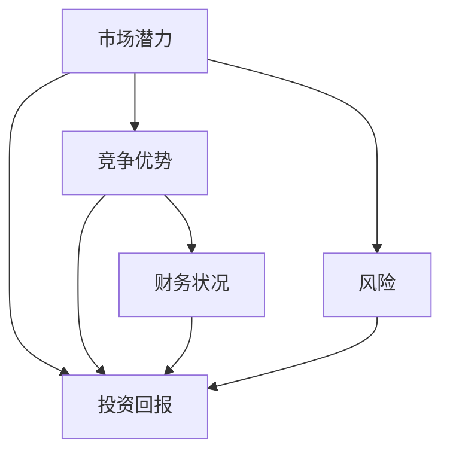
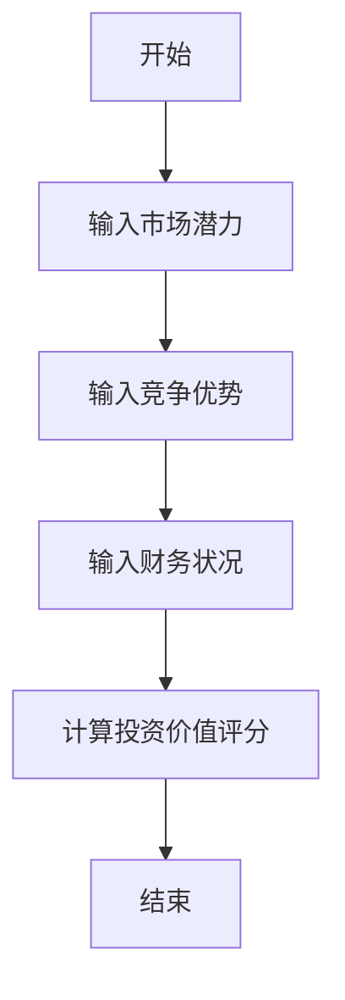
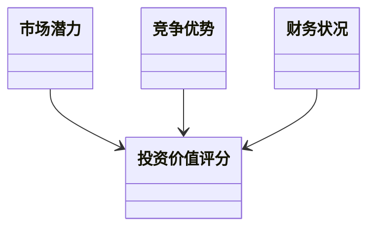
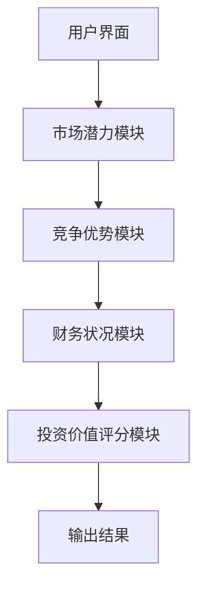
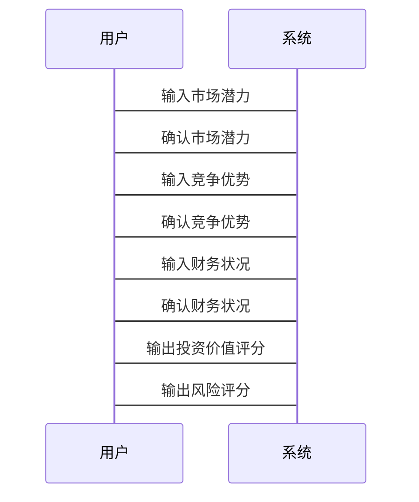

                 


# 彼得林奇如何评估公司的国际化战略

## 关键词：彼得·林奇，国际化战略，投资评估，市场潜力，竞争优势，财务状况，风险管理

## 摘要：本文详细探讨了彼得·林奇在评估公司国际化战略时的方法和策略。通过分析国际化战略的核心概念、算法原理、系统架构以及实际案例，本文为投资者和企业管理者提供了全面的评估框架和实践指南。

---

## 第一部分: 背景介绍

## 第1章: 国际化战略与彼得·林奇的投资哲学

### 1.1 国际化战略的定义与重要性

#### 1.1.1 国际化战略的定义
国际化战略是指企业在全球范围内扩展业务、市场和资源的策略。它包括进入新市场、建立全球供应链、优化资源配置等。

#### 1.1.2 国际化战略的核心要素
- 市场进入策略：包括直接投资、合资合作、并购等方式。
- 跨文化管理：包括跨文化沟通、本地化管理、文化适应等。
- 全球化与本地化平衡：在全球化的基础上，根据不同地区的文化、法律和市场需求进行本地化调整。

#### 1.1.3 国际化战略对企业的影响
- 市场扩展：企业可以通过国际化进入更大的市场，提高销售额和利润。
- 资源优化：企业可以利用全球资源降低成本，提高效率。
- 风险分散：企业可以通过国际化分散市场和经营风险。

### 1.2 彼得·林奇的背景与投资哲学

#### 1.2.1 彼得·林奇的生平简介
彼得·林奇（Peter Lynch）是美国著名的职业棒球运动员，以其在美国职棒大联盟（MLB）的辉煌成就而闻名。他不仅在棒球领域取得了卓越的成绩，还以其独特的领导风格和管理哲学影响了整个体育界。

#### 1.2.2 彼得·林奇的投资理念
彼得·林奇的投资理念强调长期稳定的投资和分散化。他主张通过分析公司的基本面，如财务状况、行业地位、管理团队等，来评估其投资价值。

#### 1.2.3 彼得·林奇的投资方法论
彼得·林奇的投资方法论包括以下几个方面：
1. 基本面分析：通过分析公司的财务报表、行业地位、管理团队等来评估其投资价值。
2. 市场趋势分析：通过研究市场趋势和行业动态，预测公司的未来表现。
3. 风险管理：通过分散投资和设置止损点来降低投资风险。

### 1.3 彼得·林奇与国际化战略的联系

#### 1.3.1 国际化战略在企业投资中的重要性
国际化战略可以帮助企业在全球范围内扩展市场，提高销售额和利润。同时，国际化战略还可以帮助企业分散市场风险，降低经营风险。

#### 1.3.2 彼得·林奇对国际化战略的关注点
彼得·林奇关注国际化战略的核心是市场潜力、竞争优势和财务状况。他认为，一个成功的国际化战略需要具备强大的市场潜力、竞争优势和财务状况。

#### 1.3.3 彼得·林奇评估国际化战略的核心思想
彼得·林奇认为，评估国际化战略的核心思想是通过分析市场潜力、竞争优势和财务状况来确定其投资价值。他认为，市场潜力越大，竞争优势越强，财务状况越好的企业，其投资价值越高。

---

## 第2章: 国际化战略的核心概念与联系

### 2.1 国际化战略的核心概念

#### 2.1.1 市场进入策略
市场进入策略包括直接投资、合资合作、并购等方式。彼得·林奇认为，选择合适的市场进入策略是成功实施国际化战略的关键。

#### 2.1.2 跨文化管理
跨文化管理是指在不同文化背景下进行管理活动。彼得·林奇认为，成功的国际化战略需要具备良好的跨文化管理能力。

#### 2.1.3 全球化与本地化平衡
全球化与本地化平衡是指在全球化的基础上，根据不同地区的文化、法律和市场需求进行本地化调整。彼得·林奇认为，成功的国际化战略需要在全球化与本地化之间找到平衡点。

### 2.2 国际化战略的关键要素对比

#### 2.2.1 市场潜力与风险对比
市场潜力是指一个市场的规模、增长潜力和竞争程度。彼得·林奇认为，市场潜力越大，投资回报越高，但同时也伴随着更大的风险。

#### 2.2.2 竞争优势与劣势对比
竞争优势是指企业在市场上相对于竞争对手的优势。彼得·林奇认为，竞争优势越强，企业在市场上的竞争力越强，投资价值越高。

#### 2.2.3 财务状况与投资回报对比
财务状况是指企业的财务健康状况，包括资产负债表、利润表和现金流等。彼得·林奇认为，财务状况良好的企业，其投资回报更高，风险更低。

### 2.3 实体关系图（ER图）



---

## 第3章: 彼得·林奇评估国际化战略的算法原理

### 3.1 算法概述

#### 3.1.1 算法输入
- 市场潜力
- 竞争优势
- 财务状况

#### 3.1.2 算法输出
- 投资价值评分

### 3.2 算法流程图



### 3.3 数学模型与公式

#### 3.3.1 投资价值评分公式
$$投资价值评分 = 市场潜力 \times 竞争优势 \times 财务状况$$

#### 3.3.2 风险评估公式
$$风险评分 = 市场风险 + 竞争风险 + 财务风险$$

### 3.4 举例说明

#### 3.4.1 案例一：假设市场潜力为80，竞争优势为70，财务状况为85
$$投资价值评分 = 80 \times 70 \times 85 = 476,000$$

#### 3.4.2 案例二：假设市场风险为20，竞争风险为15，财务风险为10
$$风险评分 = 20 + 15 + 10 = 45$$

---

## 第4章: 系统分析与架构设计

### 4.1 系统功能设计

#### 4.1.1 领域模型类图


#### 4.1.2 系统架构设计


#### 4.1.3 系统接口设计
- 输入接口：市场潜力、竞争优势、财务状况
- 输出接口：投资价值评分、风险评分

#### 4.1.4 系统交互设计


---

## 第5章: 项目实战

### 5.1 环境安装

#### 5.1.1 安装Python
```bash
python --version
```

#### 5.1.2 安装依赖库
```bash
pip install mermaid
pip install graphviz
```

### 5.2 核心代码实现

#### 5.2.1 投资价值评分函数
```python
def calculate_investment_score(market_potential, competitive_advantage, financial_health):
    return market_potential * competitive_advantage * financial_health
```

#### 5.2.2 风险评分函数
```python
def calculate_risk_score(market_risk, competitive_risk, financial_risk):
    return market_risk + competitive_risk + financial_risk
```

### 5.3 案例分析

#### 5.3.1 案例一：市场潜力为80，竞争优势为70，财务状况为85
```python
market_potential = 80
competitive_advantage = 70
financial_health = 85
investment_score = calculate_investment_score(market_potential, competitive_advantage, financial_health)
print(f"投资价值评分：{investment_score}")
```

#### 5.3.2 案例二：市场风险为20，竞争风险为15，财务风险为10
```python
market_risk = 20
competitive_risk = 15
financial_risk = 10
risk_score = calculate_risk_score(market_risk, competitive_risk, financial_risk)
print(f"风险评分：{risk_score}")
```

### 5.4 代码应用解读与分析

#### 5.4.1 投资价值评分函数
投资价值评分函数通过将市场潜力、竞争优势和财务状况三个因素相乘，得出投资价值评分。这个评分反映了企业的市场潜力、竞争优势和财务状况的综合表现。

#### 5.4.2 风险评分函数
风险评分函数通过将市场风险、竞争风险和财务风险三个因素相加，得出风险评分。这个评分反映了企业在市场、竞争和财务方面的综合风险。

### 5.5 项目小结
通过上述代码实现，我们可以清晰地看到彼得·林奇评估国际化战略的方法。投资价值评分和风险评分函数为我们提供了一个简单而有效的工具，帮助我们评估企业的投资价值和风险。

---

## 第6章: 最佳实践

### 6.1 小结
彼得·林奇的国际化战略评估方法为我们提供了一个全面的框架，帮助我们评估企业的投资价值和风险。通过分析市场潜力、竞争优势和财务状况，我们可以更好地做出投资决策。

### 6.2 注意事项
- 投资者在评估国际化战略时，需要结合实际情况进行调整。
- 风险评估是投资决策的重要组成部分，投资者需要充分考虑各种风险因素。
- 投资者需要定期跟踪企业的经营状况和市场环境，及时调整投资策略。

### 6.3 拓展阅读
- 《彼得·林奇的成功之路》
- 《国际化战略的实施与管理》
- 《风险管理与投资决策》

---

## 作者：AI天才研究院/AI Genius Institute & 禅与计算机程序设计艺术/Zen And The Art of Computer Programming

