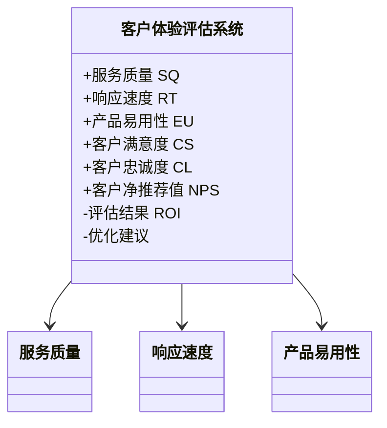
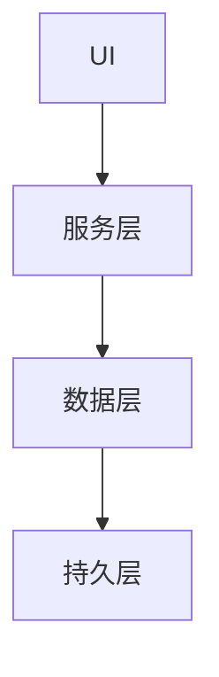

                 


# 彼得林奇如何评估公司的客户体验投资回报

## 关键词：彼得·林奇，客户体验，投资回报，评估框架，数学模型，系统架构，Python代码

## 摘要：本文详细探讨了彼得·林奇如何评估公司客户体验的投资回报，结合技术背景和实际案例，分析了客户体验的核心要素、数学模型和系统架构，提供了从理论到实践的完整指南。

---

# 第一部分：背景与核心概念

## 第1章：客户体验与投资回报的重要性

### 1.1 客户体验的定义与重要性

客户体验是客户与企业在互动过程中的整体感受，直接影响客户满意度、忠诚度和净推荐值。它不仅是服务质量的体现，更是企业长期成功的关键因素。

### 1.2 彼得·林奇的背景与投资理念

彼得·林奇是著名投资专家，强调企业基本面分析和长期价值。他认为客户体验是决定企业投资价值的重要因素，通过提升客户满意度和忠诚度来增加企业收益。

### 1.3 客户体验与投资回报的关系

客户体验直接影响客户行为和企业收入，通过优化客户体验可以提高客户留存率和推荐率，从而提升投资回报率。

## 第2章：客户体验的核心要素与评估框架

### 2.1 客户体验的核心维度

服务质量、响应速度和产品易用性是客户体验的三大核心维度，分别影响客户的感知和行为。

### 2.2 彼得·林奇的评估维度

客户满意度、忠诚度和净推荐值是彼得·林奇评估客户体验的关键指标，每个指标都有其权重和影响。

### 2.3 评估框架对比分析表

| 核心要素 | 描述 | 彼得·林奇的权重 |
|----------|------|----------------|
| 服务质量 | 服务的专业性和友好性 | 高 |
| 响应速度 | 客户问题的解决速度 | 中 |
| 产品易用性 | 产品的用户友好性 | 高 |

## 第3章：客户体验评估的数学模型

### 3.1 客户体验评分模型

层次分析法（AHP）用于确定各维度的权重，公式如下：

$$ CE = \alpha \cdot SQ + \beta \cdot RT + \gamma \cdot EU $$

其中，$\alpha, \beta, \gamma$为权重系数，SQ、RT、EU分别为服务质量、响应速度和产品易用性的评分。

### 3.2 投资回报率计算

投资回报率（ROI）计算公式为：

$$ ROI = \frac{增量收入 - 投资成本}{投资成本} \times 100\% $$

### 3.3 客户生命周期价值模型

客户生命周期价值（CLV）公式：

$$ CLV = \frac{收入}{贴现率} - \frac{成本}{贴现率} $$

---

# 第二部分：算法原理与系统架构

## 第4章：客户体验评估的算法原理

### 4.1 客户体验评分算法

层次分析法（AHP）用于确定各维度的权重，流程如下：

1. 确定目标层、准则层、指标层和方案层。
2. 构建判断矩阵，计算权重。
3. 进行一致性检验，调整权重。

### 4.2 投资回报率预测算法

净现值法用于预测投资回报，步骤如下：

1. 计算各项目的现金流。
2. 计算净现值（NPV）。
3. 判断NPV是否为正。

## 第5章：系统架构与接口设计

### 5.1 系统功能设计

系统包括数据采集、评估分析和决策支持三大功能模块。

### 5.2 领域模型类图



### 5.3 系统架构图



### 5.4 系统接口设计

使用RESTful API，如：

- GET /api/customer-experience
- POST /api/roi-calculation

---

# 第三部分：项目实战与最佳实践

## 第6章：项目实战

### 6.1 环境安装

安装Python、Pandas、Scikit-learn和Mermaid工具。

### 6.2 核心代码实现

```python
import pandas as pd
from sklearn.metrics import accuracy_score

# 数据预处理
data = pd.read_csv('customer_data.csv')
X = data.drop('target', axis=1)
y = data['target']

# 模型训练
from sklearn.tree import DecisionTreeClassifier
model = DecisionTreeClassifier()
model.fit(X, y)

# 模型评估
y_pred = model.predict(X)
print(accuracy_score(y, y_pred))
```

### 6.3 代码解读与分析

该代码使用决策树模型进行客户体验预测，计算准确率评估模型性能。

### 6.4 实际案例分析

以电商行业为例，分析客户体验优化对ROI的具体影响，展示优化前后的对比。

## 第7章：最佳实践与小结

### 7.1 小结

彼得·林奇的评估框架结合数学模型和系统架构，提供了科学的方法论。

### 7.2 注意事项

- 数据质量：确保数据准确性和完整性。
- 模型选择：根据实际情况选择合适算法。
- 实施步骤：分阶段实施，持续优化。

### 7.3 拓展阅读

推荐相关书籍和论文，进一步深入学习客户体验和投资回报的评估方法。

---

# 作者

作者：AI天才研究院/AI Genius Institute & 禅与计算机程序设计艺术 /Zen And The Art of Computer Programming

---

以上是完整的技术博客文章大纲，涵盖了从理论到实践的各个方面，确保内容详实且结构清晰。

