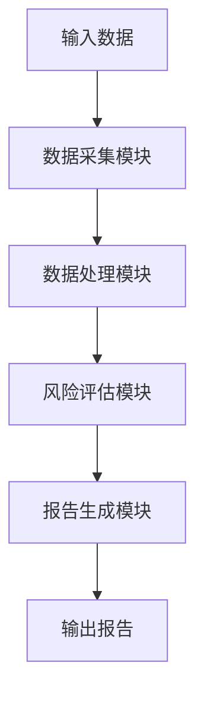
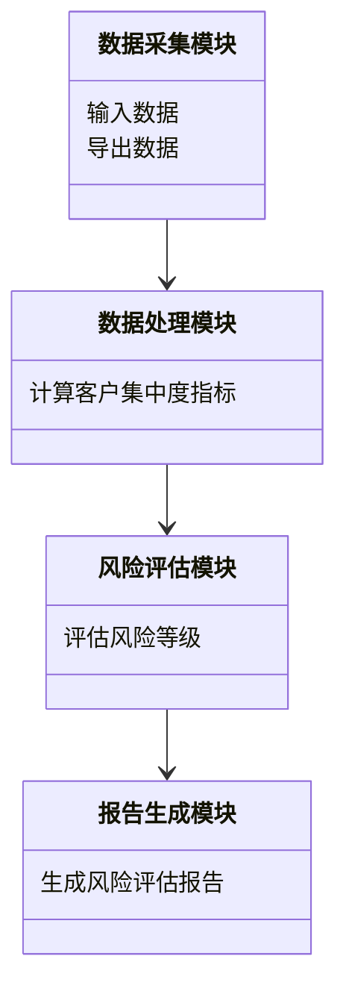

                 

# 彼得林奇如何评估公司的客户集中度风险

## 关键词：彼得·林奇，客户集中度风险，投资分析，风险管理，企业稳定性

## 摘要：客户集中度风险是企业经营中的一个重要指标，衡量公司业务对少数客户的依赖程度。本文从彼得·林奇的投资理念出发，详细分析客户集中度风险的核心概念、评估方法、系统架构设计以及项目实战案例。通过数学模型和算法实现，结合实际案例，为企业管理者和投资者提供客户集中度风险评估的深度解析和实践指导。

---

# 第一部分: 引言

## 第1章: 客户集中度风险的定义与重要性

### 1.1 客户集中度风险的定义
客户集中度风险是指一家公司对其客户群的高度依赖性，尤其是当公司业务收入或客户数量高度集中在少数几个客户时，这些客户的流失或需求变化可能会对公司的财务状况和经营稳定性造成重大影响。这种风险在企业风险管理中尤为重要，因为它直接关系到企业的收入来源和持续发展能力。

### 1.2 客户集中度风险的影响
客户集中度风险的高发行业包括软件开发、咨询、金融服务业等。当客户集中度过高时，企业面临以下风险：
- **收入波动风险**：依赖少数大客户可能导致收入波动，一旦失去这些客户，收入将大幅下降。
- **议价能力下降**：大客户可能要求更多的折扣或条款优惠，影响企业的利润空间。
- **供应链风险**：过度依赖少数客户可能导致企业在供应链管理和资源分配上出现失衡。

### 1.3 评估客户集中度风险的重要性
评估客户集中度风险是企业制定风险管理策略的重要组成部分。通过量化客户集中度，企业可以更好地识别潜在风险，并采取相应的措施，例如分散客户群体、增强客户关系管理或优化业务模式。

---

## 第2章: 彼得·林奇的投资理念与客户集中度风险

### 2.1 彼得·林奇的投资哲学
彼得·林奇是美国著名的基金经理和投资作家，以其在富达投资的长期成功而闻名。他的投资哲学强调基本面分析、长期投资和深入研究企业。他认为，成功的投资不仅取决于市场趋势，还取决于对企业的深入了解，包括企业的财务状况、管理层能力和市场地位。

### 2.2 客户集中度风险在投资中的地位
在林奇的投资框架中，客户集中度风险被视为评估企业稳健性的关键指标之一。他认为，一个高度依赖少数客户的公司可能存在潜在风险，尤其是在这些客户可能流失或需求变化时。

### 2.3 彼得·林奇对客户集中度风险的重视
林奇在其著作《彼得·林奇的投资成功之道》中多次提到，投资者应该警惕那些客户集中度过高的企业。他建议投资者在分析公司时，不仅要关注财务数据，还要深入研究客户的分布情况，以评估公司的风险敞口。

---

# 第二部分: 客户集中度风险的核心概念

## 第3章: 客户集中度风险的维度分析

### 3.1 客户数量集中度
客户数量集中度是指公司客户数量在不同客户群体中的分布情况。例如，如果一家公司有100个客户，其中最大的客户贡献了60%的收入，而其他客户贡献了40%的收入，那么这个公司客户的收入集中度很高。

### 3.2 收入集中度
收入集中度是衡量客户集中度风险的核心指标之一。计算收入集中度的公式通常为：
$$
\text{收入集中度} = \frac{\text{前几大客户收入总和}}{\text{总收入}}
$$

### 3.3 客户依赖度
客户依赖度反映了公司在多大程度上依赖少数客户。例如，如果公司前两大客户贡献了90%的收入，那么公司的客户依赖度非常高，面临较高的客户集中度风险。

### 3.4 客户分布的地理与行业特征
客户分布的地理和行业特征也是评估客户集中度风险的重要维度。例如，如果一家公司主要客户集中在某个特定行业或地理区域，那么该行业或区域的市场变化可能对该公司的收入产生重大影响。

---

## 第4章: 客户集中度风险的核心要素

### 4.1 客户集中度的衡量指标
衡量客户集中度的主要指标包括：
- 前五大客户收入占比
- 前十大客户收入占比
- 客户集中度指数（例如赫芬达尔-赫希曼指数）

### 4.2 客户集中度的阈值与警戒线
客户集中度的阈值通常设定为某个临界点，超过该点则认为客户集中度过高。例如，如果前两大客户的收入占比超过50%，则可能被视为高客户集中度风险。

### 4.3 客户集中度与企业稳定性
客户集中度与企业稳定性密切相关。高客户集中度的企业通常面临更大的经营风险，而低客户集中度的企业则具有更强的抗风险能力和市场适应性。

---

# 第三部分: 客户集中度风险的评估方法

## 第5章: 彼得·林奇的客户集中度风险评估框架

### 5.1 评估框架的核心步骤
1. **数据收集**：收集公司过去几年的财务报表和客户收入分布数据。
2. **指标计算**：计算客户集中度指标，如前五大客户收入占比。
3. **风险分析**：根据指标结果评估客户集中度风险，并制定相应的风险管理策略。

### 5.2 数据收集与整理
数据收集是评估客户集中度风险的第一步。需要收集以下数据：
- 过去三年的财务报表
- 每个客户的收入贡献情况
- 客户的行业和地理分布

### 5.3 客户集中度指标的计算
计算客户集中度指标时，通常使用以下方法：
$$
\text{客户集中度指数} = \sum_{i=1}^{n} (\text{客户i收入占比})^2
$$

---

## 第6章: 客户集中度风险的定性与定量分析

### 6.1 定性分析方法
定性分析包括评估客户关系的稳定性、客户的市场地位以及行业的竞争状况。例如，如果一家公司的前两大客户是行业龙头，且具有稳定的市场需求，那么即使客户集中度较高，风险也可能较低。

### 6.2 定量分析方法
定量分析主要依赖数学模型和统计方法。例如，使用客户集中度指数来量化客户的集中程度。

### 6.3 综合评估模型
综合评估模型结合了定性和定量分析，通过加权平均的方法，综合考虑多个因素，得出客户集中度风险的综合评估结果。

---

## 第7章: 客户集中度风险的案例分析

### 7.1 经典案例分析
以某软件公司为例，假设该公司过去三年的收入分布如下：
- 第一大客户：40%
- 第二大客户：25%
- 其他客户：35%
计算客户集中度指数为：
$$
0.4^2 + 0.25^2 + 0.35^2 = 0.16 + 0.0625 + 0.1225 = 0.345
$$

### 7.2 案例中的风险识别
从上述案例可以看出，该公司的客户集中度较高，尤其是前两大客户贡献了65%的收入。如果这两大客户的需求发生变化或流失，公司收入将受到重大影响。

### 7.3 案例中的风险应对策略
公司可以采取以下措施：
- **多元化客户群体**：积极开发新客户，减少对前两大客户的依赖。
- **加强客户关系管理**：与前两大客户签订长期合作协议，确保收入稳定性。
- **优化业务模式**：探索新的收入来源，降低客户集中度风险。

---

# 第四部分: 系统分析与架构设计

## 第8章: 客户集中度风险评估系统架构

### 8.1 系统功能模块设计
- 数据采集模块：负责收集客户的收入数据。
- 数据处理模块：计算客户集中度指标。
- 风险评估模块：根据指标结果评估风险等级。
- 报告生成模块：生成风险评估报告。

### 8.2 数据流图

### 8.3 系统架构图

---

## 第9章: 客户集中度风险评估的算法实现

### 9.1 算法原理
客户集中度评估算法主要基于客户收入占比的平方和。公式如下：
$$
\text{客户集中度指数} = \sum_{i=1}^{n} (\text{客户i收入占比})^2
$$

### 9.2 算法实现步骤
1. **数据预处理**：清洗数据，确保数据准确性和完整性。
2. **计算收入占比**：计算每个客户的收入占比。
3. **计算客户集中度指数**：根据收入占比计算客户集中度指数。
4. **风险评估**：根据指数结果评估客户集中度风险等级。

### 9.3 优化与改进
为了提高算法的准确性和效率，可以引入机器学习方法，例如使用聚类分析来识别高风险客户。

---

# 第五部分: 项目实战

## 第10章: 客户集中度风险评估的项目实施

### 10.1 项目背景与目标
本项目旨在通过分析某公司的客户收入分布情况，评估其客户集中度风险，并提出相应的风险管理策略。

### 10.2 数据收集与清洗
收集过去三年的收入数据，并清洗数据，确保数据的完整性和准确性。

### 10.3 指标计算与分析
计算前五大客户的收入占比，计算客户集中度指数。

### 10.4 结果可视化与报告
生成可视化图表，直观展示客户集中度情况，并撰写风险评估报告。

---

## 第11章: 项目总结与经验分享

### 11.1 项目实施的关键点
- 数据的准确性和完整性是评估的基础。
- 算法的选择和优化直接影响评估结果。
- 结果的可视化和报告撰写是传递价值的关键。

### 11.2 项目中的常见问题与解决方案
- 数据不足：可以通过补充数据或使用估算方法解决。
- 算法复杂：可以通过简化模型或采用更直观的方法优化。

### 11.3 项目成果与意义
通过项目实施，公司能够清晰地识别客户集中度风险，并采取相应的风险管理措施，降低经营风险，增强企业的抗风险能力。

---

# 第六部分: 最佳实践与展望

## 第12章: 客户集中度风险评估的注意事项

### 12.1 数据质量的重要性
数据质量直接影响评估结果的准确性，因此在数据收集和处理过程中，必须确保数据的准确性和完整性。

### 12.2 模型的适用性与局限性
评估模型适用于大多数企业，但在某些特殊情况下（例如客户分布极度不均匀）可能需要调整模型参数或采用其他方法。

### 12.3 风险管理的动态性
客户集中度风险是一个动态变化的过程，企业需要定期评估和更新风险管理策略。

---

## 第13章: 未来展望与发展趋势

### 13.1 技术进步对风险管理的影响
随着人工智能和大数据技术的发展，客户集中度风险评估将更加智能化和自动化。

### 13.2 风险管理的全球化趋势
随着全球化的深入，客户分布的地理范围将更广，客户集中度风险的评估也将更加复杂和多样化。

### 13.3 可持续发展与风险管理
在可持续发展背景下，客户集中度风险评估将更加注重企业的社会责任和长期发展。

---

# 作者：AI天才研究院/AI Genius Institute & 禅与计算机程序设计艺术 /Zen And The Art of Computer Programming

---

以上是《彼得林奇如何评估公司的客户集中度风险》的技术博客文章的完整目录和部分章节内容。希望这篇文章能为您提供有价值的见解和实践指导。

