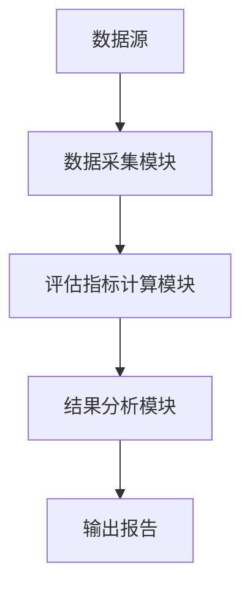

                 

# 彼得林奇如何评估公司的市场适应能力

## 关键词：彼得林奇，市场适应能力，投资评估，公司分析，市场研究

## 摘要：本文详细探讨了彼得林奇评估公司市场适应能力的方法，分析了其核心概念、评估框架、数学模型及实际应用案例，帮助读者理解如何在投资决策中运用这些方法。

---

## 第一部分：背景介绍

### 第1章：彼得林奇与市场适应能力概述

#### 1.1 彼得林奇的背景与投资理念

- **1.1.1 彼得林奇的生平简介**  
  彼得·林奇（Peter Lynch）是美国著名投资专家，曾任富达麦哲伦基金的经理，以卓越的投资业绩闻名。他的投资理念强调长期持有优质股票，注重对公司基本面的深入分析。

- **1.1.2 彼得林奇的投资哲学**  
  林奇主张投资于自己理解的公司，关注公司的长期增长潜力，而非短期市场波动。他认为，市场适应能力是公司能否持续增长的关键因素。

- **1.1.3 彼得林奇对市场的独特见解**  
  林奇认为，市场波动为投资者提供了以合理价格买入优质股票的机会。他强调，市场适应能力使公司在变化中保持竞争力。

#### 1.2 市场适应能力的概念

- **1.2.1 市场适应能力的定义**  
  市场适应能力是指公司在面对市场变化时，调整战略、产品和服务以保持竞争力的能力。

- **1.2.2 市场适应能力的重要性**  
  具备市场适应能力的公司在市场变化时能迅速调整，抓住机会，避免危机。

- **1.2.3 彼得林奇对市场适应能力的重视**  
  林奇认为，市场适应能力是公司长期成功的关键，他通过分析公司是否能适应市场变化来评估其投资价值。

---

## 第二部分：核心概念与联系

### 第2章：市场适应能力的核心要素

#### 2.1 市场适应能力的构成要素

- **2.1.1 公司战略的灵活性**  
  公司是否能根据市场变化调整战略。

- **2.1.2 产品创新能力**  
  公司能否快速推出新产品以应对市场需求变化。

- **2.1.3 市场响应速度**  
  公司在面对市场变化时的反应速度和效率。

- **2.1.4 管理团队的适应性**  
  管理团队能否有效应对市场变化，带领公司适应新环境。

#### 2.2 核心概念对比分析

- **2.2.1 市场适应能力与市场竞争力的对比**  
  | 比较维度 | 市场适应能力 | 市场竞争力 |
  |----------|--------------|------------|
  | 定义     | 应对变化的能力 | 在市场中的实力 |
  | 关注点   | 灵活性        | 实力和份额 |

- **2.2.2 市场适应能力与企业成长性的对比**  
  | 比较维度 | 市场适应能力 | 企业成长性 |
  |----------|--------------|------------|
  | 关注点   | 应对变化      | 增长速度    |
  | 目标     | 灵活性        | 长期增长    |

---

## 第三部分：彼得林奇的评估方法

### 第3章：彼得林奇的评估框架

#### 3.1 评估框架的构成

- **3.1.1 行业环境分析**  
  评估公司所在行业的市场趋势、竞争状况和潜在风险。

- **3.1.2 公司基本面分析**  
  检查公司的财务状况、管理团队和产品竞争力。

- **3.1.3 市场适应能力评分系统**  
  通过量化指标评估公司的适应能力，赋予不同指标权重。

#### 3.2 评估步骤

- **3.2.1 确定评估目标**  
  明确评估的目的和范围，选择合适的公司和行业。

- **3.2.2 数据收集与整理**  
  收集公司财务数据、市场报告和行业分析。

- **3.2.3 评估指标的权重分配**  
  根据各指标的重要性分配权重，如战略灵活性占30%，产品创新占20%等。

- **3.2.4 评估结果的分析与应用**  
  根据评分结果，判断公司是否具备投资价值，调整投资策略。

---

## 第四部分：数学模型与公式

### 第4章：市场适应能力的量化模型

#### 4.1 市场适应能力评分公式

- **评分公式**  
  $$ \text{市场适应能力评分} = \sum (\text{指标权重} \times \text{指标得分}) $$

- **示例**  
  假设某公司指标得分为：战略灵活性80分，产品创新70分，市场响应速度75分，管理团队适应性85分。各指标权重分别为30%、20%、30%、20%。则评分计算如下：

  $$ \text{评分} = 0.3 \times 80 + 0.2 \times 70 + 0.3 \times 75 + 0.2 \times 85 = 24 + 14 + 22.5 + 17 = 77.5 $$

  评分77.5表示该公司市场适应能力较强。

---

## 第五部分：系统分析与架构设计

### 第5章：评估系统的架构设计

#### 5.1 系统功能模块

- **数据采集模块**  
  收集公司财务数据、市场报告等。

- **评估指标计算模块**  
  根据公式计算各公司的评分。

- **结果分析模块**  
  对评估结果进行分析，生成报告。

#### 5.2 系统架构图

---

## 第六部分：项目实战

### 第6章：实际案例分析

#### 6.1 案例背景

- **公司简介**  
  某科技公司专注于软件开发，近年来市场变化迅速，需评估其市场适应能力。

- **行业环境分析**  
  行业竞争加剧，技术更新快，市场需求多样化。

#### 6.2 实施步骤

- **数据收集与整理**  
  收集公司过去五年的财务数据、产品创新记录和市场反馈。

- **指标计算与分析**  
  计算各指标得分，评估公司市场适应能力。

- **结果解读与建议**  
  根据评分结果，提出优化策略，如加强产品创新，提升市场响应速度。

---

## 第七部分：总结与最佳实践

### 第7章：总结与注意事项

#### 7.1 小结

- **彼得林奇方法的核心要点**  
  突出市场适应能力在投资决策中的重要性，强调公司灵活性和创新能力。

- **评估过程中的关键因素**  
  数据的准确性和全面性，方法的适用性和局限性。

#### 7.2 注意事项

- **数据准确性**  
  确保数据来源可靠，避免错误判断。

- **方法适用性**  
  根据具体情况调整评估指标和权重，避免机械应用。

---

## 结语

彼得林奇的市场适应能力评估方法为投资者提供了科学的决策工具。通过系统分析和实际案例，我们可以更好地理解并应用这些方法，提升投资决策的准确性。未来，随着市场变化，评估方法也将不断优化，帮助投资者在复杂环境中做出明智决策。

---

## 作者：AI天才研究院/AI Genius Institute & 禅与计算机程序设计艺术 /Zen And The Art of Computer Programming

---

**本文内容遵循CC BY-NC-SA 4.0协议，转载请注明出处。**

