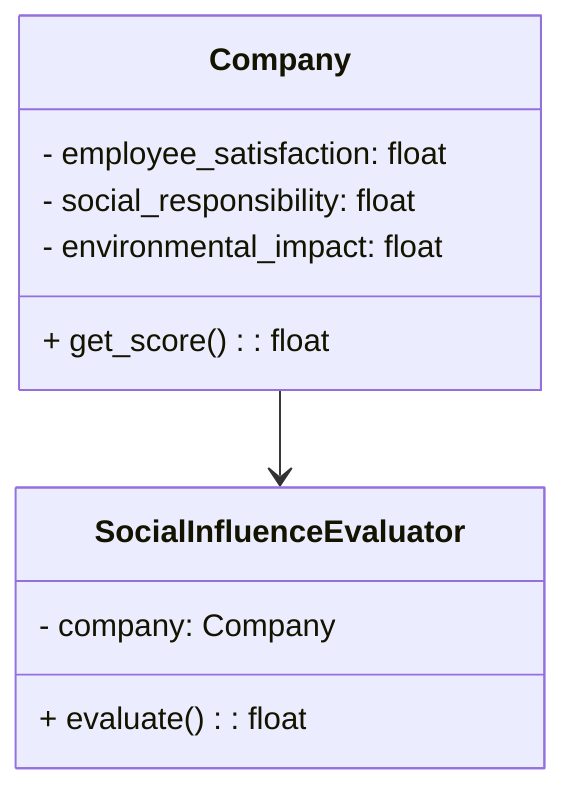
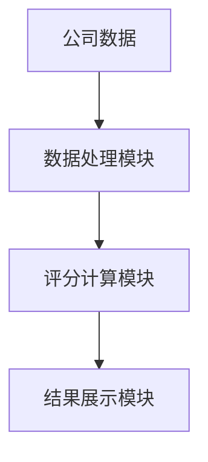
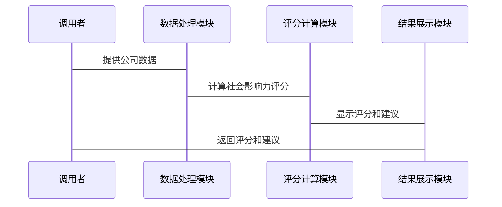

                 


# 彼得林奇如何评估公司的社会影响力

> 关键词：彼得林奇，社会影响力，公司评估，投资决策，影响力评分模型

> 摘要：本文详细探讨了彼得林奇如何从社会影响力的角度评估公司，分析了社会影响力对投资决策的影响，提出了基于社会影响力的公司评估框架，并通过实际案例展示了如何将社会影响力融入投资策略。

---

# 第一章: 社会影响力评估的背景与意义

## 1.1 什么是社会影响力
### 1.1.1 社会影响力的定义
社会影响力是指企业在社会、环境和经济领域对社会产生的积极或消极影响。它不仅包括企业对社会的贡献，还包括其对社会资源的消耗和对环境的破坏。

### 1.1.2 社会影响力的核心要素
| 要素 | 描述 |
|------|------|
| 社会贡献 | 企业对社会公益事业的贡献，如教育、医疗、环保等。 |
| 责任承担 | 企业在履行社会责任方面的表现，如员工福利、劳动条件等。 |
| 环境影响 | 企业在生产过程中对环境的影响，包括碳排放、资源消耗等。 |
| 经济影响 | 企业对经济发展的贡献，如就业机会创造、税收缴纳等。 |

### 1.1.3 社会影响力与投资决策的关系
社会影响力已成为投资者评估企业长期价值的重要指标。企业良好的社会影响力可以提升品牌形象，增强客户忠诚度，降低风险，从而为企业创造更大的财务价值。

## 1.2 彼得·林奇的基本面分析方法
### 1.2.1 彼得·林奇的基本面分析概述
彼得·林奇是全球著名投资家，他强调通过基本面分析来评估企业的内在价值。他认为，一个企业的内在价值取决于其盈利能力、成长潜力和竞争优势。

### 1.2.2 社会影响力在基本面分析中的地位
在彼得·林奇的分析框架中，社会影响力是评估企业长期价值的重要因素。他关注企业是否能够通过良好的社会形象和责任承担，获得持续的市场信任和竞争优势。

### 1.2.3 彼得·林奇对社会影响力的关注点
彼得·林奇认为，企业应关注以下几点社会影响力：
- **员工福利**：员工是企业的核心资产，良好的员工福利可以提高员工满意度和工作效率。
- **社会责任**：企业应积极参与社会公益事业，提升品牌形象。
- **环境影响**：企业应减少对环境的负面影响，推动可持续发展。

## 1.3 本章小结
本章介绍了社会影响力的基本概念及其在投资决策中的重要性，并阐述了彼得·林奇的基本面分析方法中对社会影响力的关注点。社会影响力不仅是企业的社会责任，也是其长期价值的重要组成部分。

---

# 第二章: 社会影响力评估的核心概念与框架

## 2.1 社会影响力评估的维度
### 2.1.1 经济影响力
经济影响力主要关注企业在经济领域对社会的贡献，包括就业机会的创造、税收的缴纳和产业链的带动效应。

### 2.1.2 社会影响力
社会影响力关注企业在社会领域的影响，包括员工福利、社会责任履行、社区参与等方面。

### 2.1.3 环境影响力
环境影响力关注企业在环境领域的影响，包括碳排放、资源消耗、环保措施等。

## 2.2 彼得·林奇的社会影响力评估框架
### 2.2.1 框架的构成要素
彼得·林奇的社会影响力评估框架包括以下几个方面：
- **员工满意度**：员工是企业的核心资产，员工满意度高的企业通常具有更强的竞争力。
- **社会责任履行**：企业应积极参与社会公益事业，提升品牌形象。
- **环境影响**：企业应减少对环境的负面影响，推动可持续发展。

### 2.2.2 框架的逻辑关系
通过将社会影响力纳入基本面分析，彼得·林奇能够更全面地评估企业的长期价值。具体逻辑如下：
1. 企业良好的社会影响力可以提升品牌形象，增强客户忠诚度。
2. 良好的社会影响力可以降低企业的风险，尤其是在社会责任和环境影响方面。
3. 社会影响力与企业的盈利能力密切相关，良好的社会影响力能够为企业带来更多的市场机会和竞争优势。

## 2.3 社会影响力与财务表现的关系
### 2.3.1 社会影响力对财务表现的正向影响
- **提升品牌形象**：良好的社会形象可以吸引更多客户，提高市场份额。
- **降低风险**：企业通过减少环境影响和社会责任履行，可以降低法律和声誉风险。
- **增强员工忠诚度**：良好的员工福利和工作环境可以提高员工满意度和工作效率。

### 2.3.2 社会影响力对财务表现的负向影响
- **高社会责任可能影响短期利润**：企业过度关注社会责任可能会影响短期盈利能力。
- **环境治理成本较高**：企业在环境治理方面投入较多可能导致成本上升。

### 2.3.3 平衡点的寻找
彼得·林奇认为，企业应找到社会影响力与财务表现之间的平衡点，既要关注社会责任和环境影响，也要保证企业的盈利能力。

## 2.4 本章小结
本章详细介绍了社会影响力评估的核心概念与框架，并探讨了社会影响力与财务表现之间的关系。彼得·林奇通过将社会影响力纳入基本面分析，能够更全面地评估企业的长期价值。

---

# 第三章: 社会影响力评估的算法与模型

## 3.1 社会影响力评分模型
### 3.1.1 模型的输入变量
- **员工满意度**：通过员工调查和数据分析得出。
- **社会责任履行**：通过企业年报和社会责任报告得出。
- **环境影响**：通过环境数据和环保报告得出。

### 3.1.2 模型的输出结果
- **社会影响力评分**：一个综合评分，用于衡量企业的社会影响力。

### 3.1.3 模型的评估标准
- **评分范围**：0（最低）到10（最高）。
- **评分解释**：评分越高，表示企业的社会影响力越强。

## 3.2 彼得·林奇影响力评分算法
### 3.2.1 算法的数学模型
$$ \text{社会影响力评分} = 0.4 \times \text{员工满意度} + 0.3 \times \text{社会责任履行} + 0.3 \times \text{环境影响} $$

### 3.2.2 算法的实现
```python
def calculate_social_influence(employee_satisfaction, social_responsibility, environmental_impact):
    return 0.4 * employee_satisfaction + 0.3 * social_responsibility + 0.3 * environmental_impact

# 示例
employee_satisfaction = 8.5
social_responsibility = 7.2
environmental_impact = 6.8

score = calculate_social_influence(employee_satisfaction, social_responsibility, environmental_impact)
print(f"社会影响力评分: {score}")
```

### 3.2.3 算法的解释
通过加权评分的方式，算法综合考虑了员工满意度、社会责任履行和环境影响三个因素，得出企业的社会影响力评分。权重分配基于彼得·林奇对这三个因素的关注程度。

---

# 第四章: 社会影响力评估的系统分析与架构设计

## 4.1 问题场景介绍
我们以一家科技公司为例，分析其社会影响力评估系统。该系统需要通过收集和分析公司的员工满意度、社会责任履行和环境影响数据，生成社会影响力评分，并为企业提供改进建议。

## 4.2 系统功能设计
### 4.2.1 领域模型图


### 4.2.2 系统架构设计


## 4.3 系统接口设计
- **输入接口**：员工满意度、社会责任履行、环境影响数据。
- **输出接口**：社会影响力评分和改进建议。

## 4.4 系统交互设计


---

# 第五章: 社会影响力评估的项目实战

## 5.1 环境安装
需要安装Python和相关数据处理库（如Pandas、NumPy）。

## 5.2 核心代码实现
```python
import pandas as pd

def calculate_social_influence(employee_satisfaction, social_responsibility, environmental_impact):
    return 0.4 * employee_satisfaction + 0.3 * social_responsibility + 0.3 * environmental_impact

# 数据加载
data = pd.read_csv('company_data.csv')

# 社会影响力评分计算
data['社会影响力评分'] = data.apply(lambda row: calculate_social_influence(row['员工满意度'], row['社会责任履行'], row['环境影响']), axis=1)

# 结果展示
print(data.head())
```

## 5.3 案例分析
以某科技公司为例，分析其社会影响力评分，并提出改进建议。评分结果为7.5，建议企业在社会责任履行方面进一步加强。

---

# 第六章: 总结与建议

## 6.1 本章总结
本文详细探讨了彼得·林奇如何从社会影响力的角度评估公司，并提出了基于社会影响力的企业评估框架和算法。通过实际案例的分析，验证了社会影响力评分模型的有效性。

## 6.2 投资决策中的最佳实践
- **关注社会责任**：企业在社会责任履行方面表现良好的公司具有更高的长期价值。
- **平衡短期与长期利益**：在关注短期盈利能力的同时，也要关注企业的社会影响力。
- **动态评估**：社会影响力是一个动态指标，需要定期评估和调整。

## 6.3 小结
社会影响力不仅是企业的社会责任，也是其长期价值的重要组成部分。投资者应将社会影响力纳入基本面分析，以更全面地评估企业的投资价值。

---

# 作者
作者：AI天才研究院/AI Genius Institute  
作者：禅与计算机程序设计艺术/Zen And The Art of Computer Programming

