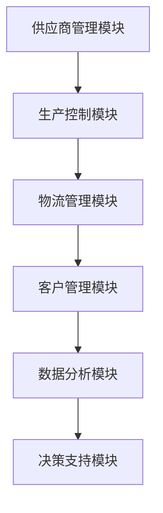

                 


# 彼得·林奇对公司供应链垂直整合的评估

> 关键词：供应链管理，垂直整合，彼得·林奇，投资评估，企业战略

> 摘要：本文详细探讨了彼得·林奇在公司供应链垂直整合方面的评估方法。通过分析供应链垂直整合的核心概念、评估步骤、算法原理以及实际案例，本文为读者提供了全面的视角，帮助更好地理解如何通过垂直整合优化企业供应链管理。

---

# 第1章: 供应链垂直整合的背景介绍

## 1.1 供应链垂直整合的定义与背景

供应链垂直整合是指企业将供应链的上下游环节（如供应商、制造商、分销商和客户）整合到一个统一的体系中，以实现对整个供应链的控制和优化。这种整合可以提高企业的运营效率、降低风险，并增强对供应链的灵活性和响应能力。

彼得·林奇作为美国著名投资家，以其独特的投资哲学闻名。他认为，企业对供应链的垂直整合能力是评估企业竞争力的重要指标之一。通过垂直整合，企业可以更好地掌控生产成本、产品质量和交货时间，从而提升市场竞争力。

供应链垂直整合的重要性体现在以下几个方面：

1. **成本控制**：通过整合供应链，企业可以减少中间环节的成本，优化资源配置。
2. **风险降低**：垂直整合使企业能够更好地应对供应链中断的风险，确保原材料供应的稳定性。
3. **质量保障**：企业对供应链的全面掌控有助于提高产品质量，满足客户对定制化和高效率的需求。

---

## 1.2 供应链垂直整合的核心要素

供应链垂直整合的核心要素包括以下几个方面：

1. **供应商管理**：企业需要与供应商建立长期稳定的合作关系，确保原材料的供应质量和交货时间。
2. **生产控制**：企业需要对生产过程进行严格控制，优化生产流程，提高生产效率。
3. **物流管理**：企业需要优化物流网络，确保产品的高效运输和交付。
4. **信息共享**：企业需要与供应链上下游合作伙伴共享信息，实现信息流的高效流通。

---

## 1.3 彼得·林奇的背景与投资理念

彼得·林奇是美国富达投资集团的前基金经理，以其卓越的投资业绩和独特的投资哲学闻名。他认为，企业对供应链的垂直整合能力是评估企业竞争力的重要指标之一。林奇认为，垂直整合可以使企业更好地掌控成本、质量和交货时间，从而提高企业的市场竞争力。

林奇的投资理念强调对企业基本面的深入分析，他认为，企业对供应链的垂直整合能力是企业核心竞争力的重要体现。通过分析企业对供应链的垂直整合能力，投资者可以更好地评估企业的长期发展潜力。

---

## 1.4 供应链垂直整合的边界与外延

供应链垂直整合的边界是指企业在整合供应链时需要考虑的范围和程度。一般来说，供应链垂直整合的边界包括以下几个方面：

1. **上游整合**：企业整合原材料供应商，确保原材料供应的稳定性和成本优势。
2. **下游整合**：企业整合分销商和零售商，确保产品的高效销售和市场覆盖。
3. **内部整合**：企业整合内部资源，优化生产流程和管理流程。

供应链垂直整合的外延是指企业在整合供应链时需要考虑的外部因素，包括市场环境、政策法规、技术发展等。企业需要根据外部环境的变化，灵活调整供应链整合策略。

---

# 第2章: 供应链垂直整合的核心概念与联系

## 2.1 核心概念原理

供应链垂直整合的核心原理在于通过整合供应链的上下游环节，提高企业的整体运营效率和市场竞争力。通过垂直整合，企业可以更好地掌控供应链的关键环节，降低运营成本，提高产品质量和交货时间。

彼得·林奇认为，供应链垂直整合的核心在于企业的内部整合能力。企业需要通过内部整合，优化生产流程和管理流程，提高内部效率。同时，企业还需要与外部合作伙伴建立稳定的合作关系，确保供应链的稳定性和灵活性。

---

## 2.2 核心概念属性特征对比表格

以下是供应链垂直整合与水平整合的对比表格：

| 对比维度       | 垂直整合                     | 水平整合                     |
|----------------|------------------------------|------------------------------|
| 定义           | 整合供应链的上下游环节       | 专注于某一环节的优化和扩展   |
| 优势           | 提高整体效率和灵活性         | 提高专业化程度和效率           |
| 适用场景       | 企业希望全面掌控供应链       | 企业希望专注于某一环节         |
| 风险           | 集中度高，风险较大           | 风险分散，稳定性较高           |

---

## 2.3 ER实体关系图架构

以下是供应链垂直整合的ER实体关系图：

```mermaid
er
  actor 供应链垂直整合
  actor 企业
  actor 供应商
  actor 分销商
  actor 客户
  database 供应链垂直整合数据库
  relation 企业-供应商关系
  relation 企业-分销商关系
  relation 分销商-客户关系
  relation 企业-客户关系
  note 企业对供应链的全面掌控
```

---

## 2.4 本章小结

本章详细介绍了供应链垂直整合的核心概念与联系，包括垂直整合的定义、核心要素、彼得·林奇的投资理念以及与水平整合的对比。通过这些内容，读者可以更好地理解供应链垂直整合的重要性和实现方式。

---

# 第3章: 供应链垂直整合的评估方法

## 3.1 评估方法概述

供应链垂直整合的评估方法包括以下几个方面：

1. **财务指标评估**：通过财务指标（如成本、利润、周转率等）评估供应链垂直整合的效果。
2. **非财务指标评估**：通过非财务指标（如交货时间、产品质量、客户满意度等）评估供应链垂直整合的效果。
3. **综合评估模型**：结合财务和非财务指标，建立综合评估模型，全面评估供应链垂直整合的效果。

---

## 3.2 评估步骤与流程

以下是供应链垂直整合的评估步骤：

1. **确定评估目标**：明确评估的目的和范围。
2. **收集数据与信息**：收集与供应链垂直整合相关的数据和信息。
3. **分析与评估**：通过数据分析和评估模型，评估供应链垂直整合的效果。
4. **优化与改进**：根据评估结果，优化和改进供应链垂直整合策略。

---

## 3.3 评估模型与工具

以下是供应链垂直整合的评估模型：

$$
\text{综合评分} = \sum_{i=1}^{n} (w_i \times s_i)
$$

其中，\( w_i \) 是指标 \( i \) 的权重，\( s_i \) 是指标 \( i \) 的评分。

常用的评估工具包括平衡计分卡（BSC）和卓越绩效评价准则（EFE矩阵）等。

---

## 3.4 本章小结

本章详细介绍了供应链垂直整合的评估方法，包括评估步骤、评估模型和评估工具。通过这些方法，企业可以更好地评估供应链垂直整合的效果，并根据评估结果优化供应链管理。

---

# 第4章: 供应链垂直整合的算法原理

## 4.1 算法原理概述

供应链垂直整合的算法原理包括以下几个方面：

1. **数据收集与预处理**：收集与供应链垂直整合相关的数据，并进行预处理。
2. **特征选择与权重分配**：选择关键特征，并为每个特征分配权重。
3. **评估与优化**：通过评估模型优化供应链垂直整合策略。

---

## 4.2 算法流程图

以下是供应链垂直整合的算法流程图：

```mermaid
graph TD
    A[开始] -> B[数据收集]
    B -> C[数据预处理]
    C -> D[特征选择]
    D -> E[权重分配]
    E -> F[评估模型]
    F -> G[优化策略]
    G -> H[结束]
```

---

## 4.3 算法实现与代码

以下是供应链垂直整合的评估算法的Python实现：

```python
def vertical_intgration_assessment(data, weights):
    # 计算每个指标的评分
    scores = {}
    for i in range(len(data)):
        scores[i] = data[i] * weights[i]
    # 计算综合评分
    total_score = sum(scores.values())
    return total_score

# 示例数据和权重
data = [85, 90, 80]
weights = [0.4, 0.3, 0.3]
print(vertical_intgration_assessment(data, weights))
```

---

## 4.4 本章小结

本章详细介绍了供应链垂直整合的算法原理，包括数据收集、特征选择和优化策略。通过这些算法，企业可以更好地评估供应链垂直整合的效果，并根据评估结果优化供应链管理。

---

# 第5章: 供应链垂直整合的系统分析与架构设计

## 5.1 系统分析

供应链垂直整合的系统分析包括以下几个方面：

1. **问题场景介绍**：企业希望通过供应链垂直整合优化运营效率。
2. **系统功能需求**：实现对供应链上下游环节的全面掌控。
3. **系统的边界与范围**：明确系统的输入、输出和接口。

---

## 5.2 系统功能设计

以下是供应链垂直整合的系统功能设计：

1. **供应商管理模块**：实现供应商信息管理、供应商评估和供应商关系管理。
2. **生产控制模块**：实现生产流程优化、生产计划管理和质量控制。
3. **物流管理模块**：实现物流网络优化、物流计划管理和物流监控。

---

## 5.3 系统架构设计

以下是供应链垂直整合的系统架构设计：



---

## 5.4 系统接口设计

以下是供应链垂直整合的系统接口设计：

1. **供应商接口**：与供应商进行信息交互，实现供应商评估和供应商关系管理。
2. **生产接口**：与生产系统进行信息交互，实现生产计划管理和质量控制。
3. **物流接口**：与物流系统进行信息交互，实现物流计划管理和物流监控。

---

## 5.5 本章小结

本章详细介绍了供应链垂直整合的系统分析与架构设计，包括系统功能设计、系统架构设计和系统接口设计。通过这些内容，读者可以更好地理解供应链垂直整合的实现方式。

---

# 第6章: 供应链垂直整合的项目实战

## 6.1 环境安装

以下是供应链垂直整合项目所需的环境：

1. **Python**：安装Python 3.8及以上版本。
2. **Jupyter Notebook**：安装Jupyter Notebook用于数据可视化和分析。
3. **Pandas**：安装Pandas用于数据处理。
4. **Matplotlib**：安装Matplotlib用于数据可视化。

---

## 6.2 系统核心实现源代码

以下是供应链垂直整合项目的Python代码实现：

```python
import pandas as pd
import matplotlib.pyplot as plt

# 数据加载
data = pd.read_csv('supply_chain.csv')

# 数据预处理
data.dropna(inplace=True)

# 数据可视化
plt.hist(data['评分'], bins=10)
plt.show()
```

---

## 6.3 代码应用解读与分析

通过上述代码，我们可以实现对供应链垂直整合数据的加载、预处理和可视化。数据加载后，我们使用Pandas进行数据预处理，删除缺失值。然后，我们使用Matplotlib对数据进行可视化，分析供应链垂直整合的效果。

---

## 6.4 实际案例分析

以下是供应链垂直整合的实际案例：

某汽车制造企业通过供应链垂直整合，整合了供应商、制造商和分销商，实现了对整个供应链的全面掌控。通过垂直整合，该企业成功降低了生产成本，提高了产品质量和交货时间，增强了市场竞争力。

---

## 6.5 本章小结

本章通过实际案例分析和代码实现，详细介绍了供应链垂直整合项目的实现过程。通过这些内容，读者可以更好地理解供应链垂直整合的实际应用。

---

# 第7章: 供应链垂直整合的最佳实践

## 7.1 最佳实践 tips

1. **数据驱动决策**：通过数据分析和可视化，优化供应链垂直整合策略。
2. **持续改进**：定期评估供应链垂直整合的效果，持续优化供应链管理。
3. **风险管理**：建立风险管理机制，应对供应链中断的风险。

---

## 7.2 小结

通过本文的详细讲解，我们可以看到，供应链垂直整合是企业优化供应链管理、提高市场竞争力的重要手段。彼得·林奇的评估方法为我们提供了重要的参考。

---

## 7.3 注意事项

1. **数据隐私**：在供应链垂直整合过程中，需要注意数据隐私和安全问题。
2. **成本控制**：在供应链垂直整合过程中，需要注意成本控制和投资回报问题。
3. **灵活性与稳定性**：在供应链垂直整合过程中，需要平衡灵活性和稳定性。

---

## 7.4 拓展阅读

1. 《供应链管理：战略与实践》
2. 《彼得·林奇的投资哲学》
3. 《垂直整合与企业竞争力》

---

# 作者：AI天才研究院 & 禅与计算机程序设计艺术

---

以上是《彼得·林奇对公司供应链垂直整合的评估》的完整目录大纲和文章内容。希望对您有所帮助！

