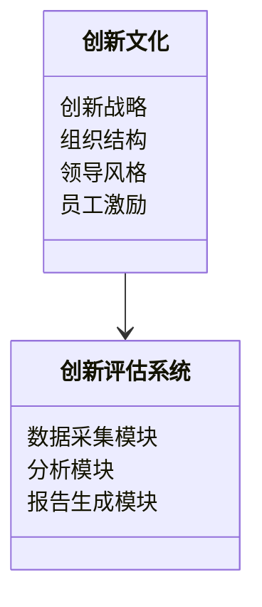

                 


# 彼得林奇对公司创新文化的定性分析

## 关键词：
- 彼得林奇
- 创新文化
- 定性分析
- 企业战略
- 领导力
- 员工参与

## 摘要：
本文通过对彼得·林奇的创新文化定性分析方法的深入探讨，结合企业战略、领导力和员工参与等核心要素，系统地分析了创新文化在企业中的构建与影响。文章从背景介绍、核心概念、算法原理、系统架构、项目实战到最佳实践，全面剖析了创新文化的定性评估方法，为企业管理者和研究者提供了有价值的理论和实践指导。

---

# 第一部分：背景介绍

## 第1章：创新文化的核心概念

### 1.1 创新文化的定义与特征
#### 1.1.1 创新文化的定义
创新文化是指企业在组织内部营造的一种鼓励创新、容忍失败、重视知识共享和持续改进的文化氛围。它通过战略、结构、流程和激励机制的相互作用，推动企业不断适应变化和实现创新目标。

#### 1.1.2 创新文化的特征
- **开放性**：鼓励员工提出新想法，允许失败并从中学习。
- **协作性**：强调跨部门合作，促进知识共享。
- **领导力驱动**：高层领导的示范作用对创新文化至关重要。
- **目标导向性**：创新活动围绕企业战略目标展开。

#### 1.1.3 创新文化的核心要素
- **战略与目标**：明确的创新方向和目标。
- **组织结构**：扁平化、灵活的组织架构。
- **领导力与管理风格**：支持创新的领导风格。
- **员工参与与激励机制**：鼓励员工参与创新并给予奖励。

### 1.2 彼得林奇的分析框架
#### 1.2.1 彼得林奇的背景与投资理念
彼得·林奇是全球著名投资家，曾任富达投资的经理。他的投资理念强调长期增长，认为企业的持续创新是实现长期增长的关键。他提出，创新文化是企业保持竞争优势的核心因素。

#### 1.2.2 林奇对创新文化的关注点
- **员工的自主性**：员工是否有足够的自主权去尝试新事物。
- **管理层的支持**：管理层是否为创新提供资源和时间。
- **客户反馈机制**：企业是否重视客户反馈并快速响应。

#### 1.2.3 林奇分析方法的适用性
林奇的定性分析方法适用于评估企业创新文化的成熟度和潜力，尤其适合中小企业和初创企业。这种方法通过观察和访谈，深入了解企业的创新氛围和员工态度。

### 1.3 定性分析的基本概念
#### 1.3.1 定性分析的定义
定性分析是通过非量化的手段，如观察、访谈和案例研究，来理解和评估事物的内在特征和关系。它关注事物的性质、结构和动态变化。

#### 1.3.2 定性分析与定量分析的区别
- **目的**：定性分析用于理解“为什么”和“如何”，而定量分析用于测量“多少”。
- **方法**：定性分析使用访谈、观察等方法，定量分析使用调查、实验等方法。
- **结果**：定性分析结果通常是描述性的，而定量分析结果通常是数字形式的。

#### 1.3.3 定性分析在创新文化研究中的作用
- **理解文化特征**：揭示创新文化的独特属性。
- **识别问题根源**：找到阻碍创新的深层原因。
- **制定改进策略**：基于分析结果提出具体的改进措施。

---

# 第二部分：创新文化的核心要素与联系

## 第2章：创新文化的核心要素分析

### 2.1 创新文化的核心要素分解
#### 2.1.1 战略与目标
企业的创新战略应与整体业务目标一致，确保创新活动与企业发展方向一致。

#### 2.1.2 组织结构与流程
灵活的组织结构和高效的流程能够快速响应市场变化，支持创新活动。

#### 2.1.3 领导力与管理风格
领导者的创新意识和管理风格直接影响员工的创新行为。

#### 2.1.4 员工参与与激励机制
激励机制能够激发员工的创新热情，参与感强的员工更愿意贡献创意。

### 2.2 核心要素的对比分析
#### 2.2.1 各要素的属性特征对比表
| 要素         | 战略与目标 | 组织结构与流程 | 领导力与管理风格 | 员工参与与激励机制 |
|--------------|------------|----------------|------------------|--------------------|
| 关键属性     | 战略性     | 灵活性          | 激励性            | 参与性              |
| 影响范围     | 全局性     | 部门间          | 中层以上          | 全体员工            |
| 可变性       | 中          | 高              | 中                | 高                  |

#### 2.2.2 ER实体关系图
```mermaid
er
  entity 创新文化 {
    创新战略
    组织结构
    领导风格
    员工激励
  }
  创新战略 --|> 创新文化
  组织结构 --|> 创新文化
  领导风格 --|> 创新文化
  员工激励 --|> 创新文化
```

---

# 第三部分：定性分析的算法原理

## 第3章：定性分析的算法与模型

### 3.1 定性分析的主要方法
#### 3.1.1 主题分析法
通过识别文本中的主题，分析创新文化的核心主题。

#### 3.1.2 内容分析法
对文本内容进行编码和分类，揭示创新文化的结构和特征。

#### 3.1.3 语义网络分析
构建语义网络，展示创新文化要素之间的关系。

### 3.2 算法原理讲解
#### 3.2.1 主题分析法的步骤
1. 收集文本数据。
2. 使用TF-IDF提取关键词。
3. 进行主题建模。

#### 3.2.2 内容分析法的实现
```python
from sklearn.feature_extraction.text import TfidfVectorizer

texts = ["创新文化", "员工参与", "领导支持"]
vectorizer = TfidfVectorizer()
tfidf = vectorizer.fit_transform(texts)
```

#### 3.2.3 语义网络分析的流程
1. 提取关键词。
2. 计算关键词间的相似度。
3. 绘制语义网络图。

---

# 第四部分：系统分析与架构设计方案

## 第4章：系统分析与架构设计

### 4.1 问题场景介绍
如何系统性地评估和提升企业的创新文化。

### 4.2 系统功能设计
#### 4.2.1 领域模型


### 4.3 系统架构设计


---

# 第五部分：项目实战

## 第5章：项目实战

### 5.1 环境安装
安装Python和相关库，如NLTK和Gensim。

### 5.2 核心代码实现
```python
from nltk.tokenize import word_tokenize
from gensim.models import Word2Vec

texts = ["创新文化", "员工参与"]
model = Word2Vec(texts, vector_size=100, window=5)
```

### 5.3 案例分析
通过具体案例分析创新文化在不同企业的应用。

### 5.4 项目小结
总结项目实施的经验和教训。

---

# 第六部分：最佳实践

## 第6章：最佳实践

### 6.1 小结
创新文化是企业成功的关键因素，定性分析是评估和改进创新文化的有效工具。

### 6.2 注意事项
- 注重员工参与。
- 领导层的支持至关重要。
- 定期评估和调整。

### 6.3 拓展阅读
推荐相关书籍和文献，供读者深入学习。

---

# 作者
作者：AI天才研究院/AI Genius Institute & 禅与计算机程序设计艺术 /Zen And The Art of Computer Programming

