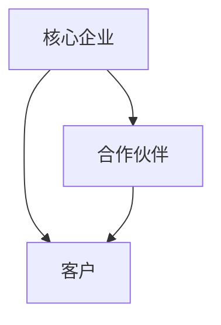

                 


# 彼得林奇对公司创新生态系统可持续性评估

> 关键词：创新生态系统，可持续性评估，企业战略，系统动力学模型，网络分析方法

> 摘要：本文探讨了创新生态系统及其可持续性评估的重要性，结合彼得·林奇的理论，提出了创新生态系统评估的方法论，包括核心概念、评估框架、算法原理、系统架构设计及实际案例分析，为企业提供可持续性评估的参考。

---

## 第一部分：创新生态系统与可持续性评估背景

### 第1章：创新生态系统概述

#### 1.1 创新生态系统的核心概念

创新生态系统是一个由企业、供应商、合作伙伴、客户等多方参与者组成的网络，通过协同创新实现价值共创。其核心在于系统中各实体的动态关系和价值传递。

#### 1.2 可持续性评估的重要性

在当前竞争激烈的市场环境中，创新生态系统能否持续发展直接影响企业的生存能力。通过评估，企业可以识别风险，优化资源配置，确保生态系统的稳健发展。

#### 1.3 与企业战略的关系

企业战略是指导创新生态系统建设的蓝图。通过战略规划，企业可以明确创新方向，构建可持续的生态系统，从而实现长期竞争优势。

### 第2章：创新生态系统的核心概念与联系

#### 2.1 核心概念

- **核心企业**：作为生态系统的主导者，负责制定战略和协调各方。
- **合作伙伴**：提供技术、资源或市场支持，增强生态系统的能力。
- **客户与市场**：反馈需求，推动产品和服务的创新。

#### 2.2 实体关系网络

通过绘制Mermaid图，展示各实体之间的关系，分析其动态和稳定性，为评估提供可视化工具。



### 第3章：可持续性评估的方法论

#### 3.1 评估框架

构建一个包含定量和定性指标的框架，如市场适应性、技术领先性、合作稳定性等，确保评估的全面性。

#### 3.2 方法选择

根据目标选择合适的方法，如层次分析法（AHP）进行定性评估，回归分析进行定量预测。

### 第4章：算法原理

#### 4.1 系统动力学模型

该模型用于分析生态系统随时间的变化，通过微分方程描述各变量间的动态关系。

$$\frac{dX}{dt} = aX - bX^2$$

#### 4.2 网络分析方法

使用网络分析识别关键节点，评估其影响力和风险敞口，确保生态系统的稳健性。

### 第5章：系统架构设计

#### 5.1 功能模块

- 数据采集：收集各实体的数据。
- 指标计算：基于模型计算各项指标。
- 可视化展示：呈现评估结果，辅助决策。

#### 5.2 架构设计

采用分层架构，数据层、业务逻辑层和表现层，确保系统的可扩展性和维护性。

### 第6章：项目实战

#### 6.1 环境安装

安装必要的软件和库，如Python、NumPy、Matplotlib等。

#### 6.2 核心代码

```python
import numpy as np
import matplotlib.pyplot as plt

# 参数设置
a = 0.5
b = 0.1

# 时间序列
t = np.linspace(0, 10, 100)
x = np.zeros_like(t)

# 微分方程求解
from scipy.integrate import odeint

def dxdt(x, t):
    return a * x - b * x**2

sol = odeint(dxdt, x[0], t)
x = sol.T[0]

# 绘制图形
plt.plot(t, x)
plt.xlabel('Time')
plt.ylabel('X')
plt.title('System Dynamics Model')
plt.show()
```

#### 6.3 案例分析

分析科技公司和传统企业的创新生态系统，识别共性和差异，总结经验教训，优化评估方法。

### 第7章：总结与展望

#### 7.1 总结

创新生态系统是企业发展的关键，通过系统评估和优化，企业可以提升竞争力和可持续性。

#### 7.2 展望

未来研究可结合大数据和AI技术，提升评估的精准性和实时性，为企业提供更有力的支持。

---

作者：AI天才研究院 & 禅与计算机程序设计艺术

---

这篇文章通过详细分析创新生态系统的核心概念、评估方法和实际应用，为企业提供了可持续性评估的全面指导，帮助企业构建稳健的创新生态系统，确保长期竞争优势。

