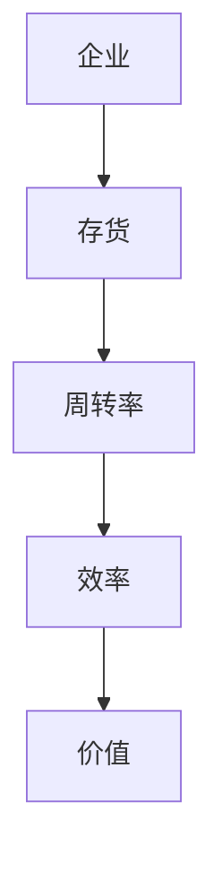
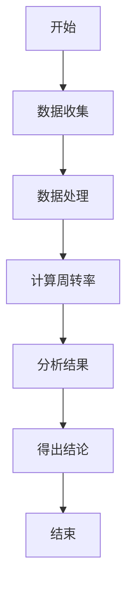

                 


# 彼得林奇对公司存货周转率的分析

> 关键词：彼得·林奇，存货周转率，投资分析，财务指标，企业价值

> 摘要：本文深入分析了彼得·林奇对公司存货周转率的分析方法，探讨了存货周转率对企业价值的影响，结合系统分析和实战案例，详细讲解了存货周转率的计算、行业对比、财务表现以及优化策略。通过本文的学习，读者可以掌握如何从存货周转率的角度评估企业的财务健康状况和投资价值。

---

# 第一部分: 存货周转率的基本概念与分析框架

## 第1章: 存货周转率的核心概念

### 1.1 存货周转率的定义与公式

存货周转率是衡量企业库存管理效率和运营能力的重要财务指标，其公式为：
$$\text{存货周转率} = \frac{\text{营业成本}}{\text{平均存货}}$$

其中，营业成本是指企业在一定时期内销售商品或提供服务所产生的成本，而平均存货则是企业在该时期内存货的平均值，计算公式为：
$$\text{平均存货} = \frac{\text{期初存货} + \text{期末存货}}{2}$$

### 1.2 彼得·林奇的存货周转率分析方法

彼得·林奇是全球著名的价值投资者，他通过分析存货周转率来评估企业的财务健康状况和投资价值。他认为，存货周转率高的企业通常具有更强的运营效率和市场竞争力。

#### 1.2.1 投资理念概述

彼得·林奇的投资理念强调长期持有的策略，他注重企业的基本面分析，尤其是企业的财务指标和行业地位。他认为，存货周转率是评估企业运营效率的重要指标，同时也是判断企业是否具有长期投资价值的关键因素之一。

#### 1.2.2 存货周转率的行业对比

存货周转率的行业差异较大，例如零售业和制造业的存货周转率通常较高，而传统制造业和重工业的存货周转率相对较低。彼得·林奇在分析存货周转率时，通常会将其与行业平均水平进行对比，以判断企业的相对优势。

### 1.3 本章小结

本章主要介绍了存货周转率的基本概念和彼得·林奇的分析方法，为后续的深入分析奠定了基础。

---

## 第2章: 存货周转率的计算与实例分析

### 2.1 存货周转率的计算公式

存货周转率的计算公式为：
$$\text{存货周转率} = \frac{\text{营业成本}}{\text{平均存货}}$$

其中，营业成本和存货数据通常可以从企业的财务报表中获取。例如，假设某企业的期初存货为100万元，期末存货为120万元，营业成本为500万元，则其存货周转率为：
$$\text{存货周转率} = \frac{500}{(100 + 120)/2} = \frac{500}{110} \approx 4.55$$

### 2.2 彼得·林奇存货周转率分析的实例

#### 2.2.1 某行业标杆企业的存货周转率分析

以某零售企业为例，假设其2022年的营业成本为800万元，期初存货为200万元，期末存货为240万元，则其存货周转率为：
$$\text{存货周转率} = \frac{800}{(200 + 240)/2} = \frac{800}{220} \approx 3.64$$

通过与行业平均水平的对比，可以判断该企业的存货周转率是否处于合理范围。

#### 2.2.2 实例中存货周转率的行业对比

假设行业平均水平的存货周转率为3.5，则上述企业的存货周转率3.64略高于行业平均水平，表明其存货管理效率略高于行业平均水平。

### 2.3 本章小结

本章通过实例分析，详细讲解了存货周转率的计算方法和行业对比的应用，为后续的深入分析提供了实践依据。

---

## 第3章: 存货周转率与企业价值的关系

### 3.1 存货周转率与企业盈利能力的关系

#### 3.1.1 存货周转率对净利润的影响

存货周转率高通常意味着企业能够高效利用库存，减少资金占用，从而提高净利润。例如，假设某企业的存货周转率从3.5提高到4.5，且其他条件不变，则其净利润可能显著提高。

#### 3.1.2 存货周转率与ROE的关系

ROE（净资产收益率）是衡量企业盈利能力的重要指标，存货周转率的提高通常会间接提高ROE，因为更高的存货周转率意味着更高效的资产利用。

#### 3.1.3 行业案例分析

以某制造业为例，假设其存货周转率从2.0提高到3.0，且其他条件不变，则其ROE可能从8%提高到10%。

### 3.2 存货周转率与企业成长性的关系

#### 3.2.1 高成长企业存货周转率的特点

高成长企业通常具有较高的存货周转率，因为它们需要快速响应市场需求，保持库存的高效周转。

#### 3.2.2 低成长企业存货周转率的特点

低成长企业通常具有较低的存货周转率，因为市场需求相对稳定，企业不需要频繁调整库存。

### 3.3 本章小结

本章分析了存货周转率与企业盈利能力及成长性的关系，强调了存货周转率在企业价值评估中的重要性。

---

## 第4章: 彼得·林奇存货周转率分析的系统方法

### 4.1 系统分析框架

#### 4.1.1 系统分析的基本概念

系统分析是一种通过对企业各个组成部分进行综合分析，以优化整体表现的方法。在存货周转率分析中，系统分析可以帮助企业识别库存管理中的瓶颈，并提出优化建议。

#### 4.1.2 存货周转率分析的系统模型

以下是一个简单的存货周转率分析系统模型的Mermaid图示：



#### 4.1.3 系统分析的步骤与方法

系统分析的步骤通常包括：问题定义、数据收集、模型建立、分析与优化、结果验证。

### 4.2 系统分析的工具与方法

#### 4.2.1 存货周转率分析的流程图

以下是一个存货周转率分析的流程图：



#### 4.2.2 存货周转率与财务指标的关系

以下是存货周转率与财务指标关系的表格：

| 财务指标 | 关系描述 |
|---------|----------|
| 营业成本 | 高存货周转率通常意味着高效利用库存 |
| 平均存货 | 存货周转率与平均存货呈反比关系 |
| 净利润  | 高存货周转率通常与高净利润相关 |

### 4.3 本章小结

本章详细介绍了系统分析的方法和工具，为存货周转率的深入分析提供了理论支持。

---

## 第5章: 存货周转率分析的实战应用

### 5.1 实战环境配置

#### 5.1.1 数据获取与处理

在实际分析中，通常需要获取企业的财务报表数据，包括营业成本、期初存货和期末存货等。数据获取可以通过企业财报或财务数据库完成。

#### 5.1.2 数据分析工具的选择

常用的分析工具包括Excel、Python（pandas库）等。Python代码示例如下：

```python
import pandas as pd

# 假设df为包含财务数据的DataFrame
df['平均存货'] = (df['期初存货'] + df['期末存货']) / 2
df['存货周转率'] = df['营业成本'] / df['平均存货']
```

### 5.2 存货周转率分析的代码实现

#### 5.2.1 Python代码示例

```python
import pandas as pd

# 示例数据
data = {
    '年份': [2019, 2020, 2021, 2022],
    '期初存货': [100, 120, 130, 140],
    '期末存货': [110, 115, 120, 125],
    '营业成本': [500, 550, 600, 650]
}

df = pd.DataFrame(data)

# 计算平均存货和存货周转率
df['平均存货'] = (df['期初存货'] + df['期末存货']) / 2
df['存货周转率'] = df['营业成本'] / df['平均存货']

# 输出结果
print(df)
```

#### 5.2.2 数据可视化与分析

通过上述代码计算出存货周转率后，可以使用matplotlib或seaborn库进行可视化分析，例如绘制存货周转率的趋势图：

```python
import matplotlib.pyplot as plt

plt.plot(df['年份'], df['存货周转率'])
plt.title('存货周转率趋势图')
plt.xlabel('年份')
plt.ylabel('存货周转率')
plt.show()
```

### 5.3 本章小结

本章通过实战案例，详细讲解了存货周转率的计算、可视化和分析过程，帮助读者掌握实际操作方法。

---

# 第六章: 存货周转率分析的最佳实践与注意事项

## 6.1 最佳实践

#### 6.1.1 数据质量的重要性

确保数据的准确性和完整性是分析的基础。

#### 6.1.2 结合其他财务指标进行综合分析

存货周转率应结合营业利润率、应收账款周转率等其他指标进行综合评估。

## 6.2 注意事项

#### 6.2.1 行业差异的影响

不同行业的存货周转率标准差异较大，分析时应结合行业特点。

#### 6.2.2 时间周期的选择

存货周转率的分析通常基于年度或季度数据，选择合适的时间周期有助于提高分析的准确性。

## 6.3 本章小结

本章总结了存货周转率分析的最佳实践和注意事项，为读者提供了实际操作的指导。

---

# 第七章: 总结与展望

## 7.1 本章总结

本文深入分析了彼得·林奇对公司存货周转率的分析方法，结合理论和实践，详细讲解了存货周转率的计算、行业对比、系统分析和实战应用。

## 7.2 未来展望

随着企业运营的复杂化和数据化的深入，存货周转率的分析将更加依赖于大数据和人工智能技术。未来的研究可以结合机器学习模型，进一步优化存货周转率的预测和分析。

---

# 作者：AI天才研究院 & 禅与计算机程序设计艺术

---

以上是关于“彼得林奇对公司存货周转率的分析”的完整目录大纲和文章内容。文章从存货周转率的基本概念出发，结合彼得·林奇的投资理念，系统地分析了存货周转率的计算方法、行业对比、企业价值影响以及实战应用，为读者提供了全面的分析框架和实践指导。

