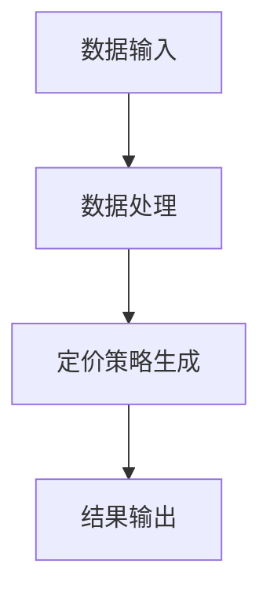

                 


# 彼得林奇对公司定价能力的评估标准

## 关键词：
定价能力、彼得林奇、投资策略、定价模型、企业分析、定价弹性

## 摘要：
本文深入探讨了彼得·林奇对公司定价能力的评估标准，分析了定价能力的定义、核心要素、评估指标以及其在不同行业中的应用。通过数学模型和实际案例，结合系统架构设计，详细阐述了如何从投资角度评估定价能力，为企业和投资者提供了实用的定价策略和决策依据。

---

# 第1章: 定价能力的概述

## 1.1 定价能力的定义与重要性

### 1.1.1 定价能力的核心概念
定价能力是指企业在市场中制定价格并实现 profitable growth 的能力。它不仅影响企业的收入和利润，还关系到企业的市场地位和竞争能力。

### 1.1.2 定价能力在企业中的作用
定价能力直接影响企业的财务表现和市场竞争力。通过有效的定价策略，企业可以优化收入、降低成本并提高利润。

### 1.1.3 定价能力与企业竞争力的关系
定价能力强的企业通常能够在市场上占据优势地位，通过差异化定价策略吸引更多的客户，并在竞争中保持领先地位。

---

## 1.2 彼得·林奇的背景与投资理念

### 1.2.1 彼得·林奇的简介
彼得·林奇是美国著名投资家，以其在共同基金领域的卓越表现而闻名。他的投资理念强调长期稳健的增长和对企业的深入了解。

### 1.2.2 林奇的投资哲学
林奇的投资哲学注重企业的基本面分析，特别是企业的定价能力和盈利模式。他认为，定价能力是企业长期盈利能力的关键因素。

### 1.2.3 林奇对公司定价能力的关注
林奇在其投资分析中，特别关注企业的定价能力。他认为，强大的定价能力是企业在市场上持续盈利的核心能力。

---

# 第2章: 定价能力的核心要素

## 2.1 定价策略的制定

### 2.1.1 市场定位与定价策略
市场定位决定了企业的定价策略。通过了解目标市场的需求和竞争对手的价格，企业可以制定出合理的定价策略。

### 2.1.2 成本导向定价法
成本导向定价法是基于企业生产成本来制定价格的一种方法。这种方法适用于成本相对稳定的行业。

### 2.1.3 需求导向定价法
需求导向定价法是根据市场需求和消费者愿意支付的价格来制定价格。这种方法适用于市场需求波动较大的行业。

---

## 2.2 影响定价能力的关键因素

### 2.2.1 市场需求分析
市场需求分析是制定定价策略的基础。通过分析市场需求，企业可以了解消费者的价格敏感度和购买意愿。

### 2.2.2 竞争对手分析
竞争对手的定价策略是影响企业定价能力的重要因素。了解竞争对手的价格策略可以帮助企业制定更具竞争力的定价策略。

### 2.2.3 企业成本结构
企业的成本结构直接影响定价能力。合理的成本控制可以帮助企业在定价上具有更大的灵活性。

---

# 第3章: 定价能力的评估标准

## 3.1 评估定价能力的财务指标

### 3.1.1 销售毛利率
销售毛利率是衡量企业定价能力的重要指标。毛利率越高，说明企业的定价能力越强。

### 3.1.2 净利润率
净利润率是衡量企业盈利能力的指标。高净利润率表明企业能够通过有效的定价策略实现高利润。

### 3.1.3 市场占有率
市场占有率是衡量企业定价能力的另一个重要指标。高市场占有率表明企业能够通过定价策略吸引更多的客户。

---

## 3.2 林奇的定价能力评估模型

### 3.2.1 模型的构建
林奇的定价能力评估模型基于企业的毛利率、市场占有率和净利润率等财务指标，综合评估企业的定价能力。

### 3.2.2 模型的适用性
该模型适用于不同行业的企业，但需要根据具体行业特点进行调整。

### 3.2.3 模型的优缺点
优点：模型简单易用，能够快速评估企业的定价能力。缺点：模型可能忽略了一些重要因素，如市场需求的变化和竞争环境的影响。

---

# 第4章: 定价能力的行业案例分析

## 4.1 高科技行业的定价策略

### 4.1.1 苹果公司的定价策略
苹果公司通过高端定价策略，成功树立了品牌溢价形象，实现了高利润率。

### 4.1.2 微软的定价策略
微软通过软件订阅模式，实现了稳定的收入来源和高客户粘性。

### 4.1.3 亚马逊的定价策略
亚马逊通过成本导向定价和动态定价策略，实现了市场份额的扩大和成本控制。

---

## 4.2 零售行业的定价策略

### 4.2.1 沃尔玛的定价策略
沃尔玛通过成本控制和天天平价策略，吸引了大量价格敏感的消费者。

### 4.2.2 家乐福的定价策略
家乐福通过会员制和促销活动，实现了市场份额的扩大和客户忠诚度的提升。

### 4.2.3 7-Eleven的定价策略
7-Eleven通过标准化定价和小而美的商品策略，实现了高周转率和高利润率。

---

# 第5章: 定价能力的数学模型与公式

## 5.1 定价弹性模型

### 5.1.1 弹性系数的定义
定价弹性是指价格变化对需求量的影响程度。弹性系数越大，需求对价格变化越敏感。

### 5.1.2 弹性系数的计算公式
$$ 弹性系数 = \frac{\% \Delta Q}{\% \Delta P} $$

### 5.1.3 弹性系数的应用
企业可以根据弹性系数调整定价策略，以实现收入最大化。

---

## 5.2 边际成本定价模型

### 5.2.1 边际成本的定义
边际成本是指每增加一单位产品生产的额外成本。

### 5.2.2 边际成本的计算公式
$$ 边际成本 = \frac{\Delta C}{\Delta Q} $$

### 5.2.3 边际成本的应用
企业可以通过边际成本定价模型确定产品的最低定价，以确保不亏损。

---

# 第6章: 定价能力的系统架构与设计

## 6.1 系统架构设计

### 6.1.1 系统模块划分
系统模块包括数据采集、数据分析、定价策略制定和结果输出。

### 6.1.2 系统功能流程
系统功能流程包括数据输入、数据处理、定价策略生成和结果输出。

### 6.1.3 系统数据流图


---

## 6.2 系统接口设计

### 6.2.1 输入接口设计
输入接口包括市场需求数据、竞争对手数据和企业成本数据。

### 6.2.2 输出接口设计
输出接口包括定价建议、财务指标分析和市场占有率预测。

---

# 第7章: 定价能力的项目实战

## 7.1 环境安装
需要安装Python、Pandas、Matplotlib和Scikit-learn等工具。

## 7.2 系统核心实现源代码
```python
import pandas as pd
import matplotlib.pyplot as plt
from sklearn.linear_model import LinearRegression

# 数据输入
data = pd.read_csv('pricing.csv')

# 数据处理
X = data[['cost', 'demand']]
y = data['price']

# 模型训练
model = LinearRegression()
model.fit(X, y)

# 定价策略生成
new_cost = 100
new_demand = 500
predicted_price = model.predict([[new_cost, new_demand]])
print("predicted_price:", predicted_price)
```

---

## 7.3 代码应用解读与分析
通过训练数据，模型可以预测新的成本和需求下的价格。企业可以根据预测价格制定定价策略。

---

## 7.4 实际案例分析和详细讲解剖析
以某高科技企业为例，分析其定价策略的有效性和改进空间。

---

## 7.5 项目小结
通过项目实战，企业可以更好地理解定价能力的评估标准，并制定更具竞争力的定价策略。

---

# 第8章: 总结与投资建议

## 8.1 总结
本文详细分析了彼得·林奇对公司定价能力的评估标准，提出了定价能力的核心要素和评估指标，并通过实际案例和数学模型进行了深入探讨。

## 8.2 投资建议
投资者在评估企业时，应重点关注企业的定价能力，特别是毛利率、市场占有率和净利润率等财务指标。

## 8.3 注意事项
定价能力受多种因素影响，投资者应结合行业特点和市场环境进行综合分析。

## 8.4 拓展阅读
推荐阅读彼得·林奇的《股票投资的革命》等书籍，以进一步了解定价能力的评估方法。

---

# 附录

## 附录1: 术语表
- 定价能力：企业在市场中制定价格并实现 profitable growth 的能力。
- 定价弹性：价格变化对需求量的影响程度。
- 边际成本：每增加一单位产品生产的额外成本。

## 附录2: 数据来源
本文的数据来源于公开的企业财报和市场研究报告。

## 附录3: 参考文献
1. 彼得·林奇. 《股票投资的革命》
2. Smith, J. (2020). Corporate Pricing Strategies.

---

# 作者：AI天才研究院/AI Genius Institute & 禅与计算机程序设计艺术 /Zen And The Art of Computer Programming

