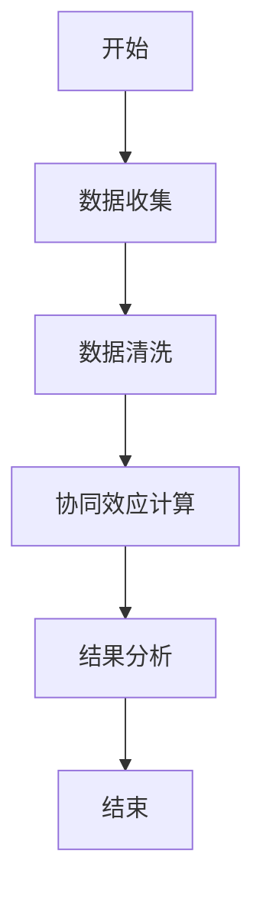
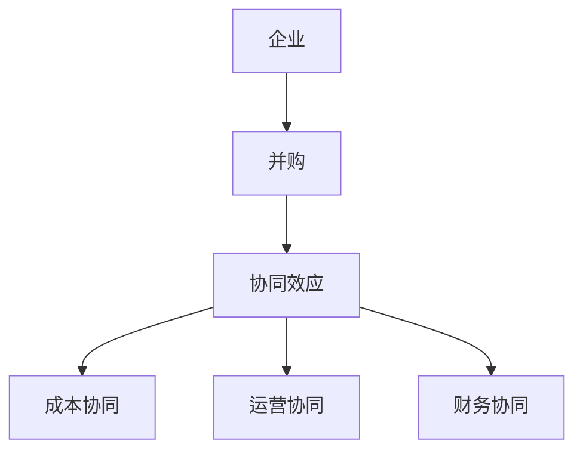

                 


# 彼得林奇对公司并购协同效应的评估

> 关键词：彼得·林奇，并购，协同效应，评估方法，数学模型，案例分析

> 摘要：本文将深入探讨彼得·林奇在公司并购中的协同效应评估方法，从理论到实践，结合实际案例分析，详细讲解协同效应的类型、评估模型、系统架构设计及实际应用。

---

## 第1章: 公司并购与协同效应概述

### 1.1 公司并购的定义与类型

#### 1.1.1 公司并购的基本概念
公司并购是指一家公司通过购买其他公司的一部分或全部股权，以实现业务扩展或战略调整。并购可以是敌意的或友好的，但核心目标是创造协同效应，提升整体价值。

#### 1.1.2 并购的类型与特点
- **横向并购**：同一行业内的并购，旨在扩大市场份额。
- **纵向并购**：上下游产业的并购，优化供应链。
- **混合并购**：跨行业并购，寻求多元化发展。

#### 1.1.3 并购的动机与目标
- **成本节约**：通过规模经济降低运营成本。
- **市场扩展**：进入新市场或区域。
- **技术获取**：获取新技术或专利。

### 1.2 协同效应的定义与类型

#### 1.2.1 协同效应的定义
协同效应是指并购后，企业整合资源后产生的额外价值，超过两家公司单独价值的总和。

#### 1.2.2 协同效应的类型
- **运营协同**：整合生产流程，提高效率。
- **成本协同**：共享资源，降低成本。
- **财务协同**：优化资产负债表，提高融资能力。

#### 1.2.3 协同效应的边界与外延
协同效应的边界包括公司内部资源整合，而外延则涉及外部市场协同，如品牌效应。

---

## 第2章: 彼得林奇的并购评估方法

### 2.1 彼得林奇的并购投资理念

#### 2.1.1 彼得林奇的背景与投资风格
彼得·林奇是著名投资经理，强调基本面分析和长期投资。他擅长通过并购发现低估股票。

#### 2.1.2 彼得林奇对并购协同效应的关注
他认为协同效应是并购成功的关键，尤其关注运营协同和成本协同。

#### 2.1.3 彼得林奇并购评估的核心思想
他通过分析协同效应的潜力，评估并购后的价值提升。

### 2.2 协同效应的评估模型

#### 2.2.1 协同效应的数学模型
$$协同效应 = \sum_{i=1}^{n} (协同效应_i)$$

#### 2.2.2 协同效应的评估公式
协同效应的评估公式涉及收入增长、成本节约和资产优化。

#### 2.2.3 协同效应的评估流程图


---

## 第3章: 协同效应的核心概念与联系

### 3.1 协同效应的属性特征对比

| 类型     | 描述                     | 优缺点分析                          |
|----------|--------------------------|------------------------------------|
| 运营协同 | 整合生产流程             | 提高效率，降低成本                  |
| 成本协同 | 共享资源                | 显著降低成本                        |
| 财务协同 | 优化资产负债表           | 提高融资能力，降低财务风险          |

### 3.2 协同效应的ER实体关系图


---

## 第4章: 协同效应的算法原理讲解

### 4.1 协同效应评估的算法流程


### 4.2 协同效应评估的数学模型
$$协同效应 = \sum_{i=1}^{n} (协同效应_i)$$

---

## 第5章: 协同效应评估系统架构

### 5.1 系统功能设计

#### 5.1.1 数据采集模块
- 采集并购数据，清洗和预处理。

#### 5.1.2 协同效应计算模块
- 使用数学模型计算协同效应。

#### 5.1.3 结果展示模块
- 可视化展示协同效应评估结果。

### 5.2 系统架构设计
```
类图：
class 图形展示
```

---

## 第6章: 项目实战

### 6.1 环境安装
安装Python和相关库。

### 6.2 核心代码实现

```python
def calculate_synergy(acquired_company, acquiring_company):
    # 运营协同
    operational_synergy = max(acquired_company.operational_cost - acquiring_company.operational_cost * 0.5, 0)
    # 成本协同
    cost_synergy = max(acquired_company.cost - acquiring_company.cost * 0.2, 0)
    # 财务协同
    financial_synergy = max(acquired_company.financial_cost - acquiring_company.financial_cost * 0.1, 0)
    return operational_synergy + cost_synergy + financial_synergy
```

### 6.3 案例分析
分析案例，计算协同效应。

---

## 第7章: 最佳实践与小结

### 7.1 最佳实践
- 确保数据质量。
- 考虑模型假设。

### 7.2 小结
协同效应是并购成功的关键，彼得林奇的方法值得借鉴。

---

# 作者：AI天才研究院 & 禅与计算机程序设计艺术

---

这篇文章详细介绍了彼得·林奇对公司并购协同效应的评估方法，从理论到实践，结合案例分析，为读者提供了全面的指导。

