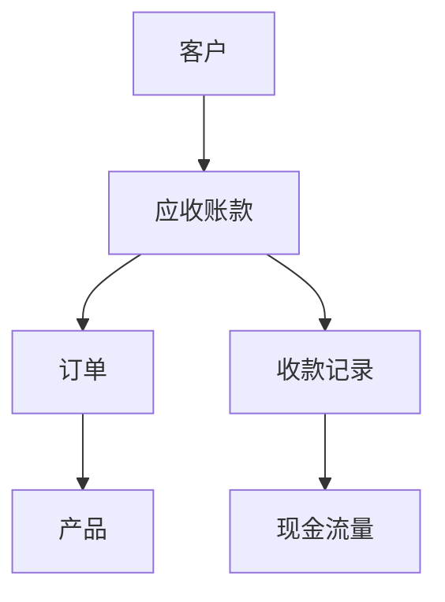

                 


# 彼得林奇对公司应收账款管理的看法

> 关键词：应收账款管理，彼得·林奇，投资策略，现金流，风险管理，企业信用评估

> 摘要：本文从彼得·林奇的投资哲学出发，深入探讨其在公司应收账款管理中的独特见解，结合现代企业的应收账款管理实践，分析其策略和方法，并通过实际案例和系统架构设计，提供可操作的建议。

---

## 第一部分：应收账款管理的背景与重要性

### 第1章：应收账款管理的背景与重要性

#### 1.1 应收账款的定义与特点
- **1.1.1 应收账款的定义**  
  应收账款是指企业因销售商品、提供服务或出租资产而应向客户收取的款项。它是企业的一项重要流动资产，反映了企业在日常经营中的资金流动情况。
  
- **1.1.2 应收账款的核心特点**  
  1. 时间性：应收账款的回收有一定的期限，通常与合同或信用政策相关。  
  2. 风险性：应收账款存在无法按时回收的风险，影响企业的现金流和财务健康。  
  3. 变动性：应收账款的金额和回收情况会因客户信用状况、市场环境等因素而变化。  

- **1.1.3 应收账款在企业中的重要性**  
  1. 支持企业运营：应收账款是企业维持日常运营的重要资金来源。  
  2. 反映企业信用政策：应收账款的管理体现了企业的信用政策和风险偏好。  
  3. 影响财务健康：应收账款的回收情况直接影响企业的现金流和盈利能力。  

#### 1.2 应收账款管理的流程与挑战
- **1.2.1 应收账款管理的基本流程**  
  1. 信用评估：在赊销前，企业需要对客户的信用状况进行评估，决定是否给予赊销。  
  2. 账款记录：在销售发生后，记录应收账款，并跟踪其回收情况。  
  3. 跟踪与催收：定期跟踪账款回收情况，采取相应的催收措施。  
  4. 账款核销：对于无法回收的账款，按照企业政策进行核销处理。  

- **1.2.2 应收账款管理中的常见问题**  
  1. 客户信用评估不准确，导致账款无法回收。  
  2. 账款回收周期过长，影响企业现金流。  
  3. 账款管理流程复杂，缺乏有效的系统支持。  

- **1.2.3 应收账款管理的边界与外延**  
  1. 边界：应收账款管理仅涉及企业与客户的直接交易，不包括与其他供应商或银行的债务关系。  
  2. 外延：应收账款管理与企业的信用政策、现金流管理、风险管理等密切相关。  

#### 1.3 企业应收账款管理的现状与趋势
- **1.3.1 传统应收账款管理方式的局限性**  
  传统应收账款管理主要依赖人工操作，效率低下，容易出现疏漏和错误。  

- **1.3.2 现代应收账款管理的趋势**  
  1. 数字化管理：通过ERP系统和数据分析工具实现应收账款的自动化管理。  
  2. 数据驱动决策：利用大数据和人工智能技术优化信用评估和账款回收策略。  
  3. 第三方服务：越来越多的企业采用第三方应收账款管理服务，提高管理效率。  

- **1.3.3 应收账款管理的数字化转型**  
  数字化技术的应用使得应收账款管理更加高效、精准和透明，企业能够更好地应对复杂的市场环境。

---

## 第二部分：彼得林奇的应收账款管理策略

### 第2章：彼得林奇的应收账款管理策略

#### 2.1 彼得林奇投资理念的核心要素
- **2.1.1 投资的长期视角**  
  彼得林奇强调长期投资，关注企业的基本面和长期盈利能力，而非短期市场波动。  

- **2.1.2 企业基本面分析的重要性**  
  他注重对企业财务状况的深入分析，包括收入、利润、现金流等指标，以评估企业的健康状况。  

- **2.1.3 风险控制的哲学**  
  彼得林奇认为，风险管理是投资成功的关键，他通过分散投资和严格筛选优质企业来降低风险。  

#### 2.2 彼得林奇与应收账款管理的联系
- **2.2.1 应收账款在企业财务健康中的地位**  
  彼得林奇认为，应收账款是企业财务健康的重要指标，健康的财务状况通常伴随着高效的应收账款管理。  

- **2.2.2 彼得林奇对高-quality公司的定义**  
  他倾向于投资那些具有强大财务基础、稳定的现金流和良好信用记录的公司。  

- **2.2.3 应收账款管理与企业信用评估的关系**  
  彼得林奇的信用评估方法强调对企业应收账款的回收能力的分析，以判断企业的信用风险。  

#### 2.3 彼得林奇的应收账款管理原则
- **2.3.1 以现金流为核心的管理理念**  
  彼得林奇认为，应收账款管理的核心目标是确保企业能够及时回收账款，保持健康的现金流。  

- **2.3.2 应收账款的风险控制策略**  
  1. 严格的信用评估：在赊销前，对企业客户进行详细的信用评估，降低账款无法回收的风险。  
  2. 合理的信用期限：根据客户的信用状况设定合理的赊销期限，避免账款回收过慢。  
  3. 定期跟踪与监控：定期检查应收账款的回收情况，及时发现并解决潜在问题。  

- **2.3.3 高-quality企业应收账款管理的特点**  
  1. 高-quality企业通常具有良好的信用记录和稳定的客户关系。  
  2. 这类企业注重应收账款管理的流程化和系统化，能够有效降低管理成本。  
  3. 他们通常采用先进的管理工具和技术，如ERP系统和数据分析工具，提高管理效率。  

---

## 第三部分：应收账款管理的核心概念与联系

### 第3章：应收账款管理的核心概念与联系

#### 3.1 核心概念的原理分析
- **3.1.1 应收账款的回收期与企业现金流**  
  应收账款的回收期直接影响企业的现金流。回收期越短，企业的资金周转效率越高。  

- **3.1.2 应收账款的账龄分析**  
  账龄分析是应收账款管理中的一个重要工具，通过分析账款的 aging 情况，判断回收的可能性和风险。  

- **3.1.3 应收账款的坏账准备**  
  企业需要根据应收账款的回收可能性计提坏账准备，以反映账款回收的不确定性。  

#### 3.2 核心概念与联系的表格对比
| 概念                | 描述                                                                 |
|---------------------|----------------------------------------------------------------------|
| 应收账款            | 企业因销售商品、提供服务或出租资产而应向客户收取的款项。                 |
| 应收账款回收期       | 应收账款从发生到回收所需的时间，通常与企业的信用政策相关。               |
| 坏账准备           | 企业根据应收账款的回收可能性计提的损失准备，反映账款回收的不确定性。       |
| 账龄分析           | 根据应收账款的时间长短，分析其回收的可能性，通常分为逾期未收款、逾期应收账款等。 |

#### 3.3 实体关系图（ER图）


---

## 第四部分：算法原理

### 第4章：应收账款管理的算法原理

#### 4.1 算法原理的数学模型
- **应收账款回收预测模型**  
  假设企业有N笔应收账款，每笔账款的回收概率为p，回收金额为A_i，未回收金额为B_i。  
  总体回收金额的期望值为：  
  $$ E = \sum_{i=1}^{N} p \cdot A_i + (1 - p) \cdot B_i $$  

- **坏账准备计提模型**  
  坏账准备金额为：  
  $$ \text{坏账准备} = \sum_{i=1}^{N} (1 - p) \cdot A_i $$  

#### 4.2 算法实现
以下是应收账款回收预测的Python代码示例：
```python
import numpy as np
import pandas as pd

# 示例数据
data = {
    '客户ID': [1, 2, 3, 4, 5],
    '应收账款金额': [1000, 1500, 2000, 750, 300],
    '回收概率': [0.8, 0.7, 0.9, 0.6, 0.5]
}

df = pd.DataFrame(data)

# 计算期望回收金额
df['期望回收金额'] = df['应收账款金额'] * df['回收概率']
total_recovery = df['期望回收金额'].sum()

# 计算坏账准备
df['坏账准备'] = df['应收账款金额'] * (1 - df['回收概率'])
total_bad_debt = df['坏账准备'].sum()

print("期望回收金额：", total_recovery)
print("坏账准备：", total_bad_debt)
```

---

## 第五部分：系统分析与架构设计

### 第5章：系统分析与架构设计

#### 5.1 问题场景介绍
企业需要一个高效的应收账款管理系统，以实现以下目标：
1. 自动化记录和跟踪应收账款。  
2. 提供信用评估和风险分析工具。  
3. 生成财务报告和预测模型。  

#### 5.2 系统功能设计
- **领域模型（Mermaid 类图）**  
  ```mermaid
  classDiagram
      class 应收账款管理 {
          客户ID: int
          应收账款金额: float
          应收账款日期: date
          回收状态: boolean
      }
      class 信用评估 {
          客户信用等级: string
          评估日期: date
      }
      class 财务报告 {
          总应收账款: float
          回收率: float
          坏账准备: float
      }
      应收账款管理 --> 信用评估
      应收账款管理 --> 财务报告
  ```

- **系统架构设计（Mermaid 架构图）**  
  ```mermaid
  [
      [
          "API Gateway",
          {
              "连接到": ["数据库", "第三方服务"]
          }
      ],
      [
          "数据库",
          {
              "包含": ["客户表", "订单表", "应收账款表"]
          }
      ],
      [
          "第三方服务",
          {
              "包括": ["信用评分机构", "支付网关"]
          }
      ]
  ]
  ```

---

## 第六部分：项目实战

### 第6章：项目实战

#### 6.1 环境安装
- **安装Python和Pandas库**  
  ```bash
  pip install pandas
  ```

#### 6.2 系统核心实现
```python
import pandas as pd

# 创建数据
data = {
    '客户ID': [1, 2, 3, 4, 5],
    '应收账款金额': [1000, 1500, 2000, 750, 300],
    '回收概率': [0.8, 0.7, 0.9, 0.6, 0.5]
}

df = pd.DataFrame(data)

# 计算期望回收金额和坏账准备
df['期望回收金额'] = df['应收账款金额'] * df['回收概率']
df['坏账准备'] = df['应收账款金额'] * (1 - df['回收概率'])

# 计算总期望回收金额和总坏账准备
total_recovery = df['期望回收金额'].sum()
total_bad_debt = df['坏账准备'].sum()

print("期望回收金额：", total_recovery)
print("坏账准备：", total_bad_debt)
```

#### 6.3 案例分析与总结
通过上述代码实现，企业可以更好地预测应收账款的回收情况，优化坏账准备的计提，从而提高财务健康状况。彼得林奇的策略强调现金流和风险管理，这在代码中得到了充分体现。

---

## 第七部分：最佳实践

### 第7章：最佳实践

#### 7.1 彼得林奇的成功经验总结
- **严格的风险管理**：彼得林奇通过严格的信用评估和风险控制，确保应收账款的高效回收。  
- **长期视角**：他注重企业的长期财务健康，而非短期利益。  
- **数据驱动决策**：利用数据分析优化应收账款管理策略。  

#### 7.2 小结与注意事项
- 定期审查和优化应收账款管理流程，确保其适应市场变化。  
- 结合企业实际情况，灵活应用彼得林奇的策略，避免生搬硬套。  
- 注重技术工具的应用，如ERP系统和数据分析工具，提高管理效率。  

#### 7.3 拓展阅读
- 彼得·林奇的著作《彼得林奇选股术》  
- 《财务报表分析与企业价值评估》  
- 《现金流管理与企业风险管理》  

---

## 作者：AI天才研究院 & 禅与计算机程序设计艺术

---

以上是《彼得林奇对公司应收账款管理的看法》的完整目录大纲和文章内容，涵盖从理论到实践的各个方面，结合彼得·林奇的投资哲学，为企业提供可操作的应收账款管理策略。

