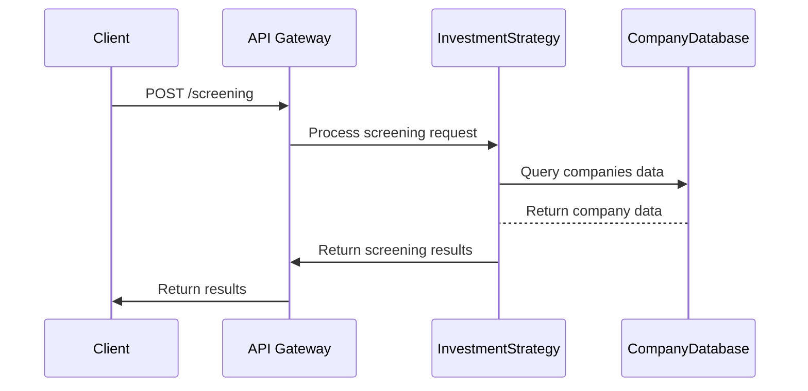

                 


# 彼得林奇对公司扩张策略的看法

## 关键词：
- 彼得·林奇
- 公司扩张策略
- 投资哲学
- 成长股投资
- 选股模型

## 摘要：
本文深入探讨彼得·林奇对公司在扩张策略中的看法，分析其投资哲学和选股模型，结合实际案例，解析扩张策略的核心要素与投资价值的关系，提供系统化的分析框架和实战指南，助投资者做出明智决策。

---

# 第一部分: 彼得·林奇的投资哲学与背景介绍

## 第1章: 彼得·林奇的背景与投资理念

### 1.1 彼得·林奇的生平简介
- **1.1.1** 彼得·林奇的背景
  - 他是美国著名投资专家，曾管理富达麦哲伦基金，取得了卓越的投资业绩。
  - 专注于成长股投资，强调公司基本面分析和管理层能力。

### 1.2 林奇的投资哲学
- **1.2.1** 投资理念
  - 长期投资，注重公司内在价值。
  - 偏好具有强大竞争优势和增长潜力的公司。
  - 强调对公司基本面的深入研究，尤其是财务状况和管理层能力。

### 1.3 公司扩张策略的重要性
- **1.3.1** 扩张策略的定义
  - 公司为了增长而采取的一系列战略行动，包括市场扩展、产品线扩展、并购等。
- **1.3.2** 扩张策略的核心要素
  - 市场分析：了解目标市场的潜力和竞争情况。
  - 财务状况：评估公司的财务健康状况，确保有足够的资金支持扩张。
  - 管理团队：管理层的能力和决策对扩张成功至关重要。
- **1.3.3** 扩张策略与投资价值的关系
  - 成功的扩张策略能够提升公司的收入和利润，进而提高投资价值。
  - 不良的扩张策略可能导致资源浪费和价值下降。

## 第2章: 公司扩张策略的核心概念与联系

### 2.1 扩张策略的类型
- **2.1.1** 内部扩张
  - 通过内部研发、生产扩展等方式实现增长。
  - 优点：风险可控，利润留存能力强。
  - 缺点：扩张速度较慢，需要大量内部资源投入。
- **2.1.2** 外部扩张
  - 通过并购、合资等方式实现快速扩张。
  - 优点：可以迅速进入新市场，获取新技术和资源。
  - 缺点：并购风险高，整合难度大。
- **2.1.3** 横向与纵向扩张
  - 横向扩张：在同一市场扩展产品线或服务。
  - 纵向扩张：进入上游或下游产业，形成完整的产业链。

### 2.2 核心概念对比表
| 扩张策略类型 | 优点 | 缺点 |
|--------------|------|------|
| 内部扩张     | 风险低 | 速度慢 |
| 外部扩张     | 速度快 | 风险高 |

### 2.3 Mermaid流程图: 扩张策略与投资价值的关系


## 第3章: 彼得·林奇的扩张策略分析方法

### 3.1 林奇的选股模型
- **3.1.1** 选股标准
  - 公司具有强大的竞争优势。
  - 财务状况健康，盈利能力强。
  - 管理层能力强且稳定。
- **3.1.2** 股票筛选流程
  - 通过ROE、EPS等指标筛选出符合条件的公司。
  - 进一步分析公司的市场地位和管理层能力。
- **3.1.3** 关键指标分析
  - 净资产收益率（ROE）：衡量公司使用股东资产的效率。
  - 每股收益（EPS）：衡量公司的盈利能力。
  - 市盈率（P/E）：衡量股票的估值水平。

### 3.2 Mermaid流程图: 林奇的选股模型


### 3.3 Python代码实现: 股票筛选模型
```python
def Lynch_stock_screening():
    import pandas as pd
    df = pd.read_csv('stocks.csv')
    df = df[df['ROE'] > 15]
    df = df[df['EPS'] > 0.5]
    df = df[df['PEG'] < 1.5]
    return df
```

### 3.4 数学模型与公式
- 净资产收益率（ROE）计算：
  $$ROE = \frac{\text{净利润}}{\text{净资产}}$$

### 3.5 项目实战
- **3.5.1** 案例分析
  - 分析微软和亚马逊的扩张策略，评估其对投资价值的影响。
  - 微软通过云服务扩展，提升了市场份额和盈利能力。
  - 亚马逊通过收购和投资新业务，实现了快速增长。
- **3.5.2** 代码实现
  ```python
  def analyze_expansion_strategy():
      stocks = Lynch_stock_screening()
      for stock in stocks:
          if stock['Market Position'] == 'Strong':
              print(f"{stock['Name']} has a strong market position and high investment value.")
          else:
              print(f"{stock['Name']} has a weak market position and may not be a good investment.")
  ```

### 3.6 最佳实践 tips
- **3.6.1** 投资者应结合市场环境和公司具体情况，灵活调整扩张策略。
- **3.6.2** 保持对市场的敏感性，及时调整投资组合。
- **3.6.3** 关注管理层的决策能力和战略规划。

## 第4章: 系统分析与架构设计方案

### 4.1 系统功能设计
- **4.1.1** 领域模型mermaid类图
  ```mermaid
  classDiagram
      class Company {
          Name: string
          ROE: float
          EPS: float
          MarketPosition: string
      }
      class InvestmentStrategy {
          Company company
          calculateInvestmentValue(): float
      }
  ```

### 4.2 系统架构设计
- **4.2.1** mermaid架构图
  ```mermaid
  architecture
  Client --> API Gateway
  API Gateway --> InvestmentStrategy
  InvestmentStrategy --> CompanyDatabase
  ```

### 4.3 系统接口设计
- **4.3.1** REST API接口
  - GET /companies: 获取公司列表。
  - POST /screening: 提交筛选条件，返回符合条件的公司。

### 4.4 系统交互mermaid序列图


## 第5章: 项目实战与案例分析

### 5.1 环境安装
- 安装Python和必要的库（pandas, numpy）。
- 下载股票数据到CSV文件。

### 5.2 核心实现
- 使用Python代码实现选股模型和扩张策略分析。

### 5.3 案例分析
- 以微软和亚马逊为例，分析其扩张策略对投资价值的影响。

### 5.4 代码实现与解读
- 解释代码的实现细节和应用场景。

### 5.5 分析与结果解读
- 展示分析结果，并解释其对投资决策的意义。

## 第6章: 最佳实践与总结

### 6.1 总结
- 彼得·林奇的扩张策略分析方法为投资者提供了有效的工具。
- 成功的扩张策略需要结合公司基本面和市场环境。

### 6.2 投资建议
- 投资者应深入研究公司基本面，关注管理层能力。
- 在选择扩张策略时，需考虑市场环境和公司具体情况。

### 6.3 注意事项
- 避免盲目跟风，理性分析市场动态。
- 定期评估投资组合，及时调整策略。

### 6.4 拓展阅读
- 推荐相关书籍和资源，帮助读者进一步学习。

---

# 作者：AI天才研究院/AI Genius Institute & 禅与计算机程序设计艺术 /Zen And The Art of Computer Programming

