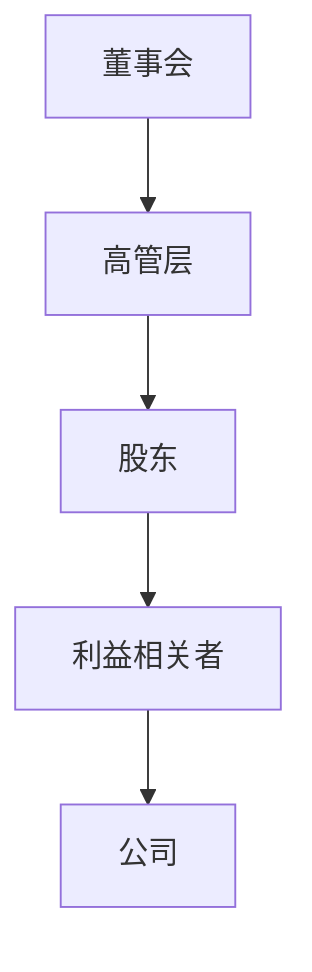
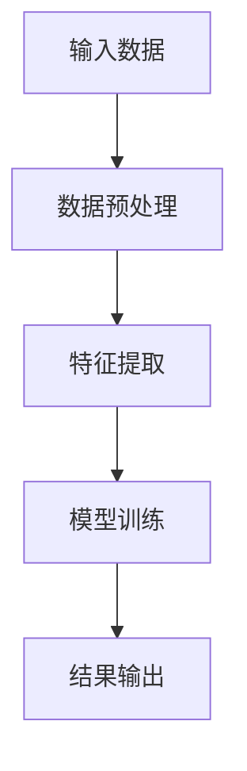
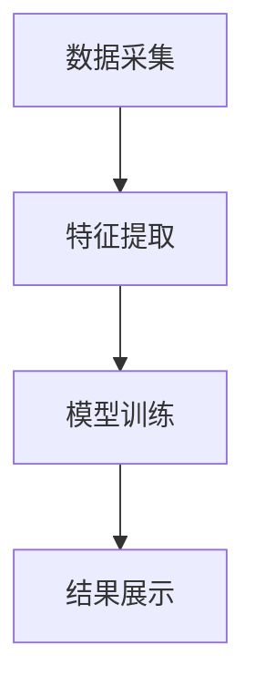
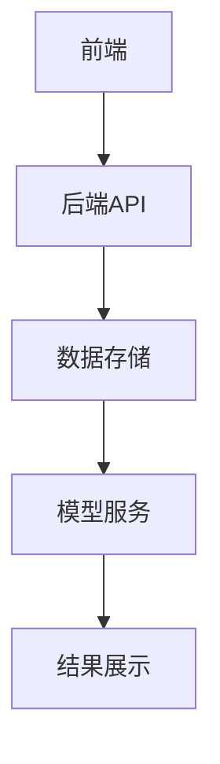
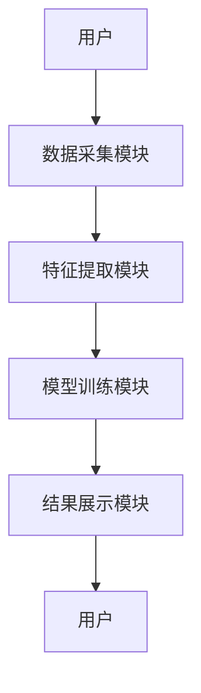

                 


```markdown
# 彼得林奇对公司治理的要求

> 关键词：公司治理，彼得林奇，投资理念，评估模型，系统架构，项目实战

> 摘要：本文详细探讨了彼得林奇对公司治理的要求，从核心概念、评估模型、系统架构到项目实战，全面分析了公司治理在投资中的重要性，并通过具体案例和数学模型展示了如何应用这些要求来提升公司治理的透明度和效率。

---

## 第一部分: 背景与理念

### 第1章: 公司治理的基本概念与背景

#### 1.1 公司治理的定义与核心要素
- **定义**：公司治理是指公司内部和外部利益相关者之间为了实现公司价值最大化而建立的权力结构和责任体系。
- **核心要素**：
  - **董事会**：负责制定公司战略和监督高管。
  - **高管层**：负责日常经营和执行董事会决策。
  - **股东**：拥有公司所有权，参与公司重大决策。
  - **利益相关者**：包括员工、客户、供应商和债权人等。
  - **审计与合规**：确保公司财务透明和合规性。

#### 1.2 彼得林奇与公司治理的联系
- **彼得林奇的投资理念**：彼得林奇是著名的投资家，他认为公司治理是决定公司长期价值的关键因素之一。
- **公司治理在投资中的重要性**：良好的公司治理可以降低投资风险，提高公司透明度和管理效率。
- **彼得林奇对公司治理的要求**：
  - **董事会独立性**：董事会成员应独立于管理层，确保决策的客观性。
  - **高管问责制**：高管应对其行为负责，确保公司利益最大化。
  - **股东权益保护**：公司应尊重和保护股东的权益，确保股东的知情权和参与权。

---

## 第二部分: 核心概念与联系

### 第2章: 公司治理的核心概念与联系

#### 2.1 核心概念对比分析
- **董事会与高管对比**：
  | **属性** | **董事会** | **高管层** |
  |----------|------------|------------|
  | **职责** | 制定战略   | 执行战略   |
  | **权力** | 监督       | 决策与执行 |

- **股东与利益相关者对比**：
  | **属性** | **股东**         | **利益相关者** |
  |----------|------------------|----------------|
  | **角色** | 拥有所有权       | 受公司影响的各方 |
  | **权利** | 表决权、分红权   | 无直接所有权   |

#### 2.2 实体关系图


---

## 第三部分: 评估模型与算法原理

### 第3章: 公司治理的评估模型与算法原理

#### 3.1 公司治理评估模型
- **模型定义**：基于彼得林奇的公司治理要求，构建一个综合评分系统，评估公司的治理透明度和效率。
- **模型输入**：公司治理相关数据，包括董事会结构、高管问责制、股东权益保护等。
- **模型输出**：公司治理综合评分，分为优秀、良好、一般和较差四个等级。

#### 3.2 算法原理


#### 3.3 算法实现
- **数据预处理**：清洗和标准化公司治理相关数据。
- **特征提取**：提取关键特征，如董事会独立性、高管问责制、股东权益保护等。
- **模型训练**：使用机器学习算法（如随机森林）训练模型，评估公司治理评分。
- **结果输出**：输出公司治理综合评分，指导投资决策。

#### 3.4 数学模型
- **公司治理评分公式**：
  $$ \text{评分} = \sum_{i=1}^{n} w_i \cdot x_i $$
  其中，\( w_i \) 是第 \( i \) 个特征的权重，\( x_i \) 是第 \( i \) 个特征的评分。

---

## 第四部分: 系统分析与架构设计

### 第4章: 系统分析与架构设计

#### 4.1 系统功能设计
- **领域模型**：公司治理评估系统包括数据采集、特征提取、模型训练和结果展示四个模块。



#### 4.2 系统架构设计
- **架构图**：


#### 4.3 系统接口设计
- **接口1**：数据采集接口，接收公司治理数据。
- **接口2**：模型训练接口，调用机器学习模型进行评分。
- **接口3**：结果展示接口，返回公司治理评分和建议。

#### 4.4 系统交互流程


---

## 第五部分: 项目实战

### 第5章: 项目实战

#### 5.1 环境安装
- **Python环境**：安装Python 3.8以上版本。
- **依赖库**：安装numpy、pandas、scikit-learn等库。

#### 5.2 系统核心实现
```python
import pandas as pd
from sklearn.ensemble import RandomForestClassifier

# 数据加载
data = pd.read_csv('governance_data.csv')

# 特征提取
features = data[['board_independence', 'executive_accountability', 'shareholder_rights']]
target = data['governance_score']

# 模型训练
model = RandomForestClassifier()
model.fit(features, target)

# 预测评分
new_company = [[0.8, 0.7, 0.6]]
prediction = model.predict(new_company)
print(f"公司治理评分：{prediction[0]}")
```

#### 5.3 案例分析
- **案例1**：某公司董事会独立性为0.8，高管问责制为0.7，股东权益保护为0.6，模型预测其治理评分为良好。
- **案例2**：某公司治理评分为较差，建议其改进董事会结构和高管问责制。

#### 5.4 项目小结
- 本项目展示了如何应用彼得林奇的公司治理要求，构建一个高效的评估系统，帮助投资者做出更明智的投资决策。

---

## 第六部分: 最佳实践与总结

### 第6章: 最佳实践

#### 6.1 小结
- 彼得林奇强调公司治理的重要性，良好的治理结构是公司长期价值的核心。
- 通过构建评估模型和系统架构，可以有效量化公司治理的透明度和效率。

#### 6.2 投资建议
- **长期投资**：关注具有优秀公司治理结构的公司。
- **持续监控**：定期评估公司治理状况，及时调整投资策略。

#### 6.3 注意事项
- 公司治理评估应结合定性分析和定量分析，避免片面性。
- 投资者应关注公司治理的动态变化，及时调整投资组合。

#### 6.4 拓展阅读
- 《彼得林奇的投资哲学》
- 《公司治理与企业价值》

---

## 作者：AI天才研究院/AI Genius Institute & 禅与计算机程序设计艺术 /Zen And The Art of Computer Programming

---

通过以上目录结构，我们可以全面了解彼得林奇对公司治理的要求，并通过具体案例和系统设计展示如何将这些要求应用于实际投资中。

