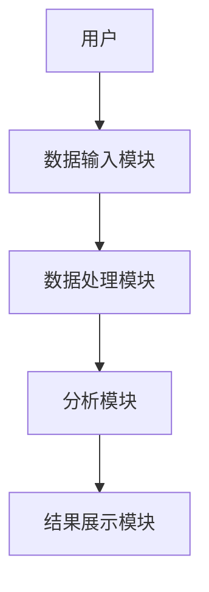

                 


```markdown
# 彼得林奇对公司现金流的重要性分析

## 文章关键词
- 现金流分析
- 彼得·林奇
- 投资决策
- 财务健康
- 企业价值

## 摘要
现金流是企业财务健康的重要指标，也是投资决策的关键因素。本文深入探讨了现金流分析的核心概念、数学模型、系统架构及实际应用，结合彼得·林奇的投资理念，分析了现金流在企业价值评估中的重要性。通过案例分析和系统设计，展示了如何利用现金流分析做出明智的投资决策。

---

## 第一部分：现金流的基本概念与重要性

### 第1章：现金流的基本概念
1.1 现金流的定义与分类
- 现金流是企业在一定时期内现金的流入和流出，分为经营活动、投资活动和筹资活动三类。
- 现金流的正负号分别代表现金流入和流出，是企业财务健康的重要指标。

1.2 现金流的重要性
- 现金流直接反映企业的盈利能力和偿债能力。
- 现金流充足的企业能够维持日常运营，抓住投资机会，降低财务风险。

1.3 彼得·林奇的投资理念
- 彼得·林奇强调基本面分析，尤其是现金流的质量和稳定性。
- 他认为，自由现金流是企业创造利润的核心指标，能够反映企业的内在价值。

---

## 第二部分：现金流的结构与分析方法

### 第2章：现金流的结构分析
2.1 现金流量表的构成
- 经营活动现金流：企业日常运营中产生的现金流入和流出。
- 投资活动现金流：企业投资于长期资产或出售资产所产生的现金流量。
- 筹资活动现金流：企业通过发行股票、债券或其他融资方式获得或偿还的债务所产生的现金流量。

2.2 自由现金流的概念与计算
- 自由现金流（FCF）= 经营活动现金流 - 资本 expenditures。
- 例如，企业某年的经营活动现金流为 $1000，资本 expenditures 为 $200，则自由现金流为 $800。

2.3 现金流质量的评估
- 现金流质量高意味着企业能够持续产生稳定的现金流，且现金流来源于核心业务。
- 现金流质量差可能表明企业依赖外部融资或出售资产来维持运营。

---

## 第三部分：现金流分析的数学模型与算法

### 第3章：现金流分析的数学模型
3.1 现金流的现值计算
- 现值公式：PV = CF / (1 + r)^n，其中 CF 是现金流，r 是贴现率，n 是时间周期。
- 例如，未来现金流 $1000，贴现率 10%，时间 2 年，则 PV = 1000 / (1.1)^2 ≈ $826.45。

3.2 内部收益率（IRR）的计算
- IRR 是使净现值为零的贴现率。
- 例如，项目现金流为 $-1000、$500、$600，则 IRR ≈ 15%。

3.3 现金流分析的数学模型
- 使用DCF模型评估企业内在价值：
  - 内在价值 = ∑(CF_t / (1 + r)^t) + 终值。
  - 终值 = 最后一年的现金流 / (r - g)，其中 g 是永续增长率。

---

## 第四部分：现金流分析的系统架构与实战

### 第4章：现金流分析的系统架构
4.1 系统功能设计
- 数据输入：收集企业财务报表中的现金流数据。
- 数据处理：计算自由现金流、贴现率等关键指标。
- 分析模块：应用DCF模型计算内在价值。
- 结果展示：生成可视化图表，如现金流量表和DCF模型图。

4.2 系统架构设计


### 第5章：项目实战
5.1 环境安装
- 安装Python和相关库（如numpy、pandas、matplotlib）。
- 使用Jupyter Notebook进行数据处理和可视化。

5.2 核心实现
```python
import pandas as pd
import numpy as np
import matplotlib.pyplot as plt

# 示例数据：现金流和贴现率
cf = [ -100, 200, 300, 400 ]
r = 0.1

# 现金流的现值计算
pv = sum(cf_t / (1 + r)**t for t, cf_t in enumerate(cf))
print("现值：", pv)

# 内部收益率计算
def irr(cfs):
    return np.irr(cfs)

irr_result = irr(cf)
print("内部收益率：", irr_result)
```

5.3 案例分析
- 以苹果公司为例，分析其最近5年的现金流情况。
- 使用DCF模型计算其内在价值，并与市场价进行对比。

---

## 第五部分：总结与展望

### 第6章：总结
- 现金流分析是投资决策的核心，现金流的质量和稳定性直接关系到企业的价值。
- 彼得·林奇的投资理念强调现金流的重要性，投资者应将现金流分析作为基本面分析的重要部分。

### 第7章：注意事项与拓展阅读
- 现金流分析需结合其他财务指标（如利润表、资产负债表）进行综合评估。
- 进一步阅读彼得·林奇的著作《彼得·林奇的投资策略》深入理解其投资理念。

---

## 作者：AI天才研究院 & 禅与计算机程序设计艺术
```

