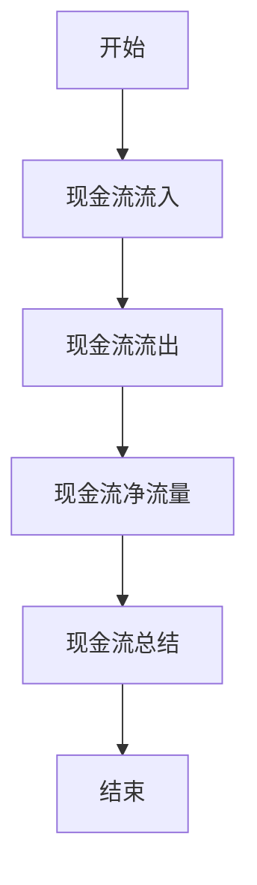
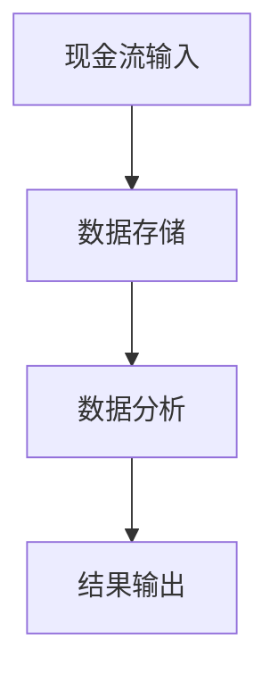

                 


# 彼得林奇对公司现金流的重视

> 关键词：现金流、企业估值、彼得·林奇、投资策略、DCF模型、内部收益率

> 摘要：现金流是企业健康和价值的核心指标，彼得·林奇作为投资大师，其对现金流的重视在投资策略中占据了重要地位。本文从现金流的定义、核心概念、分析方法、系统架构、实战案例、最佳实践等方面，深入探讨彼得·林奇的现金流分析方法及其在投资决策中的应用，帮助读者全面理解现金流的重要性，并掌握如何利用现金流分析做出明智的投资决策。

---

## 第1章: 现金流的概述

### 1.1 现金流的定义与分类

#### 1.1.1 现金流的基本定义
现金流（Cash Flow）是指企业在一定时期内现金的流入和流出情况。现金流入包括销售收入、投资收益等，现金流出包括支付的成本、税费等。现金流是衡量企业财务健康状况的重要指标。

#### 1.1.2 现金流的分类与特点
现金流可以分为三类：
1. **经营活动现金流**：来自企业日常经营的现金流。
2. **投资活动现金流**：来自投资活动的现金流，如购买或出售资产。
3. **筹资活动现金流**：来自筹资活动的现金流，如借款或发行股票。

#### 1.1.3 现金流在企业中的重要性
现金流直接反映了企业的财务状况和经营能力，是评估企业价值的重要指标。健康的现金流意味着企业能够维持日常运营并进行扩张。

---

### 1.2 现金流与企业价值的关系

#### 1.2.1 现金流对企业发展的影响
现金流充足的企业能够更好地应对市场波动，抓住投资机会。反之，现金流不足的企业可能面临财务危机。

#### 1.2.2 现金流与企业估值的核心联系
现金流是企业估值的基础，通过贴现现金流模型（DCF模型），投资者可以估算企业的内在价值。

#### 1.2.3 现金流在投资决策中的作用
现金流分析是投资决策的核心，通过分析现金流，投资者可以评估企业的盈利能力和成长潜力。

---

### 1.3 彼得·林奇与现金流分析

#### 1.3.1 彼得·林奇的投资理念概述
彼得·林奇是著名的投资经理，他强调基本面分析，尤其是对企业的现金流和盈利能力的关注。

#### 1.3.2 现金流在彼得·林奇投资策略中的地位
彼得·林奇认为，现金流是衡量企业健康的核心指标，只有具备稳定现金流的企业才具备长期投资价值。

#### 1.3.3 彼得·林奇现金流分析方法的核心思想
彼得·林奇通过分析企业的现金流，评估其盈利能力和成长潜力，从而做出投资决策。

---

## 第2章: 现金流的核心概念与数学模型

### 2.1 现金流的核心概念解析

#### 2.1.1 现金流的时间价值
现金流的时间价值是指资金随着时间的推移而产生的价值变化。例如，今天的100元和一年后的100元在价值上是不同的。

#### 2.1.2 现金流的风险评估
现金流的风险主要来自市场波动和企业经营状况的变化。通过分析现金流的波动性，可以评估其风险。

#### 2.1.3 现金流的可预测性分析
现金流的可预测性取决于企业的经营模式和市场环境。稳定的现金流更容易预测。

---

### 2.2 现金流的数学模型与公式

#### 2.2.1 现金流贴现模型（DCF模型）
贴现现金流模型（Discounted Cash Flow, DCF）是评估企业价值的核心工具。公式如下：

$$
\text{企业价值} = \sum_{t=1}^{n} \frac{\text{现金流}_t}{(1 + r)^t} + \frac{\text{残值}}{(1 + r)^n}
$$

其中，\( r \) 是贴现率，\( n \) 是预测期数。

#### 2.2.2 内部收益率（IRR）与净现值（NPV）的计算
内部收益率（IRR）是使净现值（NPV）为零的贴现率：

$$
\text{NPV} = \sum_{t=1}^{n} \frac{\text{现金流}_t}{(1 + r)^t}
$$

IRR的计算需要通过试算法或使用财务计算器。

---

### 2.3 现金流的实体关系图与流程图

#### 2.3.1 现金流的来源与流向关系图


#### 2.3.2 现金流的生命周期流程图


---

## 第3章: 彼得·林奇的现金流分析方法

### 3.1 彼得·林奇现金流分析的核心原理

#### 3.1.1 现金流质量的评估标准
彼得·林奇关注现金流的质量，即现金流的稳定性和可持续性。

#### 3.1.2 现金流增长的可持续性分析
通过分析现金流的历史增长趋势，评估其未来的增长潜力。

#### 3.1.3 现金流与企业利润的关系
健康的现金流来源于稳定的利润，而利润又来源于有效的成本控制和销售增长。

---

### 3.2 现金流评估模型与数学公式

#### 3.2.1 现金流预测模型的建立
通过历史数据和市场趋势，建立现金流预测模型：

$$
\text{预测现金流} = \text{历史现金流} \times (1 + \text{增长率})
$$

#### 3.2.2 现金流贴现率的计算公式
贴现率的计算公式：

$$
r = \frac{\text{净收益}}{\text{现金流}}
$$

---

### 3.3 现金流分析的实战案例

#### 3.3.1 某公司现金流分析案例
假设某公司过去三年的现金流分别为100万、120万、150万，预测未来三年的增长率为10%。

#### 3.3.2 现金流分析对投资决策的影响
通过分析现金流，投资者可以评估企业的盈利能力和成长潜力。

---

## 第4章: 现金流与企业估值的系统分析

### 4.1 现金流与企业估值的关系

#### 4.1.1 现金流在企业估值中的核心作用
现金流是企业估值的基础，通过DCF模型，投资者可以估算企业的内在价值。

#### 4.1.2 现金流贴现模型（DCF）的应用
DCF模型的公式如下：

$$
\text{企业价值} = \sum_{t=1}^{n} \frac{\text{现金流}_t}{(1 + r)^t} + \frac{\text{残值}}{(1 + r)^n}
$$

#### 4.1.3 现金流与企业市场价值的对比分析
现金流与市场价值的对比可以帮助投资者评估企业的合理估值。

---

### 4.2 现金流系统的架构设计

#### 4.2.1 现金流系统的功能设计
- 现金流的输入与输出
- 现金流的存储与管理
- 现金流的分析与预测

#### 4.2.2 现金流系统的架构图


---

## 第5章: 现金流分析的实战案例

### 5.1 现金流分析的实战环境

#### 5.1.1 环境安装与配置
- 数据分析工具（如Excel、Python）
- 数据获取与清洗

#### 5.1.2 系统核心实现源代码
```python
def calculate_cash_flow(cash_flows, discount_rate):
    present_value = 0
    for year, cf in enumerate(cash_flows):
        present_value += cf / (1 + discount_rate) ** year
    return present_value

cash_flows = [100, 120, 150]
discount_rate = 0.1
print(calculate_cash_flow(cash_flows, discount_rate))
```

---

### 5.2 现金流分析的案例解读与分析

#### 5.2.1 案例分析
通过分析某公司的现金流，评估其内在价值。

#### 5.2.2 案例总结与经验分享
现金流分析的关键在于数据的准确性和模型的合理性。

---

## 第6章: 现金流的管理与投资策略

### 6.1 现金流管理策略

#### 6.1.1 现金流的管理原则
- 保持现金流的稳定性
- 合理分配现金流
- 风险管理

#### 6.1.2 现金流管理的数学模型
$$
\text{现金流管理} = \text{现金流流入} - \text{现金流流出}
$$

---

### 6.2 投资策略中的现金流分析

#### 6.2.1 现金流与投资组合优化
通过分析现金流，优化投资组合的收益与风险。

#### 6.2.2 现金流风险管理
制定风险管理策略，降低现金流波动对投资的影响。

---

## 第7章: 小结与展望

### 7.1 现金流的重要性
现金流是企业健康和价值的核心指标。

### 7.2 彼得·林奇的贡献
彼得·林奇通过现金流分析，帮助投资者做出明智的投资决策。

### 7.3 未来展望
现金流分析将随着技术的进步和市场的变化不断完善，为投资者提供更精准的决策支持。

---

## 附录

### 附录A: 现金流计算表格
| 年份 | 现金流（万元） |
|------|----------------|
| 2020 | 100            |
| 2021 | 120            |
| 2022 | 150            |

### 附录B: 现金流关键公式
$$
\text{净现值} = \sum_{t=1}^{n} \frac{\text{现金流}_t}{(1 + r)^t}
$$

### 附录C: 推荐阅读
- 《彼得·林奇的股票投资战策》
- 《财务报表分析与股票估值》

---

## 作者：AI天才研究院/AI Genius Institute & 禅与计算机程序设计艺术 /Zen And The Art of Computer Programming

