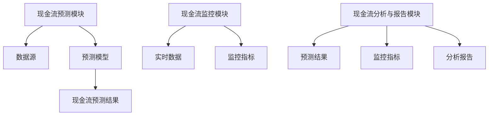
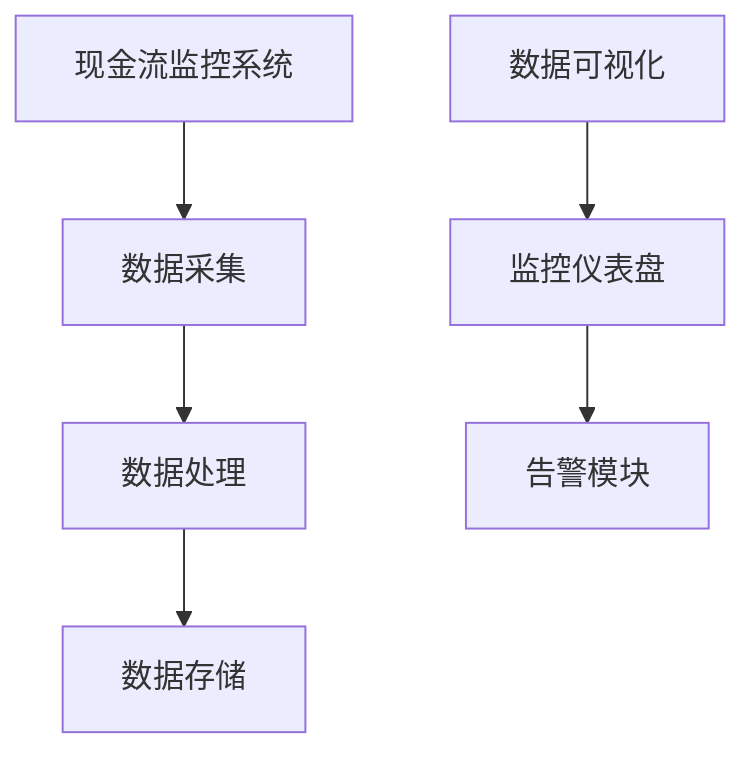

                 


# 彼得林奇对公司现金流管理的看法

> 关键词：彼得林奇，现金流管理，企业价值，投资策略，财务分析，风险管理

> 摘要：现金流管理是企业财务管理的核心，彼得林奇作为投资大师，提出了独特的现金流管理理论。本文系统阐述了现金流管理的基本概念、彼得林奇的现金流分析方法、现金流预测模型、现金流风险管理策略，以及现金流管理在企业价值评估中的应用。通过实际案例分析和系统架构设计，探讨了如何利用现金流信息制定有效的投资策略，并提供了风险管理的最佳实践和投资建议。

---

# 第一部分：现金流管理的基本概念

## 第1章：现金流的定义与重要性

### 1.1 现金流的定义

#### 1.1.1 现金流的定义和分类
现金流是指企业在一定时期内现金的流入和流出。根据来源和用途，现金流可以分为经营活动现金流、投资活动现金流和筹资活动现金流。

#### 1.1.2 现金流在企业中的作用
现金流是企业生存和发展的基础，直接影响企业的偿债能力、运营能力和投资能力。

#### 1.1.3 现金流与企业生存的关系
现金流是企业的生命线，充足的现金流能够保证企业正常运营，而现金流断裂可能导致企业倒闭。

### 1.2 现金流的重要性

#### 1.2.1 现金流对企业财务健康的影响
现金流健康意味着企业能够按时支付账单、偿还债务，并有足够的资金进行投资。

#### 1.2.2 现金流在投资决策中的作用
现金流是评估投资项目可行性的重要指标，能够帮助投资者判断投资的收益性和风险性。

#### 1.2.3 现金流与企业价值的关系
现金流的稳定性和增长性是决定企业价值的重要因素，能够影响企业的市场估值。

---

## 第2章：彼得林奇的投资理念

### 2.1 彼得林奇的投资者背景

#### 2.1.1 彼得林奇的生平简介
彼得林奇是美国著名投资家，以其价值投资理念闻名，强调长期投资和基本面分析。

#### 2.1.2 彼得林奇的投资风格
彼得林奇注重对企业基本面的分析，特别是现金流和利润情况，以寻找具有长期增长潜力的企业。

#### 2.1.3 彼得林奇的投资哲学
彼得林奇强调，投资成功的前提是对企业有深入的了解，关注企业的现金流和利润来源。

### 2.2 彼得林奇的现金流管理理论

#### 2.2.1 现金流在企业估值中的重要性
彼得林奇认为，现金流是企业价值的核心，稳定的现金流能够支撑企业的长期发展。

#### 2.2.2 彼得林奇的现金流评估方法
彼得林奇通过分析企业的现金流状况，评估企业的盈利能力和偿债能力。

#### 2.2.3 彼得林奇对现金流管理的建议
彼得林奇建议企业保持充足的现金流，避免过度依赖外部融资，注重现金流的稳定性和可持续性。

---

## 第3章：现金流管理的核心要素

### 3.1 现金流的来源

#### 3.1.1 经营活动现金流
经营活动现金流是企业日常经营活动中产生的现金流，包括销售商品、提供服务等。

#### 3.1.2 投资活动现金流
投资活动现金流是企业在投资活动中的现金流入和流出，如购买固定资产、出售投资等。

#### 3.1.3 筹资活动现金流
筹资活动现金流是企业通过融资活动获得的现金流，包括发行股票、借款等。

### 3.2 现金流的类型

#### 3.2.1 正向现金流
正向现金流表示企业现金流入大于流出，企业财务状况良好。

#### 3.2.2 负向现金流
负向现金流表示企业现金流出大于流入，企业财务状况可能存在问题。

#### 3.2.3 现金流的平衡与优化
企业需要通过合理管理现金流，实现现金流的平衡与优化，确保企业的财务健康。

---

## 第4章：现金流管理的数学模型与分析

### 4.1 现金流的计算公式

#### 4.1.1 现金流净额公式
$$ \text{现金流净额} = \text{现金流入} - \text{现金流出} $$

#### 4.1.2 现金流折现模型
$$ \text{现值} = \frac{\text{未来现金流}}{(1 + r)^n} $$
其中，r是折现率，n是时间跨度。

#### 4.1.3 内部收益率（IRR）与净现值（NPV）的计算
$$ \text{NPV} = \sum_{t=0}^{n} \frac{\text{现金流}_t}{(1 + r)^t} $$
IRR是使NPV等于零的折现率。

### 4.2 现金流的分析方法

#### 4.2.1 现金流的时间价值分析
通过现值和终值计算，评估现金流的时间价值。

#### 4.2.2 现金流的风险评估
利用标准差和β系数等方法，评估现金流的风险。

#### 4.2.3 现金流的预测与预算
通过历史数据分析和趋势预测，制定现金流预算。

---

## 第5章：现金流管理的系统架构

### 5.1 现金流管理的系统功能设计

#### 5.1.1 现金流预测模块
通过历史数据和趋势分析，预测未来现金流。

#### 5.1.2 现金流监控模块
实时监控现金流状况，及时发现和解决问题。

#### 5.1.3 现金流分析与报告模块
生成现金流分析报告，支持决策制定。

### 5.2 现金流管理的系统架构图



---

## 第6章：现金流管理的实战案例

### 6.1 现金流管理的案例分析

#### 6.1.1 彼得林奇的经典投资案例
彼得林奇通过分析现金流状况，成功投资于一些具有稳定现金流的企业。

#### 6.1.2 现金流管理在实际投资中的应用
通过现金流分析，选择具有稳定现金流和增长潜力的企业进行投资。

#### 6.1.3 现金流管理的成功与失败经验
总结现金流管理的成功经验，避免常见的错误。

### 6.2 现金流管理的风险管理策略

#### 6.2.1 现金流风险管理的重要性
现金流风险可能影响企业的偿债能力和运营能力。

#### 6.2.2 现金流风险管理的工具和方法
利用保险、衍生工具等方法，管理现金流风险。

#### 6.2.3 现金流风险管理的最佳实践
制定风险管理计划，建立风险管理机制，定期评估和调整。

---

# 第七章：现金流管理与企业价值评估

## 7.1 现金流与企业价值的关系

### 7.1.1 现金流对企业价值的影响
现金流是企业价值的核心，稳定的现金流能够支撑企业的长期发展。

### 7.1.2 现金流与企业估值模型
现金流折现模型（DCF）是企业估值的重要工具，基于未来现金流的现值计算企业价值。

## 7.2 现金流与投资策略

### 7.2.1 投资策略的制定
通过现金流分析，制定合理的投资策略，选择具有稳定现金流和增长潜力的企业。

### 7.2.2 投资策略的实施
根据现金流状况，动态调整投资组合，规避风险，追求收益。

---

# 第八章：现金流管理的系统实现

## 8.1 现金流预测模型

### 8.1.1 时间序列分析
使用ARIMA模型对现金流进行预测。

### 8.1.2 系统实现

```python
from statsmodels.tsa.arima.model import ARIMA

# 假设data是现金流时间序列数据
model = ARIMA(data, order=(5,1,0))
model_fit = model.fit()
forecast = model_fit.forecast(steps=5)
```

### 8.1.3 结果分析
通过模型预测未来现金流，并分析预测的准确性。

## 8.2 现金流监控系统

### 8.2.1 系统架构设计



### 8.2.2 实施方案
通过实时数据采集和处理，构建现金流监控系统，实现数据可视化和告警功能。

---

## 第九章：现金流管理的最佳实践

## 9.1 投资策略建议

### 9.1.1 长期投资策略
选择具有稳定现金流和增长潜力的企业进行长期投资。

### 9.1.2 短期投资策略
根据市场波动，调整短期投资组合，规避风险。

## 9.2 风险管理建议

### 9.2.1 建立风险管理机制
制定风险管理计划，定期评估和调整风险管理策略。

### 9.2.2 使用风险管理工具
利用保险、衍生工具等方法，管理现金流风险。

## 9.3 小结

现金流管理是企业财务管理的核心，彼得林奇的现金流管理理论为企业提供了重要的指导。通过科学的现金流预测、监控和分析，企业可以制定有效的投资策略，实现财务健康和可持续发展。

---

# 作者：AI天才研究院/AI Genius Institute & 禅与计算机程序设计艺术 /Zen And The Art of Computer Programming

