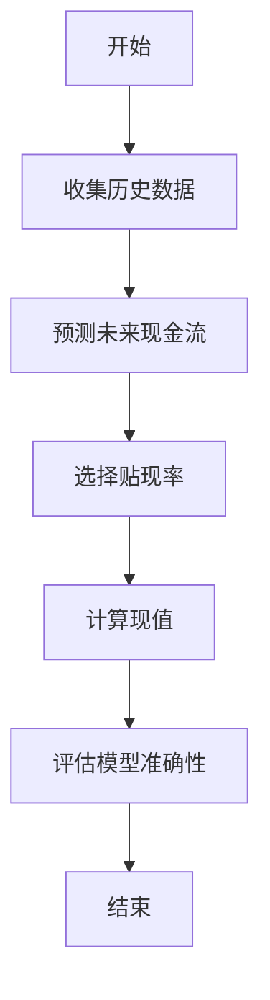
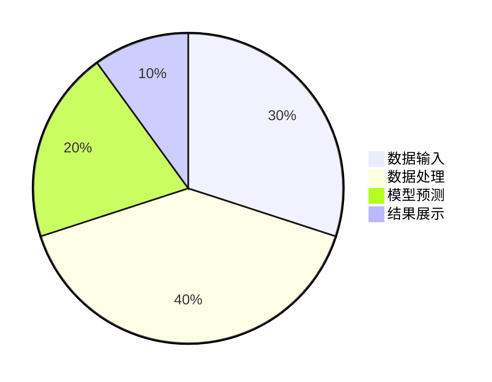
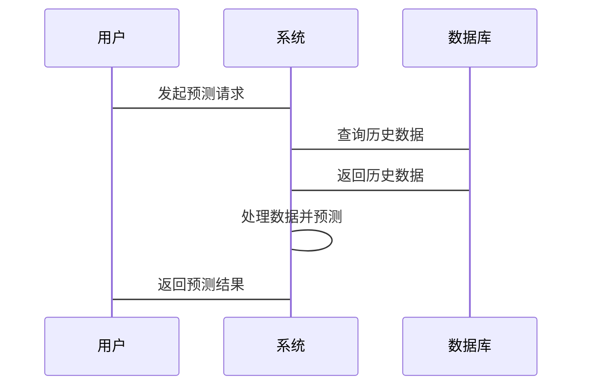

                 


# 彼得林奇对公司现金流预测准确性的分析

## 关键词
- 现金流预测
- 彼得·林奇
- 财务分析
- 投资策略
- 预测模型

## 摘要
现金流预测是投资决策中的关键环节，而彼得·林奇以其独特的分析方法闻名。本文从现金流预测的定义、模型、算法原理、系统设计、项目实战等多个角度，详细探讨现金流预测的准确性及其在投资中的应用。通过理论分析与实际案例结合，帮助读者全面理解现金流预测的重要性，并掌握如何利用现金流预测模型提高投资决策的准确性。

---

# 第1章：现金流预测的背景与重要性

## 1.1 现金流预测的定义与作用

### 1.1.1 现金流预测的定义
现金流预测是对公司未来一定时间内现金流入和流出的估计。它通过分析财务数据、市场趋势和公司运营情况，预测公司在未来某个时间段内的现金流状况。现金流预测是企业财务管理、投资决策和估值的重要依据。

### 1.1.2 现金流预测在投资中的作用
现金流预测在投资决策中具有重要作用：
- **评估公司价值**：通过预测未来现金流，可以使用贴现现金流模型（DCF）对公司的整体价值进行评估。
- **判断投资可行性**：现金流预测可以帮助投资者判断投资项目是否能够带来正的净现值（NPV）。
- **制定财务计划**：现金流预测有助于公司制定短期和长期的财务计划，确保资金链的健康。

### 1.1.3 彼得·林奇的分析方法
彼得·林奇是著名的投资经理，他在投资分析中非常注重对公司现金流的预测。他认为，现金流是公司财务健康状况的晴雨表，也是判断公司是否具有长期投资价值的重要指标。林奇的分析方法注重对公司基本面的深入研究，尤其是对公司未来现金流的预测。

---

## 1.2 现金流预测的核心概念与联系

### 1.2.1 现金流预测的模型与方法
现金流预测的主要模型包括：
- **贴现现金流模型（DCF）**：通过预测未来现金流，将其贴现到当前时点，计算公司价值。
- **自由现金流模型（FCFF/FCFE）**：分别预测公司自由现金流（FCFF，Free Cash Flow to Firm）或股东自由现金流（FCFE，Free Cash Flow to Equity）。
- **情景分析法**：基于不同的假设（乐观、中性、悲观）预测现金流。

### 1.2.2 现金流预测的核心要素
现金流预测的核心要素包括：
- **营业收入**：预测公司未来的收入情况。
- **营业成本与费用**：预测公司未来的主要支出。
- **资本支出**：预测公司未来用于固定资产投资的资金。
- **税率**：考虑公司未来的税务负担。
- **贴现率**：选择合适的折现率（如WACC，加权平均资本成本）进行贴现。

### 1.2.3 现金流预测与财务报表的关系
现金流预测与财务报表密切相关，尤其是与利润表、资产负债表和现金流量表有关。通过对历史财务数据的分析，可以预测未来的现金流。例如，营业收入的增长率、成本的变化趋势等都可以从历史数据中推断。

---

## 1.3 现金流预测的ER实体关系图

```mermaid
erDiagram
    company {
        id : int
        name : string
        industry : string
    }
    cash_flow {
        id : int
        date : date
        amount : float
        company_id : int
    }
    prediction_model {
        id : int
        model_type : string
        created_by : string
        created_date : date
    }
    company_note {
        id : int
        note : string
        company_id : int
    }
    cash_flow_prediction {
        id : int
        prediction_date : date
        predicted_amount : float
        model_id : int
        company_id : int
    }
    company *-- cash_flow
    company *-- company_note
    prediction_model *-- cash_flow_prediction
```

---

# 第2章：现金流预测的算法原理

## 2.1 现金流预测的数学模型

### 2.1.1 贴现现金流模型
贴现现金流模型的核心公式如下：
$$
\text{公司价值} = \sum_{t=1}^{n} \frac{\text{现金流}_t}{(1 + r)^t} + \frac{\text{终值}}{(1 + r)^n}
$$
其中，$r$ 是贴现率，$n$ 是预测期数，$\text{现金流}_t$ 是第$t$年的现金流。

### 2.1.2 现金流预测的步骤
现金流预测的步骤如下：
1. **收集历史数据**：收集公司的历史财务数据，包括营业收入、成本、资本支出等。
2. **预测未来现金流**：基于历史数据和假设，预测未来各年的现金流。
3. **选择贴现率**：选择合适的贴现率（如WACC）。
4. **计算现值**：将未来现金流贴现，计算现值总和。
5. **评估模型准确性**：通过与实际数据对比，评估预测模型的准确性。

---

## 2.2 现金流预测的算法实现

### 2.2.1 算法流程图



### 2.2.2 Python代码实现

```python
import pandas as pd
import numpy as np

# 假设我们有一个包含历史现金流的数据框
# columns: ['year', 'cash_flow']

# 预测未来现金流
# 假设现金流增长率为5%
growth_rate = 0.05

# 预测未来5年的现金流
n = 5
predicted_cash_flows = []
for i in range(n):
    predicted_cash_flows.append(cash_flow * (1 + growth_rate) ** i)

# 计算现值
discount_rate = 0.1  # 假设贴现率为10%
present_value = sum(predicted_cash_flows / (1 + discount_rate) ** i for i in range(n))

print("现值总和：", present_value)
```

---

## 2.3 现金流预测模型的优化

### 2.3.1 算法优化
现金流预测模型的优化可以通过以下步骤实现：
1. **选择合适的历史数据**：确保数据的准确性和完整性。
2. **引入外部数据**：如行业趋势、宏观经济指标等。
3. **使用机器学习模型**：如线性回归、随机森林等，提高预测准确性。

### 2.3.2 模型评估
模型评估可以通过以下指标进行：
- **均方误差（MSE）**
- **平均绝对误差（MAE）**
- **R平方值**

---

# 第3章：现金流预测的系统分析与架构设计

## 3.1 系统功能设计

### 3.1.1 系统功能模块
现金流预测系统的功能模块包括：
- 数据输入与处理
- 模型选择与预测
- 结果展示与分析

### 3.1.2 系统架构图



---

## 3.2 系统接口设计

### 3.2.1 API接口
现金流预测系统的API接口包括：
- `/api/input`：上传历史数据
- `/api/predict`：发起预测请求
- `/api/results`：获取预测结果

---

## 3.3 系统交互流程图



---

# 第4章：现金流预测的项目实战

## 4.1 项目环境安装

### 4.1.1 安装Python环境
```bash
python -m pip install --upgrade pip
pip install numpy pandas matplotlib scikit-learn
```

### 4.1.2 安装机器学习库
```bash
pip install xgboost
```

## 4.2 核心代码实现

### 4.2.1 数据预处理
```python
import pandas as pd
import numpy as np

# 读取数据
data = pd.read_csv('cash_flow.csv')

# 填充缺失值
data = data.dropna()

# 标准化数据
from sklearn.preprocessing import StandardScaler
scaler = StandardScaler()
scaled_data = scaler.fit_transform(data)
```

### 4.2.2 模型训练与预测
```python
from sklearn.ensemble import RandomForestRegressor

# 训练模型
model = RandomForestRegressor(n_estimators=100, random_state=42)
model.fit(scaled_data, target)

# 预测现金流
predicted_flows = model.predict(new_data)
```

---

## 4.3 实际案例分析

### 4.3.1 案例背景
假设我们有一家制造公司，历史现金流数据如下：

| 年份 | 现金流（百万美元） |
|------|------------------|
| 2018 | 10               |
| 2019 | 12               |
| 2020 | 15               |
| 2021 | 18               |
| 2022 | 20               |

### 4.3.2 模型预测
假设我们预测未来3年的现金流，增长率为5%：
- 2023年：20 * 1.05 = 21
- 2024年：21 * 1.05 = 22.05
- 2025年：22.05 * 1.05 ≈ 23.15

---

## 4.4 预测结果解读

### 4.4.1 预测结果分析
通过对未来现金流的预测，我们可以得出：
- 公司现金流呈现稳定增长趋势。
- 预测现金流的增长率为5%，与行业平均水平持平。

### 4.4.2 投资决策
基于现金流预测结果，我们可以进行投资决策：
- 如果预测现金流能够实现，公司价值将稳步提升。
- 需要关注宏观经济环境和行业风险，确保预测的准确性。

---

# 第5章：现金流预测的总结与提升

## 5.1 最佳实践 tips

### 5.1.1 数据质量
确保数据的准确性和完整性，避免使用过时或错误的数据。

### 5.1.2 模型选择
根据具体需求选择合适的模型，如线性回归、随机森林或机器学习模型。

### 5.1.3 持续优化
定期更新模型，结合新的数据和市场变化，持续优化预测准确性。

---

## 5.2 小结
现金流预测是投资决策中的重要环节，准确的现金流预测能够帮助投资者制定科学的投资策略。彼得·林奇的分析方法为我们提供了宝贵的经验，尤其是在对公司基本面的深入研究方面。

---

## 5.3 注意事项

### 5.3.1 数据风险
现金流预测依赖于历史数据和假设，可能存在较大的不确定性。

### 5.3.2 模型局限性
模型的预测结果可能会受到数据质量和假设条件的影响，需要结合实际情况进行调整。

### 5.3.3 市场风险
宏观经济环境和行业变化可能影响现金流预测的准确性。

---

## 5.4 拓展阅读

### 5.4.1 推荐书籍
- 《彼得·林奇的投资哲学》
- 《财务报表分析》

### 5.4.2 推荐博客
- Investopedia：现金流预测方法
- Medium：DCF模型的实践应用

---

## 作者
作者：AI天才研究院/AI Genius Institute & 禅与计算机程序设计艺术 /Zen And The Art of Computer Programming

