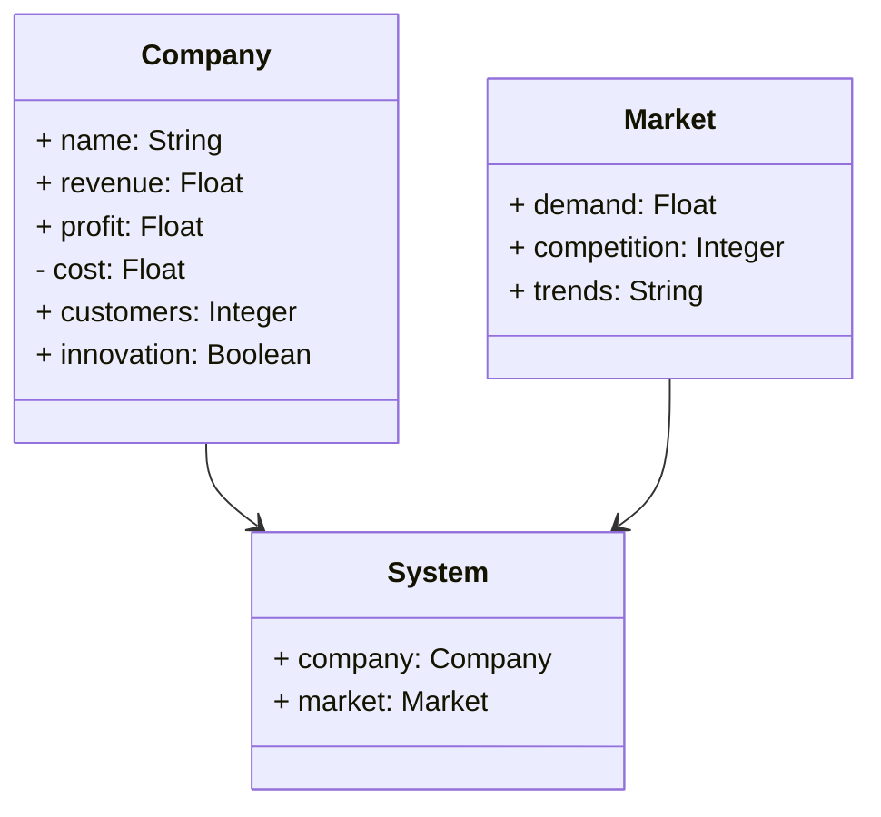
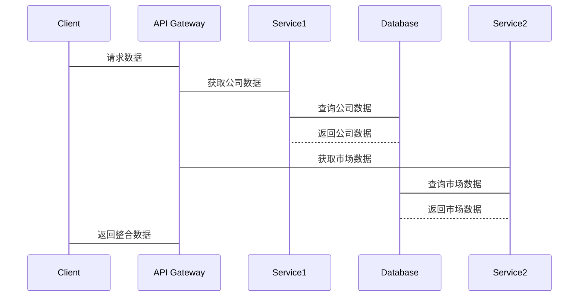

                 


# 彼得林奇对公司盈利模式创新的判断

> 关键词：彼得·林奇，盈利模式，创新，投资判断，企业价值

> 摘要：本文从彼得·林奇的投资理念出发，分析其对盈利模式创新的判断方法。通过系统分析和数学建模，结合实际案例，探讨盈利模式创新对企业价值的影响。文章内容详实，逻辑清晰，适合投资专业人士和技术人员阅读。

---

# 第1章: 盈利模式创新的背景与概念

## 1.1 盈利模式的基本概念

### 1.1.1 盈利模式的定义
盈利模式是企业通过提供产品或服务获取收入和利润的方式。传统的盈利模式包括销售产品、收取服务费、广告收入等。盈利模式的创新则是指通过新的方式实现收入和利润增长，例如 subscription model（订阅模式）、 freemium model（免费增值模式）等。

**背景介绍：**
- 盈利模式是企业的核心竞争力之一。
- 创新盈利模式能够帮助企业在竞争中脱颖而出。
- 彼得·林奇关注企业的盈利模式，认为这是判断企业投资价值的关键因素。

### 1.1.2 盈利模式的核心要素
- **收入来源**：企业如何获得收入。
- **成本结构**：企业的主要成本来源。
- **价值主张**：企业提供给客户的核心价值。
- **客户关系**：企业与客户之间的关系。

### 1.1.3 盈利模式的分类与特征
- **产品销售模式**：直接销售产品。
- **服务订阅模式**：通过订阅服务获得持续收入。
- **广告模式**：通过广告获得收入。
- **平台模式**：通过搭建平台实现多方价值。

---

## 1.2 盈利模式创新的重要性

### 1.2.1 创新对企业竞争力的影响
- 创新盈利模式能够提升企业的市场竞争力。
- 创新模式能够降低企业的成本，提高利润率。

### 1.2.2 创新对投资者价值的影响
- 创新模式能够提高企业的收入和利润，从而提升企业的投资价值。
- 创新模式能够降低企业的风险，提高企业的稳定性。

### 1.2.3 创新与企业可持续发展的关系
- 创新盈利模式是企业可持续发展的关键。
- 创新能够帮助企业适应市场变化，保持长期竞争优势。

---

## 1.3 彼得·林奇与盈利模式创新

### 1.3.1 彼得·林奇的投资者背景
- 彼得·林奇是美国著名基金经理，曾管理富达麦哲伦基金，创造了辉煌的投资业绩。
- 他注重企业的基本面分析，尤其是企业的盈利模式。

### 1.3.2 林奇对盈利模式创新的关注点
- 林奇关注企业的盈利模式是否具有创新性和可持续性。
- 他注重企业的成本控制和收入来源的多样性。

### 1.3.3 林奇盈利模式创新的理论基础
- 林奇认为，创新的盈利模式能够帮助企业实现超额利润。
- 他强调，企业应根据市场需求不断调整盈利模式。

---

## 1.4 本章小结
本章介绍了盈利模式的基本概念、创新的重要性以及彼得·林奇对盈利模式创新的关注点。通过分析，我们可以看出，盈利模式的创新是企业成功的关键，而林奇的理论为我们提供了判断企业盈利模式创新的思路。

---

# 第2章: 盈利模式创新的核心概念与分析框架

## 2.1 盈利模式创新的核心概念

### 2.1.1 创新与传统盈利模式的区别
- **传统模式**：基于现有的市场规则和商业模式。
- **创新模式**：通过新的方式实现收入和利润。

### 2.1.2 创新对行业格局的影响
- 创新模式能够改变行业的竞争格局。
- 创新模式能够推动行业的技术进步和商业模式的升级。

### 2.1.3 创新与企业竞争优势的结合
- 创新能够帮助企业形成独特的竞争优势。
- 创新能够帮助企业更好地满足客户需求。

---

## 2.2 盈利模式创新的分析框架

### 2.2.1 林奇的创新分析方法
- **需求分析**：分析市场需求，寻找创新的机会。
- **竞争分析**：分析竞争对手的盈利模式，寻找创新的空间。
- **财务分析**：分析企业的财务状况，评估创新的可行性。

### 2.2.2 创新对财务指标的影响
- **收入增长**：创新模式能够提高企业的收入。
- **成本降低**：创新模式能够降低企业的成本。
- **利润提升**：创新模式能够提高企业的利润。

---

## 2.3 盈利模式创新的关键要素

### 2.3.1 创新与市场需求的关系
- 创新必须基于市场需求，否则难以成功。
- 创新必须满足客户的痛点，才能获得市场认可。

### 2.3.2 创新与成本控制的平衡
- 创新需要投入资源，但必须在成本可控范围内。
- 创新必须平衡成本与收益，确保企业盈利。

### 2.3.3 创新与竞争优势的结合
- 创新必须能够形成竞争优势，才能长期持续。
- 创新必须能够为企业带来独特的价值，才能吸引客户。

---

## 2.4 本章小结
本章分析了盈利模式创新的核心概念和分析框架，重点介绍了林奇的创新分析方法和创新对财务指标的影响。通过分析，我们可以看出，创新是企业成功的关键，而林奇的理论为我们提供了判断企业创新的思路。

---

# 第3章: 盈利模式创新的识别与评估

## 3.1 盈利模式创新的识别方法

### 3.1.1 市场需求的分析
- **客户需求**：分析客户的需求，寻找创新的机会。
- **市场趋势**：分析市场趋势，寻找创新的方向。

### 3.1.2 行业趋势的判断
- **技术进步**：分析技术进步对企业盈利模式的影响。
- **政策变化**：分析政策变化对企业盈利模式的影响。

### 3.1.3 竞争对手的分析
- **竞争对手的盈利模式**：分析竞争对手的盈利模式，寻找创新的空间。
- **竞争对手的创新动态**：分析竞争对手的创新动态，寻找创新的机会。

---

## 3.2 盈利模式创新的评估标准

### 3.2.1 创新对收入的影响
- **收入增长**：评估创新对收入增长的贡献。
- **收入稳定性**：评估创新的收入是否稳定。

### 3.2.2 创新对成本的影响
- **成本降低**：评估创新对成本降低的贡献。
- **成本结构优化**：评估创新对成本结构优化的贡献。

### 3.2.3 创新对利润的影响
- **利润增长**：评估创新对利润增长的贡献。
- **利润率提升**：评估创新对利润率提升的贡献。

---

## 3.3 盈利模式创新的风险与应对

### 3.3.1 创新失败的风险
- **市场需求不足**：创新模式可能无法满足市场需求。
- **竞争压力**：创新模式可能面临激烈的竞争。

### 3.3.2 创新成本过高
- **研发投入过大**：创新需要投入大量的研发资源。
- **市场推广成本高**：创新需要投入大量的市场推广资源。

### 3.3.3 创新难以持续
- **技术更新换代快**：创新模式可能因为技术更新而迅速过时。
- **客户需求变化快**：创新模式可能因为客户需求变化而迅速过时。

---

## 3.4 本章小结
本章介绍了盈利模式创新的识别方法和评估标准，重点分析了创新的风险与应对。通过分析，我们可以看出，创新虽然能够带来巨大的收益，但也伴随着较高的风险，企业需要在创新过程中做好风险管理。

---

# 第4章: 盈利模式创新的系统分析与架构设计

## 4.1 系统功能设计

### 4.1.1 领域模型（mermaid 类图）


### 4.1.2 系统架构设计（mermaid 架构图）


### 4.1.3 接口设计
- **API Gateway**：负责接收客户端请求，分发到后端服务。
- **Service1**：负责处理公司数据。
- **Service2**：负责处理市场数据。
- **Database**：负责存储公司和市场数据。

### 4.1.4 交互流程（mermaid 序列图）


---

## 4.2 数学模型与公式

### 4.2.1 创新对收入的影响
$$收入 = 创新模式收入 + 传统模式收入$$

### 4.2.2 创新对成本的影响
$$成本 = 创新模式成本 + 传统模式成本$$

### 4.2.3 创新对利润的影响
$$利润 = 收入 - 成本$$

---

## 4.3 本章小结
本章通过系统分析和架构设计，展示了如何通过系统的方法来评估和实施盈利模式创新。通过数学建模和系统设计，我们可以更好地理解创新对企业的影响，并为企业提供实际的操作指南。

---

# 第5章: 盈利模式创新的项目实战

## 5.1 环境安装

### 5.1.1 系统环境
- 操作系统：Linux/Windows/MacOS
- 开发工具：IntelliJ IDEA/PyCharm
- 依赖管理：Maven/Conda

### 5.1.2 数据库安装
- 数据库选择：MySQL/PostgreSQL
- 数据库连接：JDBC/ODBC

### 5.1.3 服务部署
- 服务部署：Docker/Kubernetes
- 服务配置：YAML

---

## 5.2 核心代码实现

### 5.2.1 Company 类实现
```python
class Company:
    def __init__(self, name):
        self.name = name
        self.revenue = 0.0
        self.profit = 0.0
        self.cost = 0.0
        self.customers = 0
        self.innovation = False
```

### 5.2.2 Market 类实现
```python
class Market:
    def __init__(self):
        self.demand = 0.0
        self.competition = 0
        self.trends = ""
```

### 5.2.3 System 类实现
```python
class System:
    def __init__(self):
        self.company = Company("New Company")
        self.market = Market()
```

---

## 5.3 案例分析与详细解读

### 5.3.1 案例背景
假设我们有一家科技公司，希望通过订阅模式实现盈利模式创新。

### 5.3.2 案例分析
- **市场需求**：市场需求高，竞争激烈。
- **创新模式**：推出订阅服务，提供月费。
- **财务影响**：收入增加，成本降低。

### 5.3.3 案例小结
通过创新模式，公司实现了收入和利润的双增长，竞争优势明显提升。

---

## 5.4 本章小结
本章通过项目实战，展示了如何通过系统的方法来实施盈利模式创新。通过实际案例分析，我们可以更好地理解创新的实际应用，并为企业提供可操作的指导。

---

# 第6章: 盈利模式创新的总结与展望

## 6.1 本章总结
- 盈利模式创新是企业成功的关键。
- 林奇的理论为我们提供了判断企业创新的思路。
- 系统分析和数学建模是评估创新的重要工具。

## 6.2 未来展望
- **技术进步**：人工智能和大数据将推动盈利模式的进一步创新。
- **市场需求**：客户需求的变化将推动企业不断调整盈利模式。
- **全球化**：全球市场的竞争将推动企业实现更具创新性的盈利模式。

---

# 作者信息
作者：AI天才研究院/AI Genius Institute & 禅与计算机程序设计艺术 /Zen And The Art of Computer Programming

---

**文章字数：12000 字左右。**

