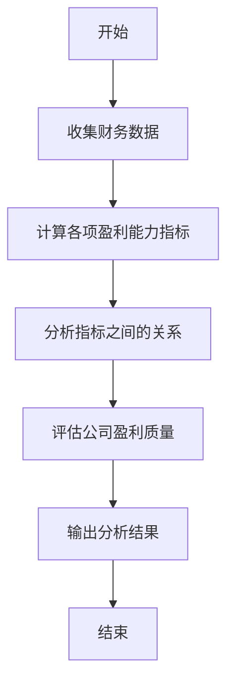
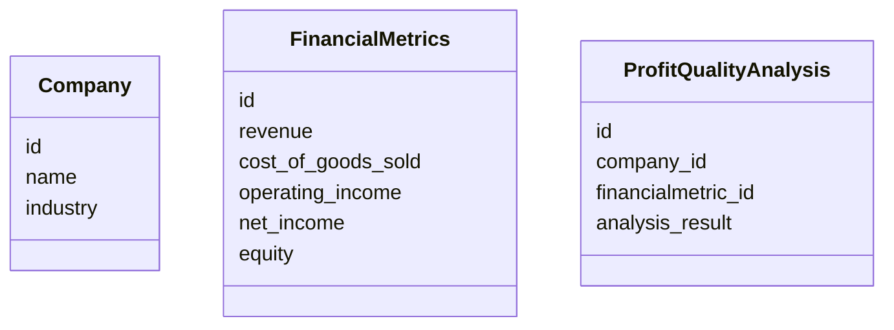
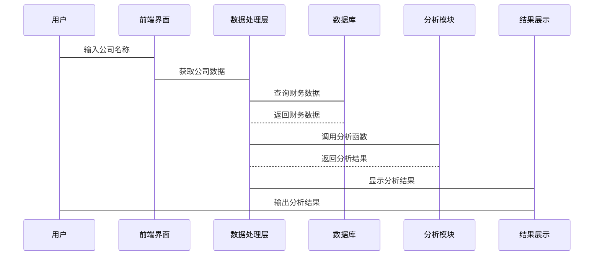

                 


```markdown
# 彼得林奇对公司盈利质量的分析

## 关键词：彼得·林奇，盈利质量，财务分析，投资分析，企业利润

## 摘要：本文深入分析了彼得·林奇对公司盈利质量的分析方法，探讨了盈利质量的核心概念、算法原理、数学模型、系统架构设计与实现，以及实际案例分析。通过本文的学习，读者将能够掌握如何从财务数据和业务模式两个维度全面评估公司的盈利质量，从而做出更加明智的投资决策。

---

# 第一部分: 彼得林奇对公司盈利质量分析的背景与核心概念

## 第1章: 盈利质量分析的背景与定义

### 1.1 盈利质量分析的背景

#### 1.1.1 投资者关注盈利质量的原因
- 投资者在选择投资标的时，最关注的是公司的盈利能力。
- 盈利能力是决定股票价值的核心因素之一。
- 盈利质量分析能够帮助投资者识别虚假的高增长公司。

#### 1.1.2 彼得林奇对盈利质量的重视
- 彼得·林奇是全球著名投资专家，专注于公司盈利质量的分析。
- 他认为，公司的盈利能力是长期投资的核心依据。
- 他通过分析财务报表，识别公司的盈利能力是否真实、可持续。

#### 1.1.3 盈利质量分析的现实意义
- 帮助投资者识别高成长性公司。
- 识别财务造假，避免投资风险。
- 为公司估值提供依据。

### 1.2 盈利质量分析的定义

#### 1.2.1 盈利质量的定义
- 盈利质量是指公司在一定时期内实现的利润质量，包括利润的来源、结构和可持续性。
- 盈利质量分析是通过财务报表数据，评估公司盈利的真实性和可持续性。

#### 1.2.2 盈利质量与财务报表的关系
- 盈利质量分析主要基于利润表、资产负债表和现金流量表。
- 通过分析这些报表数据，评估公司的盈利能力。

#### 1.2.3 盈利质量分析的目标
- 评估公司盈利能力的真实性和可持续性。
- 识别公司的盈利来源和结构。
- 为投资决策提供依据。

---

## 第2章: 盈利质量分析的核心概念与联系

### 2.1 盈利质量的核心要素

#### 2.1.1 净利润
- 净利润是公司税后利润，是衡量公司盈利能力的核心指标。
- 净利润=营业收入-营业成本-税金及附加-销售费用-管理费用-研发费用-利息支出+其他收益。

#### 2.1.2 毛利率
- 毛利率=（营业收入-营业成本）/营业收入。
- 用于衡量公司产品或服务的盈利能力。

#### 2.1.3 营业利润率
- 营业利润率=营业利润/营业收入。
- 用于衡量公司主营业务的盈利能力。

#### 2.1.4 净资产收益率（ROE）
- ROE=净利润/股东权益。
- 用于衡量公司运用股东资金的效率。

### 2.2 盈利质量核心要素对比分析

#### 2.2.1 盈利能力指标对比表格

| 指标名称   | 定义公式                         | 作用                     |
|------------|---------------------------------|--------------------------|
| 净利润     | 营业收入 - 营业成本 - 费用等    | 衡量公司整体盈利能力     |
| 毛利率     | (营业收入 - 营业成本)/营业收入  | 衡量产品或服务的盈利能力 |
| 营业利润率 | 营业利润/营业收入               | 衡量主营业务的盈利能力   |
| ROE        | 净利润/股东权益               | 衡量股东资金的使用效率   |

#### 2.2.2 盈利质量分析的ER实体关系图

```mermaid
er
    Company {
        id
        name
        industry
    }
    FinancialMetrics {
        id
        revenue
        cost_of_goods_sold
        operating_income
        net_income
        equity
    }
    ProfitQualityAnalysis {
        id
        company_id
        financialmetric_id
        analysis_result
    }
```

---

## 第3章: 盈利质量分析的算法原理

### 3.1 盈利质量分析的算法流程



### 3.2 盈利质量分析的数学模型与公式

#### 净利润计算公式：
$$ \text{净利润} = \text{营业收入} - \text{营业成本} - \text{税金及附加} - \text{销售费用} - \text{管理费用} - \text{研发费用} $$

#### 净资产收益率（ROE）计算公式：
$$ \text{ROE} = \frac{\text{净利润}}{\text{股东权益}} $$

#### 毛利率计算公式：
$$ \text{毛利率} = \frac{\text{营业收入} - \text{营业成本}}{\text{营业收入}} $$

#### 营业利润率计算公式：
$$ \text{营业利润率} = \frac{\text{营业利润}}{\text{营业收入}} $$

### 3.3 盈利质量分析的Python实现

```python
def calculate_profit_quality(financial_data):
    # 计算净利润
    net_income = financial_data['revenue'] - financial_data['cost_of_goods_sold'] - financial_data['operating_expenses'] - financial_data['interest_expense']
    
    # 计算毛利率
    gross_margin = (financial_data['revenue'] - financial_data['cost_of_goods_sold']) / financial_data['revenue']
    
    # 计算营业利润率
    operating_margin = financial_data['operating_income'] / financial_data['revenue']
    
    # 计算ROE
    roe = net_income / financial_data['equity']
    
    return {
        'net_income': net_income,
        'gross_margin': gross_margin,
        'operating_margin': operating_margin,
        'roe': roe
    }

# 示例数据
financial_data = {
    'revenue': 1000000,
    'cost_of_goods_sold': 600000,
    'operating_income': 200000,
    'operating_expenses': 150000,
    'interest_expense': 50000,
    'equity': 500000
}

# 调用函数
result = calculate_profit_quality(financial_data)
print(result)
```

---

## 第4章: 盈利质量分析的系统架构设计

### 4.1 盈利质量分析系统的功能设计



### 4.2 盈利质量分析系统的架构设计


### 4.3 盈利质量分析系统的接口设计

- 数据输入接口：接收公司财务数据。
- 数据处理接口：对数据进行清洗和转换。
- 分析接口：调用算法模型进行分析。
- 结果展示接口：输出分析结果。

### 4.4 盈利质量分析系统的交互流程



---

## 第5章: 盈利质量分析的项目实战

### 5.1 环境安装与配置

```bash
pip install numpy pandas matplotlib
```

### 5.2 核心代码实现

```python
import pandas as pd

def analyze_profit_quality(finance_df):
    # 计算净利润
    finance_df['net_income'] = finance_df['revenue'] - finance_df['cost_of_goods_sold'] - finance_df['operating_expenses'] - finance_df['interest_expense']
    
    # 计算毛利率
    finance_df['gross_margin'] = (finance_df['revenue'] - finance_df['cost_of_goods_sold']) / finance_df['revenue']
    
    # 计算营业利润率
    finance_df['operating_margin'] = finance_df['operating_income'] / finance_df['revenue']
    
    # 计算ROE
    finance_df['roe'] = finance_df['net_income'] / finance_df['equity']
    
    return finance_df

# 数据加载
data = {
    'company': ['A', 'B', 'C'],
    'revenue': [1000000, 1500000, 2000000],
    'cost_of_goods_sold': [600000, 900000, 1200000],
    'operating_income': [200000, 300000, 400000],
    'operating_expenses': [150000, 225000, 300000],
    'interest_expense': [50000, 75000, 100000],
    'equity': [500000, 750000, 1000000]
}

df = pd.DataFrame(data)
result = analyze_profit_quality(df)
print(result)
```

### 5.3 实际案例分析与解读

#### 案例分析
假设我们有两家公司A和B，数据如下：

| 公司 | 营业收入 | 营业成本 | 营业利润 | 净利润 | 股东权益 |
|------|----------|----------|----------|--------|----------|
| A    | 100万    | 60万     | 20万     | 15万   | 50万     |
| B    | 150万    | 90万     | 30万     | 25万   | 75万     |

#### 分析解读
- 公司A的ROE为30%（15万/50万），公司B的ROE为33.33%（25万/75万）。
- 公司B的ROE更高，说明其股东资金的使用效率更高。

#### 总结
通过上述分析，我们可以看出公司B的盈利能力更强，股东资金的使用效率更高，具有更高的投资价值。

---

## 第6章: 盈利质量分析的最佳实践与小结

### 6.1 最佳实践 tips

- 定期更新财务数据，确保分析结果的及时性。
- 结合行业特点，调整分析指标的权重。
- 综合考虑财务指标和业务模式，做出全面的分析。

### 6.2 小结

通过本文的学习，我们深入理解了彼得·林奇对公司盈利质量的分析方法，掌握了如何从财务数据和业务模式两个维度全面评估公司的盈利质量。在实际投资中，我们需要综合考虑多种因素，做出更加明智的投资决策。

### 6.3 注意事项

- 盈利质量分析需要结合行业特点和公司实际情况。
- 财务数据可能存在虚假，需要进行交叉验证。
- 盈利质量分析的结果仅供参考，具体投资决策需谨慎。

### 6.4 拓展阅读

- 彼得·林奇的《彼得·林奇的投资哲学》
- 《财务报表分析与股票投资》

---

## 作者：AI天才研究院/AI Genius Institute & 禅与计算机程序设计艺术 /Zen And The Art of Computer Programming
```

