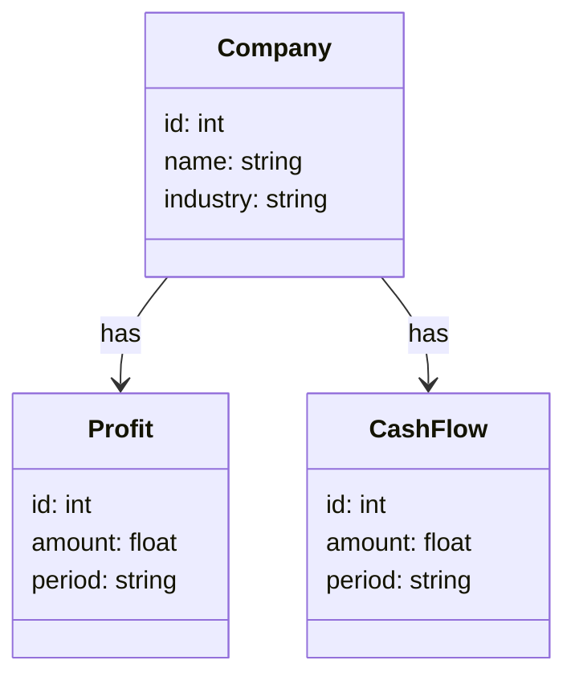

                 


# 彼得林奇对公司盈利质量的分析方法

> 关键词：彼得林奇，盈利质量，财务分析，投资决策，ROE，现金流

> 摘要：本文深入探讨了彼得林奇对公司盈利质量的分析方法，从背景介绍到核心概念，再到算法原理和系统设计，结合实际案例和最佳实践，全面解析如何通过盈利质量分析做出明智的投资决策。

---

# 第一部分: 盈利质量分析的背景与重要性

## 第1章: 盈利质量分析的背景与重要性

### 1.1 盈利质量的核心概念

#### 1.1.1 盈利质量的定义
盈利质量是指公司在一定时期内通过经营获得的利润的质量，不仅关注利润的绝对数值，更关注利润的来源、结构和持续性。彼得林奇认为，利润质量是投资决策的关键因素，因为只有高质量的利润才能为公司和股东创造长期价值。

#### 1.1.2 盈利质量与企业价值的关系
- **利润质量**：高质量的利润意味着公司盈利来源稳定、结构合理，能够在不同经济环境下持续创造利润。
- **企业价值**：企业价值不仅取决于利润的多少，还取决于利润的质量。高质量的利润能够增强企业的抗风险能力和长期发展潜力。

#### 1.1.3 彼得林奇的分析框架
彼得林奇的盈利质量分析框架包括以下几个关键要素：
1. 净利润：反映公司整体盈利能力。
2. 毛利率：衡量产品或服务的盈利能力。
3. 营业利润率：反映公司主营业务的效率。
4. 净资产收益率（ROE）：衡量公司使用股东资金的效率。

### 1.2 盈利质量分析的背景

#### 1.2.1 现金流与利润的关系
现金流是公司财务健康的重要指标，高质量的利润通常伴随着健康的现金流。彼得林奇强调，现金流是公司生存和发展的基础，只有现金流充足的公司才能在市场波动中保持稳定。

#### 1.2.2 投资者为何关注盈利质量
- 投资者关注盈利质量是因为高质量的利润意味着公司具有持续的盈利能力。
- 通过分析盈利质量，投资者可以更好地评估公司的成长潜力和投资价值。

#### 1.2.3 彼得林奇的投资理念
彼得林奇的投资理念强调长期价值投资，他通过深入分析公司的财务报表，寻找那些具有持续盈利能力和良好管理的公司。

### 1.3 盈利质量的核心要素

#### 1.3.1 净利润
净利润是公司税后利润，反映公司整体盈利能力。计算公式为：
$$ \text{净利润} = \text{营业收入} - \text{营业成本} - \text{税金及附加} - \text{销售费用} - \text{管理费用} - \text{研发费用} - \text{利息支出} $$

#### 1.3.2 毛利率
毛利率是衡量公司产品或服务盈利能力的重要指标，计算公式为：
$$ \text{毛利率} = \frac{\text{营业收入} - \text{营业成本}}{\text{营业收入}} \times 100\% $$

#### 1.3.3 营业利润率
营业利润率反映公司主营业务的效率，计算公式为：
$$ \text{营业利润率} = \frac{\text{营业利润}}{\text{营业收入}} \times 100\% $$

#### 1.3.4 净资产收益率（ROE）
净资产收益率是衡量公司使用股东资金效率的重要指标，计算公式为：
$$ \text{ROE} = \frac{\text{净利润}}{\text{净资产}} \times 100\% $$

---

## 第2章: 盈利质量的核心概念与联系

### 2.1 盈利质量的核心属性特征对比

| 指标         | 定义                              | 重要性      | 彼得林奇的观点                 |
|--------------|-----------------------------------|-------------|--------------------------------|
| 净利润       | 税后利润，反映公司整体盈利能力 | 高          | 净利润是投资决策的核心依据     |
| 毛利率       | 营业收入减去营业成本的比率      | 中          | 高毛利率意味着产品竞争力强     |
| 营业利润率   | 营业利润与营业收入的比率        | 中          | 反映公司主营业务效率             |
| 净资产收益率 | 净利润与净资产的比率           | 高          | 高ROE意味着股东资金利用效率高   |

### 2.2 盈利质量的ER实体关系图

```mermaid
er
  company {
    id: int
    name: string
    industry: string
  }
  profit {
    id: int
    amount: float
    period: string
  }
  cash_flow {
    id: int
    amount: float
    period: string
  }
  company -<-> profit: has
  company -<-> cash_flow: has
```

### 2.3 盈利质量的分析流程


---

## 第3章: 盈利质量分析的算法原理

### 3.1 盈利质量分析的算法流程


### 3.2 盈利质量分析的Python代码实现

```python
import pandas as pd

def calculate_profit_quality(financial_data):
    # 计算净利润
    net_profit = financial_data['净利润']
    # 计算毛利率
    gross_profit_margin = (financial_data['营业收入'] - financial_data['营业成本']) / financial_data['营业收入'] * 100
    # 计算营业利润率
    operating_profit_margin = financial_data['营业利润'] / financial_data['营业收入'] * 100
    # 计算ROE
    roe = (net_profit / financial_data['净资产']) * 100
    # 计算现金流
    cash_flow = financial_data['经营活动现金流净额']
    
    return {
        '净利润': net_profit,
        '毛利率': gross_profit_margin,
        '营业利润率': operating_profit_margin,
        'ROE': roe,
        '现金流': cash_flow
    }

# 示例数据
financial_data = {
    '营业收入': 1000,
    '营业成本': 600,
    '营业利润': 300,
    '净利润': 200,
    '净资产': 1000
}

# 调用函数
result = calculate_profit_quality(financial_data)
print(result)
```

### 3.3 盈利质量分析的数学模型

$$ \text{ROE} = \frac{\text{净利润}}{\text{净资产}} \times 100\% $$

$$ \text{毛利率} = \frac{\text{营业收入} - \text{营业成本}}{\text{营业收入}} \times 100\% $$

---

## 第4章: 盈利质量分析的系统设计

### 4.1 系统功能设计

#### 4.1.1 领域模型



#### 4.1.2 系统架构设计


### 4.2 系统接口设计

#### 4.2.1 REST API 示例

- **GET /api/profits**
  - 返回公司利润数据
- **POST /api/analyze**
  - 分析并返回盈利质量报告

---

## 第5章: 盈利质量分析的项目实战

### 5.1 环境安装

```bash
pip install pandas
pip install numpy
pip install matplotlib
```

### 5.2 核心代码实现

```python
import pandas as pd
import numpy as np
import matplotlib.pyplot as plt

def plot_profit_trend(data):
    plt.figure(figsize=(10, 6))
    plt.plot(data['year'], data['net_profit'], label='净利润')
    plt.plot(data['year'], data['gross_margin'], label='毛利率')
    plt.xlabel('年份')
    plt.ylabel('比率')
    plt.title('利润趋势图')
    plt.legend()
    plt.show()

# 示例数据
data = {
    'year': [2018, 2019, 2020, 2021],
    'net_profit': [200, 250, 300, 350],
    'gross_margin': [40, 45, 50, 55]
}

df = pd.DataFrame(data)
plot_profit_trend(df)
```

### 5.3 案例分析与讲解

假设我们分析一家公司的财务数据：

| 年份 | 营业收入 | 营业成本 | 净利润 | 净资产 |
|------|----------|----------|--------|--------|
| 2020 | 1000     | 600      | 200    | 1000   |
| 2021 | 1200     | 720      | 250    | 1200   |

计算ROE：
$$ \text{ROE}_{2020} = \frac{200}{1000} \times 100\% = 20\% $$
$$ \text{ROE}_{2021} = \frac{250}{1200} \times 100\% \approx 20.83\% $$

---

## 第6章: 盈利质量分析的最佳实践

### 6.1 小结

- 盈利质量分析是投资决策的关键。
- 彼得林奇的方法提供了系统的分析框架。

### 6.2 注意事项

- 避免仅关注短期利润。
- 结合行业特点进行分析。

### 6.3 拓展阅读

- 《彼得林奇选股术》
- 《投资学原理》

---

# 作者：AI天才研究院 & 禅与计算机程序设计艺术

---

通过本文的详细分析，读者可以掌握彼得林奇的盈利质量分析方法，并在实际投资中应用这些方法，做出更明智的投资决策。

