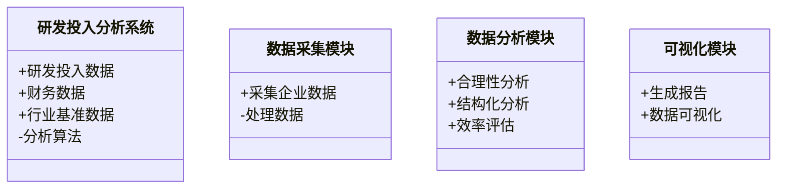
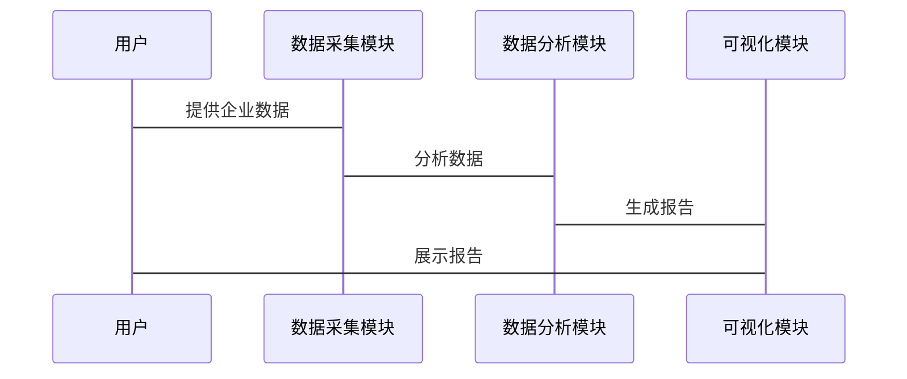

                 


# 彼得·林奇对公司研发投入的分析标准

> 关键词：彼得·林奇，研发投入，投资分析，企业战略，财务指标

> 摘要：本文系统阐述了彼得·林奇对公司研发投入的分析标准，从背景介绍、核心概念、分析框架、系统架构到实际案例分析，层层深入地探讨了如何通过研发投入分析评估企业的投资价值。文章结合理论与实践，详细讲解了研发投入的合理性、结构化分析、效率评估及市场化转化能力等关键维度，并通过实际案例展示了这些标准在投资决策中的应用。

---

# 第一部分: 彼得·林奇与公司研发投入分析概述

## 第1章: 彼得·林奇的背景与投资理念

### 1.1 彼得·林奇的生平简介

彼得·林奇（Peter Lynch）是美国著名的投资经理人和作家，被誉为“最传奇的基金经理”。他在1970年代至1990年代期间管理富达麦哲伦基金（Fidelity Magellan Fund），取得了年均29%的回报率，远超同期市场表现。林奇的投资哲学以基本面分析为核心，注重对企业基本面的深入研究，尤其是对财务数据的解读和企业竞争优势的识别。

### 1.2 彼得·林奇的投资哲学

林奇的投资哲学强调以下几点：
1. **深入研究企业基本面**：关注企业的财务报表、行业地位、竞争优势和管理层能力。
2. **长期视角**：注重企业的长期增长潜力，而非短期市场波动。
3. **分散投资**：通过分散投资降低风险，同时关注具有持续增长潜力的企业。
4. **重视研发投入**：认为研发投入是企业技术创新和竞争力提升的关键驱动因素。

### 1.3 研发投入在林奇分析体系中的重要性

在林奇的分析框架中，研发投入被视为评估企业未来增长潜力的重要指标。他认为，合理的研发投入能够为企业的技术创新和产品升级提供支持，从而增强企业的市场竞争力。同时，研发投入的结构和效率也是评估企业战略管理和财务健康的重要维度。

---

## 第2章: 研发投入的基本概念

### 2.1 研发投入的定义与分类

**研发投入**是指企业在研发活动中投入的资源，包括资金、时间和人力资源等。根据用途，研发投入可以分为以下几类：
1. **基础研究**：旨在探索未知领域的研究活动。
2. **应用研究**：旨在解决实际问题的研究活动。
3. **产品开发**：旨在开发具体产品的研究活动。

### 2.2 研发投入的财务表现形式

在财务报表中，研发投入通常体现在企业的损益表和现金流量表中。具体表现为：
1. **费用化研发投入**：直接计入当期损益的研发支出。
2. **资本化研发投入**：符合条件的部分可以资本化，计入资产负债表中的无形资产或固定资产。

### 2.3 研发投入与企业竞争力的关系

研发投入是企业技术创新的核心驱动力。通过合理的研发投入，企业能够：
1. 提升产品性能和质量。
2. 增强市场竞争力。
3. 打开新的市场机会。

---

# 第二部分: 彼得·林奇的分析标准

## 第3章: 研发投入的合理性分析

### 3.1 研发投入与企业战略目标的匹配性

**合理性分析**的核心在于评估企业的研发投入是否与企业战略目标一致。具体包括：
1. **战略目标一致性**：研发投入是否支持企业的长期发展目标。
2. **行业竞争环境**：研发投入是否能够帮助企业在行业中保持竞争优势。
3. **资源分配合理性**：研发投入是否合理分配到关键的研发项目中。

### 3.2 研发投入的行业基准比较

通过与行业平均水平的比较，可以评估企业的研发投入是否处于合理水平。例如：
- 行业平均研发投入占比为5%，而企业的研发投入占比为6%，说明企业的研发投入水平略高于行业平均水平。

### 3.3 研发投入的周期性与季节性分析

研发投入通常具有一定的周期性和季节性。例如：
- 在新产品发布前，企业的研发投入可能会显著增加。
- 在经济下行周期，企业可能会减少研发投入。

---

## 第4章: 研发支出的结构化分析

### 4.1 研发支出的构成要素

研发投入的结构化分析需要关注以下几个要素：
1. **人员成本**：研发团队的工资、奖金等。
2. **设备与材料成本**：研发所需的设备、原材料等。
3. **外包成本**：将部分研发工作外包给第三方供应商。
4. **其他费用**：包括会议、差旅等辅助性支出。

### 4.2 研发支出的资本化与费用化区分

在财务报表中，研发投入的资本化与费用化是重要的区分点。资本化的研发投入需要满足以下条件：
1. 属于开发阶段。
2. 符合资本化条件（如技术可行性和未来经济利益）。

---

## 第5章: 研发效率的量化评估

### 5.1 研发投入产出比（ROI）的计算公式

研发效率可以通过以下公式量化：
$$ ROI = \frac{\text{研发成果的价值}}{\text{研发投入总额}} $$

例如，某企业投入1000万美元的研发费用，获得了价值2000万美元的专利和技术成果，其ROI为200%。

### 5.2 研发周期与产品成功率的关系

研发周期越短，产品成功率越高，说明研发效率越高。例如：
- 研发周期从12个月缩短到9个月，产品成功率从60%提高到80%。

### 5.3 研发团队的效率评估指标

常用的效率评估指标包括：
1. 每人产出的研发成果数量。
2. 研发项目按时完成的比例。

---

## 第6章: 研发成果的市场化转化能力

### 6.1 研发成果的知识产权保护

知识产权保护是研发成果市场化转化的关键。企业需要通过专利申请、版权登记等方式保护研发成果。

### 6.2 研发成果的商业化潜力评估

评估研发成果的商业化潜力需要考虑：
1. 市场需求：是否存在足够的市场需求。
2. 竞争环境：是否存在替代产品或技术。
3. 商业化路径：是否具备清晰的商业化路径。

### 6.3 研发成果的市场竞争分析

市场竞争分析包括：
1. 价格竞争力：研发成果的成本是否具有竞争力。
2. 技术壁垒：是否存在较高的技术壁垒。

---

## 第7章: 研发投入与企业生命周期的关系

### 7.1 初创期企业的研发投入特点

初创期企业通常需要投入大量的研发资源，以开发核心技术和产品。

### 7.2 成长期企业的研发投入策略

成长期企业需要优化研发投入结构，注重研发投入的效率和产出。

### 7.3 成熟期企业的研发投入优化

成熟期企业需要通过研发投入优化，保持技术领先地位，同时降低研发投入的浪费。

---

# 第三部分: 系统分析与架构设计

## 第8章: 系统功能设计

### 8.1 系统功能模块

1. **数据采集模块**：采集企业的财务数据和研发投入数据。
2. **数据分析模块**：对研发投入进行合理性分析、结构化分析和效率评估。
3. **可视化模块**：生成直观的图表和报告。

### 8.2 领域模型（Mermaid 类图）



---

## 第9章: 系统架构设计

### 9.1 系统架构（Mermaid 架构图）


---

## 第10章: 系统接口设计

### 10.1 接口设计

1. 数据采集模块接口：用于采集企业的研发投入数据和财务数据。
2. 数据分析模块接口：用于调用分析算法。
3. 可视化模块接口：用于生成报告和数据可视化。

---

## 第11章: 系统交互设计

### 11.1 交互流程（Mermaid 序列图）



---

# 第四部分: 项目实战

## 第12章: 环境安装与核心代码实现

### 12.1 环境安装

需要安装以下工具：
1. Python 3.x
2. 数据分析库（Pandas, NumPy）
3. 图表生成库（Matplotlib, Seaborn）
4. Mermaid 插件（用于生成图表）

### 12.2 核心代码实现

以下是一个简单的研发投入分析代码示例：

```python
import pandas as pd
import matplotlib.pyplot as plt

# 数据加载
df = pd.read_csv('研发投入数据.csv')

# 合理性分析
roi = df['研发成果价值'] / df['研发投入总额']
print("研发投入产出比（ROI）：", roi.mean())

# 结构化分析
capitalized = df[df['研发投入类型'] == '资本化']
print("资本化研发投入比例：", len(capitalized) / len(df))

# 可视化
plt.figure(figsize=(10,6))
df['研发投入总额'].plot.hist(bins=10, edgecolor='black')
plt.title('研发投入总额分布')
plt.show()
```

---

## 第13章: 案例分析与项目总结

### 13.1 案例分析

以某科技公司为例，分析其研发投入情况：
1. 研发投入总额：1000万美元。
2. 研发成果价值：2000万美元。
3. ROI：200%。
4. 竞争对手的平均研发投入占比：5%。

### 13.2 项目总结

通过本项目，我们掌握了彼得·林奇的分析标准，并将其应用于实际案例分析。通过系统架构设计和代码实现，我们能够更高效地评估企业的研发投入情况，为投资决策提供支持。

---

# 第五部分: 最佳实践与总结

## 第14章: 最佳实践

### 14.1 小结

彼得·林奇的分析标准为我们提供了一个全面的框架，帮助我们评估企业的研发投入情况。通过合理性分析、结构化分析、效率评估和市场化转化能力分析，我们可以更准确地评估企业的投资价值。

### 14.2 注意事项

1. 确保数据的准确性和完整性。
2. 结合行业特点进行分析。
3. 定期更新分析模型。

### 14.3 拓展阅读

推荐阅读以下书籍和文章：
1. 《彼得·林奇的成功投资》
2. 《企业研发管理》
3. 《财务报表分析》

---

# 作者

作者：AI天才研究院/AI Genius Institute & 禅与计算机程序设计艺术 /Zen And The Art of Computer Programming

