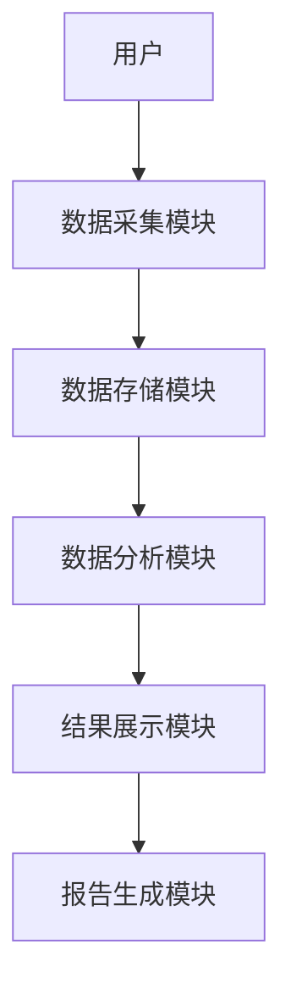

                 


# 彼得林奇对公司研发投入结构的深度分析

> 关键词：公司研发投入、彼得林奇、投资分析、研发投入结构、财务分析、投资策略、企业创新

> 摘要：本文深入分析了彼得·林奇对公司研发投入结构的分析方法，探讨了研发投入在公司战略中的重要性，以及如何通过结构化的方法来评估和优化研发投入。文章结合实际案例，详细介绍了研发投入结构的核心概念、算法原理、系统架构设计、项目实战及最佳实践，为投资者和企业管理者提供了有价值的见解。

---

## 第一部分：研发投入的背景介绍

### 第1章：研发投入的重要性

#### 1.1 研发投入在公司战略中的地位
研发投入是企业长期发展的基石，决定了企业的创新能力和技术储备。彼得·林奇认为，公司研发投入的结构和效率是评估企业未来增长潜力的重要指标。

#### 1.2 研发投入对企业发展的影响
- 研发投入直接关系到企业的技术领先性。
- 高效的研发投入能够提升产品竞争力，进而提高市场份额。

#### 1.3 研发投入与公司长期价值的关系
长期稳定的研发投入能够为公司带来持续的创新动力，进而提升公司的长期价值。彼得·林奇通过分析研发投入的结构，帮助企业识别高增长潜力的投资标的。

---

## 第2章：彼得林奇的分析框架

### 2.1 彼得林奇的投资理念
彼得·林奇强调长期投资和基本面分析，认为研发投入是企业成长的核心驱动力。

### 2.2 彼得林奇对研发投入的关注点
- 研发投入的强度和增长趋势。
- 研发投入的领域分布和效率。

### 2.3 彼得林奇的分析方法与工具
- 通过财务报表分析研发投入的结构。
- 比较不同公司的研发投入强度和效率。

---

## 第3章：研发投入结构的核心概念与联系

### 3.1 研发投入结构的定义与组成
研发投入结构是指公司在不同领域、不同时间周期内的研发投入分布情况。主要包括：
- 研发项目分布：技术领域、产品线等。
- 时间分布：季度、年度等。

### 3.2 研发投入结构的ER实体关系图
```mermaid
er
    entity 研发投入结构 {
        id
        研发项目
        投入金额
        时间周期
        领域分类
    }
    entity 研发项目 {
        id
        项目名称
        项目负责人
        项目目标
    }
    entity 投入金额 {
        id
        金额
        资金来源
    }
    entity 时间周期 {
        id
        开始时间
        结束时间
    }
    entity 领域分类 {
        id
        分类名称
        分类描述
    }
```

### 3.3 研发投入结构的特征对比
通过表格对比不同公司的研发投入结构，分析其强度、增长率和与收入的匹配度。

---

## 第4章：研发投入结构的算法原理

### 4.1 研发投入结构分析算法
#### 4.1.1 算法概述
通过数据分析，识别研发投入的结构特征，评估其对企业发展的影响。

#### 4.1.2 算法步骤
1. 数据收集：获取公司的财务报表和研发相关信息。
2. 数据清洗：处理缺失值和异常值。
3. 数据分析：计算研发投入强度、增长率等指标。
4. 结构分析：识别研发投入的领域分布和时间趋势。

#### 4.1.3 算法实现
```python
import pandas as pd

# 数据清洗
def data_cleaning(df):
    df.dropna(inplace=True)
    df.drop_duplicates(inplace=True)
    return df

# 研发投入强度计算
def compute_rnd_intensity(revenue, rnd_expense):
    return rnd_expense / revenue

# 研发投入增长率计算
def compute_growth_rate(prev_year, current_year):
    return (current_year - prev_year) / prev_year * 100

# 主函数
def analyze_rnd_structure(data):
    cleaned_data = data_cleaning(data)
    intensity = compute_rnd_intensity(cleaned_data['revenue'], cleaned_data['rnd_expense'])
    growth_rate = compute_growth_rate(cleaned_data['rnd_expense_prev'], cleaned_data['rnd_expense_current'])
    return intensity, growth_rate

# 示例数据
data = {
    'revenue': [100, 200, 150],
    'rnd_expense': [10, 20, 15],
    'rnd_expense_prev': [5, 10, 8],
    'rnd_expense_current': [10, 20, 15]
}

intensity, growth_rate = analyze_rnd_structure(data)
print("研发投入强度:", intensity)
print("研发投入增长率:", growth_rate)
```

### 4.2 数学模型与公式
- 研发投入强度公式：$$\text{研发投入强度} = \frac{\text{研发投入金额}}{\text{营业收入}}$$
- 研发投入增长率公式：$$\text{研发投入增长率} = \frac{\text{当前研发投入} - \text{上期研发投入}}{\text{上期研发投入}} \times 100\%$$

---

## 第5章：系统分析与架构设计

### 5.1 问题场景介绍
通过分析公司的研发投入结构，帮助投资者识别高增长潜力的企业。

### 5.2 系统功能设计
- 数据采集模块：收集公司财务数据。
- 数据分析模块：计算研发投入指标。
- 结果展示模块：生成可视化报告。

### 5.3 系统架构设计


---

## 第6章：项目实战

### 6.1 环境安装
安装Python和必要的库：Pandas、Matplotlib。

### 6.2 核心代码实现
```python
import pandas as pd
import matplotlib.pyplot as plt

# 数据加载
data = pd.read_csv('rnd_data.csv')

# 数据清洗
data.dropna(inplace=True)

# 研发投入结构分析
 rnd_intensity = data['rnd_expense'] / data['revenue']
 plt.plot(rnd_intensity)
 plt.title('研发投入强度分析')
 plt.show()
```

### 6.3 实际案例分析
通过分析某公司的研发投入结构，评估其投资价值。

### 6.4 项目总结
总结项目中的关键点和经验教训，为后续优化提供参考。

---

## 第7章：最佳实践与注意事项

### 7.1 投资建议
- 关注高增长行业的研发投入。
- 选择研发投入强度高且增长稳定的公司。

### 7.2 注意事项
- 确保数据的准确性和完整性。
- 结合其他财务指标综合评估。

### 7.3 拓展阅读
推荐相关书籍和文章，进一步深入学习。

---

## 作者简介

作者：AI天才研究院/AI Genius Institute & 禅与计算机程序设计艺术/Zen And The Art of Computer Programming

---

通过以上结构，您可以逐步撰写一篇详细的、逻辑清晰的技术博客文章，深入探讨彼得林奇对公司研发投入结构的分析方法和实际应用。

