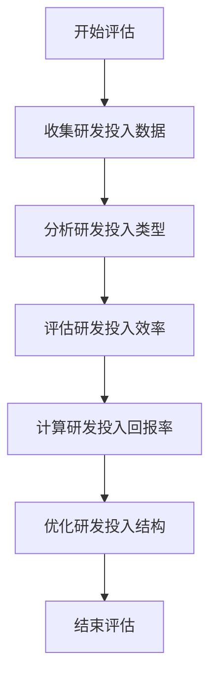
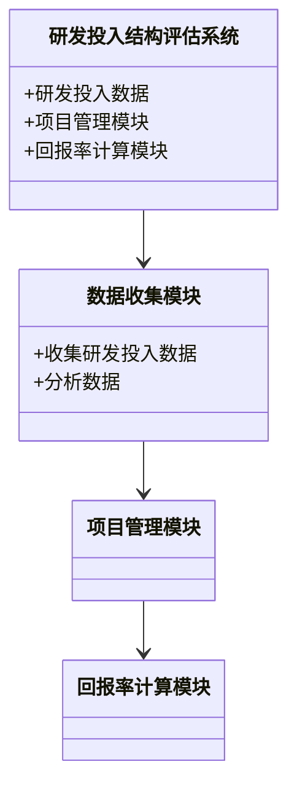

                 


# 彼得林奇对公司研发投入结构的评估

> 关键词：研发投入结构评估、彼得林奇、投资评估、企业价值分析、研发投入优化

> 摘要：本文从彼得林奇的投资哲学出发，分析其对公司研发投入结构的评估方法。通过详细阐述研发投入结构的核心概念、评估框架、算法原理以及实际应用，帮助读者理解如何通过科学的评估方法优化企业的研发投入结构，提升企业价值。文章结合理论与实践，提供了一系列实用的工具和方法，帮助投资者和企业管理者更好地进行研发投入决策。

---

## 第1章: 研发投入结构评估的背景与重要性

### 1.1 研发投入的定义与重要性

#### 1.1.1 研发投入的定义
研发投入（R&D）是指企业在研究与开发活动中投入的资源，包括资金、时间和人力资源等。这些资源用于探索新技术、开发新产品、改进现有产品或工艺。

#### 1.1.2 研发投入在企业中的重要性
研发投入是企业创新的核心驱动力。通过有效的研发投入，企业可以提升技术竞争力，降低生产成本，开拓新的市场机会。尤其是在科技行业，研发投入往往决定了企业的长期发展潜力。

#### 1.1.3 研发投入对企业发展的影响
研发投入不仅影响企业的短期盈利能力，还决定了企业的长期竞争力。合理的研发投入结构能够优化资源分配，提高研发效率，降低研发风险。

### 1.2 彼得林奇的背景与投资理念

#### 1.2.1 彼得林奇的个人简介
彼得·林奇（Peter Lynch）是美国著名的职业棒球运动员和投资家。他在职业生涯中以出色的投球技术和领导力著称，同时也以其对投资的深刻见解而闻名。

#### 1.2.2 彼得林奇的投资哲学
彼得林奇强调长期投资和价值投资。他认为，投资的核心在于找到那些具有持续增长潜力的企业，并通过深入分析企业的基本面来做出决策。

#### 1.2.3 彼得林奇对研发投入的关注点
在评估企业时，彼得林奇特别关注企业的研发投入结构。他认为，合理的研发投入能够为企业带来长期的竞争优势，而过度或不足的研发投入都会影响企业的价值。

### 1.3 研发投入结构评估的核心概念

#### 1.3.1 研发投入的结构化分析
研发投入的结构化分析包括对研发投入的类型、目标、分配方式以及预期回报的分析。通过结构化分析，可以更好地理解研发投入对企业价值的影响。

#### 1.3.2 研发投入与企业价值的关系
研发投入是企业价值的重要组成部分。合理的研发投入能够提升企业的技术竞争力，从而增加企业的市场价值。然而，如果研发投入不合理，可能会导致资源浪费，降低企业的整体价值。

#### 1.3.3 研发投入评估的边界与外延
研发投入评估的边界包括企业的财务能力、市场需求、竞争环境等因素。外延则涉及研发投入的周期性、创新性以及与企业战略目标的契合度。

---

## 第2章: 研发投入结构评估的框架与方法

### 2.1 彼得林奇的评估框架

#### 2.1.1 从战略角度评估研发投入
彼得林奇强调从战略角度评估研发投入。他认为，研发投入不仅要满足当前的需求，还要为企业未来的发展奠定基础。

#### 2.1.2 研发投入的周期性分析
研发投入具有周期性。彼得林奇建议在评估研发投入时，要考虑经济周期对研发投入的影响，合理调整研发投入的节奏。

#### 2.1.3 研发投入的效率与效果评估
彼得林奇认为，评估研发投入的效率和效果是关键。效率高的研发投入能够在有限的时间和资源内取得更大的成果，而效果好的研发投入能够真正推动企业的创新和发展。

### 2.2 研发投入结构的核心要素

#### 2.2.1 研发投入的类型与特点
研发投入可以分为基础研究、应用研究和产品开发三类。不同类型的研发投入具有不同的特点和目标，需要根据企业的实际情况进行合理分配。

#### 2.2.2 研发投入的分配与优化
合理的研发投入分配能够优化资源利用，提高研发效率。彼得林奇建议根据企业的战略目标和市场环境，动态调整研发投入的分配。

#### 2.2.3 研发投入的回报率评估
评估研发投入的回报率是衡量研发投入效果的重要指标。彼得林奇建议使用财务指标（如ROI）和非财务指标（如技术创新）来综合评估研发投入的回报率。

### 2.3 研发投入结构的对比分析

#### 2.3.1 不同行业研发投入的特征对比
不同行业的研发投入具有不同的特征。例如，科技行业需要大量的研发投入，而传统制造业的研发投入相对较少。

#### 2.3.2 不同企业规模的研发投入差异
大企业通常有更高的研发投入，而小企业由于资源有限，研发投入相对较少。彼得林奇建议根据企业的规模和市场地位，制定合理的研发投入策略。

#### 2.3.3 研发投入与企业生命周期的关系
研发投入与企业生命周期密切相关。初创企业需要更多的研发投入，而成熟企业则需要根据市场需求调整研发投入。

---

## 第3章: 研发投入结构的核心概念原理

### 3.1 研发投入结构的核心要素

#### 3.1.1 研发投入的主体与目标
研发投入的主体通常是企业，其目标是通过技术创新提升企业的竞争力。彼得林奇认为，明确的研发目标是成功的关键。

#### 3.1.2 研发投入的资金来源与分配
研发投入的资金来源包括企业的自有资金和外部融资。彼得林奇建议根据企业的财务状况和市场环境，合理分配研发投入的资金。

#### 3.1.3 研发投入的项目管理与风险控制
有效的项目管理和风险控制是确保研发投入成功的重要因素。彼得林奇强调，企业需要建立完善的研发管理体系，降低研发风险。

### 3.2 研发投入结构的属性特征对比

#### 3.2.1 研发投入的周期性与持续性
研发投入具有周期性，但也需要持续进行。彼得林奇建议企业在经济波动期间，合理调整研发投入的节奏。

#### 3.2.2 研发投入的创新性与可复制性
创新性是研发投入的核心特征。彼得林奇认为，企业需要通过持续的创新保持竞争优势。

#### 3.2.3 研发投入的经济效益与社会影响
研发投入不仅具有经济效益，还具有重要的社会影响。彼得林奇认为，企业应该关注研发投入的社会效益，承担更多的社会责任。

---

## 第4章: 研发投入结构的ER实体关系图

### 4.1 实体关系图的构建

#### 4.1.1 实体定义与关系
以下是研发投入结构评估的ER实体关系图：

```mermaid
erdiagram
    项目（Project）
    资金（Funding）
    人员（Personnel）
    技术（Technology）
    时间（Time）

    项目 --> 资金：每个项目对应多个资金分配
    项目 --> 人员：每个项目需要多个人员参与
    项目 --> 技术：每个项目对应多个技术开发
    项目 --> 时间：每个项目对应一个时间段

    资金 --> 人员：每个资金分配对应多个人员
    资金 --> 技术：每个资金分配对应多个技术开发

    人员 --> 技术：每个人员参与多个技术开发
```

---

## 第5章: 研发投入结构评估的算法原理

### 5.1 算法流程图

以下是研发投入结构评估的算法流程图：



### 5.2 数学模型与公式

#### 5.2.1 研发投入回报率计算公式
$$ \text{研发投入回报率} = \frac{\text{研发投入带来的收益} - \text{研发投入成本}}{\text{研发投入成本}} \times 100\% $$

#### 5.2.2 研发投入效率评估公式
$$ \text{研发投入效率} = \frac{\text{研发项目成功数量}}{\text{总研发项目数量}} \times 100\% $$

---

## 第6章: 系统分析与架构设计方案

### 6.1 问题场景介绍
企业需要通过系统化的研发投入结构评估，优化资源配置，提升研发效率。彼得林奇的方法为我们提供了一个理论框架，但实际应用中需要结合具体的系统设计。

### 6.2 系统功能设计

#### 6.2.1 领域模型
以下是研发投入结构评估的领域模型：



### 6.3 系统架构设计

#### 6.3.1 系统架构图
以下是研发投入结构评估系统的架构图：


---

## 第7章: 项目实战

### 7.1 环境安装

#### 7.1.1 系统需求
- 操作系统：Windows 10 或更高版本
- 开发工具：Python 3.8 或更高版本，Jupyter Notebook
- 数据库：MySQL 或其他关系型数据库

### 7.2 核心代码实现

#### 7.2.1 数据收集模块
以下是数据收集模块的核心代码：

```python
import sqlite3
import pandas as pd

def collect_data():
    conn = sqlite3.connect('研发数据.db')
    query = "SELECT * FROM 研发投入;"
    data = pd.read_sql(query, conn)
    return data

# 示例数据
data = collect_data()
print(data.head())
```

#### 7.2.2 回报率计算模块
以下是回报率计算模块的核心代码：

```python
def calculate_return_on_investment(data):
    return_rate = (data['收益'] - data['成本']) / data['成本'] * 100
    return return_rate

# 示例计算
data['回报率'] = calculate_return_on_investment(data)
print(data['回报率'].mean())
```

### 7.3 案例分析与解读
以某科技公司为例，分析其研发投入结构，并计算其回报率。通过对比不同项目，优化其研发投入结构，提升整体回报率。

---

## 第8章: 最佳实践、小结、注意事项和拓展阅读

### 8.1 最佳实践
- 定期评估研发投入结构，根据市场变化进行调整。
- 建立完善的研发管理体系，降低研发风险。
- 关注研发投入的社会效益，承担企业社会责任。

### 8.2 小结
通过本文的分析，我们了解了彼得林奇对公司研发投入结构的评估方法。合理优化研发投入结构，能够提升企业的技术创新能力，增强市场竞争力。

### 8.3 注意事项
- 研发投入评估需要结合企业的实际情况，避免一刀切。
- 重视数据的准确性和完整性，确保评估结果的有效性。
- 研发投入的周期性与企业的生命周期密切相关，需动态调整。

### 8.4 拓展阅读
- 彼得林奇的其他投资理念
- 研发投入与企业战略的结合
- 国际市场的研发投入分析

---

## 作者信息

作者：AI天才研究院/AI Genius Institute & 禅与计算机程序设计艺术 /Zen And The Art of Computer Programming

---

通过以上内容，我们系统地分析了彼得林奇对公司研发投入结构的评估方法，并结合实际案例进行了详细解读。希望本文能够为投资者和企业管理者在优化研发投入结构方面提供有价值的参考。

