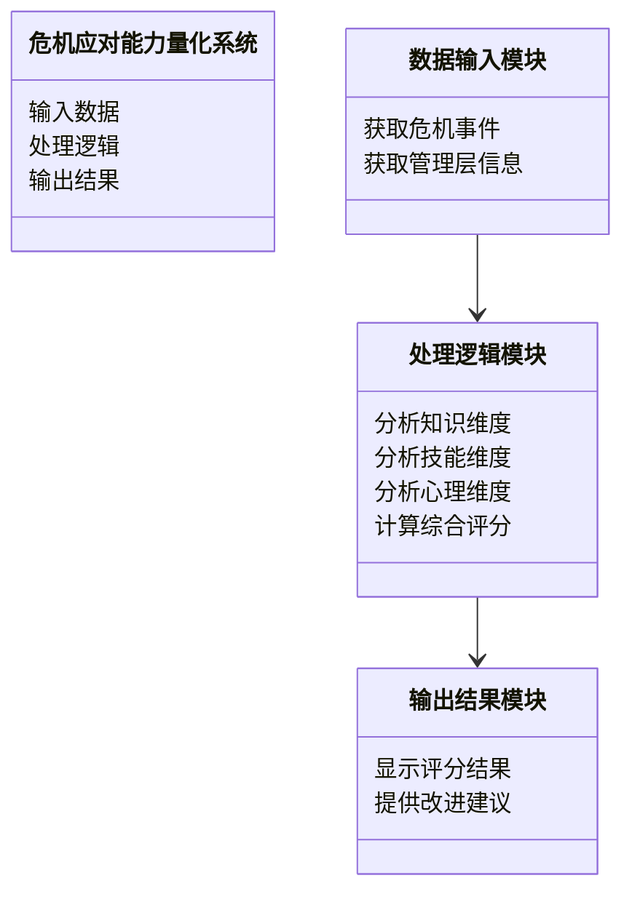
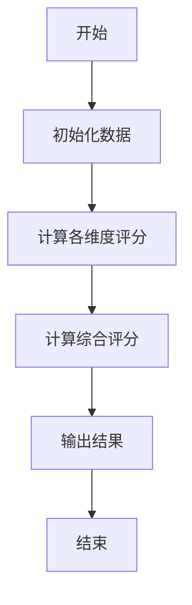

                 


# 彼得林奇对公司管理层危机应对能力的量化

## 关键词：彼得林奇、危机应对能力、量化评估、系统架构、算法实现、投资分析、风险管理

## 摘要：本文深入探讨了彼得·林奇的危机应对能力量化方法，结合数学模型、系统架构和项目实战，分析了公司管理层在危机中的应对能力，并提出了系统的解决方案。

---

## 第1章：背景介绍

### 1.1 危机应对能力的重要性

危机应对能力是指企业在面对突发事件时，管理层能够迅速制定有效策略，减少损失，恢复业务的能力。这种能力直接影响企业的生存和发展，是企业风险管理的核心。

彼得·林奇作为投资界的传奇人物，以其独特的投资策略闻名。他强调管理层在危机中的应对能力，认为这是企业能否在逆境中生存的关键。

量化管理层的危机应对能力可以帮助投资者评估企业的抗风险能力，为投资决策提供依据。

---

## 第2章：核心概念与联系

### 2.1 危机应对能力的维度

危机应对能力可以分为知识、技能和心理三个维度：

- **知识维度**：包括对危机类型和应对策略的理解。
- **技能维度**：包括危机管理的具体操作能力。
- **心理维度**：包括在危机中的情绪稳定性和决策能力。

### 2.2 各维度的属性对比

下表展示了三个维度的对比：

| 维度 | 属性1 | 属性2 | 属性3 |
|------|--------|--------|--------|
| 知识 | 理论基础 | 应对策略 | 相关法规 |
| 技能 | 应急响应 | 危机沟通 | 资源调配 |
| 心理 | 情绪稳定性 | 决策果断性 | 团队激励 |

### 2.3 危机应对能力的ER实体关系图

Mermaid ER图：

```mermaid
erd
    顾客
    {
        id: int
        name: string
    }
    危机事件
    {
        id: int
        type: string
        timestamp: datetime
    }
    危机应对能力
    {
        id: int
        knowledge: int
        skills: int
       心理素质: int
    }
    顾客 --> 危机事件: 受影响
    危机事件 --> 危机应对能力: 评估
```

---

## 第3章：算法原理讲解

### 3.1 算法原理概述

量化危机应对能力的算法基于多维度评估模型，结合权重计算和综合评分。

### 3.2 算法的数学模型

公式如下：

$$
\text{危机应对能力评分} = \sum_{i=1}^{n} w_i \times s_i
$$

其中，$w_i$ 是第i个维度的权重，$s_i$ 是第i个维度的评分。

---

## 第4章：系统分析与架构设计

### 4.1 系统功能设计

#### 领域模型Mermaid类图：



### 4.2 系统架构设计

Mermaid架构图：

```mermaid
C4Context
    title 危机应对能力量化系统架构

    container 危机应对能力量化系统 {
        危机事件数据库
        管理层信息数据库
        量化算法模块
        结果展示模块
    }

    participant 用户
    participant 管理层数据录入员

    用户 --> 危机应对能力量化系统: 请求评估
    管理层数据录入员 --> 危机应对能力量化系统: 提供数据
    危机应对能力量化系统 --> 量化算法模块: 执行算法
    量化算法模块 --> 结果展示模块: 输出结果
```

---

## 第5章：项目实战

### 5.1 环境安装

- **开发环境**：Python 3.8+
- **工具**：Jupyter Notebook, Mermaid, LaTeX
- **依赖**：安装numpy和pandas库

### 5.2 系统核心实现源代码

```python
import numpy as np
import pandas as pd

def calculate_crisis_response_score(data):
    weights = [0.4, 0.3, 0.3]
    dimensions = ['knowledge', 'skills', '心理素质']
    scores = []
    for index, row in data.iterrows():
        score = 0
        for i in range(len(dimensions)):
            score += weights[i] * row[dimensions[i]]
        scores.append(score)
    return pd.Series(scores, index=data.index, name='综合评分')

# 示例数据
data = pd.DataFrame({
    'knowledge': [85, 90, 88],
    'skills': [80, 85, 82],
    '心理素质': [75, 80, 85]
})

result = calculate_crisis_response_score(data)
print(result)
```

### 5.3 代码应用解读与分析

上述代码实现了一个简单的危机应对能力评分系统，输入危机事件数据后，计算每个管理层的综合评分。

---

## 第6章：最佳实践与总结

### 6.1 最佳实践

- **系统设计**：模块化设计便于扩展和维护。
- **数据处理**：确保数据的准确性和完整性。
- **算法优化**：根据实际需求调整权重和模型。

### 6.2 小结

本文通过理论分析、算法实现和系统设计，全面探讨了彼得·林奇的危机应对能力量化方法。未来可以进一步研究动态权重调整和实时数据分析，提升系统的实用性和准确性。

---

## 附录：数学公式与流程图

### 附录A：

数学公式：

$$
\text{危机应对能力评分} = \sum_{i=1}^{n} w_i \times s_i
$$

流程图：



---

## 作者：AI天才研究院/AI Genius Institute & 禅与计算机程序设计艺术 /Zen And The Art of Computer Programming

