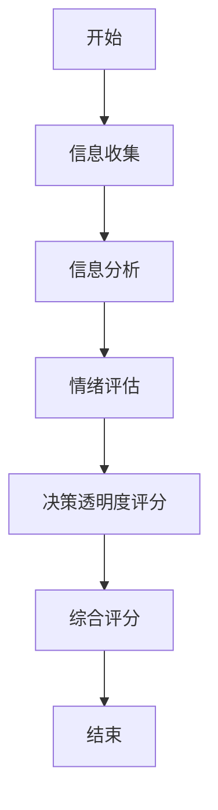

                 


# 彼得林奇对公司管理层危机沟通能力的评估

## 关键词：
- 彼得·林奇
- 危机沟通能力
- 管理层评估
- 投资决策
- 企业价值

## 摘要：
彼得·林奇作为投资界的重要人物，提出了对公司管理层危机沟通能力的评估标准，认为这种能力是企业在危机中能否 survive 和 thrive 的关键因素。本文从危机沟通的核心概念、评估模型、算法实现、系统架构、项目实战、最佳实践等多维度进行分析，结合具体案例，详细阐述了如何评估管理层的危机沟通能力，并提出了改进建议。

---

## 第一部分: 危机沟通能力的核心概念与背景

### 第1章: 危机沟通能力的定义与重要性

#### 1.1 危机沟通的定义
- **1.1.1 危机沟通的定义与范围**
  - 危机沟通是指在企业面临重大危机（如财务危机、法律纠纷、自然灾害等）时，管理层与利益相关者（如股东、员工、客户等）之间的信息传递和互动过程。
  - 危机沟通不仅仅是传递信息，更是通过信息传递来稳定情绪、化解危机、恢复信任的过程。

- **1.1.2 危机沟通的核心要素**
  - **信息传递**：信息的准确性和及时性是危机沟通的核心。
  - **情绪管理**：管理层在危机中的情绪管理能力直接影响利益相关者的信心。
  - **决策透明度**：管理层在危机中的决策是否透明，直接影响企业的信任度和形象。

- **1.1.3 危机沟通与企业价值的关系**
  - 危机沟通能力直接影响企业的股价波动、投资者信心和企业声誉。
  - 在危机中表现良好的企业，往往能够更快恢复市场信任，提升企业价值。

#### 1.2 管理层危机沟通的重要性
- **1.2.1 管理层在危机中的角色**
  - 管理层是企业危机沟通的核心，他们的言行直接影响企业的形象和利益相关者的信心。
  - 在危机中，管理层的沟通能力是企业能否走出危机的关键。

- **1.2.2 危机沟通对股东信任的影响**
  - 股东是企业的重要利益相关者，管理层在危机中的沟通能力直接影响股东的信任。
  - 透明的沟通能够缓解股东的焦虑，增强他们的信心。

- **1.2.3 危机沟通对股价波动的缓解作用**
  - 在危机中，股价往往会大幅波动，管理层的有效沟通能够缓解股价的波动，降低市场风险。

#### 1.3 彼得·林奇的评估标准
- **1.3.1 彼得·林奇的投资者视角**
  - 彼得·林奇认为，企业在危机中的表现是评估管理层能力的重要指标。
  - 他特别关注管理层在危机中的沟通能力，认为这是企业能否在危机中 survive 和 thrive 的关键。

- **1.3.2 危机沟通能力的评估维度**
  - **信息传递的准确性**：管理层是否能够准确传递危机信息。
  - **情绪管理**：管理层在危机中的情绪管理能力。
  - **决策透明度**：管理层在危机中的决策是否透明。

- **1.3.3 评估标准的实际应用案例**
  - 通过具体案例分析，说明彼得·林奇的评估标准在实际中的应用。

#### 1.4 本章小结
  - 本章从危机沟通的定义、核心要素和管理层的重要性三个方面进行了分析，重点介绍了彼得·林奇的评估标准及其在实际中的应用。

---

## 第2章: 危机沟通的核心要素分析

### 2.1 信息传递的准确性
- **2.1.1 信息传递的关键环节**
  - 信息的收集、整理、传递和反馈是信息传递的关键环节。
  - 每一环节都可能影响信息的准确性和及时性。

- **2.1.2 信息失真对企业的影响**
  - 信息失真可能导致错误决策，进一步加剧危机。
  - 信息失真还可能破坏企业与利益相关者的关系，影响企业的声誉。

- **2.1.3 提高信息传递准确性的方法**
  - 建立信息传递的规范化流程。
  - 使用先进的信息技术（如大数据、人工智能）辅助信息传递。

### 2.2 情绪管理与决策透明度
- **2.2.1 危机中的情绪管理**
  - 管理层在危机中的情绪管理能力直接影响企业的形象和利益相关者的信心。
  - 情绪管理的核心是保持冷静，避免恐慌。

- **2.2.2 决策透明度的定义与作用**
  - 决策透明度是指管理层在危机中的决策过程是否透明。
  - 透明的决策能够增强利益相关者的信任，缓解危机。

- **2.2.3 透明度对股东信心的影响**
  - 透明的决策能够增强股东的信心，降低股价波动。
  - 透明度不足可能导致股东的不信任，加剧危机。

### 2.3 沟通渠道的多样性与及时性
- **2.3.1 多渠道沟通的重要性**
  - 在危机中，单一的沟通渠道往往不够，需要多种渠道配合。
  - 多渠道沟通能够确保信息传递的广泛性和及时性。

- **2.3.2 危机中的及时沟通策略**
  - 及时沟通是危机沟通的核心，能够有效缓解危机。
  - 及时沟通需要建立高效的沟通机制，确保信息传递的快速性和准确性。

- **2.3.3 不同渠道的优缺点对比**
  - **面对面沟通**：直接、高效，但成本高。
  - **电话沟通**：快速、方便，但缺乏视觉信息。
  - **邮件沟通**：方便、可记录，但速度较慢。
  - **社交媒体沟通**：广泛、快速，但难以控制信息的传播。

### 2.4 核心概念对比表格
| 沟通要素 | 定义 | 重要性 | 影响因素 |
|----------|------|--------|----------|
| 信息传递 | 信息从管理层到利益相关者的流动 | 高 | 信息准确性、渠道效率 |
| 情绪管理 | 管理危机中的情绪反应 | 高 | 领导风格、透明度 |
| 决策透明度 | 决策过程的公开程度 | 高 | 企业文化和管理层态度 |

### 2.5 本章小结
  - 本章从信息传递、情绪管理、决策透明度和沟通渠道四个方面进行了详细分析，强调了危机沟通能力的核心要素及其对企业的关键影响。

---

## 第3章: 危机沟通能力的评估模型

### 3.1 评估模型的构建原理
- **3.1.1 模型构建的背景**
  - 为了更好地评估管理层的危机沟通能力，我们需要一个科学的评估模型。
  - 评估模型需要考虑危机沟通的核心要素，如信息传递、情绪管理、决策透明度等。

- **3.1.2 模型的输入变量与输出结果**
  - **输入变量**：危机类型、管理层的沟通能力、利益相关者的反应等。
  - **输出结果**：危机沟通能力的评分（如1-10分）。

- **3.1.3 模型的适用范围与限制**
  - 该模型适用于各种类型的危机，但需要根据具体情况调整参数。
  - 模型的限制包括数据的获取难度和模型的复杂性。

### 3.2 评估算法的流程图


### 3.3 算法实现
- **3.3.1 信息收集模块**
  ```python
  def collect_info():
      info = input("请输入危机相关信息：")
      return info
  ```

- **3.3.2 信息分析模块**
  ```python
  def analyze_info(info):
      # 分析信息并返回评分
      return score
  ```

- **3.3.3 情绪评估模块**
  ```python
  def evaluate_emotion(score):
      # 根据评分评估情绪
      return emotion_score
  ```

- **3.3.4 决策透明度评分模块**
  ```python
  def calculate_transparency(emotion_score):
      # 根据情绪评分计算透明度评分
      return transparency_score
  ```

- **3.3.5 综合评分模块**
  ```python
  def calculate_total_score(transparency_score):
      # 综合评分 = 信息评分 * 0.4 + 情绪评分 * 0.3 + 透明度评分 * 0.3
      total_score = info_score * 0.4 + emotion_score * 0.3 + transparency_score * 0.3
      return total_score
  ```

### 3.4 数学模型与公式
- **综合评分公式**
  $$
  \text{总评分} = 0.4 \times \text{信息评分} + 0.3 \times \text{情绪评分} + 0.3 \times \text{透明度评分}
  $$

- **信息评分计算**
  $$
  \text{信息评分} = \frac{\text{信息准确率} + \text{信息及时率}}{2}
  $$

- **情绪评分计算**
  $$
  \text{情绪评分} = \frac{\text{情绪稳定性} + \text{情绪管理能力}}{2}
  $$

### 3.5 本章小结
  - 本章详细介绍了危机沟通能力评估模型的构建原理、算法实现和数学模型，为实际应用提供了理论支持。

---

## 第4章: 系统分析与架构设计

### 4.1 问题场景介绍
- 在危机中，企业需要快速响应，及时传递信息，稳定利益相关者的情绪。

### 4.2 系统功能设计
- **领域模型**：使用 Mermaid 类图展示系统功能。
  ```mermaid
  classDiagram
      class 管理层 {
          - 信息收集模块
          - 信息分析模块
          - 情绪评估模块
          - 决策透明度模块
      }
      class 利益相关者 {
          - 股东
          - 员工
          - 客户
      }
      class 系统 {
          - 信息传递模块
          - 沟通渠道模块
          - 评分模块
      }
  ```

### 4.3 系统架构设计
- **架构图**：使用 Mermaid 架构图展示系统架构。
  ```mermaid
  architecture
      管理层 --> 信息传递模块
      利益相关者 --> 沟通渠道模块
      系统 --> 评分模块
  ```

### 4.4 系统接口设计
- **API 接口**：
  - `/api/crisis_info`：获取危机信息
  - `/api/communication_score`：获取沟通能力评分

### 4.5 系统交互流程图
  ```mermaid
  sequenceDiagram
      管理层 -> 利益相关者: 收集信息
      利益相关者 -> 管理层: 提供反馈
      管理层 -> 系统: 分析信息
      系统 -> 管理层: 返回评分
  ```

### 4.6 本章小结
  - 本章从系统设计的角度，详细分析了危机沟通能力评估的实现方案，包括功能设计、架构设计和系统交互流程。

---

## 第5章: 项目实战

### 5.1 环境安装
- 需要安装 Python 和相关的开发工具（如 IDE、库等）。

### 5.2 核心代码实现
- **信息收集模块**
  ```python
  def collect_info():
      info = input("请输入危机相关信息：")
      return info
  ```

- **信息分析模块**
  ```python
  def analyze_info(info):
      # 分析信息并返回评分
      return score
  ```

- **情绪评估模块**
  ```python
  def evaluate_emotion(score):
      # 根据评分评估情绪
      return emotion_score
  ```

- **决策透明度评分模块**
  ```python
  def calculate_transparency(emotion_score):
      # 根据情绪评分计算透明度评分
      return transparency_score
  ```

- **综合评分模块**
  ```python
  def calculate_total_score(transparency_score):
      # 综合评分 = 信息评分 * 0.4 + 情绪评分 * 0.3 + 透明度评分 * 0.3
      total_score = info_score * 0.4 + emotion_score * 0.3 + transparency_score * 0.3
      return total_score
  ```

### 5.3 代码应用解读与分析
- 通过具体案例分析，展示如何使用上述代码实现危机沟通能力的评估。

### 5.4 实际案例分析
- 通过具体案例分析，展示如何在实际中应用上述模型和算法。

### 5.5 项目小结
  - 本章通过项目实战，详细展示了如何在实际中应用危机沟通能力评估模型和算法，为读者提供了实践指导。

---

## 第6章: 最佳实践与总结

### 6.1 本章小结
  - 总结本文的核心内容，强调危机沟通能力的重要性及其对企业的关键影响。

### 6.2 最佳实践 tips
  - **提高信息传递的准确性**：建立信息传递的规范化流程，使用先进的信息技术辅助信息传递。
  - **加强情绪管理**：管理层在危机中保持冷静，避免恐慌。
  - **提升决策透明度**：建立透明的决策机制，增强利益相关者的信任。

### 6.3 注意事项
  - **数据的获取与处理**：数据的准确性和完整性直接影响评估结果。
  - **模型的适用性**：根据具体情况调整模型的参数和评估标准。

### 6.4 拓展阅读
  - 推荐相关书籍和文献，供读者进一步学习和研究。

---

## 作者：AI天才研究院/AI Genius Institute & 禅与计算机程序设计艺术 /Zen And The Art of Computer Programming

