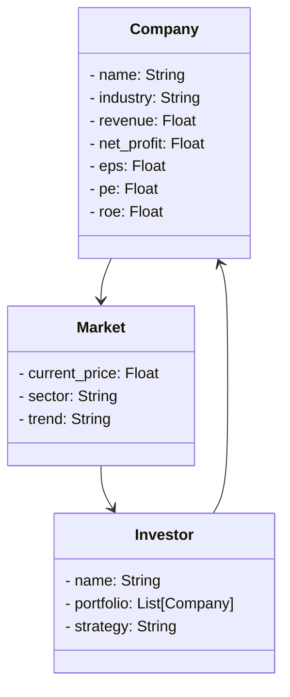

                 


# 彼得林奇对公司经营效率的重视

## 关键词：彼得·林奇、公司经营效率、投资策略、财务指标、选股标准、价值投资

## 摘要：本文深入探讨了彼得·林奇对公司经营效率的重视，分析了其投资理念、选股标准及如何通过提高经营效率来提升公司价值。文章结合实际案例和数学模型，详细讲解了经营效率与公司估值的关系，并提供了投资策略和风险管理的建议。

---

## 第一部分：彼得·林奇的经营理念概述

### 第1章：彼得·林奇与公司经营效率概述

#### 1.1 彼得·林奇的背景与投资理念

彼得·林奇（Peter Lynch）是美国著名投资专家，以其在富达投资集团的长期任职中创造了卓越的投资业绩而闻名。他强调，投资成功的关键在于选择那些能够持续提高经营效率的公司。林奇的投资理念基于对公司基本面的深入分析，特别是对管理层能力、财务指标和公司效率的重视。

#### 1.2 林奇的投资哲学

林奇认为，成功的投资需要关注公司的经营效率，即公司如何利用资源创造价值。他主张通过分析财务指标，如每股收益（EPS）、市盈率（P/E）和净资产收益率（ROE），来评估公司的效率和潜在价值。此外，他强调长期投资和价值发现，避免短期波动的干扰。

#### 1.3 林奇对公司经营效率的重视

林奇指出，公司经营效率是决定股价长期表现的核心因素。他通过分析公司的运营效率、成本控制和利润增长能力，选择那些能够持续提升效率的公司进行投资。他认为，高效率的公司能够为股东创造更多价值。

---

## 第二部分：公司经营效率的核心概念

### 第2章：公司经营效率的基本概念

#### 2.1 经营效率的定义

经营效率指公司在利用资产、劳动力和其他资源方面的能力。高效率意味着公司能够用较少的资源创造更多的价值。

#### 2.2 经营效率的重要性

经营效率直接影响公司的盈利能力、市场竞争力和股价表现。高效率的公司通常具有更强的盈利能力，能够为股东带来更高的回报。

#### 2.3 经营效率的衡量指标

常用的衡量指标包括：

- 资产周转率（Asset Turnover）：反映公司利用资产创造收入的能力。
- 每股收益（EPS）：衡量公司每股的盈利能力。
- 净资产收益率（ROE）：评估公司使用股东资金的效率。

---

## 第三部分：彼得·林奇的选股标准

### 第3章：林奇的选股核心要素

#### 3.1 公司基本面分析

林奇强调对公司基本面的深入分析，包括行业地位、竞争优势和市场前景。他倾向于选择那些在行业中具有领先地位且能够持续创新的公司。

#### 3.2 财务指标的重要性

林奇认为，财务指标是评估公司效率的关键工具。他特别关注以下几个指标：

- 每股收益（EPS）：衡量公司每股的盈利能力。
- 市盈率（P/E）：评估公司股价的合理性。
- 净资产收益率（ROE）：衡量公司使用股东资金的效率。

#### 3.3 管理层的质量

林奇认为，管理层的能力和决策对公司效率至关重要。他倾向于选择那些由经验丰富且具有战略眼光的管理层领导的公司。

---

## 第四部分：林奇的财务指标分析法

### 第4章：常用财务指标解析

#### 4.1 每股收益（EPS）

每股收益是公司净利润除以普通股股数。公式为：
$$ EPS = \frac{\text{净利润}}{\text{普通股股数}} $$

高EPS表明公司每股盈利能力强，但需结合市盈率（P/E）进行综合分析。

#### 4.2 市盈率（P/E）

市盈率是股价除以每股收益。公式为：
$$ P/E = \frac{\text{股价}}{\text{EPS}} $$

低P/E可能表明股价被低估，但需考虑行业和公司具体情况。

#### 4.3 净资产收益率（ROE）

净资产收益率是净利润除以净资产。公式为：
$$ ROE = \frac{\text{净利润}}{\text{净资产}} $$

高ROE表明公司使用股东资金的效率高，但需注意公司的杠杆情况。

---

## 第五部分：实际案例分析

### 第5章：林奇的经典投资案例

#### 5.1 某公司的经营效率分析

以某公司为例，假设其EPS为2元，P/E为15，ROE为18%。根据这些指标，林奇可能会认为该公司的经营效率较高，具有投资价值。

#### 5.2 投资决策过程

林奇会综合分析公司的财务指标、行业地位和管理层能力，最终决定是否投资。

#### 5.3 投资结果与反思

通过案例分析，林奇的投资策略得到了验证，证明了经营效率对公司价值的重要性。

---

## 第六部分：系统分析与架构设计方案

### 第6章：系统分析与架构设计

#### 6.1 问题场景介绍

为了分析公司的经营效率，需要构建一个系统，整合财务数据和市场信息，提供投资决策支持。

#### 6.2 系统功能设计（领域模型）



#### 6.3 系统架构设计


---

## 第七部分：项目实战

### 第7章：项目实战

#### 7.1 环境安装

安装Python和相关库（如pandas、numpy、matplotlib）。

#### 7.2 核心实现源代码

```python
import pandas as pd

def calculate_roe(net_profit, equity):
    return net_profit / equity

data = {
    '公司': ['A', 'B', 'C'],
    '收入': [100, 200, 150],
    '净利润': [20, 30, 25],
    '净资产': [50, 75, 60]
}

df = pd.DataFrame(data)
df['ROE'] = df.apply(lambda x: calculate_roe(x['净利润'], x['净资产']), axis=1)
print(df)
```

#### 7.3 代码应用解读

上述代码计算了各公司的ROE，帮助投资者评估公司的净资产收益率。

---

## 结论

彼得·林奇通过强调公司经营效率，提供了一套有效的企业分析方法。本文通过理论分析、案例研究和系统设计，详细讲解了如何通过提高经营效率来提升公司价值。读者可以结合实际投资案例，应用这些方法进行投资决策。

---

## 作者：AI天才研究院 & 禅与计算机程序设计艺术

