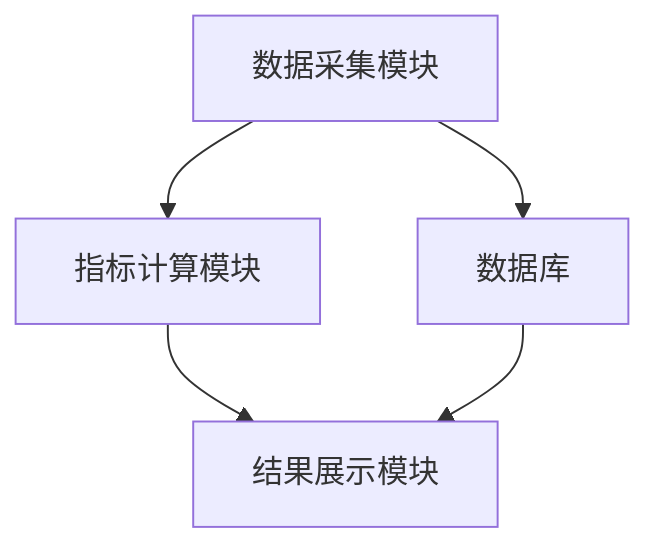

                 


# 彼得·林奇对公司财务灵活性的评估

## 关键词：财务灵活性，彼得·林奇，财务评估，企业战略，风险管理

## 摘要：本文深入探讨了彼得·林奇对公司财务灵活性的评估方法，分析了财务灵活性的核心概念、评估指标、系统架构及实际应用案例。通过结合定量分析和定性分析，文章详细阐述了如何通过财务数据和战略调整来提升企业的财务灵活性，确保企业在复杂多变的市场环境中保持竞争优势。

---

# 第一部分：财务灵活性评估概述

## 第1章：财务灵活性的核心概念

### 1.1 财务灵活性的定义与背景

#### 1.1.1 什么是财务灵活性
财务灵活性是指企业在面对市场变化、行业波动或内部调整时，能够快速适应并优化其财务结构的能力。它是企业在复杂经济环境中保持稳健发展的关键因素。

#### 1.1.2 财务灵活性的重要性
财务灵活性直接影响企业的生存能力和盈利能力。通过优化财务结构、调整资本成本和管理流动性风险，企业可以在经济波动中保持竞争优势。

#### 1.1.3 彼得·林奇的财务分析方法
彼得·林奇以其独特的投资策略闻名，他强调对公司基本面的深入分析，尤其是对财务报表的解读。他认为，财务灵活性是企业长期成功的关键因素之一。

### 1.2 财务灵活性的背景与问题背景

#### 1.2.1 当前企业财务面临的挑战
全球经济的不确定性、行业竞争加剧以及政策变化对企业财务管理提出了更高的要求。企业需要在保持增长的同时，确保财务稳健。

#### 1.2.2 财务灵活性在企业战略中的地位
财务灵活性不仅是财务部门的目标，更是企业战略的核心组成部分。它影响着企业的投资决策、资本分配和风险管理。

#### 1.2.3 企业财务灵活性的核心问题
企业在追求财务灵活性时，通常面临如何平衡短期流动性需求与长期资本优化的挑战。

### 1.3 财务灵活性的解决思路

#### 1.3.1 企业财务灵活性的目标
通过优化财务结构、提升流动性管理能力，确保企业在不同市场环境下的财务稳健性。

#### 1.3.2 财务灵活性的实现路径
包括优化资本结构、加强现金流管理、合理配置资产和负债等策略。

#### 1.3.3 财务灵活性与企业战略的关系
财务灵活性是企业战略的重要支撑，它影响着企业的投资决策、成本控制和风险承受能力。

### 1.4 财务灵活性的边界与外延

#### 1.4.1 财务灵活性的边界
财务灵活性并非无限制，它受到企业内部资源和外部市场环境的双重约束。

#### 1.4.2 财务灵活性与其他财务概念的联系
财务灵活性与资本结构、流动性管理、现金流预测等密切相关。

#### 1.4.3 财务灵活性的外延与扩展
随着企业规模和复杂性的增加，财务灵活性的内涵也在不断扩展，涉及更多领域和层面。

## 第2章：财务灵活性的核心要素

### 2.1 财务灵活性的核心要素组成

#### 2.1.1 流动性管理
流动性管理是财务灵活性的重要组成部分，确保企业在需要时能够迅速获得足够的资金。

#### 2.1.2 资本结构优化
优化资本结构可以降低企业的资本成本，提高资金使用效率。

#### 2.1.3 现金流管理
现金流管理是企业财务健康的重要指标，直接影响企业的偿债能力和投资能力。

### 2.2 财务灵活性的属性特征

#### 2.2.1 灵活性的可衡量性
财务灵活性可以通过多种财务指标进行衡量，如流动比率、速动比率等。

#### 2.2.2 灵活性的可调整性
企业可以通过调整资本结构、优化资产配置等方法来提升财务灵活性。

#### 2.2.3 灵活性的可持续性
财务灵活性的可持续性取决于企业的长期战略规划和风险管理能力。

### 2.3 财务灵活性的ER实体关系图

```mermaid
erDiagram
    actor 投资者 {
        <属性> 投资目标
        <属性> 投资期限
        <属性> 风险偏好
    }
    actor 管理层 {
        <属性> 财务目标
        <属性> 资源分配
        <属性> 绩效评估
    }
    entity 财务数据 {
        <主键> 财务指标
        <外键> 公司ID
        <属性> 时间范围
    }
    entity 公司信息 {
        <主键> 公司ID
        <属性> 公司名称
        <属性> 所属行业
        <属性> 财务年度
    }
    company 投资者与管理层之间不存在直接关联
    company 投资者与公司信息之间不存在直接关联
    company 管理层与公司信息之间不存在直接关联
    company 管理层与财务数据之间存在关联
    company 投资者与财务数据之间存在关联
```

---

# 第二部分：财务灵活性的评估方法

## 第3章：财务灵活性的评估指标

### 3.1 定量评估方法

#### 3.1.1 流动比率
流动比率（Current Ratio）是衡量企业短期偿债能力的重要指标，计算公式为：
$$ \text{流动比率} = \frac{\text{流动资产}}{\text{流动负债}} $$

#### 3.1.2 速动比率
速动比率（Quick Ratio）是流动比率的优化版本，计算公式为：
$$ \text{速动比率} = \frac{\text{速动资产}}{\text{流动负债}} $$

#### 3.1.3 资产负债率
资产负债率（Debt-to-Asset Ratio）是衡量企业资本结构的重要指标，计算公式为：
$$ \text{资产负债率} = \frac{\text{总负债}}{\text{总资产}} $$

### 3.2 定性评估方法

#### 3.2.1 企业战略目标的匹配度
企业财务灵活性需要与战略目标保持一致，确保财务决策与企业长期发展方向一致。

#### 3.2.2 管理层的财务决策能力
管理层的财务决策能力直接影响企业的财务灵活性，包括对财务风险的识别和应对能力。

### 3.3 行业特点与财务灵活性的结合

#### 3.3.1 不同行业对财务灵活性的需求差异
不同行业对财务灵活性的需求不同，例如制造业需要较高的流动性，而科技行业则更注重资本结构优化。

#### 3.3.2 行业周期性对财务灵活性的影响
行业周期性变化直接影响企业的财务灵活性，企业需要根据行业周期调整财务策略。

---

# 第三部分：系统架构与实现

## 第4章：系统架构设计

### 4.1 系统功能设计

#### 4.1.1 数据采集模块
负责收集企业的财务数据，包括资产负债表、利润表和现金流表。

#### 4.1.2 指标计算模块
根据收集的财务数据，计算各项财务指标，如流动比率、速动比率等。

#### 4.1.3 结果展示模块
以图表和报告的形式展示财务灵活性评估结果，帮助管理层制定决策。

### 4.2 系统架构图



### 4.3 接口设计与交互流程

#### 4.3.1 系统接口设计
系统需要与企业财务系统对接，确保数据的准确性和实时性。

#### 4.3.2 用户交互流程
用户输入企业财务数据，系统进行计算并生成评估报告。

### 4.4 系统实现代码

#### 4.4.1 环境安装
需要安装Python和相关库，如Pandas和Matplotlib。

#### 4.4.2 核心代码实现

```python
import pandas as pd
import matplotlib.pyplot as plt

# 数据加载
df = pd.read_csv('financial_data.csv')

# 流动比率计算
current_ratio = df['流动资产'] / df['流动负债']
print('流动比率:', current_ratio.mean())

# 速动比率计算
quick_ratio = (df['流动资产'] - df['存货']) / df['流动负债']
print('速动比率:', quick_ratio.mean())

# 可视化
plt.figure(figsize=(10,6))
plt.plot(current_ratio, label='流动比率')
plt.plot(quick_ratio, label='速动比率')
plt.legend()
plt.show()
```

---

# 第四部分：项目实战

## 第5章：财务灵活性评估的实战分析

### 5.1 案例分析

#### 5.1.1 案例背景
以某制造公司为例，分析其财务灵活性。

#### 5.1.2 数据分析
根据财务数据，计算流动比率、速动比率等指标。

#### 5.1.3 结果解读
通过分析得出企业的财务灵活性状况，并提出改进建议。

### 5.2 项目小结

#### 5.2.1 项目总结
总结项目的实施过程和主要成果。

#### 5.2.2 经验与教训
分享项目中的经验和教训，为后续项目提供参考。

---

# 第五部分：总结与展望

## 第6章：总结与展望

### 6.1 总结

#### 6.1.1 核心内容回顾
总结本文的核心内容和主要观点。

#### 6.1.2 最佳实践
提出提升财务灵活性的最佳实践和注意事项。

### 6.2 展望

#### 6.2.1 未来研究方向
探讨财务灵活性评估的未来研究方向，如动态调整模型和机器学习应用。

#### 6.2.2 技术发展趋势
分析财务灵活性评估技术的发展趋势，如大数据和人工智能的应用。

---

# 作者：AI天才研究院/AI Genius Institute & 禅与计算机程序设计艺术 /Zen And The Art of Computer Programming

