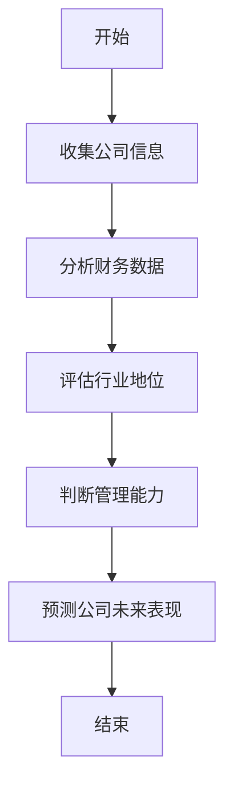
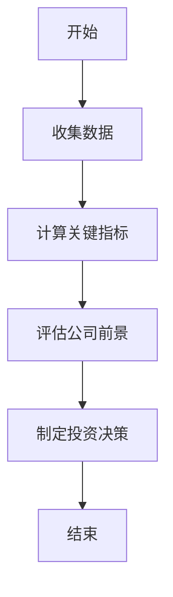
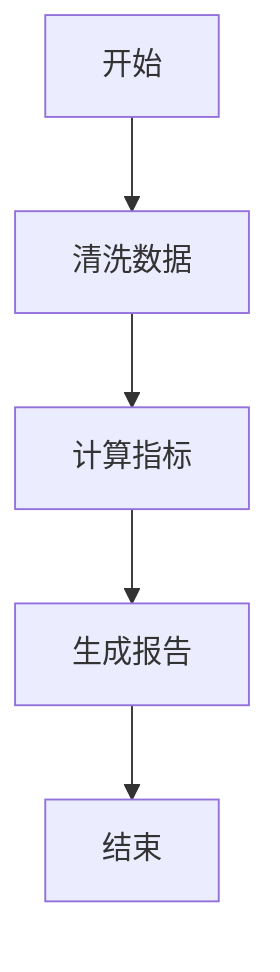
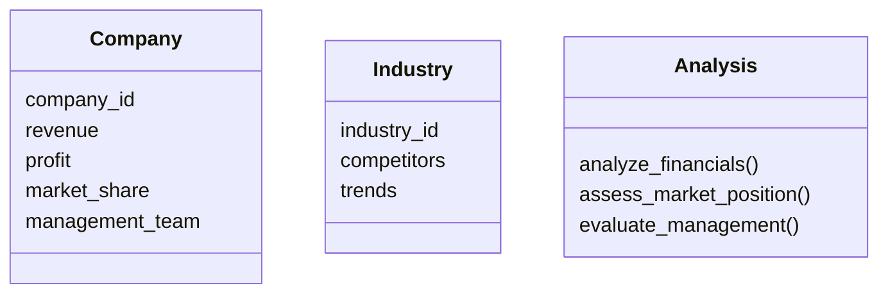
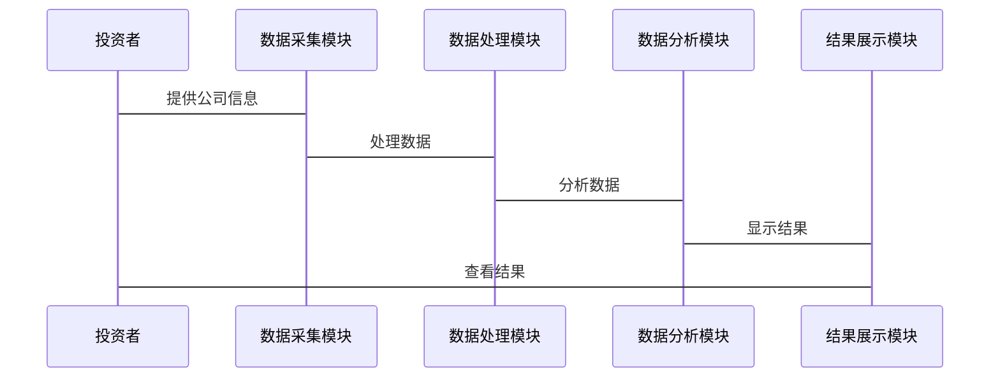

                 


# 彼得林奇对公司长期战略的分析

## 关键词：彼得林奇，长期战略，投资分析，公司分析，财务指标，投资策略

## 摘要：本文通过分析彼得·林奇的投资哲学和方法，探讨如何对公司进行长期战略分析。从背景介绍、核心概念、算法原理、系统设计到项目实战，系统地解析彼得林奇的分析方法，并通过案例展示其应用。文章内容详实，适合投资专业人士和公司管理者阅读。

---

# 第一部分：彼得林奇对公司长期战略的背景介绍

## 第1章：彼得林奇与长期战略分析概述

### 1.1 彼得林奇的背景与投资理念

#### 1.1.1 彼得林奇的个人经历与成就
彼得·林奇（Peter Lynch）是美国著名的投资专家，曾任富达投资集团麦哲伦基金的经理。他以卓越的投资业绩闻名，尤其擅长分析公司的长期战略和基本面。林奇的投资哲学强调长期持有优质股票，注重对公司基本面的深入研究。

#### 1.1.2 彼得林奇的投资哲学与方法
林奇的投资理念基于对公司财务状况、行业地位和管理团队的全面分析。他认为，投资者应选择那些具有持续增长潜力的公司，并长期持有这些股票。

#### 1.1.3 彼得林奇对长期战略的重视
林奇强调，公司的长期战略是决定其投资价值的关键因素。他通过分析公司的财务指标、行业趋势和管理能力，评估公司的长期发展潜力。

### 1.2 长期战略分析的核心概念

#### 1.2.1 问题背景与问题描述
公司长期战略分析旨在评估公司在未来市场的竞争力和增长潜力。通过对公司财务状况、行业地位和管理能力的分析，投资者可以做出更明智的投资决策。

#### 1.2.2 问题解决的路径与方法
林奇的方法包括以下步骤：收集公司信息、分析财务数据、评估行业地位、判断管理能力、预测公司未来表现。

#### 1.2.3 长期战略分析的边界与外延
长期战略分析的边界包括公司内部管理和外部市场环境。其外延涉及公司治理、行业趋势和宏观经济因素。

#### 1.2.4 核心概念与要素组成
核心概念包括财务状况、行业地位、管理能力和未来预测。要素组成包括收入、利润、市场份额、研发投入等。

---

# 第二部分：彼得林奇分析方法的核心概念与联系

## 第2章：彼得林奇分析方法的核心原理

### 2.1 彼得林奇分析方法的原理

#### 2.1.1 核心概念的定义与属性
财务状况：包括收入、利润、资产负债表等。行业地位：包括市场份额、竞争对手分析。管理能力：包括管理团队的稳定性、决策能力。

#### 2.1.2 核心概念的特征对比表格
| 特征 | 财务状况 | 行业地位 | 管理能力 |
|------|----------|----------|----------|
| 关注点 | 赢利能力 | 市场份额 | 团队决策 |

#### 2.1.3 ER实体关系图架构
```mermaid
erd
    Company {
        company_id
        revenue
        profit
        market_share
        management_team
    }
    Industry {
        industry_id
        competitors
        trends
    }
```

### 2.2 彼得林奇分析方法的流程图

#### 2.2.1 分析框架的 mermaid 流程图


---

# 第三部分：彼得林奇分析方法的算法原理讲解

## 第3章：彼得林奇分析方法的算法原理

### 3.1 算法原理的 mermaid 流程图

#### 3.1.1 分析流程图


#### 3.1.2 数据处理流程图


### 3.2 算法原理的数学模型与公式

#### 3.2.1 核心公式推导
$$ 股东权益收益率 = \frac{净利润}{股东权益} $$

#### 3.2.2 公式示例与解释
示例：某公司净利润为1000万美元，股东权益为5000万美元，$$ROE = \frac{1000}{5000} = 20\%$$

---

# 第四部分：彼得林奇分析方法的系统分析与架构设计

## 第4章：系统分析与架构设计方案

### 4.1 问题场景介绍

#### 4.1.1 投资决策的场景描述
投资者需要分析多个公司的长期战略，以做出投资决策。

#### 4.1.2 公司长期战略分析的挑战
数据收集困难、分析复杂、需要实时更新。

### 4.2 系统功能设计

#### 4.2.1 领域模型 mermaid 类图


#### 4.2.2 系统功能模块划分
功能模块包括数据采集、数据分析、结果展示。

### 4.3 系统架构设计

#### 4.3.1 系统架构 mermaid 图


#### 4.3.2 系统接口设计
接口包括数据输入接口、分析模块接口、结果输出接口。

#### 4.3.3 系统交互 mermaid 序列图


---

# 第五部分：彼得林奇分析方法的项目实战

## 第5章：项目实战与案例分析

### 5.1 环境安装与配置

#### 5.1.1 分析工具的安装
安装Python和相关库（如Pandas、Matplotlib）。

#### 5.1.2 数据库的配置
配置MySQL数据库用于存储公司信息。

### 5.2 系统核心实现源代码

#### 5.2.1 数据处理代码
```python
import pandas as pd

def calculate_roe(net_income, equity):
    return net_income / equity

# 示例数据
data = {
    '公司': ['公司A', '公司B'],
    '净利润': [1000, 1500],
    '股东权益': [5000, 6000]
}

df = pd.DataFrame(data)
df['ROE'] = df.apply(lambda x: calculate_roe(x['净利润'], x['股东权益']), axis=1)
print(df)
```

#### 5.2.2 数据分析代码
```python
import matplotlib.pyplot as plt

df['ROE'].plot.bar()
plt.title('股东权益收益率分析')
plt.xlabel('公司')
plt.ylabel('ROE (%)')
plt.show()
```

### 5.3 案例分析与详细解读

#### 5.3.1 案例介绍：微软公司
分析微软公司的财务状况、行业地位和管理能力。

#### 5.3.2 数据分析结果
$$ROE = \frac{净利润}{股东权益}$$

#### 5.3.3 结果解读
微软公司具有较高的ROE，表明其盈利能力强，具有长期投资价值。

### 5.4 项目小结

---

## 第六部分：最佳实践、小结、注意事项和拓展阅读

### 6.1 最佳实践 tips
- 定期更新数据，保持分析的准确性。
- 结合宏观经济因素，全面评估公司前景。

### 6.2 小结
本文系统地介绍了彼得林奇的分析方法，并通过案例展示了其应用。投资者和公司管理者可以从中受益。

### 6.3 注意事项
- 数据来源需可靠。
- 分析结果需结合实际情况。

### 6.4 拓展阅读
推荐阅读彼得·林奇的书籍《彼得·林奇的成功投资》。

---

# 作者：AI天才研究院 & 禅与计算机程序设计艺术

---

通过本文，读者可以深入了解彼得·林奇的分析方法，并将其应用于实际投资决策中。文章结构清晰，内容详实，适合投资专业人士和公司管理者阅读。

