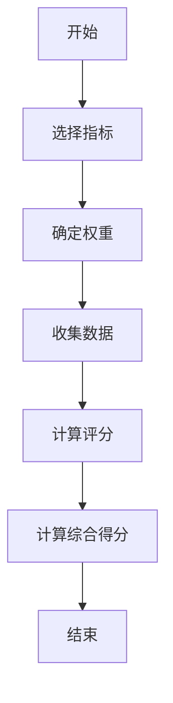

                 


# 彼得林奇对公司非财务指标的重要性评估

> 关键词：非财务指标，彼得·林奇，投资评估，企业价值，指标分析

> 摘要：本文深入探讨了彼得·林奇对公司非财务指标的重要性的独特见解，分析了非财务指标在投资决策中的关键作用，并通过具体的数学模型和算法，展示了如何通过非财务指标评估企业价值。文章结合实际案例和系统架构设计，详细讲解了非财务指标的分类、评估方法及其在不同行业中的应用。

---

## 第一部分: 非财务指标的基本概念与背景

### 第1章: 非财务指标的基本概念与背景

#### 1.1 非财务指标的定义与特点

##### 1.1.1 非财务指标的核心概念
非财务指标是指那些不能直接通过财务报表获取，但能够反映企业经营状况、市场竞争力、管理效率等重要信息的指标。这些指标通常包括企业战略、创新能力、客户满意度、员工稳定性、品牌影响力等。

##### 1.1.2 非财务指标与财务指标的区别
| 属性 | 非财务指标 | 财务指标 |
|------|------------|----------|
| 数据来源 | 内部数据，如战略文档、管理报告 | 财务报表，如利润表、资产负债表 |
| 数据类型 | 主观性较强，如企业文化、员工满意度 | 客观性较强，如收入、利润 |
| 应用场景 | 评估企业长期发展潜力 | 评估企业短期财务健康状况 |

##### 1.1.3 非财务指标在投资分析中的作用
非财务指标能够帮助投资者更全面地了解企业的内在价值，尤其是在评估企业的长期发展潜力和竞争优势时，非财务指标往往比财务指标更具参考价值。

---

#### 1.2 彼得·林奇的投资理念与非财务指标

##### 1.2.1 彼得·林奇的投资策略概述
彼得·林奇是全球著名的投资专家，他强调投资不仅仅是对数字的分析，更是对企业基本面的深入研究。他认为，企业的长期价值不仅仅体现在财务数据上，还需要关注企业的管理能力、市场地位、创新能力等因素。

##### 1.2.2 非财务指标在彼得·林奇投资决策中的重要性
在彼得·林奇的投资体系中，非财务指标占据着重要地位。他认为，企业的非财务指标能够更好地反映企业的核心竞争力和未来的成长潜力。例如，企业的产品创新能力、市场占有率、管理团队的稳定性等都是他重点关注的指标。

##### 1.2.3 非财务指标与企业长期价值的关系
非财务指标是企业长期价值的重要组成部分。一个企业可能拥有良好的财务数据，但如果缺乏创新能力和市场竞争力，其长期价值仍然有限。因此，非财务指标能够帮助投资者更准确地评估企业的长期发展潜力。

---

#### 1.3 非财务指标的分类与应用场景

##### 1.3.1 非财务指标的主要分类
非财务指标可以分为以下几类：
- **企业战略类**：如企业愿景、使命、战略目标等。
- **运营管理类**：如生产效率、供应链管理、库存周转率等。
- **市场竞争力类**：如市场份额、品牌影响力、客户忠诚度等。
- **创新与研发类**：如研发投入占比、新产品推出频率、专利数量等。
- **组织与文化类**：如员工满意度、管理团队稳定性、企业文化的凝聚力等。

##### 1.3.2 不同行业中的非财务指标应用
不同行业对非财务指标的重视程度有所不同。例如，在科技行业，创新能力和研发能力是最重要的非财务指标；而在制造业，生产效率和供应链管理则是关键指标。

##### 1.3.3 非财务指标的局限性与适用场景
非财务指标虽然重要，但也存在一些局限性。例如，非财务指标往往缺乏客观性，难以量化；而且，不同企业的非财务指标可能差异较大，难以直接比较。因此，在使用非财务指标时，需要结合企业的具体情况进行分析。

---

#### 1.4 本章小结
本章主要介绍了非财务指标的基本概念、特点以及其在投资分析中的作用。同时，详细阐述了彼得·林奇的投资理念，并分析了非财务指标的分类与应用场景。通过本章的学习，读者可以初步了解非财务指标的重要性及其在投资决策中的应用。

---

### 第2章: 非财务指标的核心概念与联系

#### 2.1 非财务指标的核心要素

##### 2.1.1 企业战略目标与非财务指标的关系
企业的战略目标是其长期发展的方向，而非财务指标则是实现战略目标的重要工具。例如，如果企业的战略目标是成为行业领导者，那么市场份额、品牌影响力等非财务指标就是其实现目标的关键因素。

##### 2.1.2 企业运营效率的非财务指标衡量
运营效率是衡量企业非财务指标的重要方面。例如，企业可以通过分析其生产周期、库存周转率、供应链效率等指标，来评估其运营效率。

##### 2.1.3 企业创新能力的非财务指标评估
创新能力是企业在竞争中保持优势的关键。非财务指标可以通过新产品推出频率、研发投入占比、专利数量等指标来评估企业的创新能力。

---

#### 2.2 非财务指标的属性特征对比

##### 2.2.1 表格对比：非财务指标与财务指标的属性特征
| 属性 | 非财务指标 | 财务指标 |
|------|------------|----------|
| 数据来源 | 内部数据 | 财务报表 |
| 数据类型 | 主观性较强 | 客观性较强 |
| 应用场景 | 长期发展潜力 | 短期财务状况 |

##### 2.2.2 图表分析：非财务指标的维度权重
以下是一个非财务指标的维度权重分析图：


---

#### 2.3 ER实体关系图架构

##### 2.3.1 非财务指标的实体关系分析
以下是一个非财务指标的实体关系图：

```mermaid
erDiagram
    投资者 --> 企业 : 评估
    企业 --> 指标 : 包含
    指标 --> 属性 : 具有
    属性 --> 值 : 等于
```

---

#### 2.4 本章小结
本章详细分析了非财务指标的核心要素及其属性特征，并通过对比和图表的方式，展示了非财务指标在企业运营中的重要性。同时，通过ER图的方式，清晰地展示了非财务指标的实体关系。

---

### 第3章: 非财务指标的评估算法原理

#### 3.1 非财务指标评估的数学模型

##### 3.1.1 非财务指标的加权评分法
加权评分法是一种常用的非财务指标评估方法。其基本原理是将各个非财务指标赋予不同的权重，然后根据每个指标的评分结果，计算出综合得分。

公式如下：
$$
\text{综合得分} = \sum (\text{指标权重} \times \text{指标评分})
$$

##### 3.1.2 层次分析法（AHP）在非财务指标评估中的应用
层次分析法是一种基于层次结构的决策分析方法。其基本步骤包括：构建层次模型、确定各层指标的权重、计算综合得分。

层次模型如下：
```
目标层 -> 准则层 -> 方案层
```

##### 3.1.3 模糊综合评价法在非财务指标评估中的应用
模糊综合评价法是一种用于处理模糊性问题的评价方法。其基本步骤包括：建立评价指标体系、确定各指标的权重、构建模糊评价矩阵、计算综合评价结果。

---

#### 3.2 算法原理的 Mermaid 流程图

##### 3.2.1 加权评分法的流程图



---

#### 3.3 本章小结
本章详细介绍了非财务指标评估的数学模型，包括加权评分法、层次分析法和模糊综合评价法。通过 Mermaid 流程图的方式，清晰地展示了这些算法的应用步骤。

---

## 第二部分: 非财务指标的系统分析与架构设计

### 第4章: 系统分析与架构设计方案

#### 4.1 问题场景介绍
本文将构建一个基于非财务指标的企业价值评估系统，帮助投资者更好地分析企业的长期发展潜力。

#### 4.2 系统功能设计

##### 4.2.1 领域模型 mermaid 类图


#### 4.3 系统架构设计 mermaid 架构图


---

## 第三部分: 项目实战与最佳实践

### 第5章: 项目实战

#### 5.1 环境配置与数据收集
- 环境：Python 3.8+
- 数据收集：从企业公开报告中获取非财务指标数据。

#### 5.2 核心实现源代码
以下是一个基于加权评分法的非财务指标评估代码示例：

```python
def calculate_weighted_score(criteria_weights, criteria_scores):
    return sum(w * s for w, s in zip(criteria_weights, criteria_scores))

# 示例数据
criteria_weights = [0.3, 0.2, 0.1, 0.2, 0.2]
criteria_scores = [0.8, 0.7, 0.6, 0.9, 0.5]

# 计算综合得分
score = calculate_weighted_score(criteria_weights, criteria_scores)
print(f"综合得分: {score}")
```

#### 5.3 案例分析与结果解读
以某科技公司为例，计算其非财务指标的综合得分，评估其长期发展潜力。

---

### 第6章: 最佳实践

#### 6.1 小结
非财务指标是评估企业长期价值的重要工具，投资者需要结合企业的具体情况进行综合分析。

#### 6.2 注意事项
- 非财务指标的评估需要结合企业的行业特点。
- 非财务指标的权重设置需要根据实际情况调整。
- 非财务指标的评估结果需要与财务指标结合分析。

#### 6.3 拓展阅读
建议读者进一步阅读彼得·林奇的《彼得·林奇的成功投资》一书，深入理解其投资理念。

---

## 作者：AI天才研究院/AI Genius Institute & 禅与计算机程序设计艺术 /Zen And The Art of Computer Programming

