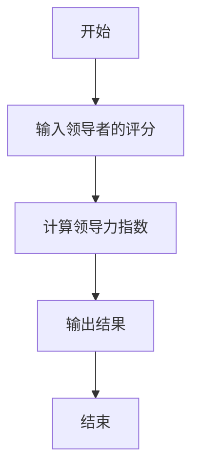
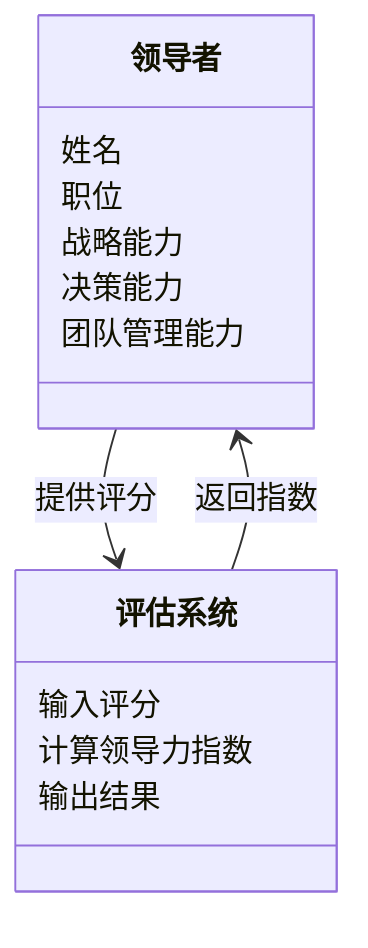

                 


# 彼得林奇对公司领导力的评估方法

> 关键词：领导力评估、彼得林奇、投资分析方法、系统设计、项目实战

> 摘要：本文将详细探讨彼得·林奇对公司领导力的评估方法，从背景介绍、核心概念、算法原理、系统分析、项目实战到最佳实践，结合丰富的案例和详细的步骤，帮助读者全面理解并掌握这一方法。

---

## 第一部分: 背景介绍

### 第1章: 领导力评估的重要性

#### 1.1 领导力在企业中的核心作用
领导力是企业成功的关键因素之一。有效的领导者能够制定战略、激励团队、应对挑战，并带领组织走向成功。在现代商业环境中，领导力的评估变得尤为重要，因为它直接影响企业的绩效和可持续发展。

#### 1.2 领导力评估的必要性
- 领导力评估能够帮助企业识别优秀领导者，优化管理结构。
- 通过评估，企业可以为领导者提供有针对性的培训，提升整体领导能力。
- 在人才招聘和晋升中，领导力评估能够帮助企业做出更明智的决策。

#### 1.3 彼得林奇评估方法的独特性
彼得·林奇作为著名的投资家，他的领导力评估方法结合了投资分析的逻辑，注重领导者的战略思维、决策能力和团队管理能力。这种方法不仅关注领导者的能力，还关注其对企业发展目标的贡献。

---

### 第2章: 彼得林奇的领导力评估方法

#### 2.1 方法的起源与背景
彼得·林奇在投资领域有着丰富的经验，他将投资分析的方法应用到领导力评估中。这种方法的核心在于通过分析领导者的决策和行动，评估其对企业价值的贡献。

#### 2.2 方法的核心思想
- 领导力评估不仅仅是对个人能力的评价，更是对领导者为企业创造价值的评估。
- 强调领导者的战略眼光和执行能力，注重其在关键时刻的决策能力。

#### 2.3 方法的适用范围与边界
- 适用于企业高管和团队领导的评估。
- 更适合评估那些在关键岗位上、能够影响企业战略方向的领导者。

---

## 第二部分: 核心概念与联系

### 第3章: 核心概念原理

#### 3.1 领导力的定义与分类
- 领导力是通过影响力影响他人行为的能力。
- 分为变革型领导力和交易型领导力，彼得林奇的方法更偏向于变革型领导力。

#### 3.2 彼得林奇评估方法的理论基础
- 基于投资分析的逻辑，将领导者视为企业价值的创造者。
- 强调领导者对企业战略目标的实现能力和对团队的激励能力。

#### 3.3 核心概念的数学模型
彼得林奇评估方法的核心概念可以用以下公式表示：
$$
\text{领导力指数} = \text{战略能力} \times \text{决策能力} \times \text{团队管理能力}
$$

---

### 第4章: 核心概念属性特征对比表格

| 领导力维度     | 彼得林奇评估方法的特征 |
|----------------|------------------------|
| 战略能力       | 评估领导者对企业长期目标的规划能力 |
| 决策能力       | 评估领导者在关键时刻的决策能力 |
| 团队管理能力   | 评估领导者对团队的激励和协调能力 |
| 适应能力       | 评估领导者在变化环境中的应变能力 |

---

### 第5章: ER实体关系图架构

```mermaid
erd
  统一建模语言(UML)类图
  类：领导者
  属性：姓名、职位、战略能力、决策能力、团队管理能力
  关系：评估结果（关联评估维度）
```

---

## 第三部分: 算法原理讲解

### 第6章: 算法原理概述

#### 6.1 算法的输入与输出
- 输入：领导者的战略能力、决策能力、团队管理能力的评分。
- 输出：领导力指数。

#### 6.2 算法的步骤与流程


---

### 第7章: 算法的数学模型与公式

彼得林奇评估方法的数学模型如下：
$$
\text{领导力指数} = 0.4 \times \text{战略能力} + 0.3 \times \text{决策能力} + 0.3 \times \text{团队管理能力}
$$

---

### 第8章: 算法的实现与代码示例

#### 8.1 Python代码实现
```python
def leadership_index(strategic_ability, decision_making, team_management):
    return 0.4 * strategic_ability + 0.3 * decision_making + 0.3 * team_management

# 示例
strategic_ability = 85
decision_making = 90
team_management = 80
index = leadership_index(strategic_ability, decision_making, team_management)
print(f"领导力指数为：{index}")
```

#### 8.2 代码解读
- 输入：战略能力、决策能力和团队管理能力的评分（满分100）。
- 输出：领导力指数，指数越高，表示领导能力越强。

---

## 第四部分: 系统分析与架构设计方案

### 第9章: 问题场景介绍

#### 9.1 问题背景
企业在评估领导者时，需要一个系统化的方法来量化领导者的价值。

#### 9.2 问题目标
设计一个基于彼得林奇方法的领导力评估系统，实现领导者能力的量化评估。

---

### 第10章: 项目介绍

#### 10.1 项目目标
开发一个领导力评估系统，支持战略能力、决策能力和团队管理能力的评分，并计算领导力指数。

#### 10.2 项目范围
- 系统设计：包括用户界面、评分模块和结果展示模块。
- 数据输入：战略能力、决策能力和团队管理能力评分。
- 数据输出：领导力指数。

---

### 第11章: 系统功能设计

#### 11.1 领域模型设计


---

### 第12章: 系统架构设计


---

## 第五部分: 项目实战

### 第13章: 环境安装与系统核心实现

#### 13.1 环境安装
- 安装Python和相关开发工具。
- 安装数据可视化库（如Matplotlib）。

#### 13.2 系统核心实现
```python
# 领导力评估系统
def calculate_leadership_index(strategic, decision, management):
    return 0.4 * strategic + 0.3 * decision + 0.3 * management

strategic = float(input("请输入战略能力评分："))
decision = float(input("请输入决策能力评分："))
management = float(input("请输入团队管理能力评分："))

index = calculate_leadership_index(strategic, decision, management)
print(f"领导力指数为：{index}")
```

---

## 第六部分: 最佳实践与小结

### 第14章: 最佳实践 tips

#### 14.1 小结
- 彼得林奇的领导力评估方法是一种有效的工具，能够帮助企业量化领导者的价值。
- 通过系统化的方法和工具，可以更科学地评估领导力。

#### 14.2 注意事项
- 评估结果仅供参考，需结合实际情况综合考虑。
- 在实际应用中，建议结合其他评估方法进行综合评估。

#### 14.3 拓展阅读
- 推荐阅读彼得·林奇的相关书籍，深入了解其投资分析方法。
- 参考其他领导力评估模型，如盖洛普领导力评估模型。

---

## 第七部分: 案例分析与总结

### 第15章: 案例分析

#### 15.1 案例背景
某公司CEO的战略能力评分为90，决策能力评分为85，团队管理能力评分为80。

#### 15.2 评估结果
领导力指数 = 0.4 × 90 + 0.3 × 85 + 0.3 × 80 = 36 + 25.5 + 24 = 85.5

#### 15.3 结果解读
领导力指数为85.5，属于较高水平，表明该CEO在战略能力和决策能力方面表现优秀，团队管理能力还有提升空间。

---

## 第八部分: 总结

彼得林奇的领导力评估方法为企业提供了一种科学的领导者评估工具。通过结合投资分析的逻辑，这种方法能够帮助企业识别和培养优秀的领导者，从而提升企业的整体绩效。希望本文能够为读者在领导力评估领域提供有价值的参考。

---

**作者：AI天才研究院/AI Genius Institute & 禅与计算机程序设计艺术/Zen And The Art of Computer Programming**

