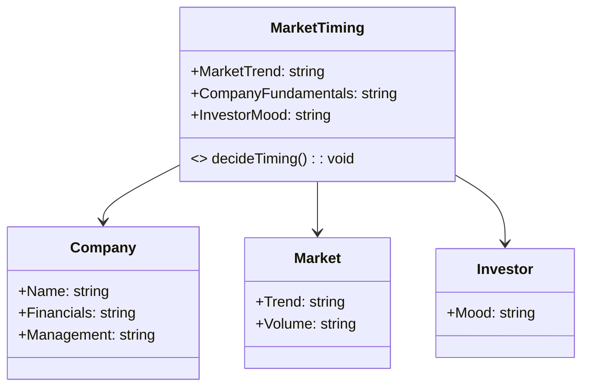

                 


# 彼得林奇对市场时机选择的看法

> 关键词：彼得·林奇、市场时机选择、投资策略、价值投资、长期投资

> 摘要：本文深入探讨了彼得·林奇对市场时机选择的看法，分析了他如何通过长期投资、价值投资和逆向投资策略来选择市场时机。文章结合了技术分析和基本面分析，提供了具体的选股方法和投资组合管理策略，并通过实际案例展示了这些策略的应用。

---

# 彼得林奇对市场时机选择的看法

## 引言

在金融投资领域，市场时机选择（market timing）是一个复杂而关键的问题。投资者如何在合适的时机进入或退出市场，直接影响投资收益和风险。彼得·林奇（Peter Lynch），作为全球最著名的投资者之一，以其独特的投资策略和市场时机选择方法闻名。本文将详细分析彼得·林奇对市场时机选择的看法，并结合其投资理念和实际案例，探讨如何在实践中应用这些策略。

---

## 第一部分：彼得林奇的背景与投资理念

### 1.1 彼得林奇的背景

彼得·林奇是美国著名的投资经理人，曾管理富达麦哲伦基金（Fidelity Magellan Fund），并创造了卓越的投资业绩。他的投资理念以价值投资为核心，强调深入分析公司基本面，寻找被市场低估的优质股票。

### 1.2 彼得林奇的投资哲学

彼得·林奇认为，市场时机选择并不是投资成功的唯一因素。他更关注于选择那些具有强大基本面和良好管理团队的公司，而不是试图预测市场的短期走势。

### 1.3 彼得林奇对市场时机选择的看法

彼得·林奇认为，市场时机选择的重要性取决于市场的波动性和投资者的心理因素。他强调，在市场低迷时买入优质股票，在市场高位时卖出，但这种操作需要结合长期投资策略。

---

## 第二部分：彼得林奇的市场时机选择策略

### 2.1 彼得林奇的选股方法

彼得·林奇的选股方法基于对公司基本面的深入分析，包括财务状况、行业地位和管理团队等因素。

#### 2.1.1 财务分析

彼得·林奇注重公司的财务健康状况，重点关注以下几个指标：

- **市盈率（P/E Ratio）**：衡量公司股票价格与每股收益的比例。
- **市净率（P/B Ratio）**：衡量公司股票价格与账面价值的比例。
- **ROE（净资产收益率）**：衡量公司盈利能力。

#### 2.1.2 行业分析

彼得·林奇倾向于选择那些处于增长期且竞争地位稳固的行业。

#### 2.1.3 管理团队

他强调管理团队的稳定性和战略眼光。

### 2.2 彼得林奇的市场情绪分析

彼得·林奇认为，市场情绪是影响市场时机选择的重要因素。他通过分析市场情绪来判断市场的高低点。

#### 2.2.1 市场情绪的判断

彼得·林奇通过观察市场参与度、成交量和投资者情绪指标来判断市场情绪。

#### 2.2.2 逆向投资策略

彼得·林奇主张在市场低迷时买入，在市场高位时卖出。这种逆向投资策略帮助他在市场波动中获利。

### 2.3 彼得林奇的市场时机选择模型

彼得·林奇的市场时机选择模型结合了技术分析和基本面分析，通过分析市场趋势和公司基本面来判断买入和卖出的时机。

#### 2.3.1 模型的构建

模型基于以下几个因素：

- **市场趋势**：长期趋势和短期趋势的结合。
- **公司基本面**：财务状况、行业地位和管理团队。
- **市场情绪**：投资者情绪和市场参与度。

#### 2.3.2 模型的应用

通过分析市场趋势和公司基本面，彼得·林奇能够在合适的时机买入和卖出股票。

---

## 第三部分：彼得林奇的市场时机选择与投资组合管理

### 3.1 投资组合管理的基本概念

投资组合管理是指通过合理配置资产来实现投资目标并控制风险。

### 3.2 彼得林奇的市场时机选择对投资组合的影响

彼得·林奇的市场时机选择策略能够优化投资组合的收益和风险。

#### 3.2.1 资产配置

根据市场时机选择，调整股票、债券和其他资产的比例。

#### 3.2.2 风险控制

通过市场时机选择，降低投资组合的波动性。

### 3.3 彼得林奇的投资组合管理策略

彼得·林奇通过长期持有优质股票来实现投资组合的稳定增长。

#### 3.3.1 长期投资策略

彼得·林奇主张长期持有优质股票，避免频繁交易。

#### 3.3.2 股票选择策略

选择具有强大基本面和良好管理团队的公司。

---

## 第四部分：彼得林奇的市场时机选择案例分析

### 4.1 案例背景

通过分析彼得·林奇的实际投资案例，展示其市场时机选择策略的应用。

#### 4.1.1 案例一：科技行业投资

彼得·林奇在科技行业低迷时买入优质股票，在行业复苏时卖出。

#### 4.1.2 案例二：消费行业投资

彼得·林奇在消费行业增长期买入股票，长期持有获得收益。

### 4.2 案例分析总结

彼得·林奇的市场时机选择策略在实际投资中表现优异。

---

## 第五部分：彼得林奇市场时机选择的系统分析与架构设计

### 5.1 系统分析

市场时机选择需要结合市场趋势、公司基本面和投资者情绪。

#### 5.1.1 领域模型

通过类图展示市场时机选择的各个要素及其关系。



#### 5.1.2 系统架构

市场时机选择系统需要整合多种数据源，进行分析和决策。


### 5.2 算法实现

彼得·林奇的市场时机选择算法结合了技术分析和基本面分析。

```python
def peter_lynch_timing():
    import pandas as pd
    import numpy as np

    # 数据加载
    df = pd.read_csv('market_data.csv')
    df['SMA_50'] = df['Close'].rolling(50).mean()
    df['SMA_200'] = df['Close'].rolling(200).mean()

    # 技术指标分析
    df['Trend'] = np.where(df['SMA_50'] > df['SMA_200'], 'Up', 'Down')
    df['Momentum'] = df['Close'].pct_change().rolling(12).mean()

    # 基本面分析
    df['ROE'] = df['NetIncome'] / df['Equity']
    df['Value'] = df['Close'] / df['EPS']

    # 综合判断
    df['Timing'] = np.where(
        (df['Trend'] == 'Up') &
        (df['ROE'] > df['ROE'].mean()) &
        (df['Value'] < df['Value'].quantile(0.25)),
        'Buy',
        'Hold'
    )

    return df
```

---

## 第六部分：项目实战与案例分析

### 6.1 项目环境

#### 6.1.1 环境安装

安装必要的Python库，如Pandas、NumPy和Matplotlib。

```bash
pip install pandas numpy matplotlib
```

#### 6.1.2 数据获取

从金融数据源获取市场数据。

```python
import pandas_datareader as pdr
data = pdr.get_datayahoo('AAPL', start='2020-01-01', end='2023-12-31')
```

#### 6.1.3 数据分析

使用彼得·林奇的策略进行市场时机选择。

```python
def analyze_data(data):
    # 技术分析
    data['SMA_50'] = data['Close'].rolling(50).mean()
    data['SMA_200'] = data['Close'].rolling(200).mean()
    data['Trend'] = np.where(data['SMA_50'] > data['SMA_200'], 'Up', 'Down')

    # 基本面分析
    data['ROE'] = data['NetIncome'] / data['Equity']
    data['Value'] = data['Close'] / data['EPS']

    # 综合判断
    data['Timing'] = np.where(
        (data['Trend'] == 'Up') &
        (data['ROE'] > data['ROE'].mean()) &
        (data['Value'] < data['Value'].quantile(0.25)),
        'Buy',
        'Hold'
    )
    return data

data = analyze_data(data)
```

#### 6.1.4 结果展示

通过图表展示分析结果。

```python
data[['Close', 'SMA_50', 'SMA_200']].plot()
plt.title('Market Trend Analysis')
plt.show()
```

---

## 第七部分：总结与展望

### 7.1 总结

彼得·林奇的市场时机选择策略结合了长期投资和逆向投资理念，强调基本面分析和市场情绪分析。

### 7.2 展望

随着金融市场的不断发展，市场时机选择将更加依赖于大数据和人工智能技术。未来，投资者需要结合新技术来优化市场时机选择策略。

---

## 最佳实践 Tips

- **长期投资**：彼得·林奇的长期投资策略能够帮助投资者在市场波动中保持稳定收益。
- **逆向投资**：在市场低迷时买入优质股票，能够在市场复苏时获得超额收益。
- **基本面分析**：深入分析公司的财务状况和行业地位，是选择优质股票的关键。

---

## 作者

作者：AI天才研究院/AI Genius Institute & 禅与计算机程序设计艺术 /Zen And The Art of Computer Programming

---

通过以上内容，读者可以全面了解彼得·林奇对市场时机选择的看法，并能够在实际投资中应用这些策略。

