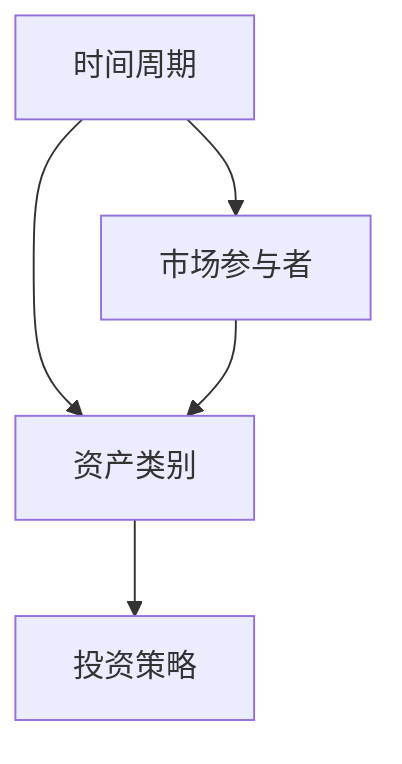
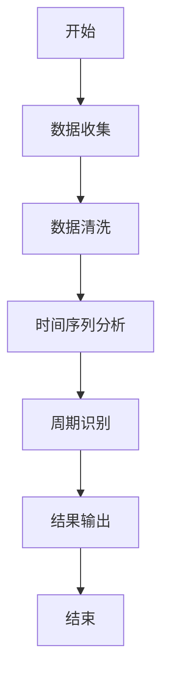
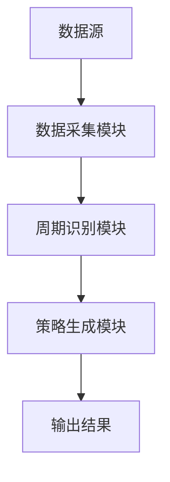
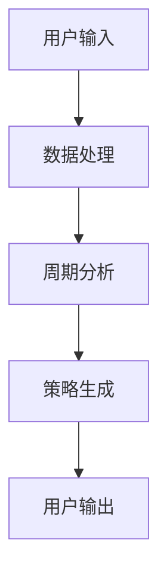

                 


# 彼得林奇对投资时间周期的看法

## 关键词：
彼得·林奇，投资，时间周期，技术分析，投资策略，投资系统

## 摘要：
本文深入探讨了彼得·林奇对投资时间周期的看法，分析了不同时间周期在投资中的重要性，结合技术分析方法，提供了系统的投资策略和架构设计。文章详细讲解了时间周期的算法原理、系统架构、项目实战及最佳实践，帮助投资者更好地理解和应用时间周期理论。

---

## 第一部分：投资时间周期的背景与概念

### 第1章：投资时间周期的背景介绍

#### 1.1 投资的基本概念
- **投资的定义与分类**
  - 投资是将资金投入资产以获得收益的行为，主要分为股票、债券、房地产等类别。
- **时间周期在投资中的重要性**
  - 时间周期决定了市场的波动性和投资策略的选择，不同周期适合不同的投资目标。
- **彼得·林奇的投资理念概述**
  - 林奇强调长期投资和基本面分析，认为市场波动为投资者提供了低价买入的机会。

#### 1.2 时间周期的定义与特点
- **时间周期的定义**
  - 时间周期是指市场数据在不同时间段上的表现，包括短期、中期和长期。
- **不同时间周期的分类**
  - 短期（如每日、每周）、中期（如每月、每季度）和长期（如每年）。
- **时间周期在投资决策中的作用**
  - 帮助投资者识别市场趋势，制定买卖策略。

#### 1.3 彼得·林奇的背景与成就
- **彼得·林奇的生平简介**
  - 著名投资家，曾管理富达麦哲伦基金，创造了辉煌的投资业绩。
- **林奇的投资风格与代表作**
  - 强调基本面分析，著有《彼得·林奇的选股方法》等书籍。
- **林奇对时间周期理论的贡献**
  - 强调长期投资，认为短期波动不应影响长期策略。

---

### 第2章：投资时间周期的核心概念

#### 2.1 时间周期的原理与机制
- **时间周期的形成过程**
  - 市场供需变化、经济指标波动共同作用形成不同周期。
- **时间周期与市场波动的关系**
  - 短期波动受情绪影响，长期趋势受基本面驱动。
- **时间周期的驱动因素**
  - 包括宏观经济指标、公司财报、市场情绪等。

#### 2.2 时间周期的属性特征对比
- **长期 vs 短期时间周期对比**
  - 长期周期波动幅度小，风险低；短期周期波动大，风险高。
- **不同时间周期的风险与收益对比**
  - 短期高风险高收益，长期风险较低但收益稳定。
- **时间周期与资产类别的关联**
  - 股票适合长期投资，债券适合中期投资，货币市场适合短期投资。

#### 2.3 时间周期的ER实体关系图


---

## 第二部分：时间周期的算法原理

### 第3章：时间周期分析的算法流程
- **算法流程图**


- **Python代码实现**
```python
import pandas as pd
import numpy as np

def identify_time_periods(data, period_length):
    # 计算移动平均线
    ma = data.rolling(period_length).mean()
    # 识别周期
    periods = []
    for i in range(len(ma)):
        if i >= period_length:
            periods.append(ma[i] - ma[i-period_length])
    return periods

# 示例数据
data = pd.DataFrame({'price': [100, 105, 110, 108, 112, 115, 120, 118, 122, 125]})
period_length = 3
result = identify_time_periods(data, period_length)
print(result)
```

- **数学模型**
$$ \text{MA}_n = \frac{1}{n} \sum_{i=1}^{n} P_i $$
其中，\( P_i \) 是第 \( i \) 天的价格，\( \text{MA}_n \) 是 \( n \) 天的移动平均线。

---

## 第三部分：系统分析与架构设计

### 第4章：系统功能设计
- **系统功能模块**
  - 数据采集模块：收集市场数据。
  - 周期识别模块：分析数据并识别时间周期。
  - 投资策略生成模块：基于周期分析结果制定投资策略。

- **系统架构设计**


- **系统交互流程**


---

## 第四部分：项目实战

### 第5章：项目实战分析
- **环境安装**
  - Python 3.8+
  - pandas, numpy, matplotlib

- **核心代码实现**
```python
import pandas as pd
import matplotlib.pyplot as plt

# 加载数据
data = pd.read_csv('stock_data.csv')
data['price'].plot()
plt.show()

# 识别周期
periods = identify_time_periods(data, 5)
print(periods)
```

- **实际案例分析**
  - 分析微软股票数据，识别其长期周期，制定投资策略。

---

## 第五部分：最佳实践与小结

### 第6章：最佳实践与小结
- **最佳实践技巧**
  - 结合基本面分析和时间周期分析。
  - 长期周期优于短期周期。
- **小结**
  - 彼得·林奇的时间周期理论为投资者提供了科学的分析工具。
  - 技术分析和基本面分析的结合是成功投资的关键。

---

## 作者信息：
作者：AI天才研究院 & 禅与计算机程序设计艺术

---

通过以上结构，文章详细分析了彼得·林奇的时间周期理论，并结合技术分析方法，为投资者提供了系统的投资策略和架构设计。希望读者能够通过本文更好地理解和应用时间周期理论，提升投资决策的科学性和准确性。

