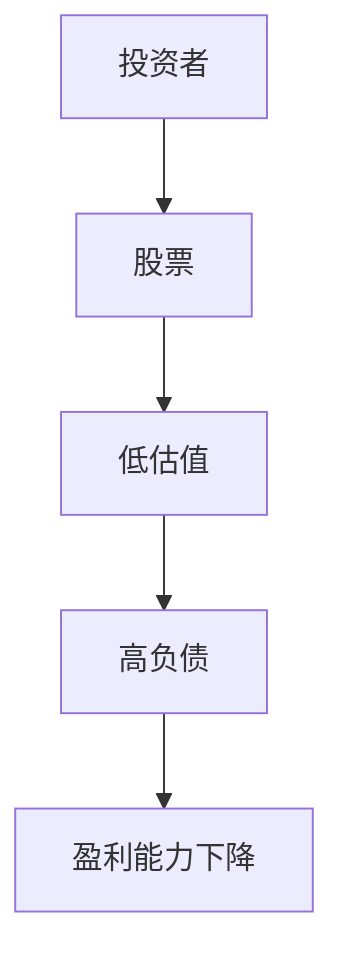
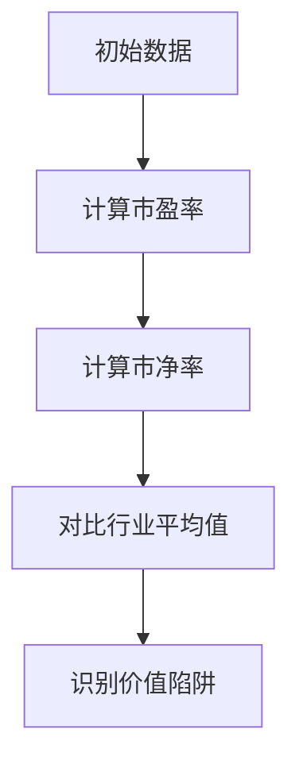
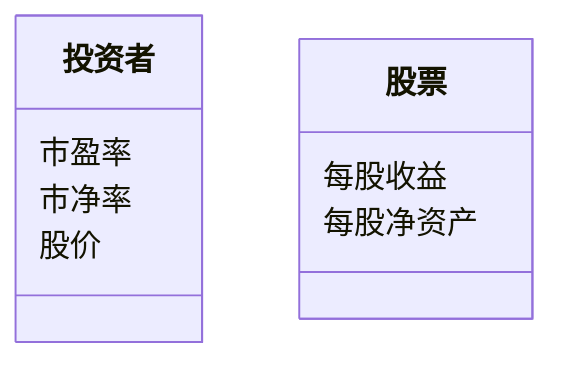
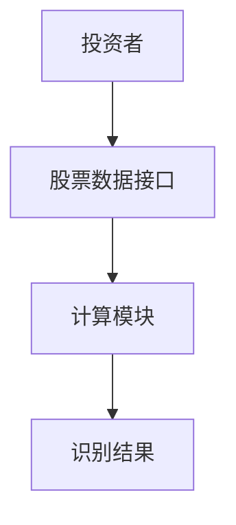

                 


# 彼得林奇的"价值陷阱"在新兴科技股中的识别

> 关键词：彼得林奇、价值陷阱、新兴科技股、财务指标、投资分析

> 摘要：本文将深入探讨彼得林奇的价值陷阱理论在新兴科技股中的应用，通过分析新兴科技股的特点、财务指标、数学模型、系统架构设计及项目实战，帮助投资者识别潜在的价值陷阱，避免投资风险。

---

## 第一部分: 价值陷阱的定义与核心概念

### 第1章: 价值陷阱的定义与核心概念

#### 1.1 价值陷阱的定义
价值陷阱是彼得林奇在其投资理论中提出的一个重要概念，指的是那些看似估值较低（如低市盈率、低市净率），但实际上存在严重问题（如盈利能力下降、高负债、管理问题等）的股票。这些股票表面上看起来有吸引力，但实际上可能隐藏着巨大的风险。

##### 1.1.1 价值陷阱的背景与问题背景
在股票投资中，投资者常常追求低估值的股票，认为这些股票具有上涨潜力。然而，一些股票之所以估值低，可能是因为其基本面存在问题，这些问题可能导致股票价格进一步下跌。这种股票就是价值陷阱。

##### 1.1.2 价值陷阱的核心概念
价值陷阱的核心在于识别那些表面上看似便宜，但实际上存在严重问题的股票。这些问题可能包括：
- **盈利能力下降**：公司净利润持续下滑。
- **高负债率**：公司债务过高，财务风险大。
- **管理问题**：公司管理层存在重大问题。
- **行业竞争加剧**：公司在行业内失去竞争优势。

##### 1.1.3 价值陷阱的边界与外延
价值陷阱的识别需要结合公司基本面分析和行业趋势分析。其边界在于如何平衡估值与风险，外延则包括如何通过财务指标和行业数据分析来识别这些陷阱。

#### 1.2 价值陷阱的核心要素
##### 1.2.1 价值陷阱的关键属性对比
下表对比了正常股票和价值陷阱股票的关键属性：

| 属性                | 正常股票               | 价值陷阱股票            |
|---------------------|------------------------|-------------------------|
| 市盈率（P/E）        | 高或适中              | 低                      |
| 市净率（P/B）        | 高或适中              | 低                      |
| 净利润增长率          | 正增长或稳定          | 下降或亏损             |
| 负债率              | 适中                  | 高                      |
| 管理团队稳定性        | 稳定                  | 不稳定或频繁变动        |

##### 1.2.2 价值陷阱的ER实体关系图


---

## 第二部分: 新兴科技股的特点与挑战

### 第2章: 新兴科技股的特点与挑战

#### 2.1 新兴科技股的定义与分类
##### 2.1.1 新兴科技股的定义
新兴科技股指的是那些在新兴科技领域（如人工智能、大数据、区块链、云计算等）具有较高成长性的公司股票。这些公司通常处于成长期，具有较高的市场潜力。

##### 2.1.2 新兴科技股的分类
- **技术驱动型**：依赖技术创新的公司（如人工智能公司）。
- **市场扩展型**：通过市场扩张实现增长的公司（如云计算服务提供商）。
- **模式创新型**：通过商业模式创新实现增长的公司（如互联网平台公司）。

##### 2.1.3 新兴科技股的市场特点
- **高波动性**：新兴科技股价格波动较大，容易受到市场情绪影响。
- **高增长潜力**：这些公司通常具有较高的增长潜力，但也伴随着较高的风险。
- **高估值**：由于市场对新兴科技股的高预期，这些股票通常估值较高。

#### 2.2 新兴科技股的财务指标分析
##### 2.2.1 新兴科技股的特殊性
与传统行业相比，新兴科技股的财务指标具有以下特殊性：
- **研发投入高**：新兴科技公司通常需要大量的研发投入。
- **收入波动大**：新兴科技公司收入可能波动较大，尤其是在市场扩张期和收缩期。
- **无形资产占比高**：新兴科技公司通常拥有大量的无形资产（如专利、技术）。

##### 2.2.2 新兴科技股的财务指标对比
下表对比了新兴科技股和传统行业股的财务指标：

| 指标                | 新兴科技股            | 传统行业股            |
|---------------------|-----------------------|-----------------------|
| 研发投入占收入比例  | 高（通常超过10%）    | 低（通常低于5%）      |
| 净利润增长率        | 高或波动大           | 稳定或低             |
| 负债率              | 中等或低             | 高或中等             |
| 市盈率              | 高                   | 适中或低             |

#### 2.3 新兴科技股的价值陷阱识别
##### 2.3.1 新兴科技股中的价值陷阱特征
在新兴科技股中，价值陷阱通常表现为：
- **高估值但无实质性增长**：公司估值高，但实际增长潜力有限。
- **研发投入不足**：公司研发投入占比低，难以维持技术优势。
- **管理团队不稳定**：公司管理层频繁变动，影响公司长期发展。
- **市场需求下降**：公司产品或服务的市场需求下降，导致收入减少。

##### 2.3.2 新兴科技股中的价值陷阱识别方法
结合彼得林奇的价值陷阱理论，新兴科技股的价值陷阱识别方法包括：
1. **财务指标分析**：通过市盈率、市净率、研发投入占比等指标判断公司是否存在问题。
2. **行业趋势分析**：分析行业发展趋势，判断公司是否具备长期竞争优势。
3. **管理层分析**：关注公司管理层的稳定性及管理能力。
4. **市场反馈分析**：通过市场对公司的反应（如股价波动、投资者情绪）判断公司是否存在潜在问题。

---

## 第三部分: 彼得林奇价值陷阱理论的数学模型

### 第3章: 价值陷阱识别的数学模型

#### 3.1 价值陷阱识别的数学模型
##### 3.1.1 财务指标计算公式
以下是常用的财务指标计算公式：

- 市盈率（P/E）：
$$P/E = \frac{股价}{每股收益}$$

- 市净率（P/B）：
$$P/B = \frac{股价}{每股净资产}$$

- 净利润增长率：
$$净利润增长率 = \frac{本期净利润 - 上期净利润}{上期净利润} \times 100\%$$

##### 3.1.2 价值陷阱识别的算法原理
下图展示了价值陷阱识别的算法流程：



---

## 第四部分: 系统分析与架构设计

### 第4章: 系统分析与架构设计

#### 4.1 系统功能设计
##### 4.1.1 领域模型
下图展示了价值陷阱识别系统的领域模型：



#### 4.2 系统架构设计
##### 4.2.1 系统架构图
下图展示了价值陷阱识别系统的架构设计：



---

## 第五部分: 项目实战

### 第5章: 项目实战

#### 5.1 环境安装
##### 5.1.1 安装Python
需要安装以下Python库：
- `pandas`：用于数据分析
- `numpy`：用于数值计算
- `matplotlib`：用于数据可视化
- `scrapy`：用于数据爬取（可选）

##### 5.1.2 安装数据分析库
安装以下库：
```bash
pip install pandas numpy matplotlib
```

#### 5.2 核心代码实现
##### 5.2.1 数据获取与处理
```python
import pandas as pd
import numpy as np

# 示例数据：假设我们从互联网获取新兴科技股的财务数据
# 这里简化为使用本地数据
data = {
    '公司': ['公司A', '公司B', '公司C'],
    '股价': [100, 80, 120],
    '每股收益': [10, 15, 20],
    '每股净资产': [50, 40, 60],
    '研发投入占比': [20, 15, 25],
    '净利润增长率': [10, 5, 15],
    '负债率': [60, 70, 50]
}

df = pd.DataFrame(data)
print(df)
```

##### 5.2.2 指标计算
```python
# 计算市盈率和市净率
df['市盈率'] = df['股价'] / df['每股收益']
df['市净率'] = df['股价'] / df['每股净资产']

print("市盈率计算结果：")
print(df['市盈率'])
print("\n市净率计算结果：")
print(df['市净率'])
```

##### 5.2.3 结果可视化
```python
import matplotlib.pyplot as plt

# 绘制市盈率和市净率的散点图
plt.scatter(df['市盈率'], df['市净率'], label='新兴科技股')
plt.xlabel('市盈率')
plt.ylabel('市净率')
plt.title('新兴科技股的市盈率与市净率关系')
plt.legend()
plt.show()
```

#### 5.3 案例分析
##### 5.3.1 案例一：公司A
- **市盈率**：100 / 10 = 10
- **市净率**：100 / 50 = 2
- **研发投入占比**：20%
- **净利润增长率**：10%
- **负债率**：60%

##### 5.3.2 案例二：公司B
- **市盈率**：80 / 15 ≈ 5.33
- **市净率**：80 / 40 = 2
- **研发投入占比**：15%
- **净利润增长率**：5%
- **负债率**：70%

##### 5.3.3 案例三：公司C
- **市盈率**：120 / 20 = 6
- **市净率**：120 / 60 = 2
- **研发投入占比**：25%
- **净利润增长率**：15%
- **负债率**：50%

---

## 第六部分: 最佳实践与总结

### 第6章: 最佳实践与总结

#### 6.1 实战案例分析
##### 6.1.1 案例一
公司A的市盈率为10，市净率为2，研发投入占比为20%，净利润增长率为10%，负债率为60%。根据价值陷阱识别方法，公司A的市盈率和市净率都较高，但研发投入占比和净利润增长率表现尚可，负债率也处于中等水平，暂时没有明显的价值陷阱特征。

##### 6.1.2 案例二
公司B的市盈率为5.33，市净率为2，研发投入占比为15%，净利润增长率为5%，负债率为70%。公司B的市盈率较低，但净利润增长率和研发投入占比都较低，负债率较高，存在较大的价值陷阱风险。

##### 6.1.3 案例三
公司C的市盈率为6，市净率为2，研发投入占比为25%，净利润增长率为15%，负债率为50%。公司C的市盈率和市净率都较低，但研发投入占比和净利润增长率较高，负债率适中，暂时没有明显的价值陷阱特征。

#### 6.2 小结与注意事项
##### 6.2.1 小结
通过以上分析可以看出，新兴科技股的价值陷阱识别需要结合公司基本面分析和行业趋势分析，重点关注公司的研发投入、净利润增长率、负债率等财务指标。

##### 6.2.2 注意事项
- **数据准确性**：确保数据来源可靠，避免因数据错误导致分析偏差。
- **行业差异**：不同行业的新兴科技股具有不同的特点，需结合行业特性进行分析。
- **动态调整**：市场环境和公司情况会不断变化，需动态调整分析方法和指标。

#### 6.3 拓展阅读
##### 6.3.1 进一步阅读的书籍
- 彼得·林奇《彼得林奇的投资哲学》
- 约翰·聂夫《防御性股票投资》

##### 6.3.2 相关研究领域
- 股票价值评估
- 风险投资策略
- 科技行业分析

---

## 结语

通过本文的分析，我们可以看到，彼得林奇的价值陷阱理论在新兴科技股中的应用需要结合公司的财务指标和行业趋势，重点关注公司的研发投入、净利润增长率、负债率等关键指标。投资者在进行新兴科技股投资时，需警惕那些看似估值低但实际存在严重问题的股票，避免陷入价值陷阱。

---

**作者：AI天才研究院/AI Genius Institute & 禅与计算机程序设计艺术 /Zen And The Art of Computer Programming**

