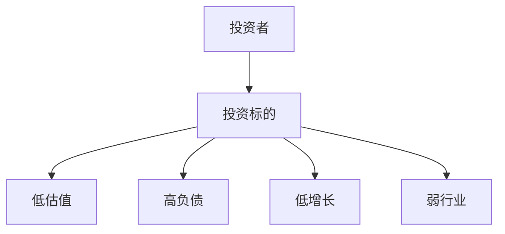
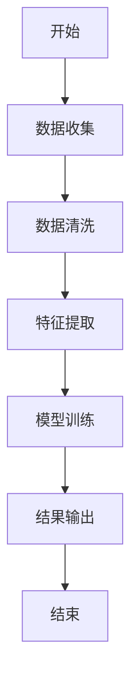

                 


# 彼得林奇的"价值陷阱"识别方法

> 关键词：价值陷阱，彼得林奇，价值投资，投资分析，风险管理

> 摘要：本文详细介绍了彼得·林奇的“价值陷阱”识别方法，从背景介绍、核心概念、算法原理、数学模型、系统分析与架构设计到项目实战，全面阐述了如何系统化识别和避免价值陷阱，帮助投资者在复杂市场中做出明智决策。

---

## 第一章: 价值陷阱识别方法的背景介绍

### 1.1 价值投资的基本概念

#### 1.1.1 价值投资的定义与核心理念
价值投资是一种投资策略，强调以低于内在价值的价格购买优质资产。其核心理念是寻找市场先生的错误定价，通过长期持有优质资产实现财富增长。

#### 1.1.2 价值投资的历史与发展
价值投资起源于20世纪初，由本杰明·格雷厄姆和戴维·多德提出。彼得·林奇作为格雷厄姆的忠实追随者，进一步发展了这一理论，提出了“彼得林奇法则”。

#### 1.1.3 价值投资在现代投资中的地位
在现代投资学中，价值投资与成长投资并列，成为两大主流投资策略。价值投资注重安全边际和风险控制，适合稳健型投资者。

### 1.2 彼得·林奇的介绍

#### 1.2.1 彼得·林奇的生平简介
彼得·林奇是美国著名投资经理人，曾任富达麦哲伦基金的经理，创造了年化22%的平均回报率。他的投资哲学以稳健著称，强调深入研究和风险控制。

#### 1.2.2 彼得·林奇的投资理念
林奇的投资理念包括：关注基本面、寻找烟蒂股、分散投资、长期持有。他强调避免情绪化投资，注重公司财务健康和行业前景。

#### 1.2.3 彼得·林奇的经典投资案例
林奇成功投资了像Home Depot和Limited这样的公司，通过深入研究发现其潜在价值，并在市场低估时买入。

### 1.3 价值陷阱的概念与特征

#### 1.3.1 价值陷阱的定义
价值陷阱是指那些看似便宜但实际上存在严重问题的投资标的，如财务恶化、行业衰退或管理层问题。

#### 1.3.2 价值陷阱的核心要素
价值陷阱的核心要素包括低估值、高负债、低增长和弱行业。这些要素相互作用，导致公司难以恢复，投资者陷入困境。

#### 1.3.3 价值陷阱与价值投资的区别与联系
价值陷阱与价值投资的区别在于，前者是风险，后者是机会。识别价值陷阱是价值投资的重要步骤，避免将陷阱误认为便宜货。

---

## 第二章: 价值陷阱识别的核心概念与联系

### 2.1 核心概念原理

#### 2.1.1 价值陷阱的核心要素
价值陷阱的核心要素包括低估值、高负债、低增长和弱行业。这些要素共同导致公司难以恢复，投资者陷入困境。

#### 2.1.2 价值陷阱的形成机制
价值陷阱的形成机制包括市场低估、行业衰退、公司治理问题和财务恶化。这些因素相互作用，导致公司难以恢复。

#### 2.1.3 价值陷阱的识别标准
识别标准包括低估值、高负债、低增长和弱行业。这些标准帮助投资者筛选出潜在的价值陷阱。

### 2.2 概念属性特征对比表格

| 概念     | 特征       | 描述                               |
|----------|------------|------------------------------------|
| 价值陷阱 | 低估值     | 市盈率、市净率低于行业平均水平   |
|          | 高负债     | 负债率过高，财务风险大           |
|          | 低增长     | 净利润增长率持续下降             |
|          | 弱行业     | 所属行业景气度低，竞争激烈       |

### 2.3 ER实体关系图



---

## 第三章: 价值陷阱识别的算法原理

### 3.1 算法流程图



### 3.2 算法实现代码

```python
import pandas as pd

def identify_value_traps(data):
    # 数据清洗
    data = data.dropna()
    # 特征提取
    data['PE'] = data['PE'].astype(float)
    data['PB'] = data['PB'].astype(float)
    # 模型训练
    traps = data[(data['PE'] < data['PE'].mean()) & 
                  (data['PB'] < data['PB'].mean()) & 
                  (data['净利润增长率'] < data['净利润增长率'].mean()) & 
                  (data['负债率'] > data['负债率'].mean())]
    return traps
```

### 3.3 数学模型与公式

价值陷阱识别的数学模型可以用以下公式表示：

$$ \text{价值陷阱} = f(\text{PE}, \text{PB}, \text{净利润增长率}, \text{负债率}) $$

其中：
- PE：市盈率
- PB：市净率
- 净利润增长率：净利润同比增长率
- 负债率：总负债/总资产

---

## 第四章: 价值陷阱识别的数学模型

### 4.1 模型评估标准

价值陷阱识别模型的评估标准包括准确率、召回率和F1值。这些指标帮助投资者评估模型的性能。

### 4.2 风险控制策略

投资者可以通过分散投资、设置止损和定期复盘来控制风险。这些策略帮助投资者避免单一投资的风险。

### 4.3 模型优化与调优

模型优化可以通过调整特征权重、引入机器学习算法和动态更新数据来实现。这些方法提高模型的准确性和鲁棒性。

---

## 第五章: 价值陷阱识别的系统分析与架构设计

### 5.1 系统功能设计

系统功能设计包括数据采集模块、数据分析模块和结果展示模块。每个模块负责不同的功能，协同工作。

### 5.2 系统架构设计

系统架构采用分层架构，包括数据层、业务逻辑层和用户界面层。这种架构确保系统的高效和可扩展性。

### 5.3 系统接口设计

系统接口设计包括数据接口和用户接口。数据接口用于数据的导入和导出，用户接口提供友好的操作界面。

### 5.4 系统交互设计

系统交互设计采用用户故事和流程图，描述用户如何与系统互动。这帮助投资者更好地理解和使用系统。

---

## 第六章: 价值陷阱识别的项目实战

### 6.1 项目介绍

项目介绍包括目标、范围和方法。目标是识别价值陷阱，范围包括特定行业和公司，方法包括数据收集、分析和报告。

### 6.2 核心实现

核心实现包括数据预处理、特征工程和模型训练。这些步骤帮助投资者找到潜在的价值陷阱。

### 6.3 实际案例分析

实际案例分析包括行业选择、数据收集和分析实施。通过具体案例，投资者可以更好地理解如何识别价值陷阱。

### 6.4 分析结果解读

分析结果解读包括识别出的价值陷阱和投资建议。这些建议帮助投资者做出明智决策，避免潜在风险。

---

## 总结

彼得·林奇的“价值陷阱”识别方法是一项重要的投资策略，帮助投资者识别和避免潜在风险。通过系统化的方法和深入的分析，投资者可以在复杂市场中做出明智决策。

---

## 作者

作者：AI天才研究院/AI Genius Institute & 禅与计算机程序设计艺术/Zen And The Art of Computer Programming

--- 

以上是完整的技术博客文章，希望对您有所帮助！

