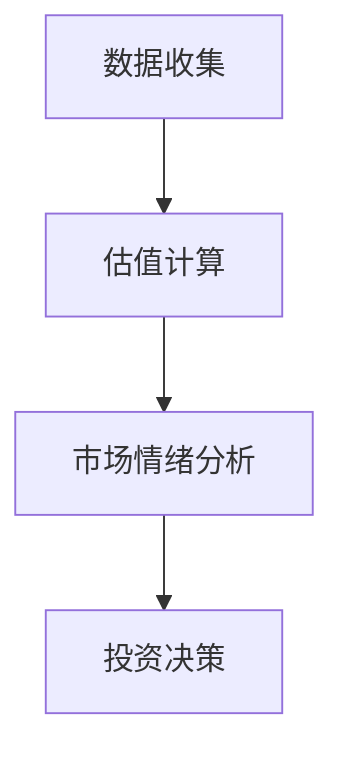
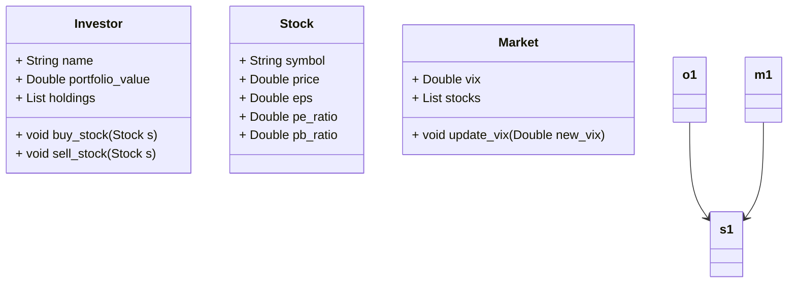
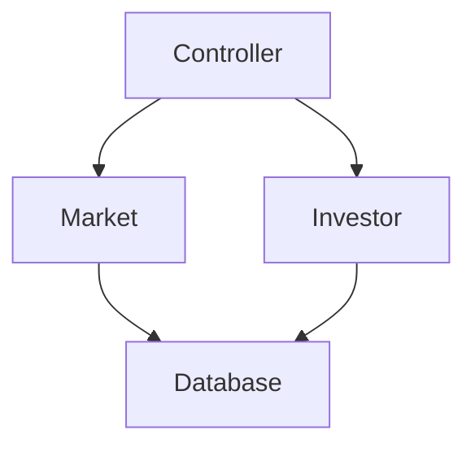

                 


# 彼得林奇的"反向思维"投资案例

---

## 关键词：彼得林奇、反向思维、投资策略、价值投资、市场分析

---

## 摘要

彼得林奇是全球著名的价值投资者，他的反向思维投资策略在投资领域独树一帜。本文通过详细分析彼得林奇的投资理念、核心概念、算法原理以及实际案例，系统地解读了反向思维投资的内在逻辑和应用方法。文章从背景介绍、核心概念、算法原理、系统架构、项目实战等多个维度展开，深入剖析了反向思维投资的理论基础和实际操作技巧，为投资者提供了清晰的指导和实用的建议。

---

## 第1章: 引言

### 1.1 彼得林奇及其投资理念

#### 1.1.1 彼得林奇的生平简介

彼得·林奇（Peter Lynch）是美国著名的职业基金经理，曾管理富达麦哲伦基金（Fidelity Magellan Fund），创造了令人瞩目的投资业绩。他以价值投资和长期投资的理念闻名，尤其擅长在市场低迷时寻找被低估的投资机会。

#### 1.1.2 彼得林奇的投资哲学

彼得林奇的投资哲学的核心是“反向思维”。他主张在市场恐慌时买入，市场疯狂时卖出。他认为，投资者应该逆市场情绪而行，寻找那些被市场忽视或低估的股票。

#### 1.1.3 反向思维投资的定义与特点

反向思维投资是一种通过分析市场周期和投资者情绪，寻找与市场走势相反的投资机会的策略。其特点包括：

1. **逆周期性**：在市场低迷时寻找机会，避免在市场高点投资。
2. **价值导向**：注重基本面分析，寻找被低估的股票。
3. **长期视角**：注重长期投资，而非短期波动。

---

## 第2章: 反向思维投资的背景与环境

### 2.1 投资市场的周期性分析

#### 2.1.1 市场周期的定义与特征

投资市场通常呈现周期性波动，包括牛市和熊市的交替。牛市时市场情绪高涨，投资者蜂拥而入；熊市时市场情绪低落，投资者恐慌性抛售。

#### 2.1.2 牛市与熊市的交替规律

牛市和熊市的交替是市场的基本规律。牛市时，股价被高估，投资者倾向于追涨；熊市时，股价被低估，投资者倾向于恐慌性抛售。

#### 2.1.3 投资者心理与市场波动的关系

投资者的心理预期对市场波动有重要影响。当市场情绪乐观时，投资者倾向于高估股票价值；当市场情绪悲观时，投资者倾向于低估股票价值。

### 2.2 反向思维投资的适用场景

#### 2.2.1 市场低迷期的投资机会

在市场低迷期，许多优质股票被市场情绪拖累，价格被低估，此时是反向思维投资的最佳时机。

#### 2.2.2 被低估股票的特征分析

被低估的股票通常具有以下特征：
1. **低市盈率（P/E）**：市盈率低于行业平均水平。
2. **低市净率（P/B）**：市净率低于行业平均水平。
3. **高股息率**：股息率高于行业平均水平。
4. **稳定的盈利能力**：公司具有稳定的盈利能力，且ROE（净资产收益率）较高。

#### 2.2.3 企业基本面分析的重要性

反向思维投资强调对企业基本面的深入分析，包括公司盈利能力、财务状况、行业地位等方面。只有通过基本面分析，才能找到真正被低估的股票。

### 2.3 反向思维投资的边界与限制

#### 2.3.1 投资市场的不确定性

市场波动具有不确定性，投资者无法完全预测市场的短期走势。

#### 2.3.2 信息不对称的影响

信息不对称可能导致投资者无法准确评估股票的价值。

#### 2.3.3 投资者认知偏差的挑战

投资者的认知偏差（如过度自信、从众心理）可能影响投资决策。

---

## 第3章: 反向思维投资的核心概念与联系

### 3.1 核心概念原理

#### 3.1.1 反向思维的数学模型

反向思维投资的核心是通过分析市场情绪和股票估值，找到市场的非理性定价。可以通过以下公式评估股票的内在价值：

$$
\text{内在价值} = \frac{\text{净利润}}{\text{贴现率} - \text{增长率}}
$$

#### 3.1.2 投资价值的评估公式

彼得林奇常用市盈率和市净率来评估股票的价值：

$$
\text{市盈率} = \frac{\text{股价}}{\text{每股收益}}
$$

$$
\text{市净率} = \frac{\text{股价}}{\text{每股净资产}}
$$

#### 3.1.3 市场情绪与股价波动的关系

市场情绪与股价波动呈负相关关系。当市场情绪高涨时，股价被高估；当市场情绪低落时，股价被低估。

### 3.2 核心概念对比分析

#### 3.2.1 反向思维与顺势投资的对比

| 对比维度       | 反向思维投资             | 顺势投资               |
|----------------|--------------------------|------------------------|
| 投资时机       | 市场低迷时               | 市场上涨时             |
| 投资策略       | 寻找被低估股票           | 追踪市场趋势           |
| 风险控制       | 高，但注重长期价值       | 低，但依赖市场短期走势 |

#### 3.2.2 长期投资与短期交易的对比

| 对比维度       | 长期投资                 | 短期交易               |
|----------------|--------------------------|------------------------|
| 投资期限       | 长期                     | 短期                   |
| 投资目标       | 实现长期财富增值         | 实现短期收益           |
| 风险承受能力   | 较高                     | 较低                   |

#### 3.2.3 价值投资与成长投资的对比

| 对比维度       | 价值投资                 | 成长投资               |
|----------------|--------------------------|------------------------|
| 投资标准       | 低估值                   | 高成长                 |
| 风险承受能力   | 中等                     | 较高                   |
| 投资期限       | 长期                     | 短期或中期             |

### 3.3 实体关系图

#### 3.3.1 投资者与市场的关系


#### 3.3.2 股票价格与企业价值的关系


#### 3.3.3 市场波动与投资决策的关系


---

## 第4章: 反向思维投资的算法原理

### 4.1 算法原理概述

反向思维投资的算法原理主要基于基本面分析和市场情绪分析。以下是核心步骤：

1. **数据收集**：收集目标股票的基本面数据，包括净利润、市盈率、市净率等。
2. **估值计算**：使用估值模型计算股票的内在价值。
3. **市场情绪分析**：通过市场指标（如VIX指数）分析市场情绪。
4. **投资决策**：根据估值和市场情绪，决定是否买入或卖出股票。

### 4.2 算法实现

#### 4.2.1 代码实现

```python
def calculate_intrinsic_value(eps, growth_rate, discount_rate):
    return eps / (discount_rate - growth_rate)

def calculate_market_mood(vix):
    if vix < 20:
        return "bullish"
    elif vix > 30:
        return "bearish"
    else:
        return "neutral"

# 示例数据
eps = 5
growth_rate = 0.05
discount_rate = 0.1
vix = 25

intrinsic_value = calculate_intrinsic_value(eps, growth_rate, discount_rate)
market_mood = calculate_market_mood(vix)

print(f"内在价值: {intrinsic_value}")
print(f"市场情绪: {market_mood}")
```

#### 4.2.2 算法流程图



---

## 第5章: 系统分析与架构设计

### 5.1 系统功能设计

#### 5.1.1 领域模型



#### 5.1.2 系统架构



---

## 第6章: 项目实战

### 6.1 环境安装

需要安装以下工具：
1. Python 3.8+
2. Jupyter Notebook
3. Pandas、NumPy、Matplotlib库

### 6.2 核心实现

#### 6.2.1 数据收集

使用Yahoo Finance API获取股票数据：

```python
import pandas_datareader as pdr

def get_stock_data(symbol):
    data = pdr.get_data_yahoo(symbol)
    return data
```

#### 6.2.2 估值计算

计算股票的内在价值：

```python
def calculate_intrinsic_value(data, growth_rate, discount_rate):
    eps = data['eps'].iloc[-1]
    return eps / (discount_rate - growth_rate)
```

#### 6.2.3 市场情绪分析

分析市场情绪：

```python
import pandas as pd

def calculate_market_mood(vix_data):
    vix = vix_data['VIX'].iloc[-1]
    if vix < 20:
        return "bullish"
    elif vix > 30:
        return "bearish"
    else:
        return "neutral"
```

### 6.3 实际案例分析

#### 6.3.1 案例背景

假设当前市场处于熊市，VIX指数为35，市场情绪为“bearish”。

#### 6.3.2 数据分析

选择一只市盈率和市净率均低于行业平均水平的股票，计算其内在价值。

#### 6.3.3 投资决策

根据计算结果，决定是否买入该股票。

---

## 第7章: 总结与最佳实践

### 7.1 小结

反向思维投资是一种有效的投资策略，尤其适用于市场低迷时期。通过基本面分析和市场情绪分析，投资者可以找到被低估的投资机会。

### 7.2 注意事项

1. **风险控制**：在市场低迷时，投资者需要具备较强的心理承受能力。
2. **长期视角**：投资需要耐心，避免短期波动的影响。
3. **持续学习**：市场环境不断变化，投资者需要不断学习和调整策略。

### 7.3 拓展阅读

1. 彼得林奇的《彼得林奇的成功投资》
2. 《价值投资入门》
3. 《投资学基础》

---

## 作者：AI天才研究院/AI Genius Institute & 禅与计算机程序设计艺术 /Zen And The Art of Computer Programming

