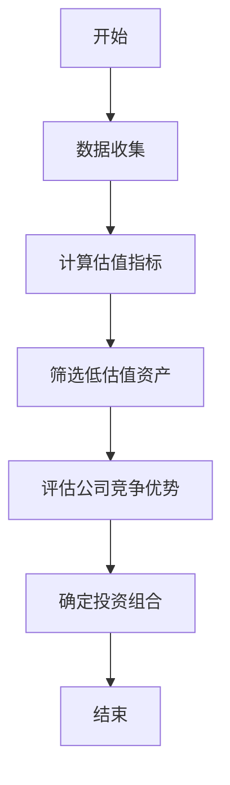
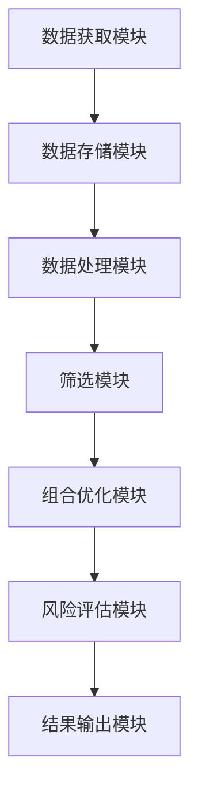

                 


# 彼得林奇的"反周期"投资在不同资产类别中的应用

## 关键词：反周期投资，彼得·林奇，资产配置，经济周期，投资策略

## 摘要：  
彼得·林奇的“反周期”投资策略是一种在经济周期低谷时投资优质资产以实现超额收益的方法。本文系统地分析了反周期投资的核心概念、算法原理、系统架构，并通过实战案例展示了其在股票、债券等资产类别中的应用。通过详细的数学模型和代码实现，本文为投资者提供了一套可操作的投资策略，并总结了最佳实践经验和注意事项。

---

## 第一部分：背景介绍

### 第1章：反周期投资概述

#### 1.1 彼得·林奇及其投资理念
彼得·林奇是美国著名的职业基金经理人，曾管理富达麦哲伦基金，创造了辉煌的投资业绩。他的投资理念以“逆向思维”为核心，主张在市场低迷时买入优质资产，在市场高位时卖出或规避风险。林奇认为，市场的短期波动为投资者提供了廉价买入优质资产的机会。

#### 1.2 反周期投资的基本概念
反周期投资是指在经济周期的低谷期（衰退或萧条阶段）投资于那些具有长期竞争优势、估值被市场低估的资产，以在经济复苏或扩张阶段获得超额收益。

#### 1.3 经济周期与资产价格波动
经济周期分为四个阶段：衰退、复苏、扩张和萧条。在衰退阶段，资产价格通常被低估，是反周期投资的最佳时机。本文将详细分析不同资产类别在经济周期中的表现。

---

## 第二部分：核心概念与联系

### 第2章：反周期投资的核心概念

#### 2.1 反周期投资的定义与特征
反周期投资的核心特征包括：
- **低估值**：资产价格远低于其内在价值。
- **高分红**：公司保持稳定的分红能力。
- **竞争优势**：公司在行业中具有长期竞争优势。
- **逆周期增长**：公司在经济低迷时期仍能保持增长。

**反周期投资与周期性投资的对比表格**：

| 特征               | 反周期投资           | 周期性投资           |
|--------------------|--------------------|--------------------|
| 投资时机           | 经济衰退期           | 经济扩张期           |
| 资产估值           | 低估                | 高估或合理           |
| 收益预期           | 超额收益            | 平均收益            |
| 风险承受能力       | 高                  | 低                  |

**反周期投资的ER实体关系图**：
```mermaid
erd
title 反周期投资的实体关系图
entity 反周期投资 {
  <<投资策略>>
  - 投资者
  - 资产类别
  - 经济周期
  - 资产估值
}
```

---

## 第三部分：算法原理

### 第3章：反周期投资的筛选标准与策略

#### 3.1 筛选标准
反周期投资的核心是筛选出具有以下特征的资产：
- 市盈率（P/E）低于行业平均水平。
- 市净率（P/B）低于行业平均水平。
- 股息率稳定且高于行业平均水平。
- 公司财务健康，现金流稳定。

#### 3.2 筛选算法流程图


#### 3.3 数学模型
反周期投资的核心在于通过估值指标（如市盈率、市净率）筛选低估资产。以下是常用的估值模型：

- 市盈率（P/E）：  
$$ P/E = \frac{\text{股价}}{\text{每股收益}} $$  
- 市净率（P/B）：  
$$ P/B = \frac{\text{股价}}{\text{每股净资产}} $$  

#### 3.4 代码实现
以下是Python代码，用于筛选低估值股票：

```python
import pandas as pd

def screen_undervalued_stocks(stocks, industry_avg_pe, industry_avg_pb):
    # 筛选市盈率低于行业平均水平的股票
    pe_filter = stocks[stocks['P/E'] < industry_avg_pe]
    # 筛选市净率低于行业平均水平的股票
    pb_filter = pe_filter[pe_filter['P/B'] < industry_avg_pb]
    return pb_filter

# 示例数据
stocks = pd.DataFrame({
    'P/E': [15, 20, 12, 18, 25],
    'P/B': [1.5, 2.0, 1.2, 1.8, 3.0],
    '行业平均P/E': [16, 18, 14, 17, 20],
    '行业平均P/B': [1.6, 1.8, 1.4, 1.7, 2.0]
})

result = screen_undervalued_stocks(stocks, 16, 1.6)
print(result)
```

---

## 第四部分：系统分析与架构设计

### 第4章：反周期投资系统的构建

#### 4.1 系统功能设计
反周期投资系统包括以下几个模块：
- 数据获取模块：收集市场数据。
- 筛选模块：根据筛选标准筛选低估资产。
- 组合优化模块：构建最优投资组合。
- 风险评估模块：评估投资组合的风险。

#### 4.2 系统架构设计


---

## 第五部分：项目实战

### 第5章：反周期投资在股票中的应用

#### 5.1 数据获取与预处理
使用Python的`pandas`和`yfinance`库获取股票数据：

```python
import yfinance as yf

# 下载苹果公司（AAPL）的历史数据
aapl = yf.download('AAPL', start='2020-01-01', end='2023-12-31')
print(aapl.head())
```

#### 5.2 估值指标计算
计算市盈率和市净率：

```python
# 计算市盈率
aapl['PE'] = aapl['Close'] / aapl['EPS'].rolling(4).mean()

# 计算市净率
aapl['PB'] = aapl['Close'] / aapl['Book Value'].rolling(4).mean()
```

#### 5.3 筛选低估股票
筛选市盈率和市净率均低于行业平均水平的股票：

```python
# 示例筛选
selected_stocks = aapl[aapl['PE'] < industry_avg_pe & aapl['PB'] < industry_avg_pb]
print(selected_stocks)
```

#### 5.4 投资组合优化
使用均值-方差优化模型构建投资组合：

```python
import numpy as np

# 示例投资组合优化
returns = selected_stocks['Return'].values
cov_matrix = np.cov(returns)

# 计算最优组合
weights = np.linalg.inv(cov_matrix) * np.ones(len(returns))
weights = weights / sum(weights)
print(weights)
```

---

## 第六部分：最佳实践与总结

### 第6章：投资要点与注意事项

#### 6.1 投资要点
- 选择具有长期竞争优势的企业。
- 在市场底部区域布局。
- 分批建仓，逐步增加仓位。

#### 6.2 注意事项
- 风险控制：设定止损点。
- 数据质量：确保数据来源可靠。
- 组合管理：定期调整投资组合。

#### 6.3 拓展阅读
- 《彼得·林奇的投资之道》
- 《反周期投资实战》

---

## 作者：AI天才研究院/AI Genius Institute & 禅与计算机程序设计艺术/Zen And The Art of Computer Programming

---

通过本文的系统分析与实战案例，读者可以深入了解彼得·林奇的反周期投资策略，并将其应用于不同资产类别中。希望本文能为投资者提供有价值的参考和启发。

