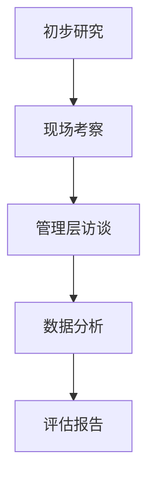
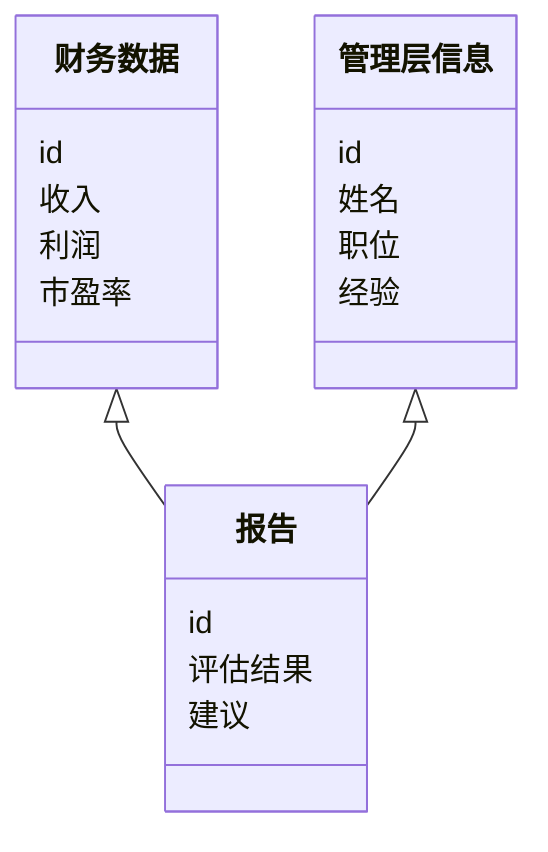
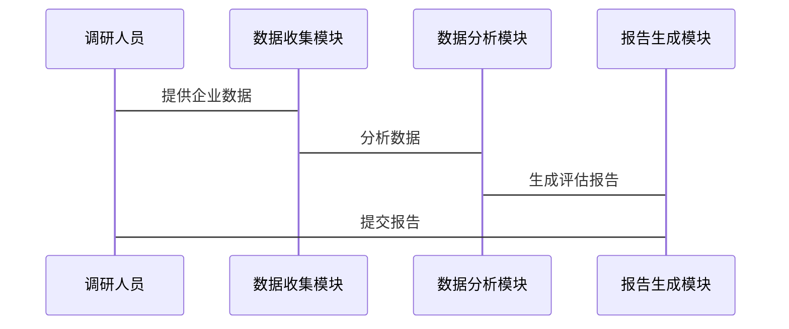

                 


# 彼得林奇的"实地调研"投资方法

## 关键词
- 彼得林奇
- 投资方法
- 实地调研
- 财务分析
- 管理层访谈

## 摘要
彼得·林奇是全球著名的职业基金经理，其“实地调研”投资方法是投资领域的重要策略。本文将详细分析这一方法的背景、核心概念、算法原理、系统架构、项目实战及最佳实践，帮助读者全面理解并应用这一投资方法。

---

# 第一部分: 背景介绍

## 第1章: 背景介绍

### 1.1 实地调研的定义与重要性
#### 1.1.1 投资方法的背景与问题背景
在投资领域，传统的投资方法往往依赖于市场趋势和历史数据分析，但这种方法难以全面评估企业的内在价值。彼得·林奇提出实地调研作为一种补充方法，通过深入企业内部，全面了解其经营状况和未来潜力。

#### 1.1.2 实地调研的核心概念与问题解决
实地调研的核心在于通过对企业实地考察，获取一手信息，评估企业的财务健康状况、管理层能力以及行业前景。这种方法能够弥补传统数据分析的局限性，帮助投资者做出更明智的决策。

#### 1.1.3 实地调研的边界与外延
实地调研不仅包括对企业财务数据的分析，还包括与管理层的面对面交流、对行业趋势的了解以及对企业竞争优势的评估。其外延涉及企业战略、市场地位和潜在风险。

#### 1.1.4 核心要素组成与结构
实地调研的核心要素包括：财务数据、管理层访谈、行业分析和竞争优势评估。这些要素共同构建了一个全面的企业评估框架。

### 1.2 实地调研与其他投资方法的区别
#### 1.2.1 传统投资方法的局限性
传统投资方法依赖于市场数据和历史表现，忽视了企业的实际经营状况和潜在风险。这种方法在市场波动较大的情况下往往表现不佳。

#### 1.2.2 实地调研的独特优势
实地调研通过对企业内部的深入了解，能够识别传统数据分析难以发现的风险和机会。这种方法特别适用于评估中小型企业或新兴行业。

#### 1.2.3 实地调研与基本面分析的对比
基本面分析依赖于财务报表和市场数据，而实地调研则通过实地考察获取更多非财务信息，如管理层能力、企业战略和行业趋势。两者结合可以提供更全面的企业评估。

---

# 第二部分: 核心概念与联系

## 第2章: 核心概念与联系

### 2.1 实地调研的核心原理
#### 2.1.1 调研流程与关键点
实地调研的流程包括：初步研究、现场考察、管理层访谈和数据分析。关键点在于获取准确的信息，并将其与企业财务数据相结合。

#### 2.1.2 调研中的信息收集与分析
信息收集包括对企业财务数据、管理层访谈、行业趋势和竞争优势的分析。这些信息需要经过整理和分析，以评估企业的内在价值。

#### 2.1.3 调研结果对投资决策的影响
调研结果可以直接影响投资决策，例如发现企业的潜在风险或竞争优势，从而调整投资组合或投资策略。

### 2.2 核心概念属性特征对比
以下是一个对比表格：

| 投资方法 | 调研对象 | 调研方式 | 信息来源 | 优势 |
|----------|----------|----------|----------|------|
| 传统分析 | 财务数据 | 数据分析 | 市场数据 | 数据全面 |
| 实地调研 | 企业内部 | 现场考察 | 一手信息 | 信息准确 |

### 2.3 实地调研的ER实体关系图
```mermaid
erDiagram
    company {
        id
        name
        industry
        revenue
        profit
    }
    management {
        id
        name
        role
        experience
    }
    financials {
        id
        year
        revenue
        profit
        growth
    }
    company --> financials : has
    company --> management : man
```

---

# 第三部分: 算法原理

## 第3章: 算法原理

### 3.1 实地调研的评估流程
#### 3.1.1 评估流程
1. 初步研究：分析企业的财务数据和行业趋势。
2. 现场考察：访问企业，观察其运营状况。
3. 管理层访谈：与管理层讨论企业战略和潜在风险。
4. 数据分析：结合调研结果，评估企业的内在价值。

#### 3.1.2 评估流程的优缺点对比
| 评估流程 | 优点 | 缺点 |
|----------|------|------|
| 初步研究 | 数据全面 | 时间较长 |
| 现场考察 | 信息准确 | 成本较高 |
| 管理层访谈 | 深入了解 | 时间较长 |

### 3.2 实地调研的数学模型

#### 3.2.1 财务指标分析
市盈率公式：
$$市盈率 = \frac{价格}{每股收益}$$

市净率公式：
$$市净率 = \frac{价格}{每股净资产}$$

#### 3.2.2 企业价值评估模型
企业价值公式：
$$企业价值 = 股东权益 + 税后利润 - 现金流出$$

### 3.3 实地调研的流程图


---

# 第四部分: 系统分析与架构设计

## 第4章: 系统分析与架构设计

### 4.1 系统功能设计
#### 4.1.1 功能模块
- 数据收集模块
- 数据分析模块
- 报告生成模块

#### 4.1.2 领域模型


### 4.2 系统架构设计
#### 4.2.1 系统架构图
```mermaid
container 容器 {
    数据收集模块
    数据分析模块
    报告生成模块
}
```

### 4.3 接口设计与交互流程
#### 4.3.1 接口设计
- 数据收集接口：从企业获取财务数据和管理层信息。
- 分析接口：对数据进行分析，生成评估报告。

#### 4.3.2 交互流程图


---

# 第五部分: 项目实战

## 第5章: 项目实战

### 5.1 案例分析
#### 5.1.1 案例介绍
以某科技公司为例，分析其财务状况和管理层战略。

#### 5.1.2 实地调研过程
1. 收集财务数据：收入、利润、市盈率。
2. 现场考察：观察企业运营状况。
3. 管理层访谈：了解企业发展战略和潜在风险。

### 5.2 核心代码实现

#### 5.2.1 数据分析代码
```python
import pandas as pd

# 数据收集
data = {
    '收入': [100, 200, 300],
    '利润': [20, 40, 60]
}

df = pd.DataFrame(data)

# 数据分析
df['市盈率'] = df['收入'] / df['利润']
print(df)
```

#### 5.2.2 报告生成代码
```python
from reportlab.pdfgen import canvas

# 生成报告
c = canvas.Canvas("调研报告.pdf")
c.drawString(100, 750, "调研报告")
c.drawString(100, 730, "公司名称：某科技公司")
c.drawString(100, 710, "市盈率：3.33")
c.save()
```

### 5.3 代码应用解读与分析
通过代码实现数据收集、分析和报告生成，帮助投资者快速评估企业价值。

---

# 第六部分: 最佳实践

## 第6章: 最佳实践

### 6.1 投资小结
实地调研是一种有效的投资方法，通过对企业内部的深入了解，帮助投资者做出更明智的决策。

### 6.2 投资注意事项
- 保持持续学习，更新投资知识。
- 选择合适的企业进行调研，避免盲目投资。
- 结合其他投资方法，全面评估企业价值。

### 6.3 拓展阅读
推荐书籍：《彼得·林奇的成功投资》。

---

# 作者：AI天才研究院/AI Genius Institute & 禅与计算机程序设计艺术 /Zen And The Art of Computer Programming

---

希望这篇文章能帮助您全面理解彼得林奇的实地调研投资方法，并将其应用到实际投资中。

