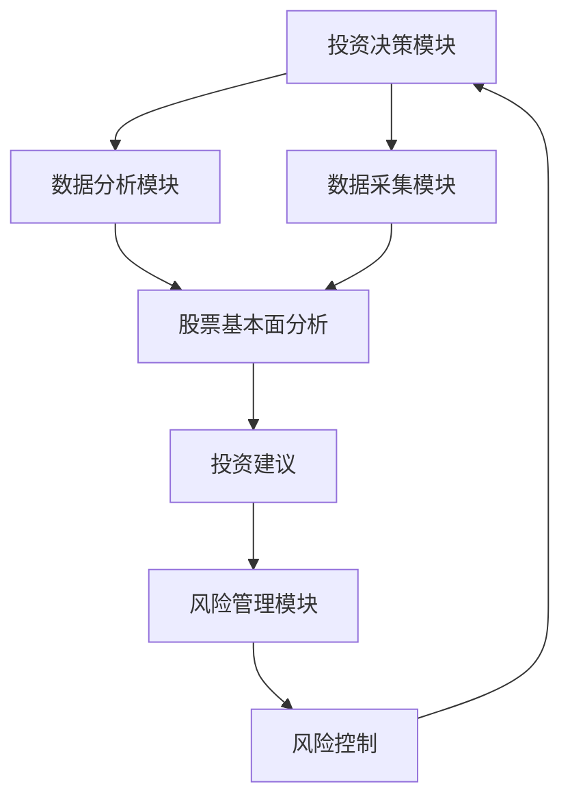
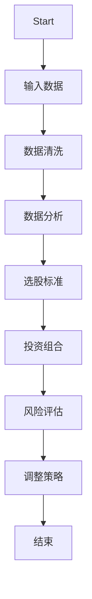

                 


# 彼得林奇的"家庭股票"投资策略

---

## 关键词：
- 彼得·林奇
- 家庭股票
- 投资策略
- 价值投资
- 长期投资

---

## 摘要：
本文深入探讨了彼得·林奇的“家庭股票”投资策略，分析其核心理念、策略实施的系统架构，以及实际案例的应用。通过理论与实践结合，揭示了如何在个人或家庭层面上有效进行股票投资，强调长期价值投资的重要性，并提供可操作的实施方法和注意事项。

---

## 第一部分：投资基础知识

### 第1章：投资的基本概念

#### 1.1 投资的基本定义
- **定义与分类**：投资是指将资金投入特定资产以期获得收益的行为。常见的投资类型包括股票、债券、基金等。
- **股票投资的基本原理**：购买公司的一部分股份，期望随着公司成长获得资本增值或分红收益。
- **投资市场的基本构成**：包括交易所、投资者、上市公司等主要参与者。

#### 1.2 投资的基本原则
- **风险与收益的平衡**：高风险可能带来高收益，但也可能损失本金。
- **长期投资的重要性**：分散投资风险，避免短期波动的影响。
- **投资组合的构建**：通过多样化投资降低风险，同时提高收益。

#### 1.3 投资者的分类
- **个人投资者与机构投资者的区别**：个人投资者资金较少，注重灵活性；机构投资者资金庞大，注重长期收益。
- **家庭投资者的独特需求**：注重风险控制，追求稳定收益，适合长期投资。

---

### 第2章：彼得·林奇的背景与成就

#### 2.1 彼得·林奇的生平简介
- **职业历程**：曾管理麦哲伦基金，创造了优异的长期投资业绩。
- **投资风格**：注重基本面分析，寻找具有持续增长潜力的公司。

#### 2.2 林奇的投资哲学
- **长期投资的重要性**：通过长期持有优质股票实现财富增长。
- **价值投资的核心理念**：寻找市场价格低于内在价值的股票。
- **风险管理的策略**：分散投资，避免过度集中在单一股票或行业。

### 第3章：家庭股票投资策略的定义

#### 3.1 家庭股票的定义与特点
- **定义**：适合家庭或个人投资者的股票投资策略，注重长期稳定收益。
- **特点**：低风险、长期持有、注重价值投资。

#### 3.2 家庭股票与其他投资方式的对比
- **传统股票投资**：高风险，适合机构投资者。
- **家庭股票投资**：低风险，适合个人投资者。

---

## 第二部分：家庭股票投资策略的核心概念

### 第4章：家庭股票与传统股票投资的对比

#### 4.1 核心概念对比
- **投资目标**：传统投资追求短期收益，家庭投资注重长期稳定。
- **投资期限**：传统投资短期频繁交易，家庭投资长期持有。

#### 4.2 投资策略的差异
- **传统策略**：高风险，高回报，适合机构投资者。
- **家庭策略**：低风险，适合个人投资者。

---

## 第三部分：家庭股票投资策略的系统分析

### 第5章：家庭股票投资系统的架构

#### 5.1 系统功能模块划分
- 数据采集模块：收集市场数据。
- 数据分析模块：分析股票基本面。
- 投资决策模块：基于分析结果做出投资决策。
- 风险管理模块：监控和控制投资风险。

#### 5.2 系统架构设计



---

### 第6章：算法原理与代码实现

#### 6.1 投资策略算法



#### 6.2 Python代码实现

```python
import pandas as pd
import numpy as np

# 示例数据
data = {'公司名称': ['A', 'B', 'C'],
        '股价': [100, 80, 120],
        '市盈率': [15, 20, 12],
        '净利润增长率': [10, 15, 8]}

df = pd.DataFrame(data)

# 选股标准：市盈率低于15，净利润增长率高于10%
selected = df[(df['市盈率'] < 15) & (df['净利润增长率'] > 10)]

print("符合标准的股票：")
print(selected)
```

---

### 第7章：项目实战与案例分析

#### 7.1 环境安装
- 安装Python和必要的库（如pandas、numpy）。

#### 7.2 核心代码实现
```python
import pandas as pd
import numpy as np

# 数据预处理
data = {'公司名称': ['A', 'B', 'C', 'D'],
        '股价': [100, 80, 120, 90],
        '市盈率': [15, 20, 12, 18],
        '净利润增长率': [10, 15, 8, 12]}

df = pd.DataFrame(data)
df = df.dropna()  # 删除缺失值

# 选股标准：市盈率 < 15，净利润增长率 > 10%
selected_stocks = df[(df['市盈率'] < 15) & (df['净利润增长率'] > 10)]

print("符合条件的股票：")
print(selected_stocks)
```

#### 7.3 案例分析
- 选择符合标准的公司，分析其长期投资价值。

---

## 第四部分：最佳实践与总结

### 第8章：最佳实践与注意事项

#### 8.1 投资策略选择
- 根据个人风险承受能力和投资目标选择合适的策略。

#### 8.2 风险管理
- 定期评估投资组合，及时调整。

#### 8.3 持续学习
- 关注市场动态，学习新的投资知识。

### 第9章：小结与展望

- **小结**：彼得·林奇的“家庭股票”策略适合个人和家庭投资者，强调长期投资和价值投资。
- **展望**：未来将结合更多数据和模型，优化投资策略。

---

## 作者：AI天才研究院/AI Genius Institute & 禅与计算机程序设计艺术 /Zen And The Art of Computer Programming

