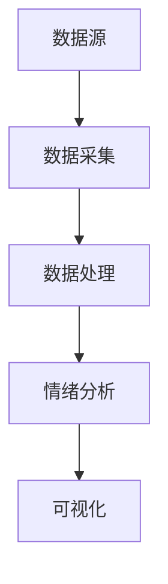

                 


# 彼得林奇的"市场情绪"判断技巧

## 关键词：市场情绪，彼得林奇，投资策略，情绪周期，量化分析

## 摘要：彼得·林奇是全球著名投资专家，他强调市场情绪在投资决策中的重要性。本文将深入探讨市场情绪的定义、影响因素、周期性变化，以及如何量化和分析市场情绪。通过结合彼得林奇的理论和现代技术手段，本文将提供一套系统化的市场情绪分析方法，帮助投资者做出更明智的投资决策。

---

## 第一部分：市场情绪的背景介绍

### 第1章：市场情绪的定义与重要性

#### 1.1 市场情绪的定义
市场情绪是指投资者在市场中的整体情绪状态，通常表现为乐观、悲观、恐慌或贪婪等。这些情绪会影响投资者的决策，进而影响市场的波动。

- 市场情绪的本质：市场情绪是投资者心理的集体反映，受个体认知偏差和群体行为影响。
- 市场情绪的外延：包括投资者对市场的预期、信心和风险偏好。

#### 1.2 彼得·林奇的市场情绪理论
彼得·林奇认为，市场情绪是投资决策的关键因素。他强调，在市场恐慌时买入，在市场狂热时卖出。

- 林奇的市场情绪分析方法：通过观察市场参与者的心理变化，预测市场的短期波动。
- 林奇的投资策略：在市场情绪低谷时投资，市场情绪高峰时退出。

---

## 第二部分：市场情绪的核心概念

### 第2章：市场情绪的影响因素

#### 2.1 投资者心理与行为
投资者心理是市场情绪的核心影响因素，包括以下几点：

- 认知偏差：投资者倾向于过度自信或厌恶损失。
- 行为偏差：投资者在面对亏损时更倾向于卖出，面对盈利时倾向于持有。

#### 2.2 市场环境与宏观经济因素
宏观经济指标对市场情绪有直接影响：

- 利率：低利率环境通常会提升市场情绪。
- 通货膨胀：适度通胀会提升市场情绪，过高通胀会引发恐慌。

#### 2.3 市场情绪的周期性
市场情绪呈现周期性波动，通常经历以下几个阶段：

1. 恐慌：投资者大量抛售资产，市场大幅下跌。
2. 理智：投资者逐步恢复理性，市场开始反弹。
3. 乐观：市场情绪高涨，投资者大量买入。
4. 狂热：市场出现泡沫，投资者预期过高。

---

## 第三部分：市场情绪的量化与算法分析

### 第3章：市场情绪的量化指标

#### 3.1 常见市场情绪指标
- **恐慌指数（VIX）**：反映市场波动性的指标，数值越高，市场情绪越恐慌。
- **投资者情绪指数（IEMX）**：基于投资者行为数据，量化市场情绪的指标。
- **市场广度指标**：衡量市场参与度的指标，如上涨股与下跌股的比例。

#### 3.2 市场情绪的数学模型
- **恐慌指数计算公式**：
  $$ VIX = \sqrt{ \frac{1}{N} \sum_{i=1}^{N} (r_i - \mu)^2 } $$
  其中，$r_i$ 是市场指数的收益率，$\mu$ 是平均收益率，$N$ 是样本数量。

- **投资者情绪指数计算**：
  $$ IEMX = \frac{\text{买入人数} - \text{卖出人数}}{\text{总人数}} $$

### 第4章：基于机器学习的市场情绪分析

#### 4.1 机器学习模型
- **情感分析模型**：使用自然语言处理技术分析新闻标题和社交媒体情绪。
- **时间序列模型**：基于历史数据预测市场情绪。

#### 4.2 算法实现
- 使用Python的`nltk`库进行情感分析：
  ```python
  from nltk.sentiment import SentimentIntensityAnalyzer
  analyzer = SentimentIntensityAnalyzer()
  sentiment = analyzer.polarity_scores(text)
  ```

---

## 第四部分：系统架构与项目实战

### 第5章：系统架构设计

#### 5.1 系统功能模块
- 数据采集模块：收集市场数据和社交媒体信息。
- 数据处理模块：清洗和预处理数据。
- 情绪分析模块：计算市场情绪指标。
- 可视化模块：生成市场情绪图表。

#### 5.2 系统架构图


---

## 第五部分：项目实战

### 第6章：环境安装与代码实现

#### 6.1 环境安装
- Python 3.8+
- NumPy、Pandas、Matplotlib、nltk库

#### 6.2 核心代码实现
- 数据处理代码：
  ```python
  import pandas as pd
  import numpy as np

  # 读取数据
  df = pd.read_csv('market_data.csv')
  
  # 计算市场情绪指标
  def calculate_market_mood(data):
      # 示例：计算市场情绪的平均值
      mood = data['sentiment'].mean()
      return mood
  
  mood = calculate_market_mood(df)
  ```

- 情绪分析代码：
  ```python
  from textblob import TextBlob

  def analyze_sentiment(text):
      blob = TextBlob(text)
      sentiment = blob.sentiment.polarity
      return sentiment

  text = "The market is bullish today."
  print(analyze_sentiment(text))
  ```

#### 6.3 实际案例分析
- 案例：2020年新冠疫情对市场情绪的影响。
- 分析：恐慌指数急剧上升，投资者情绪从乐观转为恐慌。

---

## 第六部分：总结与展望

### 第7章：总结

- **最佳实践**：定期监测市场情绪，结合技术分析和基本面分析。
- **注意事项**：市场情绪指标仅供参考，需结合其他因素综合判断。
- **拓展阅读**：推荐阅读彼得·林奇的《投资之道》和《漫步华尔街》。

### 第8章：小结

通过本文的分析，我们了解了市场情绪的定义、影响因素、量化指标以及如何构建市场情绪分析系统。结合彼得·林奇的理论和现代技术手段，投资者可以更有效地判断市场情绪，做出更明智的投资决策。

---

## 作者：AI天才研究院/AI Genius Institute & 禅与计算机程序设计艺术 /Zen And The Art of Computer Programming

