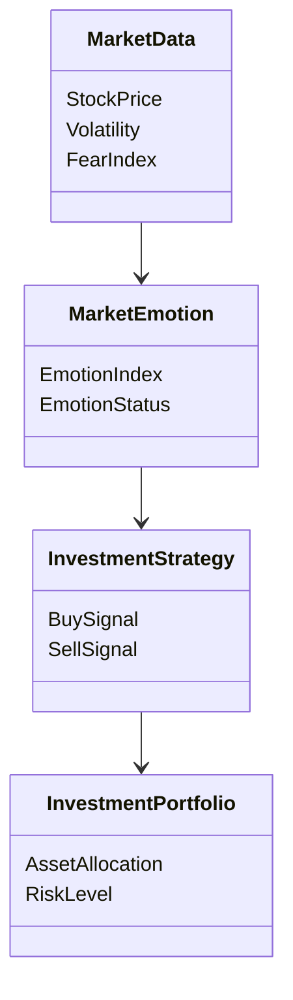

                 


# 彼得林奇的"市场情绪"利用技巧

## 关键词：市场情绪、投资策略、彼得林奇、情绪分析、量化投资

## 摘要：
市场情绪在投资决策中扮演着重要角色，彼得林奇作为一位传奇的投资家，以其独特的市场情绪利用技巧闻名。本文将深入探讨市场情绪的定义、重要性、分析方法，以及彼得林奇如何利用市场情绪进行投资决策。通过结合理论与实践，本文旨在帮助读者掌握市场情绪的分析技巧，并将其应用于实际投资中。

---

## 第一部分：市场情绪的基础与重要性

### 第1章：市场情绪的定义与核心概念

#### 1.1 市场情绪的定义
市场情绪是指投资者在市场中的整体情绪状态，反映了投资者对市场未来走势的乐观或悲观态度。市场情绪可以通过多种指标来衡量，例如波动率、恐慌指数等。

#### 1.2 市场情绪的重要性
市场情绪是投资决策的重要参考指标。投资者的情绪波动会影响市场的买卖行为，从而影响资产价格的波动。了解市场情绪可以帮助投资者做出更明智的投资决策。

#### 1.3 彼得林奇的市场情绪理论
彼得林奇认为，市场情绪的变化是投资机会的来源。他强调关注市场的非理性情绪，如过度恐慌或过度乐观，这些情绪往往会导致市场的短期偏离其内在价值。

---

### 第2章：市场情绪的分析方法

#### 2.1 市场情绪的指标分析
市场情绪可以通过多种指标来量化，例如波动率、恐慌指数（VIX）、市场广度等。这些指标可以帮助投资者了解市场的整体情绪状态。

#### 2.2 投资者心理与市场情绪
投资者的心理状态直接影响市场情绪。例如，当投资者感到恐慌时，他们可能会大量抛售资产，导致市场情绪恶化。

#### 2.3 市场情绪的周期性分析
市场情绪具有周期性特征，通常表现为从乐观到悲观，再从悲观到乐观的循环。了解市场情绪的周期性可以帮助投资者更好地把握投资机会。

---

## 第二部分：彼得林奇的市场情绪利用技巧

### 第3章：彼得林奇的投资哲学

#### 3.1 投资的第一性原理
彼得林奇强调，投资决策应基于企业的基本面分析，而非市场的短期情绪波动。他主张长期投资，关注企业的内在价值。

#### 3.2 投资者心理分析
彼得林奇认为，市场的波动往往由投资者的非理性行为引起。他提醒投资者避免跟随市场的短期情绪，保持冷静和理性。

#### 3.3 市场情绪与投资决策
彼得林奇指出，市场情绪可以帮助投资者识别市场的低估或高估状态。例如，在市场恐慌时，投资者可以寻找被市场情绪过度抛售的优质资产进行投资。

---

### 第4章：彼得林奇的市场情绪分析方法

#### 4.1 市场情绪的量化分析
彼得林奇通过分析市场情绪指标，如波动率和恐慌指数，来判断市场的风险水平。他认为，市场情绪的极端值往往预示着市场的转折点。

#### 4.2 市场情绪的定性分析
彼得林奇还强调定性分析的重要性。他通过观察市场的新闻报道、投资者情绪等非量化因素，来判断市场的整体情绪状态。

#### 4.3 市场情绪的综合分析
彼得林奇主张将定量分析与定性分析相结合。通过综合分析市场情绪的多个维度，他可以更准确地判断市场的未来走势。

---

### 第5章：彼得林奇的市场情绪投资策略

#### 5.1 基于市场情绪的买入策略
彼得林奇建议在市场情绪极度悲观时，寻找被市场情绪过度抛售的优质资产进行投资。他认为，市场情绪的低谷往往是投资的黄金机会。

#### 5.2 基于市场情绪的卖出策略
当市场情绪极度乐观时，彼得林奇提醒投资者警惕市场的过度炒作。他建议投资者在市场情绪过热时，逐步减少对高估值资产的投资。

#### 5.3 市场情绪与投资组合管理
彼得林奇强调，市场情绪是投资组合管理的重要考量因素。他建议投资者根据市场情绪的变化，动态调整投资组合的构成，以降低风险并抓住投资机会。

---

## 第三部分：市场情绪的数学模型与算法原理

### 第6章：市场情绪的量化模型

#### 6.1 市场情绪指数的构建
市场情绪指数可以通过多种指标的加权平均来构建。例如，可以将波动率、恐慌指数和市场广度等指标进行加权，构建综合市场情绪指数。

#### 6.2 市场情绪指数的计算公式
市场情绪指数的计算公式可以表示为：
$$
\text{市场情绪指数} = \alpha \times \text{波动率} + \beta \times \text{恐慌指数} + \gamma \times \text{市场广度}
$$
其中，$\alpha$、$\beta$和$\gamma$是权重系数，根据实际情况进行调整。

#### 6.3 市场情绪指数的验证方法
为了验证市场情绪指数的有效性，可以通过回测的方法，分析市场情绪指数与资产价格波动之间的关系。如果市场情绪指数能够有效预测市场的波动，那么它就是有效的。

---

### 第7章：市场情绪的算法实现

#### 7.1 数据采集与处理
市场情绪的算法实现需要首先采集相关数据，例如股票价格、波动率、恐慌指数等。这些数据可以通过API或数据库获取。

#### 7.2 市场情绪分析算法
市场情绪分析算法可以通过以下步骤实现：
1. 数据预处理：对采集的数据进行清洗和标准化处理。
2. 指标计算：计算市场情绪相关的指标，例如波动率、恐慌指数等。
3. 情绪分类：根据市场情绪指标的值，将市场情绪分为乐观、中性和悲观三种状态。

#### 7.3 算法的优缺点分析
优点：算法实现简单，易于自动化处理；缺点：市场情绪的变化具有复杂性，算法可能无法捕捉所有情绪波动。

---

## 第四部分：系统分析与架构设计方案

### 第8章：系统功能设计

#### 8.1 问题场景介绍
本文将设计一个基于市场情绪分析的投资决策支持系统，帮助投资者根据市场情绪变化优化投资策略。

#### 8.2 系统功能设计
系统功能包括数据采集、市场情绪分析、投资策略生成和投资组合管理。

#### 8.3 领域模型（mermaid类图）


---

## 第五部分：项目实战

### 第9章：项目实战

#### 9.1 环境安装
需要安装Python、Pandas、Matplotlib等库。

#### 9.2 系统核心实现源代码
```python
import pandas as pd
import matplotlib.pyplot as plt

# 数据采集
data = pd.read_csv('market_data.csv')

# 指标计算
volatility = data['Volatility'].mean()
fear_index = data['FearIndex'].mean()

# 情绪分类
if fear_index > 0.7:
    emotion_status = 'Pessimistic'
elif fear_index < 0.3:
    emotion_status = 'Optimistic'
else:
    emotion_status = 'Neutral'

print(f"Market Volatility: {volatility}")
print(f"Fear Index: {fear_index}")
print(f"Market Emotion Status: {emotion_status}")
```

#### 9.3 代码应用解读与分析
上述代码通过读取市场数据，计算波动率和恐慌指数，并根据这些指标判断市场情绪状态。投资者可以根据市场情绪状态调整投资策略。

---

## 第六部分：最佳实践、小结、注意事项、拓展阅读

### 第10章：最佳实践

#### 10.1 小结
市场情绪是投资决策的重要参考因素。彼得林奇通过分析市场情绪，识别投资机会。投资者可以通过量化分析和算法实现，进一步优化投资策略。

#### 10.2 注意事项
投资者在使用市场情绪分析时，应结合基本面分析，避免单一依赖市场情绪指标。同时，应定期更新市场情绪指标，以反映市场的最新变化。

#### 10.3 拓展阅读
推荐阅读彼得林奇的《彼得林奇选股之道》和《投资最重要的事情》，深入理解市场情绪与投资决策的关系。

---

## 作者：AI天才研究院/AI Genius Institute & 禅与计算机程序设计艺术 /Zen And The Art of Computer Programming

