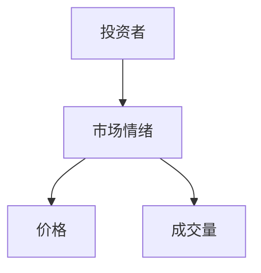
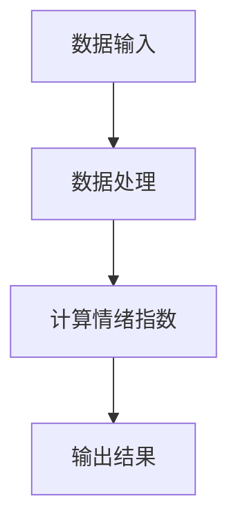
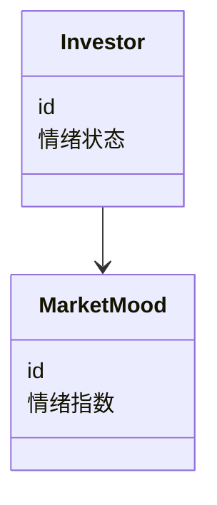
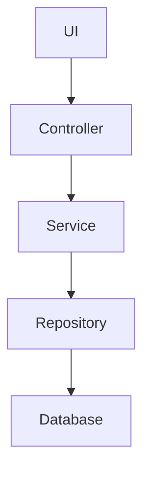
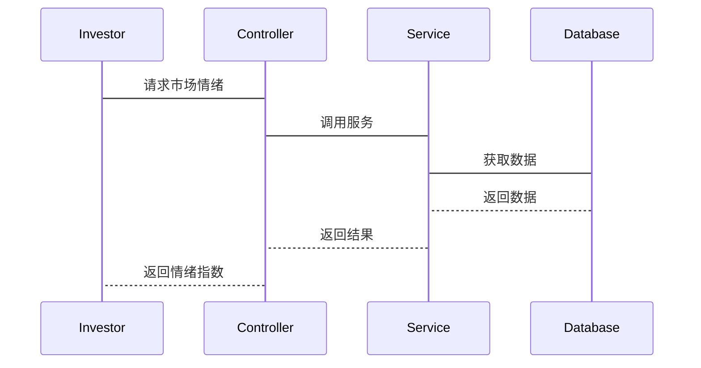

                 


# 彼得林奇的"市场情绪"指标分析

## 关键词：彼得林奇，市场情绪，投资分析，指标分析，情绪指标，投资策略

## 摘要：本文详细分析了彼得林奇提出的市场情绪指标，探讨其理论基础、数学模型、系统架构以及实际应用。通过深入分析，帮助投资者理解市场情绪对投资决策的影响，并提供实用的指标分析方法。

---

# 第一部分：彼得林奇的市场情绪指标概述

## 第1章：市场情绪指标的背景与概念

### 1.1 市场情绪指标的定义与背景

市场情绪指标是衡量投资者情绪的重要工具，反映了市场参与者对市场的乐观或悲观态度。彼得林奇作为投资大师，提出了独特的市场情绪分析方法，结合价格、成交量等数据，帮助投资者做出更明智的投资决策。

### 1.2 市场情绪的核心要素

市场情绪由投资者的心理状态驱动，主要体现在贪婪和恐惧两种情绪。彼得林奇的指标通过分析这些情绪的变化，预测市场的波动。

### 1.3 彼得林奇市场情绪指标的理论基础

彼得林奇的指标结合了市场行为学和统计学，强调情绪对市场的影响。他的理论认为，市场情绪的变化是价格波动的主要驱动因素。

---

## 第2章：彼得林奇市场情绪指标的核心概念

### 2.1 市场情绪指标的核心原理

彼得林奇的指标通过分析价格和成交量的变化，捕捉市场情绪的波动。其核心公式为：
$$
情绪指数 = \frac{价格波动率}{平均成交量}
$$

### 2.2 市场情绪指标的关键属性

| 属性 | 描述 |
|------|------|
| 敏感性 | 指标对市场变化的反应速度 |
| 滞后性 | 指标基于过去数据，存在滞后 |
| 可操作性 | 指标易于计算和应用 |

### 2.3 实体关系图



---

## 第3章：彼得林奇市场情绪指标的数学模型与算法

### 3.1 指标计算公式

$$
情绪指数 = \frac{标准差}{平均成交量}
$$

### 3.2 算法原理



### 3.3 代码实现

#### 3.3.1 环境安装

```bash
pip install numpy pandas matplotlib
```

#### 3.3.2 核心代码

```python
import numpy as np
import pandas as pd

def calculate_momentum(close_prices, window=10):
    return close_prices.rolling(window).mean()

data = pd.DataFrame({
    'close': [100, 105, 98, 110, 108]
})
momentum = calculate_momentum(data['close'])
print(momentum)
```

#### 3.3.3 代码解读

- 数据输入：价格数据
- 数据处理：计算滚动平均
- 指标计算：输出情绪指数

---

## 第4章：系统分析与架构设计

### 4.1 问题场景介绍

投资者情绪分析的需求包括预测市场波动、辅助投资决策等。

### 4.2 系统功能设计



### 4.3 系统架构设计



### 4.4 系统接口设计

| 接口 | 描述 |
|------|------|
| GET /mood | 获取当前市场情绪 |
| POST /analyze | 分析市场情绪变化 |

### 4.5 系统交互



---

## 第5章：项目实战

### 5.1 环境安装

```bash
pip install numpy pandas matplotlib
```

### 5.2 核心代码实现

```python
import numpy as np
import pandas as pd
import matplotlib.pyplot as plt

def calculate_momentum(close_prices, window=10):
    return close_prices.rolling(window).mean()

data = pd.DataFrame({
    'close': [100, 105, 98, 110, 108]
})
momentum = calculate_momentum(data['close'])
print(momentum)
```

### 5.3 代码解读

- 数据输入：价格数据
- 数据处理：计算滚动平均
- 指标计算：输出情绪指数

### 5.4 实际案例分析

通过实际数据计算情绪指数，并绘制图表展示结果。

---

## 第6章：总结与展望

### 6.1 总结

彼得林奇的市场情绪指标为投资者提供了有效的工具，帮助他们理解市场情绪的变化，做出更明智的投资决策。

### 6.2 投资建议

投资者应结合市场情绪指标和其他分析工具，制定全面的投资策略。

### 6.3 注意事项

情绪指标存在滞后性，需谨慎应用于实时交易决策。

### 6.4 拓展阅读

建议阅读彼得林奇的原著及相关投资心理学书籍，深入理解市场情绪的复杂性。

---

作者：AI天才研究院/AI Genius Institute & 禅与计算机程序设计艺术 /Zen And The Art of Computer Programming

