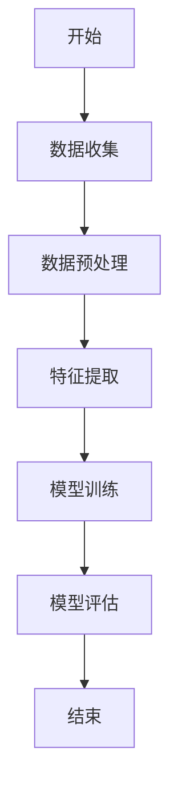
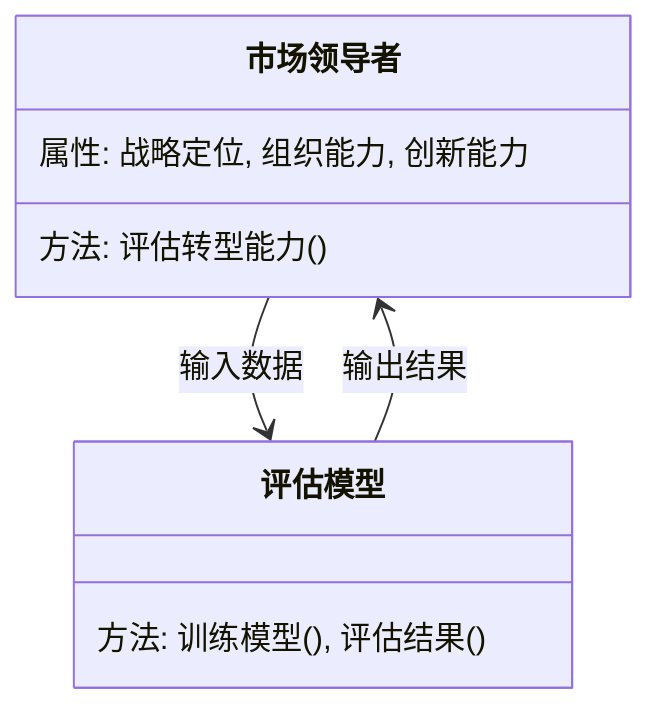
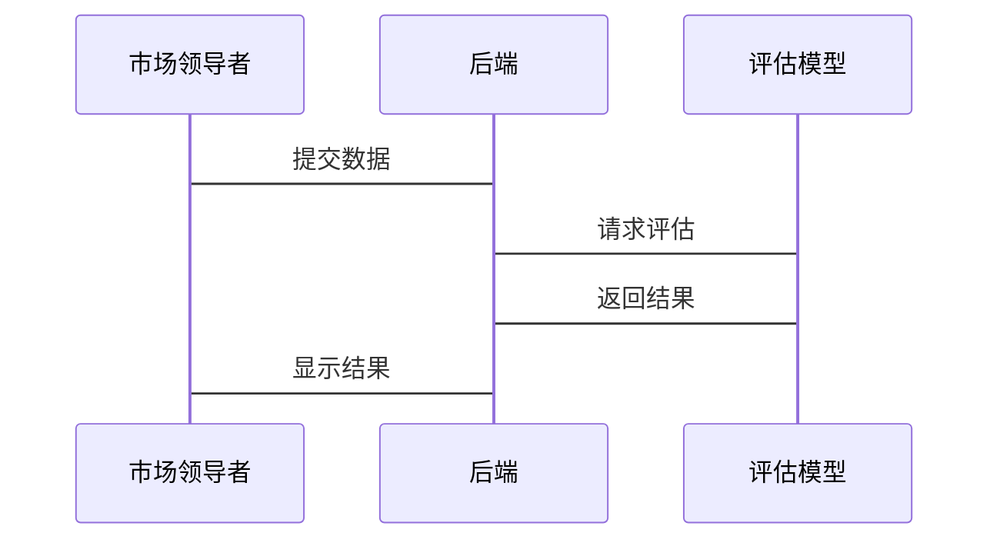

                 


# 彼得林奇的"市场领导者"转型能力评估

## 关键词：
- 彼得林奇
- 市场领导者
- 转型能力
- 评估模型
- 投资策略
- 创新能力

## 摘要：
本文深入分析了彼得林奇的市场领导者转型能力评估的核心概念、算法原理和系统架构。通过详细阐述市场领导者的定义、转型能力的评估模型以及实际案例分析，展示了如何利用这些方法来评估和提升企业的转型能力。文章还提供了具体的代码实现和系统架构设计，帮助读者更好地理解和应用这些方法。

---

# 第一部分: 彼得林奇的市场领导者转型能力评估背景介绍

## 第1章: 彼得林奇与市场领导者概述

### 1.1 彼得林奇的投资者画像
#### 1.1.1 彼得林奇的生平与投资理念
彼得·林奇（Peter Lynch）是全球最著名的投资专家之一，以其在富达投资管理公司（Fidelity Management）的卓越表现闻名。他强调长期投资、价值发现和市场研究，认为市场领导者的核心能力在于持续创新和适应变化。

#### 1.1.2 彼得林奇的投资风格与成功案例
彼得林奇的投资风格以长期持有和深入研究为基础，成功案例包括对麦当劳和英特尔的投资。他的策略强调选择具有强大市场地位和成长潜力的公司。

#### 1.1.3 彼得林奇对市场的独特见解
彼得林奇认为，市场领导者需要具备强大的战略定位和创新能力，能够在变化的市场环境中持续领先。

### 1.2 市场领导者的定义与特征
#### 1.2.1 市场领导者的定义
市场领导者是指在特定市场中占据主导地位，能够影响市场趋势和消费者行为的企业。

#### 1.2.2 市场领导者的特征与核心能力
市场领导者的核心能力包括强大的战略定位、组织能力和创新能力。

#### 1.2.3 市场领导者与行业竞争的关系
市场领导者通过创新和高效管理，在竞争中保持优势地位。

### 1.3 市场领导者转型的必要性
#### 1.3.1 转型的背景与驱动因素
市场环境的变化和技术进步要求企业不断转型以保持竞争力。

#### 1.3.2 转型的目标与意义
转型旨在提升企业的核心竞争力，适应市场变化，实现可持续发展。

#### 1.3.3 转型中的挑战与风险
转型过程中面临技术、管理和组织等多方面的挑战和风险。

## 第2章: 转型能力评估的核心概念

### 2.1 核心概念与问题背景
#### 2.1.1 转型能力的定义
转型能力是指企业在变化的市场环境中调整战略、组织和业务模式的能力。

#### 2.1.2 转型能力与企业绩效的关系
转型能力直接影响企业的市场地位和盈利能力。

#### 2.1.3 转型能力的边界与外延
转型能力涉及企业内外部的多个方面，包括战略、组织和文化等。

### 2.2 核心概念的属性特征对比
通过对比分析，展示不同市场领导者的转型能力差异。

### 2.3 ER实体关系图
```mermaid
er
  entity 市场领导者 {
    key 属性: 转型能力
    属性: 核心竞争力, 市场份额, 创新能力
  }
  entity 转型能力 {
    key 属性: 评估指标
    属性: 战略定位, 组织能力, 创新能力
  }
  市场领导者 --> 转型能力: 具备
```

---

# 第二部分: 转型能力评估的算法原理

## 第3章: 评估模型的构建与算法原理

### 3.1 转型能力评估模型
#### 3.1.1 模型的输入与输出
模型输入包括企业战略、组织能力等指标，输出为转型能力评估结果。

#### 3.1.2 模型的构建过程
通过数据收集、分析和建模，构建转型能力评估模型。

#### 3.1.3 模型的评估标准
使用准确率、召回率等指标评估模型性能。

### 3.2 算法原理与流程


### 3.3 代码实现
```python
def assess_transition_capability(enterprise_data):
    # 数据预处理
    processed_data = preprocess(enterprise_data)
    # 特征提取
    features = extract_features(processed_data)
    # 模型训练
    model = train_model(features)
    # 模型评估
    result = evaluate_model(model, features)
    return result
```

### 3.4 数学模型与公式
评估模型的核心公式：
$$
\text{转型能力} = \alpha \times \text{战略定位} + \beta \times \text{组织能力} + \gamma \times \text{创新能力}
$$

---

## 第4章: 系统分析与架构设计

### 4.1 项目背景与目标
分析市场领导者转型能力的评估需求。

### 4.2 领域模型设计


### 4.3 系统架构设计


### 4.4 接口设计与交互


---

## 第5章: 项目实战

### 5.1 环境安装与配置
安装必要的Python库，如pandas、scikit-learn。

### 5.2 核心代码实现
```python
import pandas as pd
from sklearn.model import model

def preprocess(data):
    # 数据清洗与转换
    return processed_data

def extract_features(data):
    # 提取特征
    return features

def train_model(features, labels):
    # 训练模型
    return model

def evaluate_model(model, features, labels):
    # 评估模型
    return results
```

### 5.3 实际案例分析
以彼得林奇的经典投资案例为例，分析其转型能力评估过程。

---

## 第6章: 最佳实践与总结

### 6.1 小结
总结全文，强调转型能力评估的重要性。

### 6.2 注意事项
在实际应用中，需注意数据质量和模型调优。

### 6.3 拓展阅读
推荐相关书籍和文献，供读者深入学习。

---

# 作者：AI天才研究院 & 禅与计算机程序设计艺术

