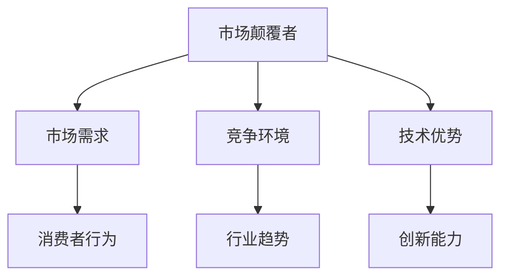
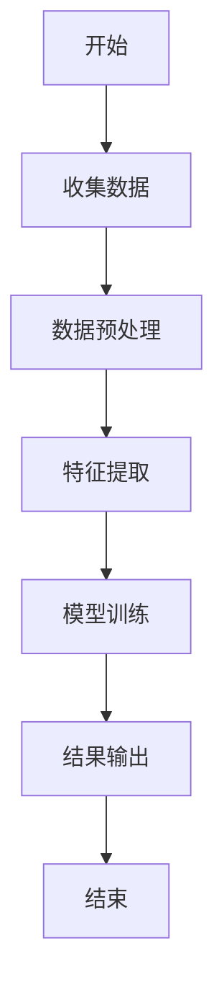

                 


# 目录大纲：《彼得林奇的"市场颠覆者"识别方法》

---

## 关键词：
- 彼得·林奇
- 市场颠覆者
- 识别方法
- 投资策略
- 创新分析

---

## 摘要：
本文系统地介绍如何识别市场颠覆者，基于彼得·林奇的投资理念，结合技术分析方法，提供从理论到实践的完整解决方案。通过案例分析、算法设计和系统架构，帮助读者掌握识别市场颠覆者的技巧，提升投资决策的准确性。

---

## 目录大纲：

### 第1章：市场颠覆者的背景与定义

#### 1.1 市场颠覆者的定义
- 1.1.1 市场颠覆者的概念
- 1.1.2 市场颠覆者的特点
- 1.1.3 市场颠覆者与传统竞争者的区别

#### 1.2 彼得·林奇的投资理念
- 1.2.1 彼得·林奇的简介
- 1.2.2 林奇的投资策略
- 1.2.3 林奇对市场颠覆者的看法

#### 1.3 市场颠覆者识别的重要性
- 1.3.1 识别市场颠覆者的意义
- 1.3.2 市场颠覆者对投资的影响
- 1.3.3 如何在投资中应用市场颠覆者识别

#### 1.4 实际案例分析
- 1.4.1 苹果公司的市场颠覆之路
- 1.4.2 特斯拉如何颠覆汽车市场
- 1.4.3 其他成功案例分析

#### 1.5 本章小结

---

### 第2章：市场颠覆者的核心概念与联系

#### 2.1 核心概念解析
- 2.1.1 创新性
- 2.1.2 市场影响力
- 2.1.3 可持续性

#### 2.2 市场颠覆者属性对比表
- 表格展示：市场颠覆者与非颠覆者的属性对比

#### 2.3 实体关系图


---

### 第3章：市场颠覆者识别的算法原理

#### 3.1 算法概述
- 3.1.1 算法目标
- 3.1.2 算法步骤

#### 3.2 算法流程图


#### 3.3 算法实现代码
```python
def identify_market_disruptor(data):
    # 数据预处理
    processed_data = preprocess(data)
    # 特征提取
    features = extract_features(processed_data)
    # 模型训练
    model = train_model(features)
    # 结果输出
    result = model.predict(features)
    return result
```

#### 3.4 数学模型与公式
- 3.4.1 市场影响力评分公式：
  $$ \text{评分} = \sum_{i=1}^{n} w_i \cdot f_i $$
  其中，\( w_i \) 是第 \( i \) 个特征的权重，\( f_i \) 是第 \( i \) 个特征的值。
- 3.4.2 可持续性预测模型：
  $$ P(s) = \frac{\sum w_i \cdot f_i}{\sum w_i} $$
  其中，\( P(s) \) 是市场颠覆者的概率。

---

### 第4章：系统分析与架构设计

#### 4.1 问题场景介绍
- 市场分析的需求
- 投资者面临的挑战

#### 4.2 系统功能设计
- 4.2.1 数据采集模块
  - 从多种数据源收集市场信息
- 4.2.2 数据分析模块
  - 使用算法识别市场颠覆者
- 4.2.3 结果展示模块
  - 可视化分析结果

#### 4.3 系统架构设计


#### 4.4 接口设计
- 数据输入接口
- 数据处理接口
- 结果输出接口

#### 4.5 交互序列图


---

### 第5章：项目实战与案例分析

#### 5.1 环境安装
- 安装必要的Python库
- 数据库安装与配置

#### 5.2 核心代码实现
```python
import pandas as pd
from sklearn.model import Model

def main():
    data = pd.read_csv('market_data.csv')
    processed_data = preprocess(data)
    features = extract_features(processed_data)
    model = train_model(features)
    result = model.predict(features)
    print(result)

if __name__ == '__main__':
    main()
```

#### 5.3 代码解读与分析
- 数据预处理
- 特征提取
- 模型训练
- 结果展示

#### 5.4 实际案例分析
- 案例一：科技公司分析
- 案例二：新兴市场分析
- 案例三：行业趋势分析

#### 5.5 项目小结

---

### 第6章：最佳实践与总结

#### 6.1 最佳实践 tips
- 数据质量的重要性
- 模型调优的技巧
- 结果验证的方法

#### 6.2 小结
- 识别市场颠覆者的关键点
- 如何将理论应用到实际投资中

#### 6.3 注意事项
- 数据偏差的风险
- 模型局限性的应对
- 市场变化的不确定性

#### 6.4 拓展阅读
- 推荐书籍和资源
- 进一步学习的方向

---

## 作者：AI天才研究院 & 禅与计算机程序设计艺术

---

**备注：**
- 本文提供了一个详细的目录大纲，您可以根据实际需求调整章节内容。
- 如果需要进一步扩展或细化某一部分，请随时告知！

