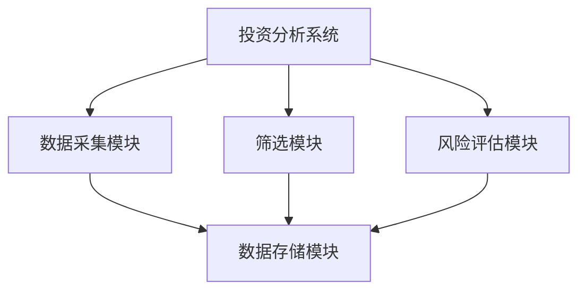

                 


# 彼得·林奇的“成长型价值股”在不同市场规模中的表现

## 关键词：彼得·林奇、成长型价值股、市场规模、股票分析、投资策略、风险管理

## 摘要：  
本文探讨了彼得·林奇的成长型价值股投资策略在不同市场规模中的表现，分析了其在小盘股、中盘股和大盘股中的优缺点，并结合实际案例和数据分析，提供了实用的投资建议和风险管理策略。

---

## 第一部分: 成长型价值股的背景与核心概念

### 第1章: 成长型价值股的基本概念

#### 1.1 成长型价值股的定义  
成长型价值股是指那些收入和利润持续增长，同时估值相对合理的公司股票。这类股票通常具有较高的成长潜力，但价格尚未被市场充分反映。彼得·林奇认为，成长型价值股是投资组合中的核心部分，能够为投资者带来长期稳定的收益。

#### 1.2 彼得·林奇的投资理念  
彼得·林奇是成长型价值股投资的代表人物，他的投资策略强调基本面分析和长期持有。他认为，选择具有强大基本面和管理团队的公司，能够在长期内实现超额收益。林奇的筛选标准包括收入增长率、净利润率和ROE（净资产收益率）等关键指标。

---

### 第2章: 不同市场规模的定义与特点  

#### 2.1 市场规模的分类  
市场规模通常分为小盘股（市值较小）、中盘股（市值中等）和大盘股（市值较大）。不同规模的股票在流动性、风险和收益方面存在显著差异：

| 市场规模 | 特点 | 风险 | 收益 |
|----------|------|------|------|
| 小盘股 | 成长潜力大，流动性较低 | 高风险 | 高收益 |
| 中盘股 | 稳定性较好，流动性适中 | 中风险 | 平衡收益 |
| 大盘股 | 防御性强，流动性高 | 低风险 | 低收益 |

#### 2.2 不同市场规模中的投资机会  
- **小盘股**：通常具有较高的增长潜力，但波动性较大，适合风险承受能力强的投资者。
- **中盘股**：兼具成长性和稳定性，适合平衡型投资者。
- **大盘股**：稳定性高，适合保守型投资者。

---

## 第二部分: 成长型价值股的核心概念与联系  

### 第3章: 成长型价值股的筛选标准  

#### 3.1 成长型价值股的筛选指标  
彼得·林奇在筛选成长型价值股时，重点关注以下指标：

1. **收入增长率**：年收入增长率应保持在10%以上。
2. **净利润增长率**：净利润应持续增长，且增速高于行业平均水平。
3. **ROE（净资产收益率）**：ROE应保持在15%以上，反映公司的盈利能力。
4. **市盈率（P/E）与市净率（P/B）**：估值应合理，低于行业平均水平。

#### 3.2 成长型价值股与市场规模的关系  
- **小盘股**：更容易满足高增长的条件，但筛选难度较大。
- **中盘股**：成长性和稳定性较好，筛选较为容易。
- **大盘股**：通常增长潜力较小，但稳定性较高。

---

## 第三部分: 成长型价值股在不同市场规模中的表现分析  

### 第4章: 小盘股中的成长型价值股表现  

#### 4.1 小盘股的特点与投资机会  
小盘股通常具有较高的成长潜力，但也伴随着较高的风险。彼得·林奇认为，小盘股中的成长型价值股是投资组合中最具吸引力的部分，但需要谨慎筛选。

#### 4.2 彼得·林奇在小盘股中的投资实践  
林奇在小盘股中寻找那些收入和利润持续增长、估值合理的公司。例如，他在上世纪80年代投资的许多小盘股最终成长为大盘股，为投资组合带来了丰厚的回报。

---

### 第5章: 中盘股中的成长型价值股表现  

#### 5.1 中盘股的特点与投资机会  
中盘股通常具有较高的稳定性，同时兼具一定的成长性。彼得·林奇认为，中盘股是成长型价值股投资的“ sweet spot ”，即风险和收益的平衡点。

#### 5.2 彼得·林奇在中盘股中的筛选策略  
林奇在中盘股中重点关注那些收入和利润稳定增长、估值合理的公司。例如，他在中盘股中投资的公司通常在行业内具有竞争优势，且管理层表现出色。

---

### 第6章: 大盘股中的成长型价值股表现  

#### 6.1 大盘股的特点与投资机会  
大盘股通常具有较高的防御性，但在成长潜力方面相对较弱。彼得·林奇认为，大盘股中的成长型价值股较为稀缺，但适合保守型投资者。

#### 6.2 彼得·林奇在大盘股中的投资策略  
林奇在大盘股中寻找那些具有稳定增长记录、估值合理的公司。例如，他在大盘股中投资的公司通常在行业内具有领先地位，且具备较强的抗周期性。

---

## 第四部分: 投资分析系统的构建  

### 第7章: 系统分析与架构设计  

#### 7.1 系统功能设计  
- 数据采集模块：获取公司基本面数据。
- 筛选模块：根据彼得·林奇的筛选标准，筛选成长型价值股。
- 风险评估模块：评估不同市场规模中的风险。

#### 7.2 系统架构设计  
以下是系统的架构图：



---

### 第8章: 项目实战  

#### 8.1 环境安装  
需要安装Python和相关数据处理库（如Pandas、NumPy等）。

#### 8.2 核心代码实现  
以下是成长型价值股筛选的Python代码：

```python
import pandas as pd

def screen_growth_stocks(df, growth_rate=10, roe=15):
    # 筛选收入增长率大于等于growth_rate的公司
    revenue_growth = df['收入增长率'].ge(growth_rate)
    # 筛选ROE大于等于roe的公司
    roe_filter = df['ROE'].ge(roe)
    # 筛选市盈率小于行业平均值的公司
    pe_filter = df['市盈率'].lt(df['行业平均市盈率'])
    # 综合筛选
    selected = df[revenue_growth & roe_filter & pe_filter]
    return selected

# 示例数据
data = {
    '公司': ['A', 'B', 'C', 'D'],
    '收入增长率': [15, 8, 12, 10],
    'ROE': [20, 10, 18, 12],
    '市盈率': [15, 20, 12, 18],
    '行业平均市盈率': [16, 18, 14, 15]
}
df = pd.DataFrame(data)

# 调用筛选函数
selected = screen_growth_stocks(df)
print(selected)
```

---

## 第五部分: 最佳实践与总结  

### 第9章: 投资建议与风险管理  

#### 9.1 投资建议  
1. **分散投资**：在不同市场规模中分散投资，降低风险。
2. **长期持有**：成长型价值股需要时间才能体现其价值。
3. **定期调整**：根据市场变化和公司基本面，定期调整投资组合。

#### 9.2 风险管理  
1. **设置止损点**：当股价下跌超过一定比例时，及时止损。
2. **关注宏观经济**：宏观经济的变化会影响股市表现。
3. **分散行业风险**：避免将所有资金投入到单一行业。

---

## 附录: 扩展阅读与工具推荐  

### 附录A: 推荐书籍  
1. 《彼得·林奇的投资哲学》
2. 《股票作手回忆录》

### 附录B: 工具推荐  
1. Python编程语言
2. Pandas、NumPy等数据处理库
3. Matplotlib或Seaborn用于数据可视化

---

## 作者：AI天才研究院/AI Genius Institute & 禅与计算机程序设计艺术 /Zen And The Art of Computer Programming

---

通过本文的分析，读者可以全面理解彼得·林奇的成长型价值股投资策略在不同市场规模中的表现，并能够结合实际数据和案例，制定适合自己的投资策略。

