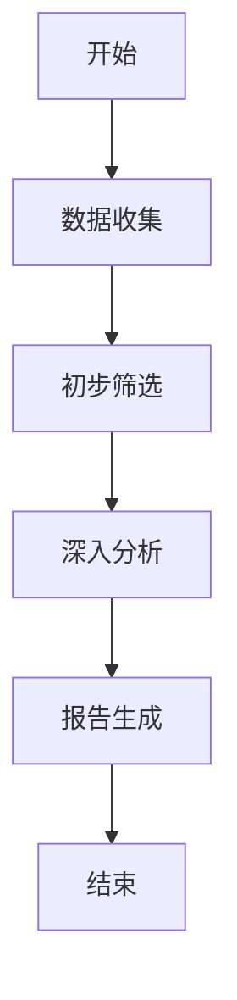
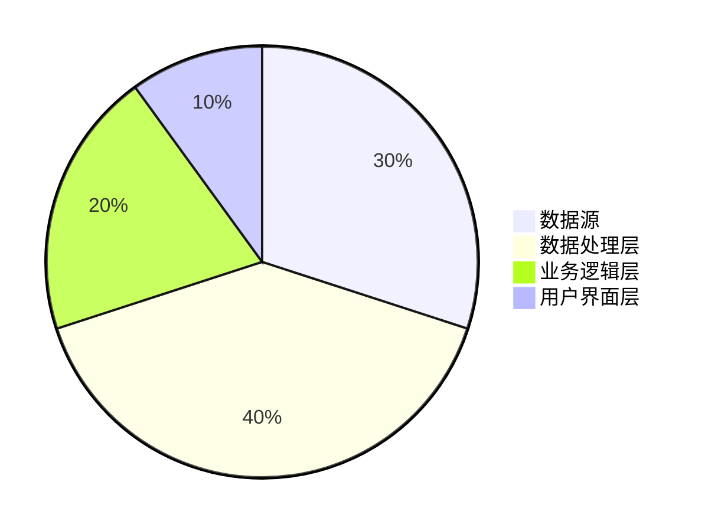

                 


# 彼得林奇的"成长型价值股"定义

---

## 关键词：成长型价值股、彼得林奇、投资学、股票分析、投资策略、价值投资

---

## 摘要：

本文深入探讨了彼得林奇的“成长型价值股”定义，从其背景、核心概念、筛选算法、系统架构到实际应用，逐一进行详细分析。通过介绍成长型价值股的定义、属性特征、筛选方法和实际案例，本文为投资者提供了全面的理解和实用的指导。

---

## 第1章: 成长型价值股的背景与起源

### 1.1 投资学的基本概念

#### 1.1.1 股票投资的基本原理

股票投资是金融市场中最常见的投资方式之一，其核心在于通过购买公司股权，获得未来收益或资本增值。股票的价值取决于多种因素，包括公司的财务状况、行业地位、市场前景等。投资者需要通过分析这些因素来判断股票的投资价值。

#### 1.1.2 价值投资的定义与核心理念

价值投资是一种投资策略，强调以低于其内在价值的价格购买优质股票。其核心理念是寻找市场低估的公司，并长期持有，等待其价值回归。价值投资的代表人物包括本杰明·格雷厄姆和 Warren Buffett。

#### 1.1.3 成长型投资与价值型投资的对比

- **价值型投资**：注重低估值，寻找市场价格低于内在价值的股票。
- **成长型投资**：注重高成长潜力，寻找收入和利润持续增长的公司。

### 1.2 彼得林奇与成长型价值股

#### 1.2.1 彼得林奇的生平简介

彼得·林奇（Peter Lynch）是美国著名的投资专家，曾担任富达麦哲伦基金（Fidelity Magellan Fund）的经理，创造了年均29%的复合收益率。他以独特的投资风格和对成长型股票的深入研究闻名。

#### 1.2.2 彼得林奇的投资理念

彼得林奇认为，成功的投资需要深入研究公司基本面，关注公司的成长潜力和竞争优势。他强调，成长型股票不仅要有合理的估值，还要有持续的收入和利润增长。

#### 1.2.3 成长型价值股的定义与特点

成长型价值股是指那些具有较高成长潜力，同时估值合理的股票。这类股票通常具有较高的ROE（净资产收益率）、稳定的收入增长和良好的行业前景。

---

## 第2章: 成长型价值股的核心概念与属性

### 2.1 成长型价值股的定义与特征

#### 2.1.1 成长型价值股的核心要素

- **收入增长**：公司收入持续增长，且增速高于行业平均水平。
- **利润增长**：公司净利润持续增长，且盈利能力稳定。
- **估值合理**：市盈率（P/E）和市净率（P/B）等指标处于合理区间。

#### 2.1.2 成长型价值股的属性特征对比表

| 属性         | 成长型价值股特征 | 其他类型股票特征 |
|--------------|------------------|------------------|
| 收入增长      | 高且持续         | 低或不稳定       |
| 利润增长      | 高且持续         | 低或不稳定       |
| 估值          | 合理             | 高或低           |
| 行业前景      | 良好             | 一般或较差       |
| 竞争优势      | 明显             | 不明显或较弱     |

#### 2.1.3 成长型价值股与其它类型股票的对比分析

通过对比分析，我们可以发现成长型价值股在收入、利润和行业前景等方面具有显著优势。这类股票通常具有较高的成长潜力，适合长期投资。

---

## 第3章: 成长型价值股的筛选算法与数学模型

### 3.1 成长型价值股的筛选算法

#### 3.1.1 算法原理与流程

筛选成长型价值股的算法基于以下步骤：

1. **数据收集**：收集目标公司的财务数据，包括收入、利润、市盈率等。
2. **初步筛选**：根据设定的条件（如收入增长率、利润增长率等）筛选出符合条件的股票。
3. **深入分析**：对筛选出的股票进行进一步分析，包括行业前景、竞争优势等。
4. **最终筛选**：根据综合分析结果，确定最终的成长型价值股。

#### 3.1.2 算法的实现步骤

以下是一个简单的Python实现示例：

```python
def screen_growth_stocks(stocks):
    screened_stocks = []
    for stock in stocks:
        if stock['revenue_growth'] > 10 and stock['net_profit_growth'] > 10:
            screened_stocks.append(stock)
    return screened_stocks
```

#### 3.1.3 算法的优缺点分析

- **优点**：筛选过程自动化，节省时间，提高效率。
- **缺点**：需要依赖高质量的数据，且可能忽略一些潜在的优质股票。

### 3.2 成长型价值股的数学模型与公式

#### 3.2.1 市盈率（P/E）的计算公式

$$ P/E = \frac{Price}{Earnings} $$

#### 3.2.2 市净率（P/B）的计算公式

$$ P/B = \frac{Price}{Book\ Value} $$

#### 3.2.3 净资产收益率（ROE）的计算公式

$$ ROE = \frac{Net\ Profit}{Total\ Equity} $$

---

## 第4章: 成长型价值股的系统分析与架构设计

### 4.1 系统功能设计

#### 4.1.1 投资者需求分析

投资者需要一个高效的系统来筛选和分析成长型价值股，包括数据收集、筛选、分析和报告生成等功能。

#### 4.1.2 系统功能模块划分

- **数据收集模块**：收集股票数据。
- **筛选模块**：根据设定的条件筛选股票。
- **分析模块**：对筛选出的股票进行深入分析。
- **报告生成模块**：生成分析报告。

#### 4.1.3 系统功能流程图



### 4.2 系统架构设计

#### 4.2.1 系统架构图的构建



#### 4.2.2 系统架构的实现方式

系统架构采用分层设计，包括数据源、数据处理层、业务逻辑层和用户界面层。各层之间通过接口进行通信。

#### 4.2.3 系统架构的优化建议

- **数据源**：使用可靠的第三方数据源。
- **数据处理层**：优化数据处理流程，提高效率。
- **业务逻辑层**：模块化设计，便于维护和扩展。
- **用户界面层**：设计直观的界面，提高用户体验。

---

## 第5章: 成长型价值股的项目实战

### 5.1 环境安装与配置

#### 5.1.1 投资分析工具的安装

安装常用的股票分析工具，如Excel、Python（Pandas库）等。

#### 5.1.2 数据库的搭建与配置

选择合适的数据库，如MySQL，搭建数据存储环境。

#### 5.1.3 开发环境的配置

安装Python环境，配置相关库（如Pandas、NumPy等）。

### 5.2 核心代码实现

#### 5.2.1 股票筛选算法的Python实现

```python
import pandas as pd

def screen_growth_stocks(stocks_df):
    # 筛选条件：收入增长率 > 10%，净利润增长率 > 10%
    screened_stocks = stocks_df[(stocks_df['revenue_growth'] > 10) &
                                (stocks_df['net_profit_growth'] > 10)]
    return screened_stocks

# 示例数据
data = {
    'stock': ['A', 'B', 'C', 'D'],
    'revenue_growth': [15, 8, 20, 5],
    'net_profit_growth': [12, 7, 22, 3]
}
stocks_df = pd.DataFrame(data)

# 调用函数
result = screen_growth_stocks(stocks_df)
print(result)
```

#### 5.2.2 代码应用解读与分析

上述代码通过筛选收入增长率和净利润增长率超过10%的股票，实现成长型价值股的初步筛选。通过数据框的形式，代码可以方便地处理和分析大量数据。

#### 5.2.3 实际案例分析

以某行业为例，分析筛选出的股票是否符合成长型价值股的定义，并进行深入分析。

---

## 第6章: 成长型价值股的最佳实践

### 6.1 小结

成长型价值股是一种结合了成长性和估值合理性的投资策略。通过本文的分析，我们可以更好地理解其定义和筛选方法。

### 6.2 注意事项

- **数据质量**：确保数据的准确性和完整性。
- **市场变化**：关注市场动态，及时调整投资策略。
- **风险控制**：合理控制风险，避免过度集中投资。

### 6.3 拓展阅读

- Peter Lynch的《投资之道》
- 价值投资的经典书籍，如《聪明的投资者》

---

## 作者：AI天才研究院/AI Genius Institute & 禅与计算机程序设计艺术 /Zen And The Art of Computer Programming

