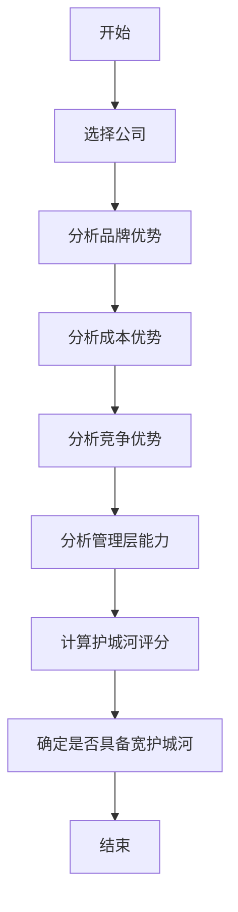
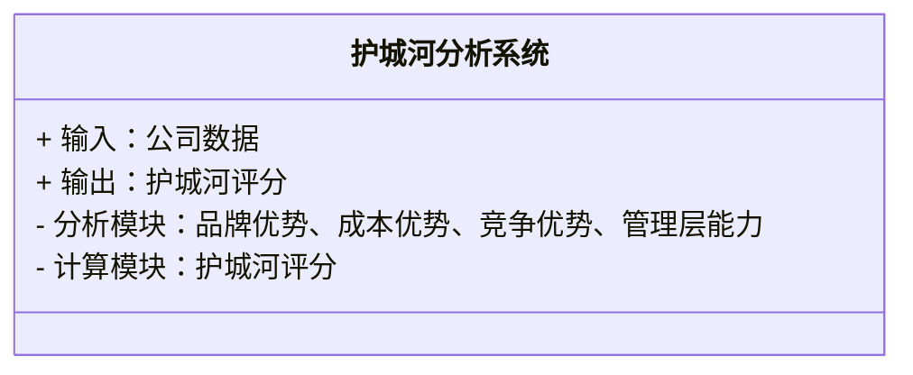
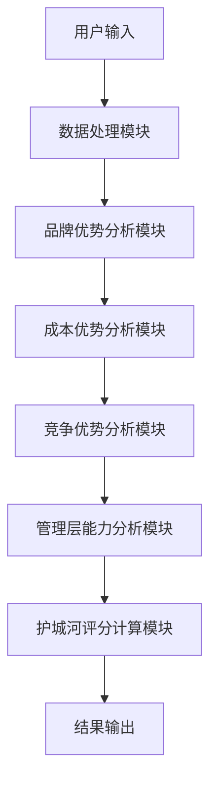

                 


# 彼得林奇的"护城河"理论在选股中的应用

> 关键词：彼得·林奇，护城河理论，选股策略，投资分析，财务指标，竞争优势

> 摘要：本文深入探讨彼得·林奇的“护城河”理论在选股中的应用，分析其核心概念、数学模型、算法实现以及系统架构，结合实际案例，提供全面的理论与实践指导。

---

## 第一部分: 护城河理论的背景与核心概念

### 第1章: 护城河理论的背景与发展

#### 1.1 护城河理论的定义与核心要素

- **护城河理论的核心概念**
  - 护城河是公司抵御竞争的核心能力。
  - 包括品牌优势、成本优势、竞争优势和管理层质量。

- **彼得·林奇与护城河理论**
  - 彼得·林奇提出护城河理论用于评估公司的长期投资价值。
  - 强调选择具备宽护城河的公司。

#### 1.2 护城河理论的背景与发展

- **投资学中的护城河理论**
  - 护城河是公司竞争优势的体现。
  - 通过分析财务指标和市场表现，评估公司的护城河宽度。

- **护城河理论的演变**
  - 从竞争优势理论到护城河理论的转变。
  - 护城河理论在投资分析中的重要性。

### 第2章: 护城河理论在选股中的应用

#### 2.1 护城河分析的步骤与方法

- **护城河分析的步骤**
  1. 确定公司的核心竞争力。
  2. 分析公司的财务状况。
  3. 评估公司的管理层能力。
  4. 判断公司的护城河宽度。

- **护城河分析的核心要素**
  - 品牌优势：公司品牌影响力。
  - 成本优势：公司成本控制能力。
  - 竞争优势：公司在市场中的独特地位。
  - 管理层质量：公司管理层的能力和决策。

#### 2.2 护城河理论与投资策略

- **护城河理论与价值投资**
  - 选择具备宽护城河的公司，长期持有。

- **护城河理论与成长投资**
  - 关注具备成长性的公司，评估其护城河宽度。

- **护城河理论与风险管理**
  - 通过护城河分析，识别投资风险。

---

## 第二部分: 护城河分析的数学模型与算法实现

### 第3章: 护城河评分模型

#### 3.1 护城河评分模型的构建

- **模型的输入变量**
  - 品牌影响力、成本优势、竞争优势、管理层能力。

- **模型的评分标准**
  - 品牌优势：1-5分。
  - 成本优势：1-5分。
  - 竞争优势：1-5分。
  - 管理层能力：1-5分。

- **模型的计算公式**
  - 总分 = 品牌优势 + 成本优势 + 竞争优势 + 管理层能力。

#### 3.2 护城河评分模型的优缺点

- **模型的优点**
  - 简单易懂，易于操作。
  - 能够量化公司的护城河宽度。

- **模型的局限性**
  - 评分标准主观性强。
  - 忽略了其他重要因素（如市场环境）。

### 第4章: 基于护城河理论的选股算法实现

#### 4.1 护城河分析的流程图



#### 4.2 护城河分析的数学模型

- **护城河评分公式**
  $$ 护城河评分 = \frac{品牌优势 + 成本优势 + 竞争优势 + 管理层能力}{4} $$

- **护城河宽度判断**
  - 若护城河评分 ≥ 4，则具备宽护城河。
  - 若护城河评分 < 4，则不具备宽护城河。

#### 4.3 护城河分析的代码实现

```python
def calculate_h护城河评分（brand, cost, competition, management）：
    return (brand + cost + competition + management) / 4

def is宽护城河评分(score):
    return score >= 4

# 示例
brand = 5
cost = 4
competition = 5
management = 4
score = calculate_h护城河评分(brand, cost, competition, management)
is_wide = is宽护城河评分(score)
print(f"护城河评分：{score}")
print(f"是否具备宽护城河：{is_wide}")
```

---

## 第三部分: 护城河分析的系统设计与项目实战

### 第5章: 护城河分析系统的架构设计

#### 5.1 系统功能设计



#### 5.2 系统架构设计



### 第6章: 项目实战与案例分析

#### 6.1 环境安装与配置

- 安装Python和相关库（如pandas、numpy）。
- 安装jupyter notebook用于数据分析和可视化。

#### 6.2 核心代码实现

```python
import pandas as pd
import numpy as np

def calculate_h护城河评分(row):
    return (row['品牌优势'] + row['成本优势'] + row['竞争优势'] + row['管理层能力']) / 4

def is宽护城河评分(score):
    return score >= 4

# 示例数据
data = {
    '公司': ['A', 'B', 'C'],
    '品牌优势': [5, 3, 4],
    '成本优势': [4, 2, 3],
    '竞争优势': [5, 3, 4],
    '管理层能力': [4, 4, 3]
}

df = pd.DataFrame(data)
df['护城河评分'] = df.apply(calculate_h护城河评分, axis=1)
df['是否具备宽护城河'] = df['护城河评分'].apply(is宽护城河评分)

print(df)
```

#### 6.3 案例分析与结果解读

- 示例公司A：护城河评分4.5，具备宽护城河。
- 示例公司B：护城河评分3，不具备宽护城河。
- 示例公司C：护城河评分3.75，接近具备宽护城河。

---

## 第四部分: 总结与展望

### 第7章: 总结与最佳实践

#### 7.1 总结

- 护城河理论是选股的重要工具。
- 通过分析公司的品牌优势、成本优势、竞争优势和管理层能力，可以有效评估公司的护城河宽度。

#### 7.2 最佳实践

- 定期更新公司的财务数据和市场信息。
- 结合其他分析方法（如PE、PB分析）进行综合判断。
- 长期关注具备宽护城河的公司，进行价值投资。

#### 7.3 注意事项

- 护城河评分模型的主观性较强，需结合实际情况调整。
- 市场环境的变化可能影响护城河的宽度。
- 投资需谨慎，建议在专业指导下进行。

#### 7.4 拓展阅读

- 彼得·林奇的《选股的艺术》。
- 其他相关投资书籍和学术论文。

---

# 作者：AI天才研究院 & 禅与计算机程序设计艺术

---

通过以上内容，我们系统地介绍了彼得·林奇的“护城河”理论在选股中的应用，从理论基础到数学模型，再到系统实现和项目实战，为读者提供了全面的指导。希望本文能帮助投资者更好地应用护城河理论，做出明智的投资决策。

