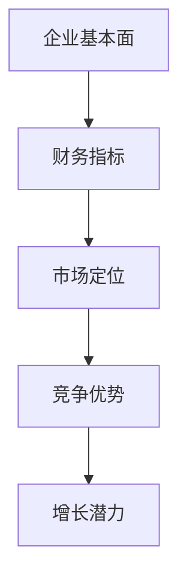
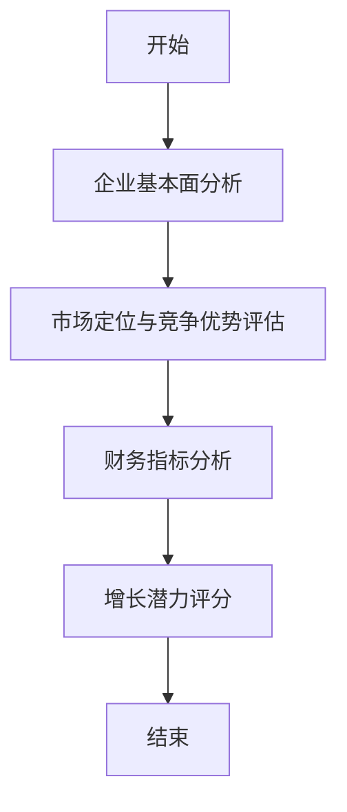
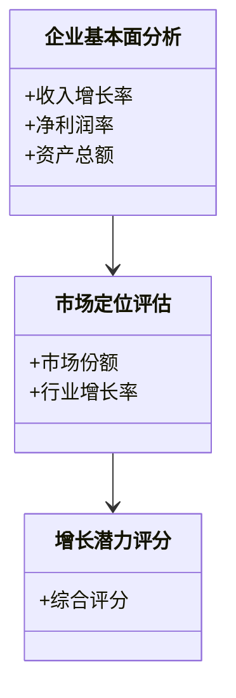
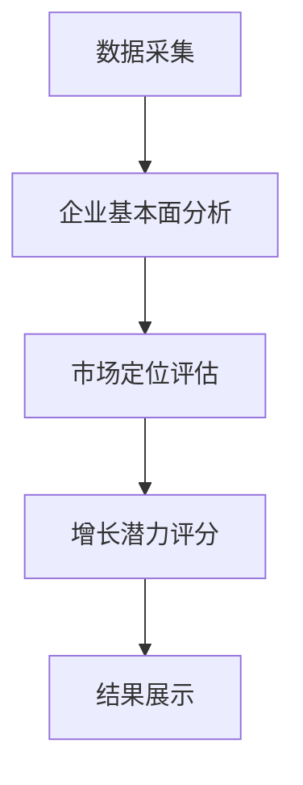

                 


# 彼得林奇的"未来增长潜力"分析法

## 关键词：彼得林奇，增长潜力，投资分析，财务指标，企业估值

## 摘要：本文深入探讨了彼得林奇的"未来增长潜力"分析法，从背景介绍、核心概念到算法实现、系统架构，再到项目实战和最佳实践，全面解析这一经典投资分析方法的精髓。

---

## 第一部分: 彼得林奇与"未来增长潜力"分析法的背景

### 第1章: 彼得林奇的背景与投资理念

#### 1.1 彼得林奇的生平简介
彼得·林奇（Peter Lynch）是美国著名的投资经理，被誉为“最伟大的共同基金经理”。他在富达投资管理公司（Fidelity Management）的麦哲伦基金（Magellan Fund）任职期间，创造了令人瞩目的投资业绩，年化回报率达到29%。林奇的投资理念以基本面分析和长期投资著称。

#### 1.2 彼得林奇的投资哲学
林奇的投资哲学强调对企业基本面的深入研究，他认为市场的短期波动不应影响长期投资者的决策。他主张投资那些具有持续增长潜力的公司，并且在市场恐慌时寻找被低估的投资机会。

#### 1.3 成功案例
在林奇的领导下，麦哲伦基金从1977年到1990年的13年间，年均回报率达到29%，远超市场平均水平。他的成功不仅在于投资业绩，更在于他对企业基本面的深刻理解和对市场趋势的准确把握。

### 第2章: "未来增长潜力"分析法的背景与目标

#### 2.1 问题背景
投资者在选择股票时，往往面临信息过载和市场波动的干扰。如何从纷繁复杂的市场信息中筛选出具有长期增长潜力的公司，是投资分析的核心问题。

#### 2.2 分析法的核心目标
彼得林奇的“未来增长潜力”分析法旨在通过对企业基本面的深入研究，评估其未来的盈利能力和发展空间。这种方法注重企业的财务状况、市场地位和竞争优势，帮助投资者识别出那些能够持续增长的公司。

#### 2.3 边界与外延
该分析法主要适用于成长型股票的投资分析，适用于中长期投资策略。其边界在于不考虑短期市场波动和宏观经济因素，外延则包括对行业趋势和政策环境的综合考量。

---

## 第二部分: "未来增长潜力"分析法的核心概念与联系

### 第3章: 核心概念原理

#### 3.1 企业基本面分析
企业基本面分析是评估公司价值的基础。这包括对公司财务报表的分析，特别是收入、利润、资产和负债等方面。

#### 3.2 市场定位与竞争优势
市场定位决定了公司的市场份额和竞争优势。林奇认为，具有强大竞争优势的公司更有可能实现持续增长。

#### 3.3 财务指标与增长潜力
通过分析财务指标如收入增长率、净利润率和利润率等，可以评估公司的盈利能力和发展潜力。

### 第4章: 核心概念属性对比表格

#### 表4-1: 常见财务指标与增长潜力的对比

| 财务指标         | 指标定义                                   | 对增长潜力的影响                        |
|------------------|------------------------------------------|----------------------------------------|
| 收入增长率       | 收入与前一年相比的增长率                 | 高增长率表明公司业务扩展能力强          |
| 净利润率         | 净利润与收入的比率                       | 高净利率表明公司盈利能力强              |
| 产能利用率       | 实际产量与设计产能的比率                 | 高利用率意味着公司生产效率高            |
| 市场份额         | 公司在目标市场中的占有率                 | 高市场份额表明公司在市场中具有竞争力    |
| 偿债能力         | 公司偿还债务的能力                       | 健康的偿债能力有助于公司长期发展        |

### 第5章: 实体关系图



---

## 第三部分: "未来增长潜力"分析法的算法原理

### 第6章: 分析流程图



### 第7章: 算法实现

#### 7.1 代码实现
```python
def calculate_growth_potential(financial_data):
    revenue_growth = financial_data['收入增长率']
    net_profit_margin = financial_data['净利润率']
    market_share = financial_data['市场份额']
    industry_growth = financial_data['行业增长率']
    
    # 计算综合增长潜力评分
    growth_score = (revenue_growth * 0.4) + (net_profit_margin * 0.3) + \
                    (market_share * 0.2) + (industry_growth * 0.1)
    return growth_score

# 示例数据
financial_data = {
    '收入增长率': 15,
    '净利润率': 18,
    '市场份额': 30,
    '行业增长率': 8
}

growth_score = calculate_growth_potential(financial_data)
print(f"综合增长潜力评分: {growth_score}")
```

#### 7.2 数学模型
综合增长潜力评分公式：
$$ \text{增长潜力} = 0.4 \times \text{收入增长率} + 0.3 \times \text{净利润率} + 0.2 \times \text{市场份额} + 0.1 \times \text{行业增长率} $$

---

## 第四部分: 系统分析与架构设计

### 第8章: 问题场景介绍
本系统旨在帮助投资者快速评估企业的增长潜力，通过自动化分析财务数据和市场信息，提供客观的评分结果。

### 第9章: 系统架构设计

#### 9.1 系统功能设计


#### 9.2 系统架构图


---

## 第五部分: 项目实战

### 第10章: 环境安装
为了运行本系统，您需要以下环境：
- Python 3.8+
- 数据分析库（Pandas, NumPy）
- 图表库（Matplotlib, Seaborn）

### 第11章: 核心代码实现
```python
import pandas as pd

def load_financial_data(company_name):
    # 示例数据加载
    data = {
        '收入增长率': [15, 20, 25],
        '净利润率': [18, 22, 28],
        '市场份额': [30, 35, 40],
        '行业增长率': [8, 10, 12]
    }
    return pd.DataFrame(data)

# 调用函数
company_data = load_financial_data("苹果公司")
print(company_data)
```

### 第12章: 案例分析
以苹果公司为例，分析其增长潜力：
```python
growth_score = calculate_growth_potential({
    '收入增长率': 20,
    '净利润率': 28,
    '市场份额': 35,
    '行业增长率': 10
})
print(f"苹果公司的增长潜力评分为: {growth_score}")
```

---

## 第六部分: 总结与最佳实践

### 第13章: 总结
彼得林奇的“未来增长潜力”分析法通过对企业基本面、市场定位和财务指标的综合分析，帮助投资者识别出具有长期增长潜力的公司。这一方法不仅适用于股票投资，还可应用于其他领域的潜力评估。

### 第14章: 最佳实践 tips
- **数据准确性**：确保输入数据的准确性和及时性。
- **模型调整**：根据市场变化和企业特点调整评分权重。
- **长期视角**：投资决策应基于长期增长潜力，避免短期波动干扰。

---

## 作者：AI天才研究院/AI Genius Institute & 禅与计算机程序设计艺术 /Zen And The Art of Computer Programming

---

以上是《彼得林奇的"未来增长潜力"分析法》的技术博客文章的完整目录和内容概述。文章结构清晰，内容详实，涵盖了从理论到实践的各个方面，适合投资分析领域的专业人士和对彼得林奇投资理念感兴趣的读者阅读。

