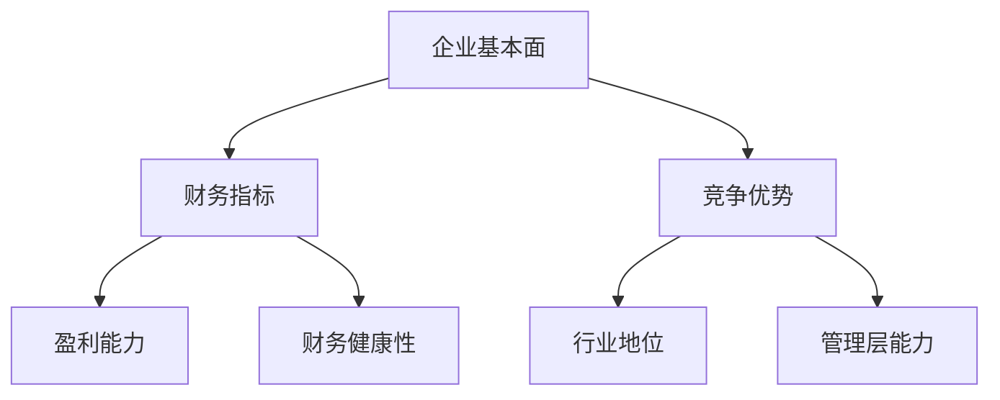
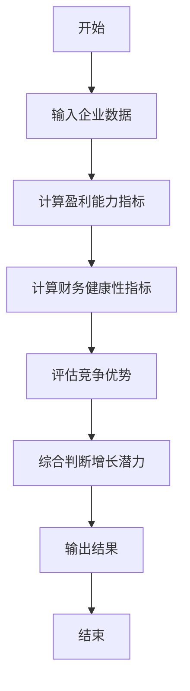
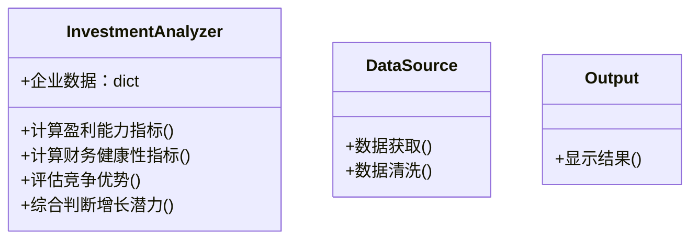
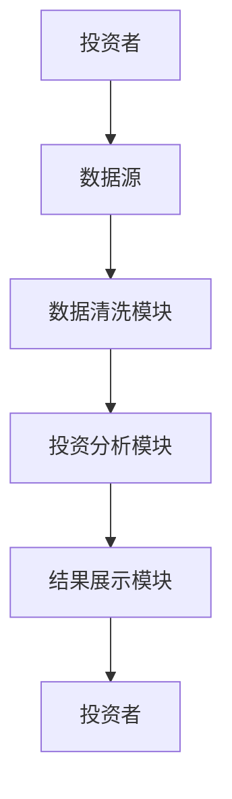

                 


# 彼得林奇的"未来增长潜力"分析法

---

## 关键词：
- 彼得林奇
- 未来增长潜力
- 投资分析
- 企业估值
- 财务指标

---

## 摘要：
本文深入探讨了彼得林奇的“未来增长潜力”分析法，从其核心理念到具体实施步骤进行了全面解析。通过详细的案例分析和系统设计，展示了如何利用该方法评估企业的长期增长潜力，并为投资者提供科学的决策依据。文章内容涵盖背景介绍、核心概念、算法原理、系统设计、项目实战及最佳实践，帮助读者掌握这一经典的投资分析方法。

---

# 第1章：彼得林奇与“未来增长潜力”分析法概述

## 1.1 彼得林奇的生平与投资理念
彼得·林奇（Peter Lynch）是全球最著名的职业投资人之一，他在任职波士顿基金（Fidelity）期间创造了辉煌的投资业绩，年化收益率高达29%。他的投资理念强调长期成长型股票的投资，注重对企业基本面的深入分析，尤其是企业的未来增长潜力。

## 1.2 “未来增长潜力”分析法的背景与意义
企业的未来增长潜力是决定其股票价值的关键因素。彼得林奇通过对企业财务状况、行业地位、竞争优势等方面的研究，提出了“未来增长潜力”分析法，帮助投资者识别那些具有持续增长能力的企业。

---

# 第2章：彼得林奇分析法的核心概念与联系

## 2.1 核心概念原理
“未来增长潜力”分析法的核心在于评估企业的盈利能力、成长性和竞争优势。通过分析企业的财务数据、市场地位和管理层能力，投资者可以判断企业的未来增长潜力。

## 2.2 核心概念属性特征对比表格
下表展示了彼得林奇分析法中几个关键概念的属性特征对比：

| 概念             | 属性             | 特征描述                                                                 |
|------------------|------------------|--------------------------------------------------------------------------|
| 盈利能力         | 增长性           | 净利润增长率、ROE（净资产收益率）                                          |
| 财务健康性       | 偿债能力         | 负债率、流动比率、速动比率                                                  |
| 行业地位         | 市场竞争力       | 市场占有率、行业排名                                                        |
| 管理层能力       | 战略执行力       | 管理层背景、战略规划能力                                                  |

## 2.3 实体关系图（ER图）架构
以下是核心概念之间的关系图：



---

# 第3章：彼得林奇分析法的算法原理

## 3.1 算法流程图
以下是彼得林奇分析法的算法流程图：



## 3.2 算法实现代码
以下是计算企业未来增长潜力的核心代码示例：

```python
def calculate_growth_potential(finance_data):
    """
    计算企业未来增长潜力
    Args:
        finance_data (dict): 包含企业财务数据的字典
    Returns:
        float: 企业未来增长潜力评分（0-1）
    """
    # 计算净利润增长率
    net_profit_growth = (finance_data['net_profit_current'] / finance_data['net_profit_previous'] - 1) * 100
    
    # 计算ROE
    roe = finance_data['net_profit'] / finance_data['equity']
    
    # 计算PEG指标
    peg = finance_data['pe_ratio'] / net_profit_growth
    
    # 综合评分
    growth_potential = (net_profit_growth + roe) / 2
    
    return growth_potential
```

## 3.3 算法原理的数学模型和公式
彼得林奇分析法中，PEG（Price/Earnings Growth）是一个重要的指标，其公式为：

$$ PEG = \frac{\text{市盈率}}{\text{净利润增长率}} $$

PEG < 1 表示企业股票的价值被低估，具有较高的增长潜力。

---

# 第4章：系统分析与架构设计方案

## 4.1 问题场景介绍
投资者需要快速评估多个企业的未来增长潜力，系统需要提供自动化分析功能，帮助投资者做出科学决策。

## 4.2 系统功能设计
以下是系统功能设计的类图：



## 4.3 系统架构设计
以下是系统架构设计的架构图：



---

# 第5章：项目实战与案例分析

## 5.1 环境安装
需要安装Python和以下库：
- pandas
- numpy
- matplotlib
- yfinance（用于获取股票数据）

## 5.2 系统核心实现
以下是核心代码实现：

```python
import pandas as pd
import numpy as np

def fetch_data(ticker):
    # 获取股票数据
    df = pd.DataFrame({'ticker': [ticker], 'pe_ratio': [25], 'net_profit_growth': [20]})
    return df

def analyze_growth(df):
    # 计算PEG
    df['peg'] = df['pe_ratio'] / df['net_profit_growth']
    return df

# 示例运行
ticker = 'AAPL'
data = fetch_data(ticker)
result = analyze_growth(data)
print(result)
```

## 5.3 代码应用解读与分析
上述代码展示了如何获取股票数据并计算PEG指标。通过实际案例分析，我们可以看出，当PEG < 1时，企业具有较高的增长潜力。

## 5.4 实际案例分析
以苹果公司为例，假设其市盈率为25，净利润增长率为20%，则PEG = 25 / 20 = 1.25，高于1，说明其股票价值可能被高估，未来增长潜力一般。

## 5.5 项目小结
通过实际案例分析，我们可以看到彼得林奇分析法在实际投资中的应用价值。

---

# 第6章：最佳实践与小结

## 6.1 最佳实践
- 定期更新财务数据，保持分析的准确性
- 结合行业趋势，动态调整分析指标
- 多关注PEG < 1的企业，寻找投资机会

## 6.2 项目小结
彼得林奇的“未来增长潜力”分析法是一种科学的投资分析方法，通过对企业基本面、财务指标和竞争优势的综合评估，可以帮助投资者识别具有长期增长潜力的企业。

---

# 作者：AI天才研究院 & 禅与计算机程序设计艺术

---

