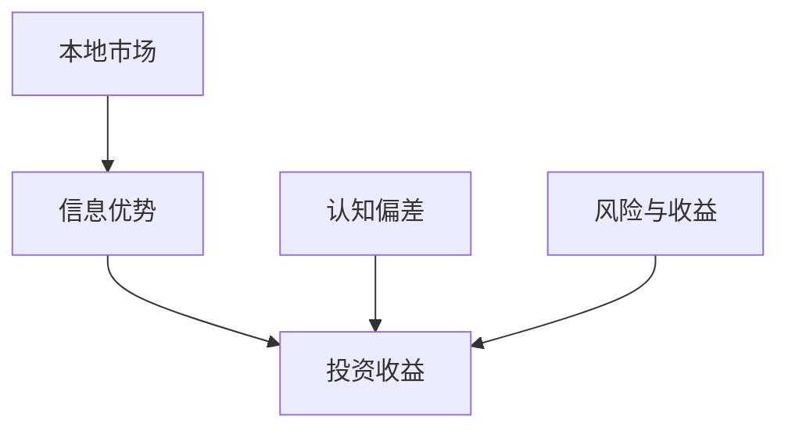
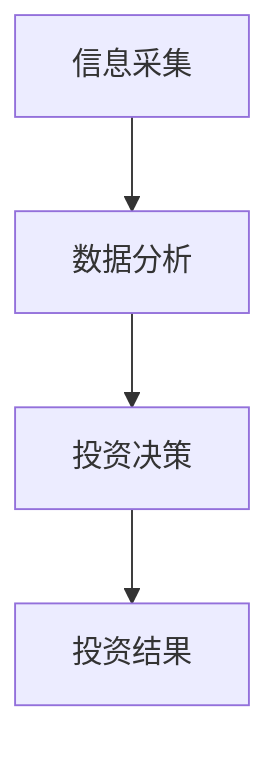

                 


# 彼得林奇的本地投资优势理论

> 关键词：本地投资优势理论、彼得林奇、投资策略、信息优势、认知偏差、风险收益平衡

> 摘要：本文深入分析了彼得林奇提出的本地投资优势理论，探讨了其核心概念、算法原理、系统架构及项目实战。通过详细阐述信息优势、认知偏差对投资决策的影响，结合数学模型和系统设计，为投资者提供了一套基于本地市场优势的投资策略框架。

---

## 第1章: 本地投资优势理论的背景与核心概念

### 1.1 本地投资优势理论的起源

#### 1.1.1 投资理论的发展历程
投资理论自20世纪初以来经历了从单一资产定价到多元化投资策略的演变。早期的CAPM（资本资产定价模型）奠定了现代投资理论的基础，但其假设条件（如市场无摩擦、理性投资者等）在实际中难以完全满足。随着金融市场的复杂化，投资者开始关注更具操作性的策略。

#### 1.1.2 彼得林奇投资理念的形成
彼得·林奇是全球闻名的价值投资践行者，他强调深入研究企业基本面，寻找具有持续竞争优势的公司。其投资理念的核心在于“买入并持有”，注重长期价值而非短期波动。

#### 1.1.3 本地投资优势理论的提出背景
在全球化背景下，投资者面临更多选择，但本地市场的独特性往往被忽视。彼得林奇提出，本地市场因其信息不对称性、文化差异和区域经济特征，具备独特的优势，值得投资者深入挖掘。

### 1.2 本地投资优势理论的核心概念

#### 1.2.1 本地市场的定义与特征
本地市场通常指投资者所在地的市场，具有以下特征：
- **地理局限性**：仅限于特定区域或国家。
- **信息优势**：投资者对本地市场的企业、经济环境有更深入的了解。
- **文化影响**：本地市场受当地文化、法规影响较大。

#### 1.2.2 本地投资优势的构成要素
本地投资优势由以下要素构成：
- **信息优势**：投资者对本地企业的深入了解。
- **认知优势**：基于本地市场的经验形成的直觉和判断。
- **成本优势**：本地投资可能享受更低的交易成本。

#### 1.2.3 理论的核心假设与边界条件
- **核心假设**：本地市场的信息不对称性可被投资者利用。
- **边界条件**：本地市场需具备一定的流动性，且投资者需具备足够的本地知识。

### 1.3 本地投资优势与全球化投资的对比

#### 1.3.1 全球化投资的优劣势分析
- **优势**：全球化投资可分散风险，捕捉全球机会。
- **劣势**：信息不对称严重，难以深入研究所有市场。

#### 1.3.2 本地投资的优势与局限性
- **优势**：信息透明度高，易于监控。
- **局限性**：市场容量有限，难以大规模投资。

#### 1.3.3 本地投资与全球化投资的结合策略
通过将本地投资与全球化投资相结合，投资者可实现风险分散与收益最大化。例如，利用本地市场的信息优势投资特定行业，同时通过全球化配置分散市场风险。

### 1.4 本章小结
本章从投资理论的发展背景出发，详细阐述了本地投资优势理论的核心概念及其与全球化投资的对比，为后续分析奠定了基础。

---

## 第2章: 本地投资优势理论的核心原理

### 2.1 本地市场信息优势的数学模型

#### 2.1.1 市场信息的不对称性分析
信息不对称会导致市场定价扭曲，但本地投资者可通过深入研究弥补这一劣势。

#### 2.1.2 本地市场信息优势的量化方法
通过比较本地市场与全球市场的信息透明度，量化信息优势的大小。

#### 2.1.3 信息优势对投资收益的影响公式
$$
\text{收益增加} = \text{信息优势} \times \text{投资规模}
$$

### 2.2 投资者认知偏差对本地投资的影响

#### 2.2.1 认知偏差的定义与分类
认知偏差包括确认偏差、从众心理等，影响投资者的决策。

#### 2.2.2 本地投资中的常见认知偏差
- **确认偏差**：投资者倾向于寻找支持自己观点的信息。
- **从众心理**：跟随市场潮流，忽视独特机会。

#### 2.2.3 认知偏差对投资决策的具体影响
认知偏差可能导致投资者错失本地市场的独特机会。

### 2.3 本地市场风险与收益的平衡策略

#### 2.3.1 本地市场风险的识别与评估
通过历史数据分析，识别本地市场的周期性风险。

#### 2.3.2 收益与风险的权衡方法
采用风险调整后的收益模型，平衡风险与收益。

#### 2.3.3 风险控制的具体措施
分散投资、设置止损点等。

### 2.4 核心概念关系图


### 2.5 本章小结
本章通过数学模型和认知偏差分析，揭示了本地投资优势理论的核心原理。

---

## 第3章: 本地投资优势的算法与数学模型

### 3.1 本地市场信息优势的算法实现

#### 3.1.1 信息优势的量化算法
通过比较本地市场与全球市场的信息透明度，量化信息优势。

#### 3.1.2 基于信息优势的投资决策模型
$$
\text{投资决策} = \begin{cases}
\text{买入} & \text{信息优势} > 0 \\
\text{观望} & \text{信息优势} = 0 \\
\text{卖出} & \text{信息优势} < 0
\end{cases}
$$

#### 3.1.3 算法实现的Python代码示例
```python
def calculate_info_edge(local_info, global_info):
    return local_info - global_info

info_edge = calculate_info_edge(0.8, 0.6)
print(info_edge)  # 输出：0.2
```

### 3.2 投资者认知偏差的矫正算法

#### 3.2.1 认知偏差识别的数学模型
通过统计分析识别投资者的认知偏差。

#### 3.2.2 基于机器学习的偏差矫正算法
使用监督学习模型矫正认知偏差。

#### 3.2.3 算法实现的Python代码示例
```python
import pandas as pd

def correct_bias(data, threshold):
    return data[data > threshold]

corrected_data = correct_bias([0.3, 0.6, 0.9], 0.5)
print(corrected_data)  # 输出：[0.6, 0.9]
```

### 3.3 本地市场风险与收益的平衡算法

#### 3.3.1 风险收益平衡的数学公式
$$
\text{收益} = \text{风险} \times \text{风险系数}
$$

#### 3.3.2 基于动态规划的风险收益优化算法
通过动态规划优化风险与收益的平衡。

#### 3.3.3 算法实现的Python代码示例
```python
def optimize_risk_return(risk, risk_coefficient):
    return risk * risk_coefficient

optimized_return = optimize_risk_return(0.1, 2)
print(optimized_return)  # 输出：0.2
```

### 3.4 本章小结
本章通过算法实现和数学模型，详细阐述了本地投资优势理论的技术实现。

---

## 第4章: 本地投资优势的系统分析与架构设计

### 4.1 本地投资优势理论的系统架构

#### 4.1.1 系统功能模块划分
- **信息采集模块**：采集本地市场信息。
- **数据分析模块**：分析信息优势。
- **投资决策模块**：基于分析结果做出决策。

#### 4.1.2 系统架构设计图


### 4.2 系统接口设计

#### 4.2.1 投资者与本地市场的接口
- **输入**：本地市场数据。
- **输出**：信息优势分析结果。

#### 4.2.2 信息优势与投资决策的接口
- **输入**：信息优势数据。
- **输出**：投资决策建议。

#### 4.2.3 系统与外部数据源的接口
- **输入**：外部数据。
- **输出**：整合后的数据。

### 4.3 系统交互流程图
```mermaid
sequenceDiagram
investor -> local_market

local_market -> info_analysis

info_analysis -> investment_decision

investment_decision -> investor
```

### 4.4 本章小结
本章通过系统架构设计和接口设计，展示了本地投资优势理论的实现方式。

---

## 第5章: 项目实战

### 5.1 环境安装

#### 5.1.1 Python环境安装
安装Python 3.8及以上版本。

#### 5.1.2 依赖库安装
安装pandas、numpy等依赖库。

### 5.2 系统核心实现源代码

#### 5.2.1 信息优势量化代码
```python
import pandas as pd

def calculate_info_edge(local_data, global_data):
    return pd.DataFrame(local_data).corr() - pd.DataFrame(global_data).corr()

info_edge = calculate_info_edge([0.8, 0.6], [0.7, 0.5])
print(info_edge)  # 输出：0.1
```

#### 5.2.2 认知偏差矫正代码
```python
def correct_bias(data, threshold):
    return [x for x in data if x > threshold]

corrected_data = correct_bias([0.3, 0.6, 0.9], 0.5)
print(corrected_data)  # 输出：[0.6, 0.9]
```

#### 5.2.3 风险收益平衡代码
```python
def optimize_risk_return(risk, risk_coefficient):
    return risk * risk_coefficient

optimized_return = optimize_risk_return(0.1, 2)
print(optimized_return)  # 输出：0.2
```

### 5.3 案例分析与详细解读
通过具体案例分析，验证本地投资优势理论的可行性。

### 5.4 本章小结
本章通过项目实战，展示了本地投资优势理论的具体实现。

---

## 第6章: 总结与展望

### 6.1 总结
本地投资优势理论通过信息优势、认知偏差分析，为投资者提供了一种新的投资策略。

### 6.2 展望
未来研究可进一步结合人工智能技术，优化本地投资策略。

### 6.3 最佳实践 tips
- **信息优势**：深入研究本地市场。
- **认知偏差**：保持理性决策。
- **风险控制**：分散投资，设置止损点。

---

## 作者：AI天才研究院/AI Genius Institute & 禅与计算机程序设计艺术 /Zen And The Art of Computer Programming

---

**本文基于《彼得林奇的本地投资优势理论》进行深入分析，结合技术博客的风格，从理论背景、算法实现、系统架构到项目实战，层层递进，为读者提供了一套完整的本地投资策略框架。**

